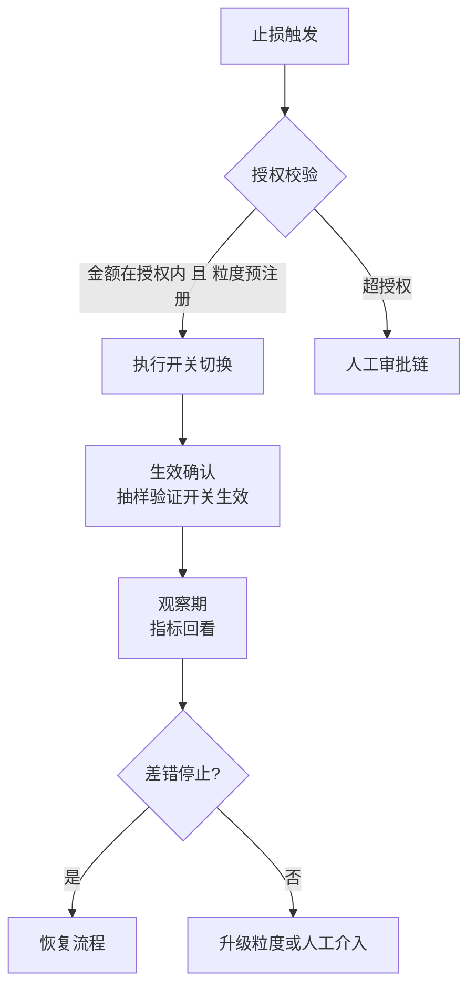
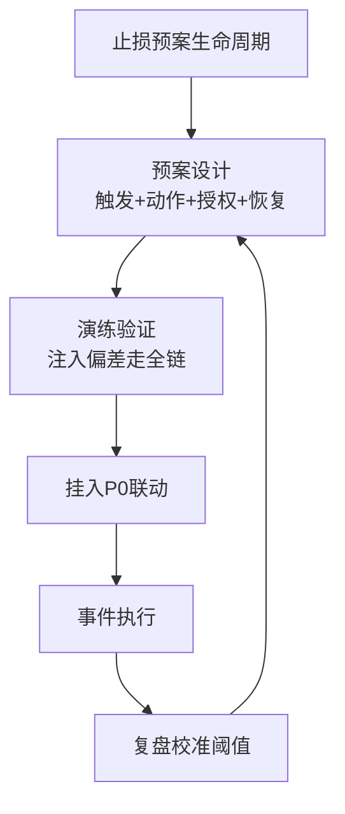

# 止损与应急冻结：自动化执行的授权边界

> 止损是防资损里「手起刀落」的动作：冻结渠道、暂停场景、切换开关——每一下都在止血，每一下也可能误伤无辜交易。自动化止损的难点从来不是「怎么停」，而是**「谁授权停、停多大范围、停了怎么恢复」**。这一篇按 ADR-0012 讲清止损动作的完整执行面。

## 一句话摘要

止损体系 = **动作库（冻结/降级/切换/暂停四类）+ 触发层（人工按钮 / 告警联动自动触发）+ 授权边界（金额上限 × 粒度 × 白名单场景）+ 恢复流程（条件确认 → 分步恢复 → 复盘）**。核心设计原则：**止损的爆炸半径必须小于事故本身**——全站级一键冻结是最后手段且永远人工，自动化的止损只允许在预授权的窄粒度（单渠道/单场景/单商户）上发生。

## 前置阅读

- 入门层篇 4《事中预警》（触发止损的告警链路）
- 入门层篇 5《事后追回》（止损之后的修正闭环）

## 🎯 本文核心

**核心机制一句话**：止损 = 用「可控的业务损失」（误冻结的交易损失）换「不可控的资金损失」（持续错账）——授权边界就是这两种损失的定价表。

**机制链**：告警/人工触发 → 授权校验（金额/粒度/场景白名单）→ 执行动作（开关切换，秒级生效）→ 生效确认 → 观察期 → 恢复流程 → 复盘。上下游：上游是预警分级（篇 3 的 P0 联动），下游是追回（篇 5）——止损期间积压的请求怎么处理（拒绝/暂存重放）是止损设计的隐藏难点。

## 上下游一分钟

止损在防资损链路的位置：它是「发现」与「追回」之间的止血带。向上接收两类触发（P0 告警自动联动 / 值班人工按钮），向下通过开关系统作用于交易链路。模块边界：止损系统只操作**预先注册的开关与预案**，不做临场发明的新动作——「事故现场想出的止损办法」如果没有预注册，说明预案体系有缺口（复盘必查项）。

## 一、动作库：四类止损动作的适用与代价

| 动作 | 作用面 | 生效 | 副作用 | 适用场景 |
|---|---|---|---|---|
| **冻结渠道** | 某支付/放款渠道的单向停用 | 秒级 | 该渠道全部交易失败（误伤） | 渠道级批量差错（单边集中在某通道） |
| **暂停场景** | 某业务场景入口关闭 | 秒级 | 场景收入归零 | 场景级计算类资损（计息规则错） |
| **降级开关** | 切换到降级逻辑（如实时核验改异步） | 秒级 | 校验强度下降 | 拦截组件故障且组件自身引发偏差 |
| **账户/商户冻结** | 单账户/商户操作禁止 | 秒级 | 单点影响极小 | 定向差错（某商户批量错账） |

**粒度选择的第一原则**：**按差错的影响面切粒度**——偏差集中在某渠道冻渠道、集中在某商户冻商户、全网性错误才动场景开关。粒度越细误伤越小，但预案数量越多（粒度 × 场景的预案矩阵要控制在可演练范围内：业内通行 ≤ 50 个预案，行业认知）。



## 二、授权边界：三条件模型（ADR-0012 参数表）

| 条件 | 参数 | 自动档 | 人工档 | 为什么 |
|---|---|---|---|---|
| 金额敞口 | 止损动作拦住的交易额上限 | ≤ 场景日均交易额 20% | 之上 | 拦住的钱 ≈ 误冻结损失的上限 |
| 触发置信度 | 偏差模式的置信度 | ≥ 0.99（单边类） | 0.9-0.99 | 低置信自动冻结 = 高误触发 |
| 粒度 | 预注册粒度 | 渠道/商户/单场景 | 场景群/全站 | 全站开关永不自动 |
| 时效限制 | 自动止损有效期 | ≤ 30 分钟自动过期 | 无 | 过期未续 = 自动恢复（防「忘了恢复」） |

**时效限制是最容易被忽略的参数**：自动冻结 30 分钟未续期自动恢复——为什么？冻结过夜意味着凌晨没有值班决策时交易持续失败，「忘记恢复」的损失可能超过原资损（行业真实案例形态）。恢复必须显式确认，过期默认回到开放态 + 告警。

## 三、执行机制：开关系统与生效确认

止损动作的物理载体是**开关系统**（配置中心的特殊配置集），三个工程要求：

1. **秒级生效 + 生效确认**：开关推送后执行端要回执（N 台实例全部生效才返回成功）——「推送了」不等于「生效了」，未生效的止损等于没止；
2. **生效抽样验证**：切换后自动发 1 笔探测交易（或读最近真实交易）验证动作真的拦住了——开关链路任何一环失效（缓存未刷/实例掉线）都能被抽样发现；
3. **开关审计日志**：谁（人或预案）、何时、为什么、动了哪个开关——全量留痕，审计与复盘的硬要求。

```python
# 止损执行器核心流程（简化骨架）
def execute_stop(panic_id: str, action: dict, trigger: dict) -> dict:
    assert check_authorization(action, trigger)      # 1. 授权三条件校验
    assert action["scope"] in PRE_REGISTERED_SCOPE   # 2. 粒度必须预注册
    result = switch_client.apply(action["switch"],   # 3. 切换并等全量回执
                                 action["value"], timeout=5)
    if not result.all_confirmed:
        alert_p1("开关未全量生效", result.pending_instances)
    probe = probe_trade(action["scope"])             # 4. 生效抽样验证
    audit_log(panic_id, action, trigger, result, probe)  # 5. 审计留痕
    schedule_expire(panic_id, action.get("ttl", 1800))   # 6. 自动过期防护
    return {"panic_id": panic_id, "confirmed": result.all_confirmed,
            "probe_ok": probe.blocked}
```

## 四、恢复流程：比止损更需谨慎的一半

止损只完成一半——**恢复做错就是二次事故**（差错未停就恢复 = 资损续杯；恢复过猛 = 流量冲击）。恢复五步：

1. **条件确认**：根因已修复（不只是「看起来停了」）+ 对账指标回到基线 + 修复版本已灰度验证；
2. **分步放量**：恢复按灰度节奏（10% → 50% → 100%），每步观察差错指标一个窗口；
3. **积压处理决策**：止损期间被拒的交易怎么办——**预先在预案里定好**（拒绝型：引导重试；暂存型：限流重放），重放本身要限速防冲击；
4. **双指标观察**：差错指标（该停的停了吗）+ 业务指标（该放的放回来了吗）；
5. **复盘归档**：止损时长、误伤交易量、差错总额、恢复时长——四数字进复盘报告，预案的参数（阈值/时效）按复盘校准。

止损授权参数的三档形态（量级分档，行业认知量级）：

| 条件 | 10w 档（日 10 万笔） | 千万档 | 亿级档 |
|---|---|---|---|
| 自动授权金额上限 | 场景日均 10% | 20% | 20% 且单笔 ≤ 10 万 |
| 置信度门槛 | 0.99 | 0.99 | 0.995（误冻结代价放大） |
| 自动 TTL | 60 分钟（人工响应快） | 30 分钟 | 15-30 分钟（积压敏感） |
| 预案数量 | < 10 个 | 20-50 个 | 50+ 分级预案库 |

为什么亿级档置信度门槛反而更高——单笔敞口 × 流量的乘积放大了误冻结的绝对损失，授权的收紧与敞口同步；**止损授权是量级的函数，不是团队勇气的函数**。

## 五、事故推演：一次「正确的冻结」与「错误的恢复」

行业化用案例：某放款渠道单边偏差，P0 联动自动冻结渠道（正确、及时）；差错修复后值班直接 100% 恢复——**积压的 2 小时放款请求被放行客户端重试瞬间打满**，渠道侧限流熔断，第二次不可用 40 分钟。复盘 Action：① 恢复分步放量写进预案模板；② 客户端重试退避策略评审（止损预案要覆盖「被拒请求的去向」）；③ 恢复操作加「双指标观察」步骤。**止损预案的完整性 = 触发 + 执行 + 恢复三段**，缺恢复段的预案是半成品。




止损体系的演进与授权的收紧同步：执行越来越快、授权越来越严——**速度与控制的平衡点是预案化**（人的决策提前到评审期，机器只做执行），这一演变在专题层红蓝对抗篇继续深化。

## 与熔断降级的区别（跨域辨析）

共用开关设施，分治于**触发依据与恢复依据**：稳定性熔断由「错误率/RT」触发（技术信号），资损止损由「资金偏差」触发（业务信号）；稳定性熔断半开恢复靠探测请求，资损恢复靠「根因修复 + 对账回基线」（业务信号）。为什么不共用熔断器？——资金偏差的信号频率低、判定慢（要等对账窗口），熔断器的快速探测模型不适用；两者可能在同一链路上先后发生（先熔断止血、止损看资金面）。

## 源码关键路径

- **开关推送**：配置中心长轮询/推送通道的「全量回执」实现（各实例监听 + ack 上报聚合）；
- **授权校验**：预案元数据（授权金额/粒度/白名单）与预案同库存同版本——**预案与授权必须原子变更**（改预案不改授权 = 越权执行口子）；
- **审计日志**：止损事件流接审计系统（金融场景合规硬要求），字段含 panic_id/预案版本/触发源/生效实例清单。

## 业内惯例与生产实践

- **惯例一**：止损预案「半年度全量演练 + 新预案启用前必演」——没演练过的自动预案不允许挂进 P0 联动；
- **惯例二**：值班最高有「临时止损权」（超授权但事后 2 小时内补审批）——完全不给临场权限会贻误战机，完全放开则授权失控；「先斩后奏 + 硬性补审」是平衡点（行业认知）；
- **惯例三**：止损事件的「误伤交易清单」自动生成——误冻结波及的用户/商户清单是客诉主动安抚与复盘定量的输入。

## 💡 实战提示

- 💡 预案文档里给每个止损动作配「一键验证命令」（curl 探测交易是否真被拦）——值班在压力下验证手段越短，生效确认越可靠。
- 💡 冻结动作的对外文案预先法务审过（「系统升级中」vs「风控拦截」）——止损的技术动作如果引发对外的错误承诺，是客诉的二次放大器。

## 常见误区

- ❌ 「止损就是全站熔断」——粒度失控的止损自身成为事故；粒度选择是止损设计的第一决策；
- ❌ 「自动止损挂上就不管了」——时效过期、误触发率、预案有效性三个健康指标要持续运营；
- ❌ 「恢复不用预案」——恢复段的流量冲击与二次差错风险不低于止损段；恢复是预案的一半；
- ❌ 「止损期间数据不用管」——被拒/暂存请求的去向、止损窗口的对账断档（没交易=没差错，对账要能区分「干净窗口」与「断采」）都要预案化。

## 代价与边界

止损的成本：误冻结的交易损失（授权金额参数的定价对象）+ 预案建设与演练成本 + 恢复期的运营。边界：止损只能停「可开关的依赖面」——错误在**已经出账的交易**里，止损无能为力（那是追回的领地）；止损窗口内「暂存重放」的请求如果携带错误数据（根因未修），重放即续杯——恢复条件里「根因已修复」是硬条件不可跳过。

## 你们可能会问

**Q1：自动止损误触发了，谁负责？**
责任在**预案的评审与授权流程**，不在执行系统与值班——误触发率是预案健康指标（触发复盘校准阈值），把责任压给值班会导致「没人敢开自动化」，这是自动化体系最常见的死法。

**Q2（追问）：为什么自动止损必须设过期时间？**
防「止损健忘症」：事故深夜处理完人睡了，冻结没人记得恢复——过夜冻结的交易损失 + 客诉损失可能远超原资损；过期恢复 + 恢复告警是「用机器防人的遗忘」。

**Q3（再追问）：止损与规则中心 REJECT 什么关系？**
REJECT 是「单请求粒度的规则判定」（常态运行），止损是「批量粒度的应急切换」（异常状态）——止损的粒度是场景/渠道级、时效是分钟级、由授权控制；规则是请求级、常态、由评审控制。同一个「拦」字，两套授权体系。

## 开放问题

- 跨团队止损的授权协同（渠道冻结影响下游合作方，需否对方同意）——「先斩后奏」的边界在对外依赖场景如何界定，是流程开放问题。

## 决策

**决策**：何时建止损预案库——第一个 P0 级资损场景上线时（止损是 P0 告警的必要配套，无止损预案的 P0 告警只响铃不救命）；何时放开某场景自动止损——该场景预案演练通过 + 误触发容忍度评审完成。怎么选首预案：选「偏差置信度最高（单边类）+ 副作用最小（单商户冻结）」的组合起步。

## 自测三问

1. 粒度选择的第一原则？（按差错影响面切粒度——误伤最小化）
2. 自动止损的四个授权条件？（金额敞口/置信度/预注册粒度/时效过期）
3. 恢复的硬条件是什么？（根因已修复 + 对账回基线——缺一不恢复）

## 5W 速记卡

| 问题 | 答案 |
|---|---|
| What | 四类动作 + 授权三条件 + 开关执行 + 五步恢复 |
| Why | 用可控误伤换不可控资损，爆炸半径可控化 |
| 关键参数 | 授权金额 20% 日均 / 置信 0.99 / TTL 30min |
| 铁律 | 生效确认 + 抽样验证 + 审计留痕 + 分步恢复 |
| 边界 | 已出账的错误管不了；预案要覆盖「被拒请求去向」 |

## 🎯 核心带走

**30 秒复述**：止损 = 动作库（冻结/降级/切换/暂停）+ 授权三条件 + 开关秒级生效 + 恢复五步；自动化只发生在预注册窄粒度，全站开关永不自动；预案完整性 = 触发 + 执行 + 恢复三段。**失效点**——粒度失控、无时效过期、恢复无预案、误触发追责到人。金句带走：

> **止损的爆炸半径必须小于事故本身——全站一键冻结不是止损，是换一个事故。**

> **恢复是止损的一半：止血五分钟、输血两小时的故事，每天都在「没有恢复预案」的团队重演。**

## 📌 数据与事实声明

- 四类动作、授权模型、恢复流程为业界应急实践归纳（公开分享与 SOP 模板）；授权参数（20%/0.99/30min）为行业认知量级；事故叙事为行业化用。

## 📚 参考资料

- 入门层篇 4（P0 联动来源）、篇 5（止损后追回）
- 本仓库稳定性系列（熔断降级的机制对照）
- 预案演练方法见专题层《资损预案演练与红蓝对抗》
