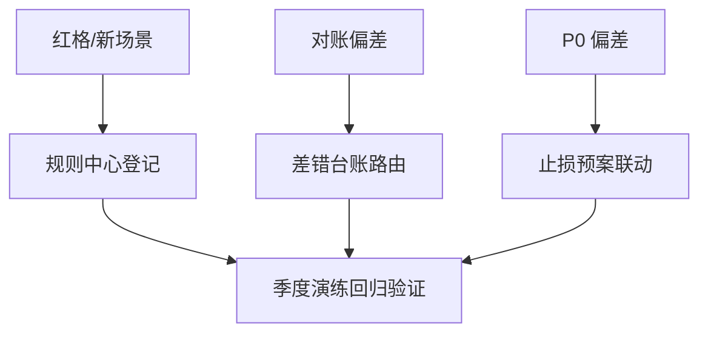
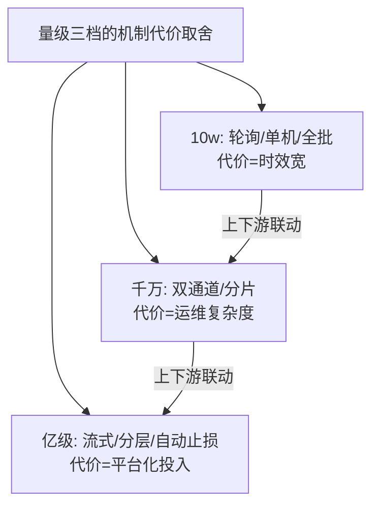

# 深入理解资损防控机制系列

## 一句话摘要

三道防线的机制级深挖——对账引擎/规则中心/监控大盘/止损冻结，全部按 ADR-0012 工程级标准（参数表/代码/步骤/量级三档），量级跨档的形态演变见各篇三档表。

## 篇目——对账引擎/规则中心/监控大盘/止损冻结，全部按 ADR-0012 工程级标准（参数表/代码/步骤/量级三档）。

## 篇目

| # | 篇目 | 状态 |
|---|---|---|
| 1 | [准实时对账引擎：分钟级发现资损的完整实现](1_准实时对账引擎-深度.md) | ✅ |
| 2 | 资损规则中心：决策引擎与灰度影子 | ⏳ 待写 |
| 3 | 资损监控大盘与告警分级 | ⏳ 待写 |
| 4 | 止损与应急冻结：授权边界 | ⏳ 待写 |

**取舍与架构定位**：本系列四个模块在防资损架构的上下游分工明确——规则中心守事前、对账引擎与大盘守事中、止损冻结做止血、差错台账闭环事后；模块边界即防线边界，跨模块的代价取舍（拦多严/核多频/停多狠）见专题层《资损与可用性的取舍》。

## 📌 数据与事实声明

- 篇目结构与工程级标准依据 ADR-0012；三档参数为行业认知量级。

## 📚 参考资料

- 入门层《从零开始认识防资损系列》全 8 篇
- 专题层《资损防控亿级实战》

## 关联

- 入门层《从零开始认识防资损系列》（概念与三道防线）
- 专题层《资损防控亿级实战》（量级三档实战）
