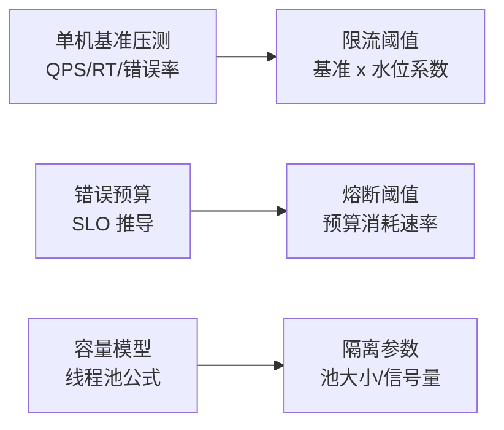
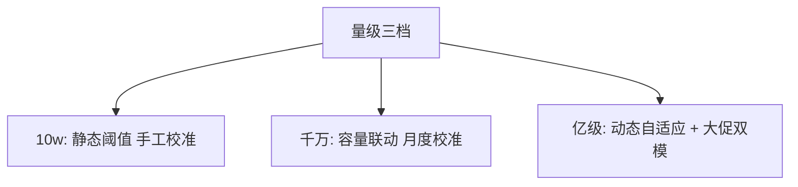
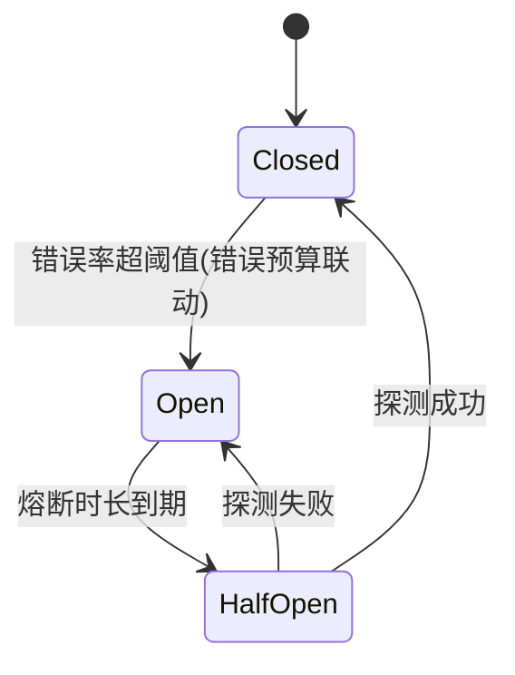

# 深入理解限流熔断参数化系列

> 限流熔断的算法都懂，参数从哪来？——从单机压测基准、错误预算与容量模型里算出来，这一系列把参数从「拍脑袋」变成「有推导」。

## 一句话摘要

参数化 = 每个阈值都有推导链：限流阈值 ← 单机基准 × 水位系数；熔断阈值 ← 错误预算与误熔断率的权衡；隔离数 ← 线程池容量公式。10w 档静态阈值够用，千万档按容量校准，亿级档动态自适应。

## 篇目规划（L1-L4，ADR-0012 方向=子目录）

| 篇目/层 |
|---|
| 篇 1 · 限流阈值推导：单机基准 → 水位系数 → 集群总量 |
| 篇 2 · 熔断参数化：错误预算联动与误熔断治理 |
| 篇 3 · 隔离容量公式：线程池/信号量/连接数的推导 |

**机制定位与取舍**：本方向的每个机制（原理与底层实现）都在篇目里锚定了位置——规划期的取舍是「机制原理优先于操作罗列」，代价是入门读者需要更多耐心，收益是后续每篇的参数与步骤都有原理可归因；架构上各层互为上下游，边界由「机制讲透」与「操作可执行」这条线划分。

## 演进视角

参数管理的演变：硬编码 → 配置中心 → 动态自适应（自适应限流按 BBR 思想实时推导）——演变方向是「参数的推导链自动化」，人只审边界。

## 📌 数据与事实声明

- 本文件为方向骨架规划（篇目标注 ⏳ 待写 / ✅ 已落地），依据 ADR-0012 工程级深度标准与 4 层架构规范；量级与参数数字均为行业认知量级，落篇时以实测替换。

## 📚 参考资料

- 本仓库 Sentinel 系列（算法与 Slot 链）、稳定性系列特性层（令牌桶/熔断状态机）、《Site Reliability Engineering》错误预算。
