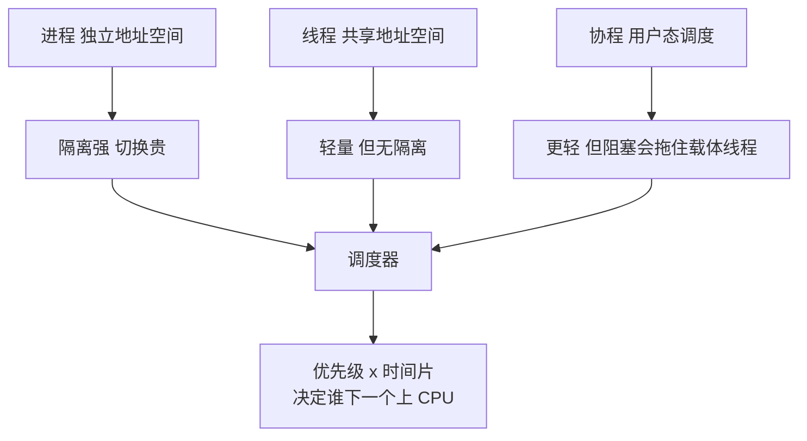
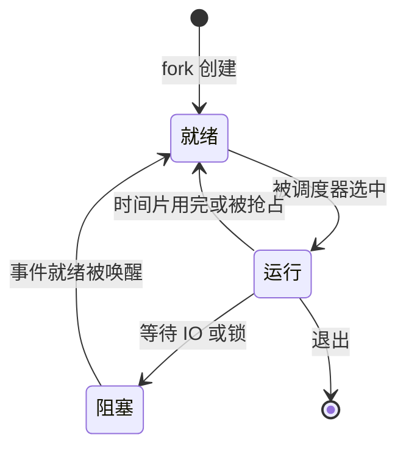
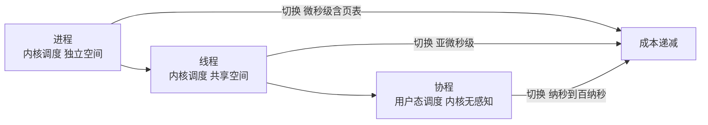

# 进程、线程与调度：地址空间、切换成本与协程的坐标

> 操作系统最基础的两个抽象——进程管资源，线程管执行。它们的一切区别都源自一个设计决定：线程共享进程的地址空间。共享带来了切换成本的骤降与通信的便利，也带来了隔离性的丧失；协程则把这条权衡线又向前挪了一格——连内核都不惊动。抓住「地址空间共享程度」这条主线，进程、线程、协程在调度谱系上的位置就一目了然。

## 一句话摘要

进程 = 资源分配的基本单位（独立地址空间），线程 = 调度执行的基本单位（共享地址空间），上下文切换的真实代价主要不在保存寄存器而在缓存与 TLB 污染，调度器的全部工作就是回答「下一个让谁跑、跑多久」，而协程是把这道答案从内核搬回用户态的产物。

## 🎯 本文核心

**核心机制一句话**：进程用独立地址空间换取隔离，线程用共享地址空间换取轻量；上下文切换的本质是「保存现场 + 恢复现场 + 重建硬件缓存」，调度器用优先级与时间片在所有就绪执行流之间分配 CPU。

**机制链（上下游一条线）**：fork 创建进程（写时复制）→ 线程共享地址空间 → 进程切换要换页表、线程不用 → 缓存与 TLB 污染决定切换的真实代价 → 调度器按 vruntime 与优先级挑下一个任务 → 协程把「挑选 + 切换」下沉到用户态，避开内核往返。这条因果链上拆掉任何一环，后一环的动因就讲不通。

## 典型使用场景

- **服务进程隔离**：网关、应用、数据库各自独立进程部署——一个进程崩溃或内存泄漏不殃及邻居，靠的正是地址空间隔离这堵墙。
- **进程内并发处理**：Web 容器的线程池、数据库的后台工作线程——共享堆内存让任务交接只是传一个对象引用，不必序列化绕内核。
- **海量并发 IO 密集**：长连接网关、消息推送、爬虫——协程以低一到两个数量级的切换成本撑起百万级并发（与第三篇的 IO 多路复用配合）。
- **反过来不适用**：强隔离要求（插件沙箱、多租户算力隔离、关键组件故障隔离）反而要回到进程，甚至容器与虚拟机这棵更重的隔离树上。

## 机制一：进程——地址空间是一切的起点

进程 = 一份独立的虚拟地址空间 + 一组资源（页表、打开文件表、信号处理等）。教科书共识：**进程是资源分配的基本单位**。Linux 上 fork 创建子进程时并不复制整个内存——父 子共享物理页并标记只读，谁先写入谁触发缺页、由内核再复制一份，这就是写时复制（公开口径：Copy-on-Write）。

这里的设计思想很值得咂摸：**能不付的成本就先不付，等真正需要时再付**。这个「惰性 + 按需」的思想贯穿整个内核（下一篇虚拟内存会把它讲透）。

**追问一：既然有了进程，为什么还要发明线程？** 一个进程一个执行流，并发只能靠多进程——但地址空间独立意味着两笔账：切换贵（要换页表），通信必须走 IPC（管道、共享内存、消息队列）绕内核一趟。线程把「并发」从「资源复制」里解耦出来：**并发是执行流的事，不是地址空间的事**。

**再追问：fork 出来的子进程地址布局和父进程一模一样，为什么不会互相踩内存？** 因为虚拟地址相同、物理页各异（或写时才复制）——地址翻译层保证了各自独立的世界。这是下一篇虚拟内存的主题，这里先记住结论：隔离的地基是「翻译」，不是「约定」。

## 机制二：线程——共享地址空间的执行流

线程独享的只有：栈、寄存器组、程序计数器、线程局部存储（TLS）；共享的是：堆、全局变量、打开文件表、信号处理。一张表记住：

| 归属 | 内容 |
|---|---|
| 线程独享 | 栈、寄存器、程序计数器、TLS |
| 进程内共享 | 堆、全局变量、打开文件表、信号处理、地址空间本身 |

公开口径：Linux 把线程实现为「按需共享资源的进程」——clone 系统调用用标志位控制共享什么，调度的基本实体是 task_struct。所以 Linux 调度器眼里其实没有进程线程之分，只有「可调度的任务」，差别只在背后挂着的资源集合大小。

**追问一：共享这么多，两个线程同时写一个变量会怎样？** 数据竞争——结果取决于调度时序，不可复现。这正是互斥锁与原子操作的领地（并发主题另篇展开），本文只需记住：线程的便宜是拿隔离换的，共享边界内的每一处并发写都要自己上锁。

**再追问：一个线程访问了非法内存，会只崩它自己吗？** 会带走整个进程——段错误是内核对整个地址空间的裁决，共享地址空间意味着没有退路。这也是「关键组件要不要进程隔离」这类争论的物理根源：线程的故障半径是整个进程。

## 机制三：上下文切换——真实代价藏在缓存里

一次切换，内核要做四件事：保存当前任务的寄存器与现场 → 切换到内核栈 → 调度器挑出下一个任务 → 恢复新任务的现场。如果是进程间切换还多一步：切换页表（公开口径：x86 上是更换 CR3 寄存器），带来 TLB 大面积失效。

进程在内核里的生命周期是一条状态机：

切换的账单分两部分：**直接成本**——保存恢复寄存器、调度器决策，业内认知在亚微秒到几微秒量级；**间接成本**——CPU 缓存与 TLB 被新任务的数据填满，旧任务回来时热点全部失效，这部分往往比直接成本大一个量级，而且在任何「使用率」监控里都不可见——CPU 使用率只统计「在跑」，不统计「在换」。

公开口径的观测工具：`vmstat` 的 cs 列看全机每秒切换次数，`pidstat -w` 看单线程的自愿/非自愿切换拆分——自愿切换是主动等 IO 或锁，非自愿切换是时间片被抢。

**追问一：切换次数越多是不是越「并发」？** 不是。切换本身是纯开销，不产出任何业务价值。业内认知的经验观察：每秒数十万次上下文切换、吞吐却不涨——这就是调度过热的信号，钱全花在了换人上，没人干活。

**打破砂锅：非自愿切换多说明什么？** CPU 是稀缺资源，就绪任务在排队被打断。两种成因两种解法：要么算力真的不够（扩容），要么有任务在空转自旋（修代码）——看 cs 之前先分清是哪种，药方完全相反。

## 机制四：调度策略直觉——时间片与优先级

调度器一句话：从就绪队列挑一个任务，给它 CPU 跑一段时间。两个旋钮：**谁先跑（优先级）**、**跑多久（时间片）**。

时间片的两个极端都不好：太长，交互卡顿（你敲键盘时前台任务在等一个大时间片跑完）；太短，切换开销占比飙升。公开口径：Linux 的 CFS 调度器干脆不用固定时间片，按权重与就绪任务数动态计算「这次该跑多久」。

CFS 的设计思想（公开口径：2.6.23 引入）是教科书级的：给每个任务记「虚拟运行时间 vruntime」，永远挑 vruntime 最小的任务跑——用红黑树 O(log n) 就能找到「最饿」的任务。绝对公平不可得（记账与切换本身都有成本），就做**动态均衡**。跨周期演进看：2023 年起 EEVDF 取代 CFS 成为默认调度器（公开口径：Linux 6.6 合入），补上了「对延迟敏感任务更快响应」的短板——公平调度器自己也在按「公平 + 延迟感知」的方向演进。

优先级侧：普通任务用 nice 值（-20 到 19，只影响权重）；实时任务走 FIFO/RR 专属调度类，优先于所有普通任务（公开口径：POSIX 实时扩展）。业内认知：数据库与低延迟服务常配合 nice、cgroup 或实时调度类做关键算力的保障。

**追问一：为什么每个 CPU 一个就绪队列，而不是全局一个大队列？** 全局队列意味着所有核抢一把锁，核越多锁竞争越惨烈，扩展性崩塌。分而治之 + 周期性负载均衡（惰性搬任务）是内核的一贯设计思想——先各自为政，饿死了再互相匀。

## 协程在调度谱系上的位置

把三者排在一条线上：**进程**（独立空间，内核调度）→ **线程**（共享空间，内核调度）→ **协程**（共享线程的执行流，用户态调度）。

协程的切换 = 用户态保存少量寄存器 + 换栈指针——不进内核、不换页表、不动硬件缓存。业内认知：单次切换纳秒到百纳秒级，比线程切换低一到两个数量级；内存上 goroutine 初始栈 2KB（公开口径：Go 运行时文档），对比线程默认兆级栈（业内认知：Linux 默认 8MB 虚拟内存），百万协程才成为可能。

**为什么协程快？** 它砍掉了切换里最贵的部分——系统调用往返与硬件缓存重建。内核从头到尾不知道协程的存在，自然也就不为它付账。

**代价是什么？** 协作式让出意味着：一个协程死循环、或阻塞在一个同步系统调用上，整条承载它的内核线程被拖住。工程解法（公开口径：Go 的 netpoller 把网络 IO 注册进 epoll，阻塞点变成「挂起协程 + 调度下一个」；Java 虚拟线程同理把阻塞调用挂起载体线程）——本质是「用户态调度 + 内核事件通知」的合谋，与第三篇的 IO 多路复用一脉相承。

这里的设计思想一句话：**协程没有发明新机制，它只是把调度权从内核搬回用户态——用「信任应用自觉让出」换「免除内核往返」**。调度谱系上每一次轻量化，都是同一条权衡线的挪动：隔离 ↔ 效率。

## 与进程的区别：一张表算清隔离与效率的账

| 维度 | 进程 | 线程 |
|---|---|---|
| 地址空间 | 独立虚拟地址空间 | 共享所属进程的 |
| 切换成本 | 高（换页表，TLB 失效） | 低（寄存器 + 栈） |
| 通信方式 | IPC（管道/共享内存/消息） | 直接读写共享内存（需同步） |
| 故障半径 | 一个进程崩不连累其他 | 一崩全崩（同进程同生共死） |
| 创建销毁开销 | 大（整套资源建立与回收） | 小 |
| 适用 | 强隔离（部署单元/沙箱） | 高协作、高互信的并发 |

辨析一个最常见的模糊认识：「线程比进程轻，所以尽量用线程」。恰恰相反——**隔离性是生产系统的第一等公民**：容器、微服务、独立部署，本质都在用进程乃至更重的隔离去换故障半径的缩小。线程的效率优势只在「高协作、高互信」的代码边界内成立；跨过这个边界谈效率，是在拿生产事故换性能数字。

## 常见误区与不适用边界

- ❌ **「线程切换比进程便宜，所以一切场景优先线程」**——便宜的只是「换地址空间」那一层，缓存污染的成本线程切换同样要付；海量并发下两者都不便宜，这正是协程出现的理由。
- ❌ **「多线程一定比单线程快」**——CPU 密集任务在核数之外继续加线程，只增加切换开销；IO 密集才有并发收益。先分清任务类型再谈并发。
- ❌ **「协程万能」**——协程救的是「等」的效率，不是「算」的效率；没有经过事件化改造的同步阻塞调用放进协程里，照样拖住整条载体线程。
- ❌ **「调度优先级调高业务就快」**——优先级是零和的，你高了别人就低；所有进程全部调高，等于谁都没调。
- **不适用边界**：强隔离多租户、不可信插件沙箱——「共享地址空间」这一前提不成立时，线程是负资产，进程才是正解。

## 不同量级下的思考

- **千连接以内**（思考方式：简单优先）——约束来源是开发与维护成本，不是切换开销：线程池加阻塞 IO 完全够用。这一档的核心问题是把代码写清楚，而不是追逐高性能模型。
- **几万并发连接**（思考方式：线程成本驱动）——约束来源是线程内存与切换开销的线性增长：千线程级的栈内存就能把机器吃空。这一档的核心问题是「用少量线程管大量连接」——IO 多路复用登场（见第三篇）。
- **百万长连接**（思考方式：谱系下沉驱动）——约束来源是内核对象数量与调度开销的双重上限：这一档的核心问题是把调度从内核态搬到用户态——协程与事件驱动成为标配，线程数收敛到核数量级。
- **千万级在线**（思考方式：分片驱动）——约束来源已不在单机调度，而在连接的接入与分发：这一档的核心问题是水平分片与无状态接入——单机调度谱系的所有武器，都只是这一层的弹药。

自下而上看，每一档的解法都长在上一档的地基上：阻塞线程池 → 多路复用 → 协程事件驱动 → 分片接入；触发升级的信号同样清楚——线程数逼近千级、切换开销占比抬头、内存被线程栈吃掉，就是向上一档迁移的闹钟。

## 💡 实战提示

- 💡 看切换健康度一条命令起步：`vmstat 1` 看 cs 列，配 `pidstat -w` 找切换大户线程——自愿切换多查 IO 与锁等待，非自愿切换多查 CPU 争抢，两种药方完全不同。
- 💡 线程池大小的直觉起点：CPU 密集约等于核数，IO 密集约等于核数乘以（1 + 等待/计算比）（业内认知：经验公式）——这是起点不是终点，压测才是终点。
- 💡 容器里线程池要与 CPU 配额对齐：cgroup 限了 2 核却按 16 核配置线程池，切换开销白白放大——显式对齐核数感知参数（如 Java 的容器感知、Go 的 GOMAXPROCS）。
- 💡 排查「CPU 使用率不高但就是慢」：同时看负载（就绪队列长度）与 cs——使用率、负载、切换三者对照，才分得清是「算不过来」还是「换不过来」。

## Trade-off：多进程、多线程、协程怎么选

**方案 A 多进程**：隔离最强、故障半径最小，代价是资源复制与 IPC 复杂度——浏览器多进程、预派生服务是这个路线。**方案 B 多线程**：共享内存通信零拷贝、模型直观，代价是锁竞争与一崩全崩。**方案 C 协程**：切换最便宜、并发规模最大，代价是需要异步生态配合、调用栈不直观难排查。

**明确推荐**：部署与安全边界用进程（每个服务独立进程天经地义）；进程内并发默认线程池；连接数上万或等待占比极高，再上协程与事件驱动。为什么不用反方案一把梭：三者的故障半径与调试成本随轻量化单调上升——**轻量是用隔离换的，没有免费的速度**。

权衡的关键一句话：先问故障边界在哪，再问并发规模多大——顺序反了，就会用协程的调试成本，去换一个根本不存在的性能问题。

## 你们可能会问

**时间片具体是多大？** CFS 没有固定时间片（公开口径），由就绪任务数与权重动态算出，通常毫秒到几十毫秒量级（业内认知）。早期内核用固定时间片（公开口径：10ms 量级），正是「太长卡顿、太短浪费」两难的来源——动态化本身就是对这两难的回应。

**goroutine 和操作系统线程是什么关系？** M:N 复用（公开口径：Go 运行时 GMP 调度模型）：海量 goroutine 复用少量内核线程，用户态调度器在协程间切换，内核线程数保持在核数量级——内核只看见那几条线程。

**为什么容器里调 nice 经常不管用？** cgroup 的 CPU 配额是另一层约束：带宽限流直接扣除时间片，与 nice 的权重分配叠加生效。先查配额再查权重，两层账要分开算——把两层混在一起调，怎么调都觉得「不灵」。

**进程切换一定要换页表吗？** 同进程的线程间不用；进程间必须换（地址空间不同）。PCID/ASID 机制（公开口径）给 TLB 条目打上地址空间标签，让切换后旧翻译不必全部作废——内核在「切换成本」上的持续优化从未停止。

## 自测三问

1. 进程和线程的本质区别一句话？（地址空间是否共享——一切切换成本与故障半径差异的根源）
2. 上下文切换最贵的部分？（不是寄存器保存恢复，是缓存与 TLB 污染造成的间接成本，且在使用率监控里不可见）
3. 协程为什么快、代价是什么？（不进内核、不动硬件缓存；代价是协作式让出——阻塞调用会拖住整条载体线程）

## 5W 速记卡

| 问题 | 答案 |
|---|---|
| What | 进程=资源容器，线程=执行流，协程=用户态执行流 |
| Why 轻重不同 | 地址空间共享程度决定切换成本与隔离强度 |
| 切换代价 | 直接成本小（寄存器），间接成本大（缓存/TLB 污染） |
| 调度直觉 | 优先级定谁先跑，时间片定跑多久，CFS 用 vruntime 做动态均衡 |
| 何时不用线程 | 强隔离边界用进程；海量等待型并发用协程/多路复用 |

## 开放问题

- 协程普及之后，内核调度器还需要为用户态调度「让路」到什么程度？Go 运行时与内核调度的协同、Java 虚拟线程的载体线程绑定问题（业内认知：pinning 问题仍在演进）值得持续观察。

## 🎯 核心带走

进程、线程、协程是同一条权衡线上的三个刻度：地址空间共享程度越高，切换越便宜，隔离越弱。上下文切换的直接成本是寄存器，间接成本是缓存与 TLB——后者才是性能账单的大头。调度器用优先级与时间片回答「下一个谁跑、跑多久」，CFS 的 vruntime 红黑树是「动态均衡优先于绝对公平」的教科书设计。失效点：线程池配得过大（切换过热）、协程里埋同步阻塞（拖垮载体线程）、CPU 密集任务盲目加线程。金句：**并发是执行流的事，不是地址空间的事；调度谱系上每一次轻量化，都是用隔离换效率。**

**决策**：什么时候用进程——故障边界与安全边界处；什么时候用线程——进程内高协作并发；什么时候用协程——海量等待型并发。取舍：隔离、效率、可调试性三者不可能同时最大化，先定边界再定模型。

## 📌 数据与事实声明

- 本文机制描述依据《操作系统导论》（OSTEP）、《Linux 内核设计与实现》与 Linux 内核公开文档（调度器演进、clone、PCID 等）；CFS 于 2.6.23 引入、EEVDF 于 Linux 6.6 成为默认、goroutine 初始栈 2KB、GMP 调度模型均为公开口径；切换耗时量级、警戒水位、线程默认栈大小等带「业内认知」标注的数字为行业普遍经验值，非精确统计；场景故事已匿名化，不指向任何特定公司与个人。

## 📚 参考资料

| 资料 | 说明 |
|---|---|
| 《操作系统导论（OSTEP）》 | 进程、调度机制讲解最透彻的入门书 |
| 《Linux 内核设计与实现》 | Linux 进程调度与上下文切换的实现细节 |
| Linux 内核文档 sched-*.txt | 调度类与调度参数的权威口径 |
| Go 运行时文档（runtime/scheduler） | goroutine 栈与 GMP 模型的公开口径 |
| man 2 clone / man 2 sched | 线程实现与优先级参数的权威手册 |
