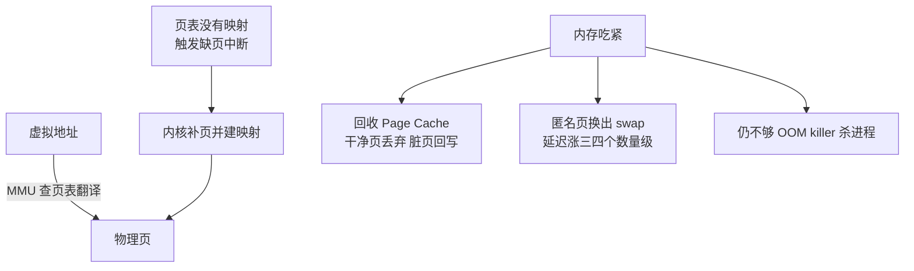
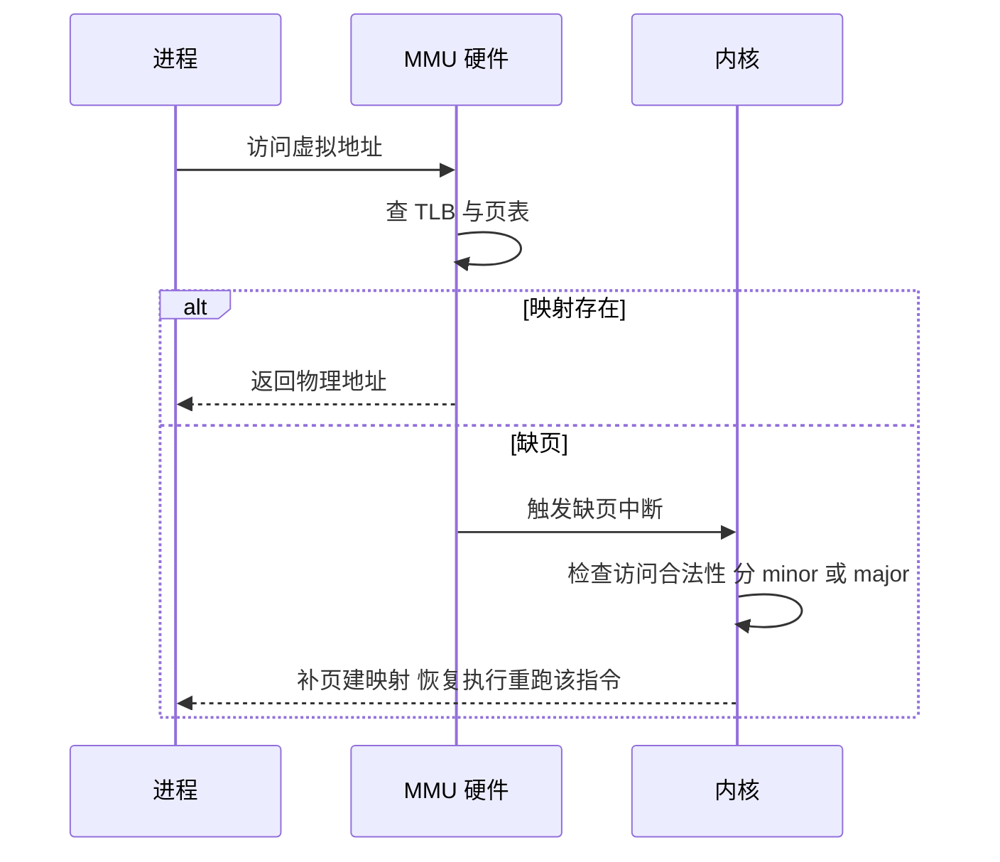

# 内存管理与虚拟内存：页表、Page Cache 与 swap 的代价

> 每个进程都活在「独占整台机器内存」的幻觉里——这正是虚拟内存的伟大之处。这一次抽象同时交付了三样东西：进程间的隔离、物理内存的超卖（超额 Commit）、冷数据的下沉（页缓存回收与 swap）。理解了这条主线，Redis 为什么怕 swap、Kafka 为什么依赖页缓存、ES 为什么建议把一半内存留给操作系统，就都不再是玄学，而是同一套机制在不同场景下的投影。

## 一句话摘要

虚拟内存用「页表翻译」同时交付隔离（进程互相不可见）、超卖（虚拟地址可以远大于物理内存）与惰性（按需分配按需加载）；Page Cache 让磁盘读写先落在内存里，是 Kafka/ES 这类组件性能的第一地基；swap 则是内存吃紧时把匿名页挪去磁盘的最后手段——代价是三到四个数量级的延迟，这正是它在生产环境被视为风险的原因。

## 🎯 本文核心

**核心机制一句话**：MMU 按页表把虚拟地址翻译成物理地址，缺页时内核补页建映射；内存吃紧时内核先回收页缓存（干净页直接丢弃、脏页回写），匿名页没有现成的落盘形态只能换出到 swap——这一步就是生产延迟尖刺的策源地。

**机制链（上下游一条线）**：malloc 只记账不分配 → 首次访问触发缺页 → 内核补物理页并建立映射 → 数据读写路过 Page Cache → 内存紧张内核按水位回收（先收页缓存）→ 匿名页换出到 swap → 极端情况 OOM killer 出场。每一环都是上一环的兜底，兜底顺序搞反了，排查方向就全错。

## 典型使用场景

- **超大内存预留的进程**：JVM 给堆预留几十 GB 虚拟地址、物理内存按实际使用逐步增长——没有惰性分配与超额 Commit，进程一启动就把机器占满。
- **数据库与中间件**：MySQL 的 Buffer Pool、ES 的文件系统缓存依赖、Kafka 的日志页缓存——这些组件性能的第一道分水岭，就是「数据在不在内存里」。
- **容器内存限额**：cgroup 限额记的就是这套物理账——页缓存也算在容器头上，这解释了「业务没占多少内存、容器却先到限额」的常见困惑。
- **反过来不适用**：对延迟极度敏感、内存可控的核心缓存服务——swap 与激进回收对它们是纯风险，部署期就该关掉（见后文机制四）。

## 机制一：虚拟内存为什么是伟大的抽象

**隔离**：每个进程一套独立虚拟地址空间，页表决定翻译结果——A 进程的 0x1000 和 B 进程的 0x1000 指向不同物理页，互相看不见摸不着。上一篇讲过，这是「进程隔离」的硬件地基。

**超额 Commit**（公开口径：Linux 的 overcommit 机制，`/proc/sys/vm/overcommit_memory` 控制）：malloc 申请到的只是虚拟地址的记账，物理页等真正写入才补。业内认知：单机所有进程虚拟内存之和远大于物理内存，是常态而不是异常。

**惰性**：按需分页（demand paging）——代码段、数据页都是访问时才装载；fork 用写时复制，连页表都尽量共享。

**追问一：超额卖出去的内存，大家一起来用怎么办？** 内核的三个出口按序触发：收页缓存（对进程几乎无感）→ 换匿名页到 swap（慢三四个数量级）→ OOM killer 直接杀进程（公开口径：内核按 badness 评分挑选牺牲者）。超额本质是杠杆：平时白赚利用率，极端时集中爆仓——理解了这一点，就理解了为什么生产事故总在「内存看起来还够」的时候发生。

**再追问：隔离凭什么由硬件保证？** 地址翻译在 MMU 硬件里完成，每一次访存都过一遍；进程访问未映射地址，硬件直接触发异常，内核才有机会介入。隔离不是软件君子协定，是硬件强制——这也是它能撑起整个现代操作系统安全模型的原因。

## 机制二：页表与缺页——翻译的代价

公开口径：x86-64 常用 4KB 页、四级页表（新平台最多五级）。多级设计的妙处在于「按需建表」：一大段从没用到的地址空间，连页表都不用分配——页表本身也是惰性的。跨周期看这套机制的演变：地址空间从 32 位到 64 位、页表从单级到多级再到五级，每一轮演进都在回答同一个矛盾——翻译要快，表又不能大。

TLB 是翻译结果的高速缓存：命中则零成本，不命中要多轮访存逐级查页表。上下文切换更换地址空间时 TLB 可能大面积失效（公开口径：PCID/ASID 标签机制缓解）——这正是上一篇「进程切换比线程切换贵」的硬件根源。

一次缺页的完整流程：

缺页分两档：**minor fault**——页早就在内存里（共享库、Page Cache 中），只补映射，微秒级以下；**major fault**——要从磁盘读入，毫秒级起步。两者差三个量级，监控上必须分开看（公开口径：ps 与 sar 都能分别统计）。

**追问一：既然有 TLB，为什么还怕页表大？** TLB 容量有限（业内认知：几十到几千条目），大页（2MB/1GB，公开口径）的本质是「一条 TLB 条目覆盖更大地址范围」——内存数据库与低延迟服务偏爱大页，就是在给 TLB 减压。

## 机制三：Page Cache——应用性能的隐形地基

**读路径**：read 先查页缓存，命中直接从内存返回；未命中从磁盘读入并缓存，下一次就是内存速度。

**写路径**：write 落到页缓存即返回（这就是「写盘像写内存一样快」的真相），脏页由内核后台异步回写（公开口径：`vm.dirty_ratio` 系列参数控制回写节奏）。

`free -h` 里 buff/cache 的一大部分就是它；判断内存是否够用要看 available 而不是 free——这是下一篇之外本文要钉死的第一个运维口径。

它与应用组件的关系（为 Redis/ES/Kafka 系列打地基）：

- **Kafka**：日志顺序追加写全部落在页缓存，消费者读的又是热点日志段——读写都在内存里转，磁盘只在后台慢慢回写。公开口径：Kafka 官方设计文档明确「信任页缓存」而不自建缓存；消费路径再配合 sendfile 从页缓存直达网卡（零拷贝见第三篇）。
- **ES**：倒排索引大头留在文件里，搜索性能高度依赖文件系统缓存命中率——公开口径：官方建议把约一半内存留给操作系统缓存，JVM 堆不超过一半。
- **数据库**：Buffer Pool 是「数据库自管的页缓存」，思想同源——把热数据钉在内存；它与内核 Page Cache 是两层，走 O_DIRECT 才能绕开上层（公开口径）。
- **Redis**：数据本就在内存，但 AOF/RDB 落盘、主从全量同步的临时文件、fork 时的写时复制——内存管理的每一步都和本篇机制相关。

**追问一：应用直接 O_DIRECT 绕开页缓存，不是更可控吗？** 代价是自己造缓存、自己管预读与回写；只有数据库这类有成熟自管缓存的组件才值得。这里能看到内核与应用的架构分工：**内核把「通用的缓存」做对所有，应用默认信任它，只在特殊场景才自己下场**——Kafka「信任页缓存」正是这一思想的最佳注脚。

**打破砂锅：为什么顺序写快、随机写慢，在页缓存视角下怎么看？** 顺序写天然凑成大块脏页一次回写；随机写让回写碎片化、预读全部失效。页缓存救得了热点，救不了全盘随机——Kafka 只追加不修改的设计，正是把「随机」从物理上消灭掉。

## 机制四：swap 的生产危害

swap 的本意是兜底：内存吃紧时把不活跃的匿名页挪到磁盘，腾出物理页。设计上完全合理——桌面场景靠它让「超出物理内存的需求」跑得动。

危害在量级：内存访问百纳秒级，磁盘毫秒级，一次换入换出慢三四个数量级。更麻烦的是被换出的往往是「平时冷、关键时热」的页——连接元数据、认证结构、代码段边角。抖动表现为**偶发尖刺长尾**而不是持续高负载，最难排查。顺带看上下游的一层：页缓存回收伤的是「吞吐」（重读一遍盘就回来了），匿名页换出伤的是「延迟」（数据回来前请求就挂死）——同一套回收机制，作用于两种页，故障形态完全不同。

公开口径与业内共识：Redis 官方建议 `vm.swappiness=1`（几乎只在紧急时换出）；ES 官方建议彻底禁用 swap 并用 `bootstrap.memory_lock` 锁内存；数据库类服务业内普遍在部署期关闭 swap。swappiness（公开口径：0-100，Linux 默认 60）控制回收时「收页缓存 vs 换匿名页」的倾向——调低不是禁用，是把匿名页换出推到万不得已。

**追问一：内存没满，为什么也会发生换页？** 回收由水位触发（公开口径：内核水位线机制），不是等满了才动。邻居进程突然吃内存、一次性大文件读写挤占缓存，都可能触发回收与换出——「我的进程内存够」不等于「我的进程不被波及」，内存账要从整机视角算。

**打破砂锅：OOM killer 杀进程之前，有机会自保吗？** 有：`oom_score_adj` 可以调整自己被选中的权重（公开口径），核心服务调低、离线任务调高，让坏时刻的牺牲顺序符合业务价值——这是混部治理的标配动作。

## 生产上的真实一课（已匿名化）

某平台的缓存服务线上事故：平时 P99 稳定在两毫秒左右，每天固定时段飙到数百毫秒，进程监控与系统负载全部正常。排查路径：应用层无慢查询、无线程阻塞；主机层 `vmstat` 发现 si/so 每秒持续非零，但 `free` 看 available 明明充足；把尖刺时段与变更记录对齐，发现同机一个离线导数任务定时启动，瞬间挤占内存，触发内核把缓存服务的匿名页换出、访问时再换入。处置：离线任务迁走 + swappiness 降到 1 + 核心进程 `oom_score_adj` 调低。复盘结论一句话：**swap 抖动不表现为「内存不足告警」，而表现为「莫名其妙的延迟尖刺」——内存要按整机算，不能按单进程算。**

## 与应用侧缓存的区别：谁挡在哪一层

| 层级 | 代表 | 挡掉的成本 | 失效后果 |
|---|---|---|---|
| 应用缓存 | 进程内 LRU / Redis / Memcached | 网络往返 + 数据库负载 | 流量直接打到下游并被放大 |
| 数据库自管缓存 | MySQL Buffer Pool | 磁盘随机读 | 数据库 IO 飙升 |
| 内核页缓存 | Page Cache（buff/cache） | 磁盘 IO | 读穿透到磁盘，压力落回盘 |

辨析一个常见误解：它们不是互相替代，而是上下游串联——应用缓存 miss 才有数据库查询，数据库 miss 才有磁盘读，磁盘读还要先过一层页缓存。**任何一层失效都不会被下一层完全兜住，只会被放大**——容量规划要按「最坏情况下流量穿过几层」来算，而不是按平均命中率。

## 常见误区与不适用边界

- ❌ **「free 显示内存快用完 = 该加内存了」**——buff/cache 是可回收的，看 available 才是正确口径；缓存占满恰恰说明系统在高效工作。
- ❌ **「RSS 等于进程真实占用」**——共享库等共享页会重复计入多个进程的账面（公开口径：PSS 是更公平的分摊口径）；容器限额又按 cgroup 记账，三套口径别混用。
- ❌ **「swap 配了不用就是浪费，不如干脆不要」**——关 swap 的理由不是浪费，是「换入换出的延迟尖刺在生产不可接受」；「保留小 swap + swappiness=1」是另一种主流选择。两者都比「默认 60 从不看一眼」强。
- ❌ **「虚拟内存大 = 内存泄漏」**——运行时保留地址空间很常见（glibc、Go 运行时都这么干），看 RSS 与缺页趋势，不看虚拟内存总量。
- **不适用边界**：大内存机器跑单一核心服务时，过度纠结 swap 参数收益有限；真正的风险区在混部、弹性伸缩、内存水位波动大的环境。

## 不同量级下的思考

- **十万级 QPS 单机、10GB 级工作集**（思考方式：默认值驱动）——约束来源是运维简单性：内核默认参数已经足够好，这一档的核心问题是别乱调，而不是调优。
- **百万级热数据条目的读服务**（思考方式：命中率驱动）——约束来源是「热数据装不装得进内存」：这一档的核心问题是缓存命中率与数据分层——ES 留一半内存给操作系统缓存、MySQL 调 Buffer Pool，都属于这一档的动作。
- **亿级用户、TB 级日志与消息流**（思考方式：顺序性驱动）——约束来源是磁盘的物理特性：这一档的核心问题是把随机消灭掉——顺序追加 + 页缓存 + 零拷贝三件套（Kafka 路线），让内存与磁盘各干各的。
- **千万级 QPS 汇聚的万机集群**（思考方式：混部治理驱动）——约束来源是整机利用率与干扰的平衡：这一档的核心问题是内存隔离与回收策略的体系化——cgroup 限额、水位分级、OOM 评分都升级为平台能力。

自下而上看：默认参数 → 命中率调优 → 顺序性设计 → 混部治理，每一档都长在上一档之上；触发升级的信号同样明确——available 频繁贴水位、缺页与回收指标抬头、延迟尖刺与时段性任务对齐，都是向上一档思考的闹钟。

## 💡 实战提示

- 💡 判断内存健康三看：`free` 看 available（不是 free 那一列）、`vmstat` 看 si/so 是否持续非零、`sar -B` 看缺页与回收速率——三处对照才能下结论。
- 💡 数据库、缓存、消息类机器，部署清单里就把 swap 策略写死：要么关闭，要么 swappiness=1 加锁内存——别把决定权留给「系统默认」。
- 💡 容器内存被打爆先看是不是页缓存：cgroup 把 cache 也记账，写大文件的容器限额会被缓存吃掉——先显式回收或调限额，再怀疑业务代码。
- 💡 排查延迟尖刺时把三张图对齐：业务耗时、内存水位、si/so——尖刺与换页时间对上了，问题就结案了一半。

## Trade-off：超额 Commit 与 swap 的尺子怎么定

**方案 A 严格预留**（overcommit=2 + 保留 swap）：分配即占坑，不会爆仓，代价是内存利用率低、大申请直接失败。**方案 B 激进超卖**（overcommit 默认 + 关 swap）：利用率最高，代价是极端时 OOM 直接杀进程。**明确推荐**：常规服务用默认启发式超卖 + 小 swap 低 swappiness，把「爆仓前兆」暴露给监控而不是藏到 OOM 里；核心有状态服务在此基础上锁内存、调低 OOM 权重。为什么不用反方案：严格预留浪费最狠的恰是「申请了暂不用」的合法场景（大堆运行时），激进超卖则把故障从「可观测的变慢」变成「不可预测的被杀」。权衡的关键：**故障模式的可观测性，比平均利用率更重要**。

## 你们可能会问

**malloc 返回成功，为什么用的时候才出事？** 超额 Commit 只在分配时记账，首次写入才补物理页；物理耗尽时的出口是回收、换出、OOM——极端情况下，触发被杀的正是你那笔「成功」的写入。

**为什么页缓存里的热数据有时看起来「丢了」？** 回收是 LRU 近似且由水位驱动，一次性大文件读写能把热页整批冲掉（业内认知：缓存污染现象）。核心路径避免大文件裸读写，或用 cgroup 与参数把它隔开。

**大页什么时候值得开？** TLB 命中率成为瓶颈时（业内认知：大内存加访存密集型服务，如内存数据库）。代价是分配粒度变粗、对碎片敏感——它是专项优化，不是默认项。

**fork 一个几十 GB 的进程为什么瞬间完成？** 写时复制：只复制页表不复制内存，父子共享物理页；之后任何一方写页才真正复制——Redis 持久化时内存占用虚高，正是这个机制（公开口径：Copy-on-Write）。

## 自测三问

1. 虚拟内存一次抽象交付了哪三样？（隔离、超额 Commit、按需惰性加载）
2. minor 与 major 缺页的差别？（页在内存只补映射 vs 要读盘——差约三个数量级，监控要分开看）
3. swap 为什么是生产风险？（延迟差三四个数量级且表现为尖刺；匿名页必须换出，无法像页缓存那样直接丢弃）

## 5W 速记卡

| 问题 | 答案 |
|---|---|
| What | 页表翻译 + 按需补页 + 页缓存 + swap 的整套内存管理 |
| Why 伟大 | 隔离由硬件强制，超卖与惰性让物理内存利用率起飞 |
| Page Cache | 读写先落内存——Kafka/ES 性能的第一地基 |
| swap 危害 | 匿名页换出慢三四个数量级，表现为偶发延迟尖刺 |
| 何时干预 | available 贴水位 / si-so 持续非零 / 尖刺与回收对齐时 |

## 开放问题

- 内核回收策略与业务「热页」的博弈仍是灰色地带：更智能的回收算法（业内认知：多代 LRU 已合入主线，演进仍在继续）能否把混部场景的干扰压到足够低，值得持续观察。

## 🎯 核心带走

虚拟内存是「一次抽象交付三样能力」的典范：页表翻译给了硬件级隔离，惰性分配与超额 Commit 给了利用率，页缓存回收与 swap 给了弹性。应用性能的隐形分水岭是数据在哪一层——热在页缓存是内存速度，换到 swap 就是磁盘速度加尖刺。失效点：邻居挤占触发回收换出、缓存记账吃掉容器限额、OOM 评分没按业务价值排过序。金句：**内存不怕用得多，就怕账没人算；Page Cache 是地基，swap 是雷。**

**决策**：什么时候信任默认——单机单服务、水位平稳；什么时候必须动手——混部、有状态核心服务、延迟敏感场景（关/降 swap + 锁内存 + 调 OOM 权重）。取舍：利用率与故障可观测性之间，永远优先后者。

## 📌 数据与事实声明

- 本文机制描述依据《操作系统导论》（OSTEP）、Linux 内核公开文档（overcommit、水位回收、swappiness、oom_score_adj、大页）与各组件官方文档；Redis 建议 swappiness=1、ES 建议禁用 swap 与 memory_lock、Kafka「信任页缓存」设计均为公开口径；TLB 容量、延迟量级等带「业内认知」标注的数字为行业普遍经验值，非精确统计；场景故事已匿名化，不指向任何特定公司与个人。

## 📚 参考资料

| 资料 | 说明 |
|---|---|
| 《操作系统导论（OSTEP）》 | 虚拟内存与页表机制最清晰的入门读物 |
| Linux 内核文档 vm/ 目录 | overcommit、swappiness、回收机制的权威口径 |
| Redis 官方文档 | swappiness 建议与 fork 写时复制的公开口径 |
| Elasticsearch 官方文档 | 禁用 swap、memory_lock 与堆外缓存的官方建议 |
| Kafka 官方设计文档 | 「信任页缓存」设计哲学的正源 |
