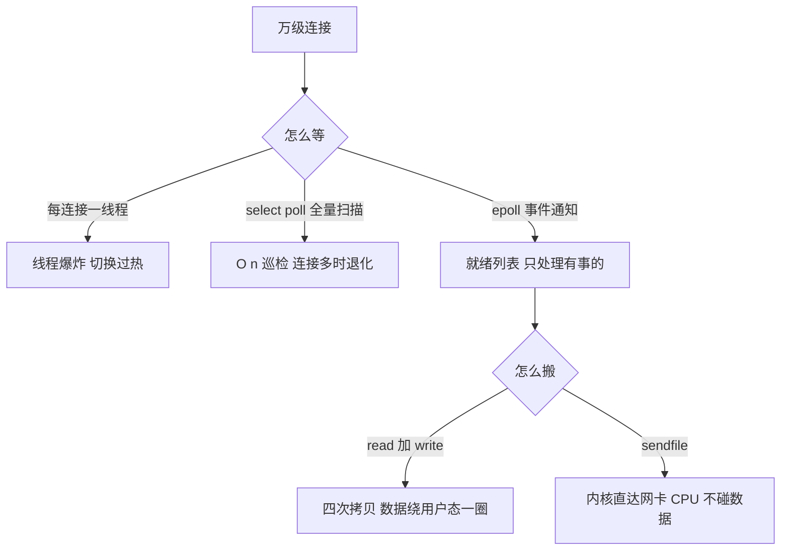
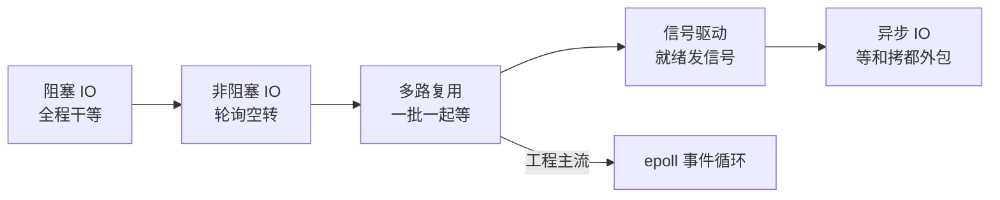
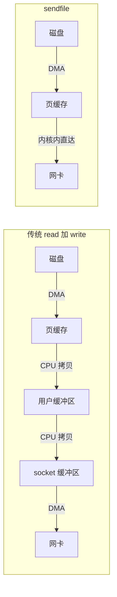

# IO 多路复用与零拷贝：五种 IO 模型、epoll 与 Kafka/Redis 的关系

> 高性能网络服务的两半拼图：一半是「怎么等」——五种 IO 模型的演进史，就是在回答等数据时怎么让 CPU 别干等；另一半是「怎么搬」——零拷贝回答数据从盘到网卡怎么少绕冤枉路。Redis、Nginx、Kafka 的性能神话，拆开看没有魔法，都是这两半问题的工程化答案。

## 一句话摘要

前四种 IO 模型（阻塞、非阻塞、多路复用、信号驱动）只解决「等」的效率，数据拷贝仍要走「内核-用户」两次搬运；epoll 用就绪列表把 O(n) 巡检变成事件通知，sendfile 让数据全程不进用户态——Redis 的快主要靠前者，Kafka 的快两样都要。

## 🎯 本文核心

**核心机制一句话**：IO 多路复用 = 一个线程委托内核监听一批连接，谁就绪处理谁；零拷贝 = 消除「内核缓冲区与用户缓冲区之间」多余的 CPU 搬运，让数据路径尽量全程留在内核。

**机制链（上下游一条线）**：连接数增长 → 阻塞模型线程数跟着线性涨 → 多路复用用事件回调把线程数收敛到核数量级 → epoll 用红黑树加就绪链表让「监听海量连接」成本可控 → 拉取与转发类流量再上 sendfile → 页缓存直达网卡——与上一篇的 Page Cache 正好接上。

## 典型使用场景

- **长连接接入**：推送网关、IM、消息通道——连接多而活跃少，多路复用是唯一经济的解法。
- **中间件数据面**：Redis 的命令事件循环（公开口径：6.0 引入 IO 线程前，网络与命令执行为单线程事件循环）、Nginx 反向代理、Kafka 的日志拉取——事件驱动加零拷贝的标准组合。
- **大文件分发**：静态资源、日志段传输——sendfile 让 CPU 完全不碰数据本体。
- **反过来不适用**：连接数少但计算重的服务——几十个连接配事件驱动是负收益，线程池加阻塞模型更直观、更好排查。

## 机制一：五种 IO 模型演进——一部「别干等」的历史

公开口径（《UNIX 网络编程 卷 1》的分类）：阻塞 IO、非阻塞 IO、IO 多路复用、信号驱动 IO、异步 IO。每种模型回答的都是同一个问题的不同侧面：**等数据就绪时，进程在干嘛？**

先把一次读操作拆成两阶段：阶段一——等数据从网卡到达内核缓冲区；阶段二——数据从内核缓冲区拷到用户缓冲区。

- **阻塞 IO**：两阶段全程挂起——一个连接一条线程伺候到底，模型简单但线程数随连接线性增长。
- **非阻塞 IO**：阶段一立刻返回「还没好」，进程轮询——CPU 空转，单独用是反模式。
- **IO 多路复用**：把「等」外包给内核——select/poll/epoll 一次看住一批连接，谁就绪处理谁；阶段二（recvfrom 拷贝）仍会阻塞。
- **信号驱动 IO**：内核就绪时发信号再处理——工程上少见，信号处理与重入的复杂度不划算。
- **异步 IO**：两阶段全外包，内核完成后才通知——公开口径：Linux 上 io_uring（5.1 引入）才是工程可用的转折点，此前的 POSIX AIO 一直不温不火。

**追问一：多路复用不也阻塞在 epoll_wait 上吗？它和阻塞 IO 到底差在哪？** 差在「一次阻塞看住一批」。阻塞 IO 一次系统调用只能伺候一个连接；epoll_wait 一次返回的是「一批就绪连接」——线程数从 O(连接数) 降到 O(核数)，切换开销直接砍掉一个数量级。这正是上一篇上下文切换账本的续集：省的不是单次等待，是成千上万条线程的维护费。

**打破砂锅：为什么前四种都叫同步 IO？** 公开口径的判据看阶段二：数据从内核拷到用户缓冲区时，进程都得亲自调用并等待；只有异步 IO 连这次拷贝都不需要进程参与。**同步与异步的分界线在「拷贝」而不在「等待」**——这是最容易记错的一条线。

## 机制二：select/poll/epoll——为什么 epoll 能扛百万连接

- **select**（公开口径）：fd_set 位图，单进程上限 FD_SETSIZE=1024；每次调用把整个集合拷进内核，内核线性扫描全部 fd，返回后用户还要再遍历一遍找出就绪的——三次 O(n)，一个都少不了。
- **poll**：pollfd 数组突破了 1024 上限，但「全量拷贝 + 双向扫描」的 O(n) 本质没变。
- **epoll**：三件套 epoll_create / epoll_ctl / epoll_wait。fd 注册一次进红黑树（增删查 O(log n)），事件就绪时内核回调把它挂进就绪链表；epoll_wait 只返回就绪列表——**监听成本与连接总量解耦，只与活跃连接数成正比**。海量连接低活跃（长连接的典型形态）下，差距是数量级的。

触发模式（公开口径）：水平触发 LT 没处理完会反复通知（默认，好写好查）；边缘触发 ET 只在状态变化时通知一次，必须配非阻塞 fd 一次性读到 EAGAIN——省唤醒，但代码难度陡增。Nginx 用 ET，多数框架默认 LT。

| 维度 | select | poll | epoll |
|---|---|---|---|
| fd 上限 | 1024（公开口径） | 无硬限制 | 无硬限制（受内存） |
| 每次调用成本 | 全量拷贝 + 全量扫描 | 全量拷贝 + 全量扫描 | 注册一次，只返回就绪 |
| 返回内容 | 整个集合（自行遍历） | 整个集合（自行遍历） | 就绪列表 |
| 复杂度 | O(n) | O(n) | O(活跃数) |
| 触发模式 | LT | LT | LT / ET |

**追问一：epoll 不扫描，它怎么知道谁就绪？** 注册时挂回调：网卡数据到达 → 硬件中断 → 内核回调把该 fd 挂进就绪链表。是事件把 fd「推」进列表的，不是 epoll 去「拉」着检查的——推拉之别，就是 O(n) 与 O(活跃数) 之别。

**再追问：一个线程处理百万连接，真处理得过来吗？** 长连接形态下，绝大多数连接当下无事可做；epoll_wait 返回的是活跃子集，事件循环逐个非阻塞处理即可。真正的瓶颈会转移到带宽与后端处理速度，而不是「发现就绪」这一步。

## 机制三：零拷贝——mmap 与 sendfile

传统 read + write 的完整账单（公开口径）：盘 → 页缓存（DMA 拷贝）→ 用户缓冲区（CPU 拷贝）→ socket 缓冲区（CPU 拷贝）→ 网卡（DMA 拷贝）——四次拷贝、四次用户态内核态切换，其中 CPU 搬了两次本不必搬的数据。

- **mmap + write**：把页缓存映射进用户地址空间，省掉「页缓存到用户缓冲区」的一次 CPU 拷贝——但数据仍经过用户态、切换仍有四次；适合「拷完还要加工内容」的场景。
- **sendfile**：数据完全不进用户态——系统调用内部完成页缓存到 socket 的搬运；网卡支持 scatter-gather 时连内核内的 CPU 拷贝都省掉（公开口径：Linux 2.4 起），CPU 彻底只当指挥员。
- **边界**：sendfile 只适合「原样搬运」——内容要加工（压缩、加密）就得回用户态。TLS 时代 sendfile 一度失效，kTLS（公开口径：Linux 4.13 起）把加密下沉到内核才把它救回来。

**打破砂锅：为什么不用 mmap 一把梭？** mmap 把页缓存映射进用户地址空间，读写像访问内存——但它适合随机访问与小段修改；顺序大段搬运交给 sendfile 更省，因为数据根本不进用户态、CPU 完全不碰。两者的取舍不在快慢，在「数据要不要经过 CPU」——这也是零拷贝家族内部的设计取舍主线。

与 Kafka/Redis 的关系（本篇的落点）：

- **Kafka**：消费者拉日志段是「文件到网卡的纯搬运」——sendfile 的标准用户（公开口径：官方文档）；生产端是「顺序写进页缓存」（上一篇讲过）。为什么消费不用 mmap？mmap 适合随机访问与小段更新，日志段是顺序读一大段，sendfile 更贴；Kafka 把 mmap 留给了索引文件的随机读（公开口径）。读写两头都信内核的架构设计哲学，让它与上下游（页缓存、网卡）的衔接几乎零摩擦——这也是它数据面性能的正源。
- **Redis**：数据本来就在用户态内存里，响应路径是「用户缓冲区 → socket 缓冲区」一次拷贝——没有文件搬运可省，零拷贝对它的收益天然小。它的高性能来自内存操作 + epoll 事件循环 + 紧凑数据结构（公开口径：单线程命令执行模型）；零拷贝对 Redis 的意义在旁路——AOF/RDB 落盘走页缓存回写、主从全量同步传 RDB 文件。
- **Nginx**：`sendfile on` 是静态文件服务的标配（公开口径：官方文档配置项）。

这里的设计思想一句话：**让专用的人干专用的事——CPU 只该碰必须加工的字节，纯搬运交给 DMA 与内核**。多路复用管「事件发现」，零拷贝管「数据通路」，两者合起来才是「数据面不让 CPU 干杂活」的完整故事。

## 与阻塞多线程模型的区别：两种并发哲学的账本

| 维度 | 每连接一线程阻塞 | epoll 事件驱动 |
|---|---|---|
| 线程数 | O(连接数) | O(核数) |
| 切换开销 | 高（上一篇的账） | 低 |
| 代码模型 | 顺序直观，栈完整好排查 | 回调与状态机，栈不连续 |
| 适合形态 | 连接少、计算重 | 连接多、活跃稀疏 |
| 典型代表 | 传统数据库连接处理 | Redis / Nginx / 网关 |

辨析一个流行错觉：「事件驱动全面优越」。恰恰相反——它省的是等待与切换，付的是代码形态：把顺序逻辑拆成回调状态机后，业务复杂度越高维护成本越陡；一个阻塞调用混进事件循环就拖住全场。业内成熟做法都在试图兼得两者（公开口径：Redis 6.0 引入 IO 线程、Go 的 netpoller 把 epoll 藏进同步写法）——不是替代关系，是分工关系：模型选型要看这条链路的上下游形态，而不是追单一组件的极值。

## 生产上的真实一课（已匿名化）

某推送类服务的线上事故——长连接网关用 select 实现的旧框架，用户量过万后网关 CPU 飙满、消息延迟堆积，新连接频繁建立失败。排查路径：先看线程数正常，排除线程模型问题；`strace` 发现 select 每次返回后，CPU 时间都耗在全量 fd 集合的遍历上；再看单进程连接数，已逼近 1024 上限。故障定位清楚后迁移 epoll 事件驱动框架，线程收敛到核数量级，延迟随之回落。复盘结论：当时踩的坑是 select 的三重 O(n) 在「万连接低活跃」形态下全部退化——容量上限先炸，巡检成本再炸，一个比一个隐蔽；这类故障在生产环境里往往先表现为「偶发建连失败」而不是 CPU 告警，等告警响起来时容量早已穿底。

## 常见误区与不适用边界

- ❌ **「用了 epoll 一定快」**——epoll 只优化「发现就绪」；后端处理慢、锁竞争重，换 IO 模型救不了。
- ❌ **「零拷贝 = 完全没有拷贝」**——DMA 拷贝仍在，省的是 CPU 参与的多余拷贝；术语指数据不进用户态，不是物理上零次复制。
- ❌ **「ET 比 LT 高级，都该用 ET」**——ET 省的是重复唤醒，代价是必须一次读净加非阻塞；读不净就丢事件。LT 才是默认安全牌。
- ❌ **「io_uring 将全面替代 epoll」**——io_uring 生态仍在铺开（公开口径：演进中），存量系统与框架主体仍是 epoll。关注它，别神话它。
- **不适用边界**：低并发高计算服务、连接数几十的内部工具——阻塞加线程池的认知成本最低，强行上事件驱动是自找复杂度。

## 不同量级下的思考

- **百连接级内部服务**（思考方式：简单优先）——约束来源是可维护性：阻塞线程池完全够用，这一档的核心问题是代码好懂，而不是任何高性能技巧。
- **万级连接**（思考方式：线程成本驱动）——约束来源是线程内存与切换开销：这一档的核心问题是把「等」集中起来管——单线程或少线程的 epoll 事件循环登场。
- **十万到百万长连接**（思考方式：内存与批量驱动）——约束来源是每连接的内核对象与缓冲内存：这一档的核心问题是内存布局与事件批量化——连接对象池、读写聚合、sendfile 全链路零拷贝。
- **千万级在线**（思考方式：分层接入驱动）——约束来源是单机天花板：这一档的核心问题是接入分片与协议优化——多级网关、连接迁移，单机模型只是这张网里的一个节点。

自下而上看：线程池 → 事件循环 → 零拷贝全链路 → 分层接入，每一档都长在上一档的地基上；触发升级的信号同样明确——连接数逼近千级（select 上限或线程数失控）、CPU 大量花在搬运而非计算、盘到网卡之间出现可测的重复拷贝。

## 💡 实战提示

- 💡 判断该不该上多路复用，只看一个比值：活跃连接 / 总连接——比值越低事件驱动收益越大；全员活跃时它没有任何魔法。
- 💡 验证零拷贝是否生效：Nginx 查 sendfile 配置；Kafka 消费路径用 strace 抓 sendfile 系统调用；对比搬运类负载下 CPU 占比的变化。
- 💡 Java 的 NIO 与 Netty 底层就是 epoll（公开口径：Linux 上 Selector 的默认实现）——写 Netty 时把连接当事件流处理的心智正是本篇模型；别在 handler 里写阻塞调用，一个阻塞拖住整个事件循环。
- 💡 文件服务类需求先问能不能原样搬运：能，sendfile；要加工，才考虑 mmap + write 或用户态处理——别为「看起来先进」引入复杂度。

## Trade-off：事件驱动与零拷贝各自的尺子

**方案 A 线程池阻塞**：认知与调试成本最低，代价是连接规模化后资源崩塌。**方案 B epoll 事件驱动**：规模化成本最优，代价是回调状态机的维护成本与「一阻塞全卡」的脆弱性。**方案 C io_uring 异步**：两阶段全异步的理论最优，代价是生态与团队心智仍在建设期。**明确推荐**：连接少用 A；万级以上连接用 B；新建高性能存储与网关类系统跟踪 C 的演进。为什么不用反方案一把梭：三者的成本曲线在不同连接规模下交叉，一次性押注任一极端，都会在另一个量级上把债还回去。权衡的关键：**模型复杂度只该为「连接规模」这个变量买单，别为其他任何理由买单。**

## 你们可能会问

**epoll 返回就绪之后，用什么读写？** 照旧 read/write/recv/send，只是配非阻塞 fd——epoll 管「何时做」，常规调用管「做」，分工别搞混。

**Redis 6.0 为什么才引入多线程？不是说它单线程很快吗？** 单线程指的是命令执行（公开口径：避免锁与上下文切换）；万兆网卡时代网络包的读写解析成为新瓶颈，IO 线程只搬包、不碰数据结构——事件循环的骨架没变，只是流水线加了工位。

**sendfile 能发 TLS 流量吗？** 纯 sendfile 不能：加密必须加工内容，数据要进用户态（或内核的加密模块）；kTLS 把加密下沉内核后 sendfile 才恢复可用（公开口径：Linux 4.13 起，Nginx 1.21.4 起支持 kTLS 配 sendfile）。

**监听 socket 和连接 socket 能放进同一个 epoll 吗？** 能，而且就该这样：监听 fd 就绪 = 有新连接，连接 fd 就绪 = 有数据要读；事件循环里区分处理——这就是所有事件驱动框架主循环的骨架。

## 自测三问

1. 五种 IO 模型的同步/异步分界线在哪？（看阶段二由谁拷贝——前四种进程都要亲自拷贝，只有异步 IO 连拷贝都外包）
2. epoll 比 select 快在哪三点？（注册一次免全量拷贝、回调进就绪链表免全量扫描、只返回就绪子集免用户遍历）
3. Kafka 为什么消费用 sendfile 而不是 mmap？（消费是顺序大段搬运，sendfile 数据不进用户态；mmap 留给索引文件的小规模随机读）

## 5W 速记卡

| 问题 | 答案 |
|---|---|
| What | 多路复用管等，零拷贝管搬——合成数据面 CPU 零杂活 |
| 五模型主线 | 阻塞、非阻塞、多路复用、信号驱动、异步——演进主题是别干等 |
| epoll 三省 | 全量拷贝、全量扫描、全量遍历——各省一刀 |
| 零拷贝 | sendfile 适合纯搬运，mmap 适合要加工的，TLS 要 kTLS |
| 何时不用 | 连接少计算重：线程池阻塞比事件驱动更对 |

## 开放问题

- io_uring 与 epoll 的边界会怎么收敛？（业内认知：内核社区仍在快速扩展 io_uring 的能力面与安全面）事件模型会不会像当年 epoll 替代 select 一样再换代一次，值得每半年回看。

## 🎯 核心带走

五种 IO 模型是一部「等的时候别闲着」的演进史——前四种只优化等待，真正的异步连拷贝都外包给内核；epoll 靠「注册一次 + 就绪链表 + 只返回活跃子集」把监听成本与连接总量解耦；sendfile 把「盘到网卡」的路径压进内核，CPU 只当指挥员。失效点：事件循环里混入阻塞调用、TLS 让 sendfile 静默失效、select 的 1024 上限在连接增长后突然爆炸。金句：**多路复用解决怎么等，零拷贝解决怎么搬；高性能数据面 = 等得聪明 + 搬得直接。**

**决策**：什么时候用阻塞线程池——连接少计算重；什么时候用 epoll——连接多活跃稀疏；什么时候上零拷贝——文件到网卡的纯搬运。取舍：模型复杂度只为连接规模买单；加密与内容加工是 sendfile 的天然边界。

## 📌 数据与事实声明

- 本文模型分类依据《UNIX 网络编程 卷 1》；select 的 FD_SETSIZE=1024、epoll 的 LT/ET、Linux 2.4 scatter-gather、io_uring 于 Linux 5.1 引入、kTLS 于 Linux 4.13 引入、Kafka sendfile 与 mmap 索引、Redis 单线程命令执行与 6.0 IO 线程、Nginx sendfile 配置均为公开口径；连接规模与收益量级等带「业内认知」标注的数字为行业普遍经验值，非精确统计；场景故事已匿名化，不指向任何特定公司与个人。

## 📚 参考资料

| 资料 | 说明 |
|---|---|
| 《UNIX 网络编程 卷 1》 | 五种 IO 模型分类的正源 |
| man 7 epoll / select / poll | 系统调用语义与触发模式的权威口径 |
| Linux 内核文档 io_uring | 异步 IO 演进的公开口径 |
| Kafka 官方文档 | sendfile 与 mmap 使用的公开口径 |
| Redis 官方文档 | 事件循环与 IO 线程模型的公开口径 |
