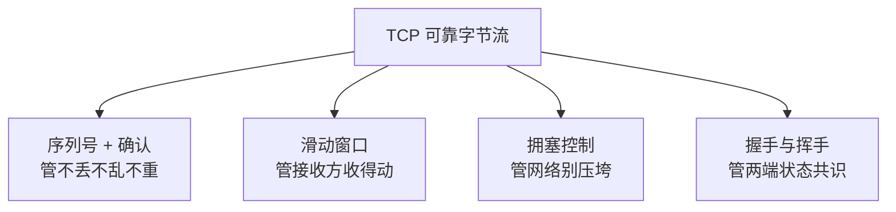
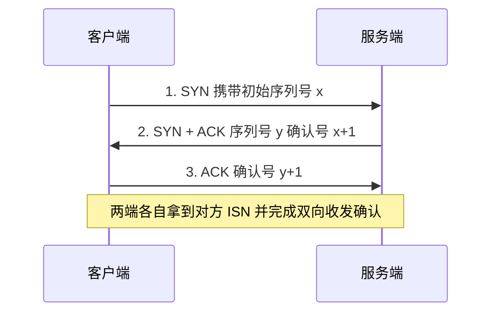
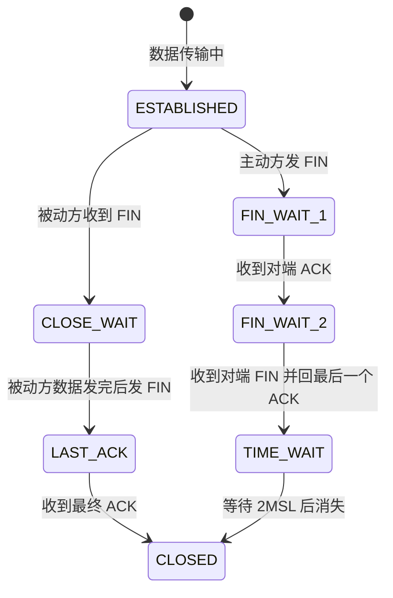
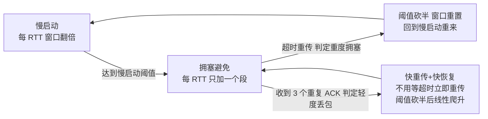

# TCP 为什么可靠：三次握手、滑动窗口与 TIME_WAIT

> IP 网络的本质是「尽力而为」：包会丢、会乱序、会重复、会迟到。TCP 却能在这样的网络上交付出「不丢、不重、不乱、不压垮任何人」的字节流。它靠的不是某一个机制，而是一套各管一件事的组合拳——把这套组合拳拆开看，可靠性就不再神秘。

## 一句话摘要

TCP 的可靠 = **序列号与确认**解决「丢、乱、重」，**滑动窗口**解决「接收方收不动」，**拥塞控制**解决「网络被压垮」，**握手与挥手状态机**解决「两端共识的建立与善后」——四个机制各答一个问题，合起来才是完整意义上的可靠。

## 🎯 本文核心

**核心机制一句话**：TCP 用「序列号 + 累积确认」把不可靠的 IP 包重组为有序字节流，用「滑动窗口」约束在途数据量保护接收方，用「拥塞控制」约束注入速率保护网络，用「连接状态机」管理两端共识从建立到拆除的全生命周期。

**机制链（上下游一条线）**：应用写数据 → 按 MSS 切段并编号 → 网络层可能丢/乱/重 → 接收方按序列号重组并 ACK → 滑动窗口限制在途字节 → 拥塞窗口限制注入速率 → 关闭时 TIME_WAIT 兜底残留报文。这四个环节是同一条因果链上的上下游，拆开任何一环，可靠性都会塌。

## 典型使用场景

- **服务间调用与网页请求**：HTTP/gRPC/数据库连接都跑在 TCP 上——调用方要求「发出去的请求一条不少、一字不差」，可靠传输是业务正确性的底线。
- **文件与消息传输**：一个安装包传到 99% 断网重连后能续传，靠的是序列号记录了「哪些字节已确认」。
- **日志与指标上报**：观测数据宁可慢一点也不能丢采样，TCP 的重传兜底比应用层自己做应答协议省事得多。
- **反过来不适用**：实时音视频、游戏帧同步——旧帧重传回来已经没有意义，宁可丢帧也要新鲜，这类场景用 UDP 自行取舍（见文末 Trade-off）。

## 机制一：序列号与确认——可靠的地基

TCP 给**每一个字节**编号（序列号 seq），接收方回复的 ACK 是「累积确认」：确认号 = 期望收到的下一个字节编号，意思是「这之前的我都收到了」。这一个设计同时解决三件事：

1. **丢**：发送方在超时时间内没等到某个段的确认，就重传——丢包被兜住了。
2. **乱**：包到达顺序错乱时，接收方按序列号重新排序再交付应用——乱序被抹平了。
3. **重**：网络重复投递的包，接收方按编号去重——重复被过滤了。

**为什么按字节编号而不是按包编号？** 字节编号让「半个段」的边界处理、乱序重排、滑动窗口计数（在途字节数）全部统一在一把尺子上；按包编号则每个包大小不一，窗口算不清账。

**追问一：ACK 包丢了怎么办，会不会全量重传？** 不会——累积确认的妙处在这里：只要后续 ACK 到了，编号更大，就等于补认了前面所有数据。第 100 号的 ACK 丢了，第 5000 号的 ACK 到了，发送方就知道 100 到 5000 全部送达。这就是「累积」二字的分量。

**再追问：那超时重传的等待时间怎么定？** TCP 持续测量往返时延 RTT，用自适应算法（公开口径：RFC 6298）动态计算超时 RTO——固定值在网络时延波动时要么白白早重传、要么干等太久。自适应本身就是「网络状况不可预知」这一假设的直接推论。

## 三次握手：为什么是三次而不是两次

握手的目的常被说成「确认双方都能收发」，这只是表层。**本质是同步两件事**：交换双方的初始序列号 ISN（后续所有字节的编号起点），并确认这条连接不是网络上残留的旧连接。

**追问一：为什么两次不行？** 两次握手下，服务端收到 SYN 回一个 ACK 就算连接建立。反直觉的真相是：一个**在网络里迷路了很久的旧 SYN** 迟到抵达，服务端照样回复并建立连接、分配缓冲区——而客户端根本不认这个连接。三次握手给了客户端最后一次裁决权：它用第三个 ACK 表态「我要的是这条连接」，旧连接的 SYN 得不到这个 ACK，就会被服务端放弃。顺序上表现为：两端的 ISN 各需要「一次告知 + 一次确认」，两个 ISN 的确认可以合并到同一个报文里，最少三次刚好够。

**再追问：那为什么不干脆四次？** 因为服务端的 SYN（我要告诉你我的 ISN）和 ACK（我确认你的 ISN）可以塞进同一个报文，四次的第二步和第三步天然合并。协议设计里，报文数每多一次，建连延迟就多一个 RTT——能合则合。

**打破砂锅：初始序列号 ISN 为什么要随机？** 两个原因：一是防混淆——如果每次都用固定起点，网络上残留的旧连接报文可能带着与新连接重叠的编号混进来；二是提高伪造难度——不知道随机起点，第三方就难以构造合法编号的报文注入连接（公开口径：RFC 6528 建议随机化时钟偏移方案）。

## 四次挥手与 TIME_WAIT：善后比建立更麻烦

关闭连接时，主动方和被动方往往数据还没发完，所以「我发完了」的 FIN 和「我知道了」的 ACK 必须分开走，四次挥手由此而来（被动方的 ACK 与 FIN 无法合并——它收到 FIN 时自己可能还有数据要发，这就是「半关闭」）。

主动关闭方最终进入 **TIME_WAIT**，停留 2 个 MSL（报文最大存活时间；公开口径：Linux 默认 MSL 为 30 秒，即停留约 60 秒）。这个「等待」有两个缺一不可的意义：

1. **给最后一个 ACK 一次重来的机会**：如果它发的最终 ACK 丢了，对端会重发 FIN——只有还停在 TIME_WAIT 里，才能重发 ACK 帮对端体面关闭；若立刻消失，对端会收到 RST，关闭过程变得粗暴。
2. **让旧连接的残留报文自然消亡**：等足够长时间，这条连接的所有报文都死在了网络里，之后新建的同四元组连接绝不会被旧报文污染。

**生产上的真实一课（已匿名化）**：某内容平台的一次线上故障——服务与下游之间用短连接高频调用，某天接口批量报「连接被拒绝」。排查路径：先看服务端进程存活正常，再看监控发现本机 TIME_WAIT 数量从几千飙到数万；`netstat` 统计确认大量 TIME_WAIT 占住本地端口，临时端口（公开口径：Linux 默认范围 32768-60999）接近耗尽，新建出站连接失败。处置：业务侧改为连接池长连接复用，配合内核 `tcp_tw_reuse` 只对出站方向开启；复盘结论一句话——TIME_WAIT 不是 bug，是高频短连接的反模式把保护机制变成了瓶颈。

## 滑动窗口与拥塞控制：流速的两道闸门

有了可靠交付，下一个问题是**发多快**。TCP 用两个窗口回答，一道闸门管一端：

- **流量控制（滑动窗口）**：接收方在每个 ACK 里通告自己的剩余缓冲区大小（接收窗口），发送方保证「已发未确认」的字节不超过它——保护**接收方**不被读速度跟不上的数据淹没。
- **拥塞控制（拥塞窗口）**：发送方自己维护一个拥塞窗口 cwnd，探测网络能承受多少在途数据——保护**网络**上的其他无辜流量不被压垮。实际发送速率受两者中较小值的约束，这就是「两道闸门」的架构分工：一个听接收方的，一个听网络的。

拥塞控制的演进脉络（自 1988 年的 TCP 拥塞控制原型到今天，公开口径：RFC 5681 定义标准算法；RFC 6928 将初始窗口提升到 10 个段）可以概括为一句设计思想：**先把发送当犯罪嫌疑人，用指数探测小心试出网络的边界，出事就果断减半**。慢启动的「慢」不是速度慢，是起点谨慎——从很小的窗口起步指数爬升；拥塞避免阶段改为线性加法增长，避免撞墙；快重传让轻度丢包不等超时（超时一次可能白等一个 RTO，公开口径下典型为秒级）。

**为什么不一上来就用大窗口？** 因为网络此刻的可用容量无人告知，只能探测。发太快不是自己丢数据那么简单——拥塞崩溃会让整条路径上所有连接的吞吐一起跳水，伤及无辜。自律不是道德，是公共资源的博弈均衡。

## 与 UDP 的区别：可靠是有代价的

| 维度 | TCP | UDP |
|---|---|---|
| 连接性 | 面向连接（握手/挥手） | 无连接，拿到地址就发 |
| 可靠性 | 不丢不重不乱（确认+重传） | 尽力而为，丢了就丢了 |
| 有序性 | 按序列号重组，交付有序 | 不保证顺序 |
| 流速约束 | 流量控制 + 拥塞控制 | 无，想发多快发多快 |
| 头部开销 | 至少 20 字节（公开口径） | 固定 8 字节（公开口径） |
| 典型场景 | 网页/RPC/文件/数据库 | 实时音视频/DNS 查询/心跳 |

辨析一个最常见的模糊认识：「可靠」的含义是**不丢、不重、不乱**，不等于「更快」，更不等于「更安全」。恰恰相反，可靠是有账单的：重传让丢包时延迟飙升；一个字节丢失会让后续已到数据排队等重传（队头阻塞）；连接状态机让服务端要为每个半开连接消耗内存。可靠的代价，就是时间和资源上的让渡。

## 常见误区与不适用边界

- ❌ **「TCP 可靠 = 应用数据一定不出错」**——TCP 只保证字节流按序完整到达，应用层的序列化错乱、逻辑 bug 照样出错，两层问题不要混。
- ❌ **「TCP keepalive 是应用心跳」**——它是内核的空闲探测机制，公开口径下 Linux 默认约 2 小时才探测，用来清死连接，不能当业务级心跳用；应用心跳要自己做。
- ❌ **「TIME_WAIT 过多就该想办法消掉」**——先问为什么会有这么多短连接；正确解法通常是长连接化，而不是调内核参数掩盖反模式。
- ❌ **「三次握手就是为了确认能通信」**——它同时承担 ISN 同步与历史连接防御，少看任何一层都会在生产里误判问题。
- **不适用边界**：实时音视频、高频行情推送、物联网小包上报——「旧数据有价值」这一前提不成立时，TCP 的可靠性是负资产。

## 不同量级下的思考

- **十万级并发连接**（思考方式：摊销驱动）——约束来源是连接建立/关闭的频次成本：短连接打法下 TIME_WAIT 与 SYN 队列轮流告警。这一档的核心问题是把握手成本摊薄，而不是压榨单连接吞吐——连接池与长连接把三次握手的开销摊到成千上万次请求上。
- **百万级在线**（思考方式：收敛驱动）——约束来源是单机物理上限（公开口径：临时端口默认约 2.8 万个，文件描述符还有 ulimit 管着）。这一档的核心问题是连接收敛的架构设计，而不是内核参数调优——接入层用少量长连接承接海量内部调用，多监听地址分摊端口空间。
- **千万级在线**（思考方式：下沉驱动）——约束来源从单机转向机房网络与协议栈整体容量。这一档的核心问题是把连接治理下沉到专门接入层，而不是让每个服务各自养连接——统一网关接管保活、重连与负载均衡。
- **亿级用户规模**（思考方式：协议升级驱动）——约束来源是移动网络的抖动与切换成本。这一档的核心问题是如何让连接尽量「不动」，而不是如何建得更快——长连接保活、断线重连、多路复用成为体系能力，TCP 之上的会话层协议（HTTP/2、QUIC）开始接管连接治理（见下一篇演进串讲）。

自下而上看，每一档的解法都长在上一档的地基上：连接池 → 连接收敛 → 统一网关 → 协议升级；触发升级的信号同样清楚——TIME_WAIT/端口告警频繁出现，或连接数逼近单机上限时，就该向上一档的架构演进。

## 💡 实战提示

- 💡 看到「Connection refused / connect timeout」先分方向：出站连接失败优先查 TIME_WAIT 与临时端口耗尽（`ss -s` 一秒出结论），入站失败优先查 accept 队列溢出。
- 💡 容器环境里内核参数跟宿主机走——`tcp_tw_reuse`、端口范围在宿主机改了才生效，进容器里改是白忙。
- 💡 抓包看握手比看文档快：`tcpdump` 抓一个三次握手 + 四次挥手的全过程，序列号、窗口、MSS 协商一次全看明白，胜过十篇文章。

## Trade-off：把可靠性买到什么程度

**方案 A：全 TCP**——应用零成本获得可靠有序，代价是队头阻塞与连接开销；**方案 B：UDP + 应用层自定义可靠性**——按需取舍「哪些数据值得可靠」，代价是重传、排序、拥塞控制全要自己做（这是 QUIC 的路线：把 TCP 的机制在用户态重造一遍并加上多路复用）。**明确推荐**：常规业务请求、存储访问、消息投递用 TCP，不要自造可靠性协议；只有当「实时性 > 完整性」或者需要在用户态控制拥塞与迁移时，才考虑 UDP 路线。**权衡的关键**：自造可靠性的成本远比想象高——TCP 三十多年演进里踩过的坑（公开口径：从 RFC 793 到 2022 年的 RFC 9293 整合更新），应用层重走一遍没有捷径。

## 你们可能会问

**三次握手时服务端收到第三次 ACK 之前处于什么状态？**
半连接（SYN_RCVD）——它会为这个待定连接分配资源并等待最终确认，这也正是 SYN 洪水攻击的靶点：海量伪造 SYN 把半连接队列灌满，正常连接进不来。防御思路（公开口径：Linux 的 SYN Cookie）是把状态编码进序列号，收到 ACK 再重建。

**为什么我的连接空闲很久不断开，有时却莫名被掐？**
中间的 NAT 网关/防火墙有自己的空闲超时（业内认知：常见几十秒到几分钟），它们悄悄删掉了映射表项，此后到来的报文会被丢弃或 RST。所以长连接需要应用层心跳，仅仅依赖 TCP 自己的保活机制是来不及的。

**滑动窗口和拥塞窗口谁说了算？**
同时生效，取最小值——流量控制窗口由接收方通告，拥塞窗口由发送方按网络状况自律调整。两个闸门串联，任何一个小都会卡住流速。

**TIME_WAIT 为什么是主动关闭方才有？**
因为最终 ACK 是主动方发出的——只有它需要停在原地等「ACK 丢失后对端重发的 FIN」。被动关闭方收到最终 ACK 直接关闭，没有善后义务。

## 自测三问

1. 三次握手防的是什么？（历史旧连接的迟到 SYN 造成脏连接，第三次 ACK 让客户端有最终裁决权）
2. 累积确认如何让单个 ACK 丢失无碍？（后续更大编号的 ACK 补认了之前的所有数据）
3. TIME_WAIT 停留多久、为什么？（2MSL，公开口径 Linux 约 60 秒——给最终 ACK 重来机会 + 让旧报文消亡）

## 5W 速记卡

| 问题 | 答案 |
|---|---|
| What | 面向连接、可靠有序的字节流协议 |
| Why 可靠 | 序列号确认管丢失乱序重复，窗口与拥塞控制管流速 |
| 握手本质 | 同步双方 ISN + 防御历史连接，三次是含合并的最少报文数 |
| TIME_WAIT | 主动关闭方停留 2MSL，兜底最终 ACK 并隔离旧报文 |
| 何时不用 | 实时性优先于完整性的场景（音视频/游戏），选 UDP |

## 开放问题

- 移动弱网下 RTT 波动剧烈，基于固定公式的 RTO 估算是否仍是正解？近年机器学习驱动的拥塞控制（业内认知：Google BBR 及后续变体改变了「丢包即拥塞」的假设）会演进到什么程度，值得持续观察。

## 🎯 核心带走

TCP 的可靠是四个机制分工协作的结果——序列号+确认管「不丢不乱不重」，滑动窗口管「接收方收得动」，拥塞控制管「网络不被压垮」，握手/挥手管「两端共识的建立与善后」。失效点：短连接高频建断（TIME_WAIT 堆积）、弱网高丢包（队头阻塞放大延迟）。金句：**可靠不是魔法，是一张编号清单、两道限流闸门和一场体面的告别。**

**决策**：什么时候用 TCP——业务正确性依赖「每条数据必达且有序」（请求响应、存储、消息）；什么时候不用——旧数据没有价值时（实时音视频、状态同步）。取舍：TCP 用延迟与连接开销买完整性；UDP 用完整性风险买实时与可控。

## 📌 数据与事实声明

- 本文机制描述依据 RFC 793/9293（TCP 规范）、RFC 5681（拥塞控制）、RFC 6298（RTO 计算）、RFC 6528（ISN 生成）、RFC 6928（初始拥塞窗口）等公开标准；Linux 内核参数默认值（MSL、临时端口范围、tcp_tw_reuse、keepalive）为内核公开文档口径；「3 个重复 ACK 触发快重传」「SYN Cookie」为公开技术事实；带「业内认知」标注的数字为行业普遍经验值，非精确统计；场景故事已匿名化，不指向任何特定公司与个人。

## 📚 参考资料

| 资料 | 说明 |
|---|---|
| RFC 9293（TCP 规范整合版） | TCP 协议行为正源，整合并取代 RFC 793 |
| RFC 5681 / RFC 6928 | 拥塞控制标准算法与初始窗口依据 |
| RFC 6298 / RFC 6528 | RTO 自适应计算与 ISN 随机化依据 |
| 《TCP/IP 详解 卷 1》（第 2 版） | 协议机制最系统的入门与进阶读物 |
| Linux 内核文档 ip-sysctl.txt | tcp_tw_reuse、端口范围等参数权威口径 |
