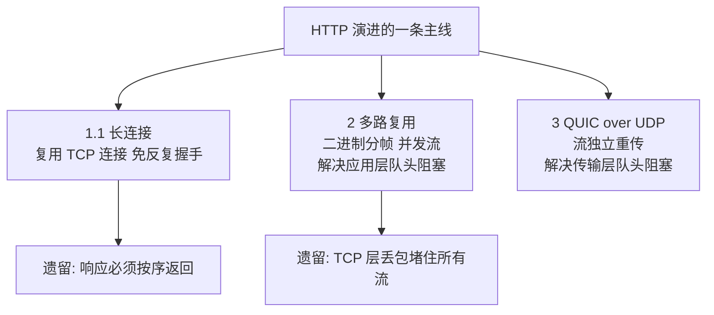
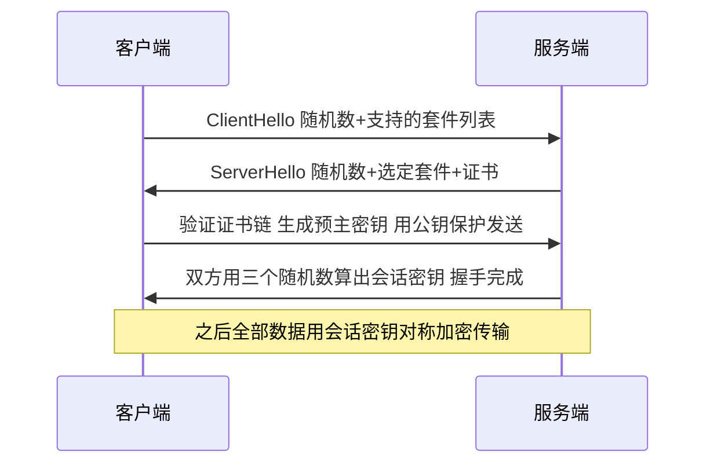

# HTTP 与 HTTPS 演进：队头阻塞、混合加密与证书链

> HTTP 走了三十年，每一代升级都指向同一个敌人——**等待**：短连接要反复握手是等待，串行请求排队是等待，TCP 层丢包堵住所有流还是等待。HTTPS 则回答另一个问题——**你正在和谁说话、说的话会不会被偷看**。把这两条线捋清，版本演进就不再是知识点堆砌，而是一条因果链。

## 一句话摘要

HTTP 从 1.1 到 3 的每一步，都是在解决「队头阻塞」：1.1 用长连接解决「建连等待」、管道化失败暴露「响应串行」；2 用二进制分帧多路复用解决应用层排队，却仍被 TCP 层丢包卡住；3 干脆换掉 TCP 用 QUIC 在传输层终结它。HTTPS 的核心则是**非对称加密交换密钥 + 对称加密传输数据**的组合，证书链负责回答「服务器值得信任」。

## 🎯 本文核心

**组织主线**：本文沿两条线展开——演进线（队头阻塞怎么被一层层拆掉：HTTP/1.1 → 2 → 3）与安全线（HTTPS 怎么用混合加密 + 证书链同时做到「加密」与「可信」）。所有概念都挂载在这两条主线上：长连接、管道化、多路复用、HPACK、QUIC 挂在演进线上；对称/非对称加密、数字签名、证书链挂在安全线上。

**机制链**：请求复用不起来（队头阻塞）→ 分帧并发（HTTP/2）→ TCP 单字节丢包堵全部流 → 换传输层（QUIC/HTTP/3）；明文可窃听可篡改可冒充 → 混合加密解决窃听 → 数字签名 + 证书链解决冒充。上游机制解不掉的问题，交给下游机制——这就是版本演进的驱动力。

## 典型使用场景

- **网页与 API 服务**：HTTP/1.1 仍是内部接口、简单服务的默认选择；面向浏览器的前端站点基本完成向 HTTP/2 的迁移（业内认知：主流浏览器对 HTTP/2 仅在 TLS 之上支持，公开口径见 RFC 9113）。
- **强安全场景**：登录、支付、任何携带凭证的接口必须 HTTPS——明文 HTTP 在公共网络上等于把请求体摊开给路径上的每个节点看。
- **高丢包弱网与移动端**：HTTP/3/QUIC 的主场——流之间独立重传，一个包丢失不再拖累所有请求。
- **反过来**：纯内网、物理隔离链路上的健康检查探针，用明文 HTTP/1.1 就够，为它上 TLS 属于负收益。

## 演进线：队头阻塞是怎么被一层层拆掉的

**HTTP/1.0 的问题最原始**：每个请求都要新建一条 TCP 连接，用完就断——三次握手加慢启动的代价，每个请求都付一遍。

**HTTP/1.1 先解「建连」**：默认长连接（keep-alive），一条 TCP 连接上连续发多个请求。它还试过「管道化」（pipeline，不等响应就连发多个请求），但**响应必须按请求顺序返回**——第一个响应慢，后面的全部排队，这就是应用层队头阻塞。管道化因此几乎没有被大规模使用，浏览器默认关闭（公开口径：RFC 7230 明确了这一限制）。业内通行的折中叫「并发连接」：一个域名开 6-8 条 TCP 连接轮流跑（业内认知数字），绕开排队——但每条连接仍要完整握手，治标不治本。

**追问一：为什么 HTTP/1.1 不干脆把响应乱序返回？** 因为它的协议格式是纯文本、响应没有编号——解析器只能靠「先来先到 + 顺序对应」分清哪个响应属于哪个请求。要乱序，必须先给每个请求贴上编号、把文本改成结构化帧——这正是 HTTP/2 做的事。

**HTTP/2 解「应用层排队」**：把报文拆成二进制帧，每个帧带上流编号（stream id），一条 TCP 连接上几十条流并发跑，响应帧乱序到达再按编号重组。同时 HPACK 压缩冗余头、服务器推送成为可能。应用层的队头阻塞被消灭了。

**再追问：那 HTTP/2 就没有队头阻塞了吗？** 还有，且藏得更深：所有流共用一条 TCP 连接——TCP 只认识字节序号，不认识流。网络丢一个字节，TCP 停下来等重传，**所有流的字节都得排在它后面**——传输层队头阻塞。并发几十条流反而让这条连接更容易撞上丢包（丢包敏感度被放大），弱网下 HTTP/2 可能比 1.1 的多连接还慢。

**打破砂锅：HTTP/3 为什么敢换掉 TCP？** 因为 TCP 在操作系统内核里实现，改不动（改内核没法全球推广）；于是 QUIC 把可靠传输、拥塞控制、流式复用在**用户态基于 UDP** 重造一遍（公开口径：RFC 9000），每个流的字节独立编号独立重传——一个包丢失只堵它自己那条流。把可变的放用户态、把稳定的留内核，这是协议分层设计哲学的一次典型实践。TLS 1.3 的握手也被合并进 QUIC 握手，建连加加密协商可以一个 RTT 完成（公开口径：RFC 9001；首次连接 1-RTT，重连可 0-RTT）。代价同样清楚：UDP 在部分企业网络与运营商链路上被限速甚至丢弃，QUIC 的推进依赖全链路支持（业内认知）。

## 安全线：HTTPS 的组合逻辑

明文 HTTP 有三宗罪：**可窃听**（路径上任何节点都能看内容）、**可篡改**（运营商插页、代理改包）、**可冒充**（你连的可能根本不是真服务器）。HTTPS（HTTP over TLS）的分层架构是在 TCP 与 HTTP 之间插入一个独立加密层，对上下游透明，用三样东西逐一对应上述问题：

**① 混合加密解「窃听」——非对称管交换，对称管传输。** 为什么不全用非对称？它数学运算慢一个量级以上（业内认知），全站流量扛不住；为什么不全用对称？双方事先没有任何共享秘密，密钥在明文信道上传等于没加密。所以组合：握手阶段用非对称加密（RSA）或密钥协商（ECDHE，现行主流，公开口径：RFC 8446 已禁用静态 RSA 交换）安全地**商量出一个会话密钥**，之后所有数据用这个对称密钥加解密——贵的东西只用在刀刃上，这就是混合加密的设计思想。

**② 数字签名解「篡改」。** 证书里带着服务器的公钥和域名信息，CA 用自己的私钥对证书内容做签名；客户端用 CA 公钥验签——内容改一个字节，签名就对不上。握手报文本身也带签名与哈希校验，中间人改参数立刻穿帮。

**③ 证书链解「冒充」——信任不能靠服务器自己说。** 浏览器凭什么信你出示的证书？答案是链式背书：**根 CA**（操作系统/浏览器内置的信任锚）签发**中间 CA**，中间 CA 签发**站点证书**。客户端逐级验签，一路验到本地预置的根证书为止——信任不是点对点的，是一条从信任锚出发的传递链。

**追问二：中间人自己伪造一张证书不行吗？** 伪造签名过不了验签；拿真域名去 CA 申请证书？CA 会验证申请者对域名的控制权（DNS/文件校验），别人的域名申请不下来。**再追问：CA 被攻破签发了假证书怎么办？** 这真实发生过（公开口径：2011 年某 CA 被入侵后签发假证书，涉事 CA 被主流浏览器除名）——行业给出的补偿机制是证书透明度 CT：所有签发的证书强制进入公开日志，域名所有者可以发现自己名下多出来的证书；另有 HSTS、证书固定等技术把信任再收紧一档。

**一个真实的线上排查（已匿名化）**：某站点迁移 HTTPS 后，移动端用户间歇性报「证书不受信任」，桌面端却几乎复现不了。排查过程：先对比两端证书详情，发现桌面端能拿到完整证书链而移动端只有站点证书——根因是服务端只配了叶子证书，桌面端浏览器会顺着证书里的地址自动补取中间证书，移动端网络策略不允许这次额外请求，验签直接失败。复盘结论：部署证书时把中间证书一起下发、并用链完整性检测工具验收，这一步缺失是 HTTPS 迁移最高频的翻车点之一。

## 与 HTTP/1.1 的区别：多路复用到底改变了什么

| 维度 | HTTP/1.1 | HTTP/2 | HTTP/3 |
|---|---|---|---|
| 传输层 | TCP | TCP | QUIC over UDP |
| 报文格式 | 文本 | 二进制帧 | 二进制帧 |
| 并发方式 | 多条连接+响应按序 | 单连接多流乱序帧 | 流独立重传 |
| 队头阻塞 | 应用层（响应排队） | 仅剩传输层（TCP 丢包） | 基本消除 |
| 头部处理 | 明文重复 | HPACK 压缩 | QPACK 压缩 |
| 安全 | 可选 TLS | 事实上必须 TLS | 内置 TLS 1.3 |

辨析一个高频模糊认识：**HTTPS ≠ HTTP/2**——前者是加密层（TLS），后者是协议版本，两者正交；「升级到 HTTPS 变快了」通常来自 TLS 1.3 与会话复用，而不是加密本身变快。另一个：**长连接 keep-alive ≠ 多路复用**——1.1 的长连接上同一时刻仍只有一个请求在飞，2 的复用才是真正并发。

## 常见误区与不适用边界

- ❌ **「HTTPS 就安全了」**——它保护的是传输链路；服务器被入侵、代码有漏洞、证书私钥泄露，HTTPS 一个都防不了。
- ❌ **「HTTPS 很慢，能不上就不上」**——TLS 1.3 握手 1-RTT、会话复用后增量成本很小（业内认知）；且 HTTP/2/3 事实上要求 TLS，不上加密反而用不上新协议的性能红利。
- ❌ **「上了 HTTP/3 一定更快」**——丢包敏感的弱网收益明显；低丢包低延迟的内网链路提升有限，还要面对 UDP 被限速的部署现实。
- ❌ **「证书买了就一劳永逸」**——证书有有效期（业内认知：现在主流 CA 签发周期已缩短到约 90 天量级），到期不续＝站点全挂；自动化续签是标配而不是可选项。
- **不适用边界**：物理隔离内网的探针与健康检查、对延迟极度敏感且无保密要求的遥测上报，明文 HTTP/1.1 仍是合理选择。

## 不同量级下的思考

- **十万级 QPS 网关**（思考方式：会话复用驱动）——约束来源是 TLS 握手的 CPU 开销（非对称运算集中在握手瞬间）。这一档的核心问题是摊薄握手成本，而不是堆机器——会话票据复用让重连免掉大部分非对称运算，连接复用让一次握手服务成千上万个请求。
- **百万级长连接**（思考方式：心跳节制驱动）——约束来源是内存与连接表容量。这一档的核心问题是控制单连接的维持成本，而不是提高并发上限——心跳间隔放宽一档、空闲连接分级回收，百万连接的内存账就平了。
- **千万级长连接**（思考方式：终止与卸载驱动）——约束来源从单机内存转向接入层架构的整体容量与上下游带宽。这一档的核心问题是把 TLS 终止下沉到专用接入层，而不是让每个后端服务都扛加密——网关统一卸载 TLS，内网段按安全等级选择再加密或明文。
- **亿级请求**（思考方式：协议红利驱动）——约束来源是公网链路质量与跨运营商延迟。这一档的核心问题是让协议自己适应弱网，而不是反复加节点硬扛——HTTP/3 在高丢包链路上的流独立性成为体系收益，头部压缩在亿级请求下省下的流量相当可观（业内认知）。

自下而上看：会话复用 → TLS 终止下沉 → 协议升级，每一档踩在上一档的肩膀上；触发升级的信号是握手 CPU 告警、接入层内存水位、弱网用户占比这些可观测指标。

## 💡 实战提示

- 💡 排查「HTTPS 偶发慢」先看握手耗时：`curl -w` 里的 time_connect 与 time_appconnect 之差就是 TLS 握手时间——占比高就查证书链是否完整（服务端漏带中间证书会让客户端多跑一次获取）与会话复用是否生效。
- 💡 浏览器地址栏的小锁只说明证书链验证通过，点开看证书是否即将过期、域名是否匹配，比等报错再查省事得多。
- 💡 验证 HTTP/2/3 是否真生效：`curl -sI --http2` / `--http3` 看响应头里的协议版本，别被「服务端开了就自动用」的直觉骗了——中间的负载均衡不支持，端到端就是降级的。

## Trade-off：加密与性能怎么平衡

**方案 A：全站强制 HTTPS**——安全基线统一，代价是握手开销与证书运维；**方案 B：仅敏感接口 HTTPS**——省资源，但混合内容（HTTPS 页面引 HTTP 资源）会被浏览器拦截，且任一明文接口都是攻击入口。**明确推荐**：面向公网的服务全站 HTTPS + TLS 1.3 + 会话复用 + 证书自动续签，把加密当默认而不是选项；内网隔离链路按安全等级自选。**权衡的关键**是运维能力：证书生命周期管理没自动化之前，「先上 HTTPS」的运维风险可能大于安全收益——这层代价是组织能力代价，不是技术代价。

## 你们可能会问

**为什么对称密钥要靠三个随机数生成，一个不行吗？**
一个随机源被预测就全盘皆输；客户端、服务端各出随机数再混入预主密钥，保证会话密钥的随机性不依赖任何单方——任何一方的随机数生成器弱了，还有两道补救。同时双方各参与生成，谁也没法单方面内定密钥。

**HTTP/2 的服务器推送是什么，为什么后来遇冷？**
服务端猜客户端马上要什么（如 HTML 引用的 CSS）提前推给它——但「猜错」的浪费常大于「提前」的收益（业内认知：实践中命中率不高），且与浏览器缓存机制冲突，主流浏览器已移除支持。它是「协议给的能力」与「业务该不该用」分离的典型例子。

**0-RTT 重连为什么不能用于所有请求？**
0-RTT 的首个请求用旧会话参数加密，存在被重放的风险——攻击者截获后原样重发，服务端无法区分。所以约定只允许 0-RTT 承载幂等请求（如 GET），非幂等操作等 1-RTT 建立完再说（公开口径：RFC 8446 的明确设计取舍）——便利性给安全性让路，这条边界写进了协议本身。

**整条链路上，TLS 保护得了 DNS 查询吗？**
保护不了——普通 DNS 是明文 UDP，你访问哪个域名，路径上的节点看得一清二楚。这也是 DoH/DoT（DNS over HTTPS/TLS）出现的原因：把链路上最后一个明文环节也加密掉。

## 自测三问

1. 管道化为什么失败？（响应必须按序返回，一个慢响应堵住全部——应用层队头阻塞，协议文本格式决定的）
2. HTTPS 为什么不全用非对称加密？（非对称慢一个量级，只用于握手交换会话密钥，数据传输走对称加密）
3. 浏览器凭什么信任一张站点证书？（证书链逐级验签，一直验到本地预置的根 CA——信任锚出发的传递链）

## 5W 速记卡

| 问题 | 答案 |
|---|---|
| What | HTTP 是应用层协议，HTTPS = HTTP + TLS 加密层 |
| Why 演进 | 每一代都在拆队头阻塞：1.1 建连 → 2 应用层 → 3 传输层 |
| 混合加密 | 非对称交换会话密钥（贵而少用）+ 对称加密数据（快而多用） |
| 证书链 | 根 CA → 中间 CA → 站点证书，逐级验签的信任传递 |
| 何时止步 | 隔离内网低敏场景用明文 HTTP/1.1 即可，不必为加密而加密 |

## 开放问题

- HTTP/3 的部署受制于中间网络的 UDP 友好度——当链路路径上的设备普遍支持 QUIC 之后，「基于 UDP 重造可靠传输」这条路线会不会反过来推动内核态 QUIC 的标准化？值得跟踪。

## 🎯 核心带走

演进线——队头阻塞被拆了三层：HTTP/1.1 长连接省建连、HTTP/2 分帧复用解应用层排队、HTTP/3 换 QUIC 解传输层排队；安全线——HTTPS 用「非对称换密钥 + 对称传数据」的组合兼顾安全与性能，用证书链把「信任」从预置的根一路传递到站点。失效点：中间设备不支持（UDP 限速/代理断流）、证书运维不自动（过期即事故）。金句：**协议演进史就是一部等待消除史——省掉一次握手、拆掉一次排队，都比堆机器便宜。**

**决策**：什么时候上 HTTP/3——面向公网、移动端占比高、链路丢包敏感的服务；什么时候止步 HTTP/1.1——内网隔离、低敏、探针类流量。取舍：新协议用部署架构的兼容性风险换弱网性能；加密用运维成本换安全基线——两端都要按自己的用户形态称重。

## 📌 数据与事实声明

- 本文协议行为依据 RFC 7230/9112（HTTP/1.1）、RFC 9113（HTTP/2）、RFC 9000/9001（QUIC 与 QUIC-TLS）、RFC 8446（TLS 1.3）、RFC 6962/9162（证书透明度）等公开标准；「浏览器默认关闭管道化」「HTTP/2 事实要求 TLS」「CA 入侵除名事件」为公开技术事实与公开报道；并发连接数、握手耗时比例等带「业内认知」标注的数字为行业普遍经验值，非精确统计；不指向任何特定公司与产品。

## 📚 参考资料

| 资料 | 说明 |
|---|---|
| RFC 9110 / 9112 | HTTP 语义与 HTTP/1.1 正源 |
| RFC 9113 | HTTP/2 分帧与多路复用机制 |
| RFC 9000 / 9001 / 9204 | QUIC 传输协议、QUIC-TLS、QPACK 头压缩 |
| RFC 8446 | TLS 1.3 握手与密钥协商正源 |
| RFC 5280 / RFC 9162 | X.509 证书结构与证书透明度机制 |
| 《HTTP 权威指南》 | 连接管理、代理与缓存的老牌系统读物 |
| MDN Web Docs（HTTP / TLS 条目） | 浏览器行为与协议演进的最佳公开参考 |
