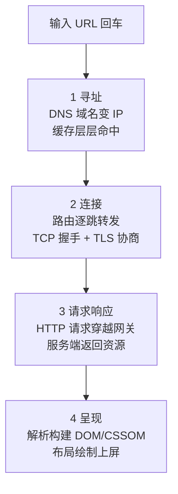
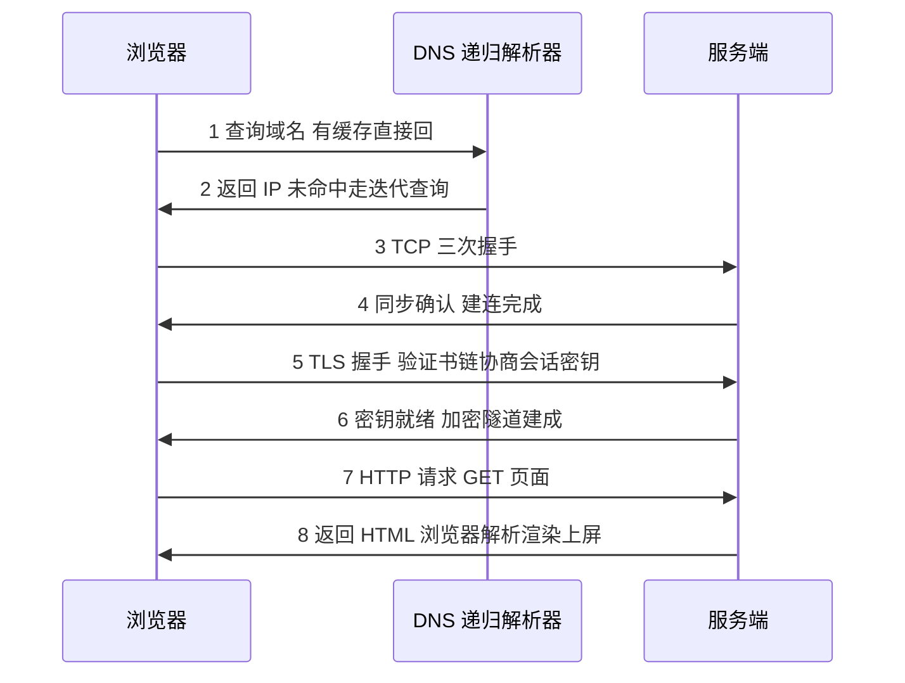

# 从输入 URL 到页面显示：一次请求的全链路串讲

> 在浏览器地址栏敲下回车到页面完整呈现，中间只有几百毫秒，却穿过了本机缓存、DNS 递归解析、路由转发、TCP 握手、TLS 协商、HTTP 请求响应、浏览器渲染流水线七个环节。这一篇把前三篇拆开讲的机制全部挂回这条真实链路上——并且给每个环节一个「出事了从哪里查」的排查入口。

## 一句话摘要

一次页面请求 = **寻址**（DNS 把域名变 IP）+ **连接**（路由转发 + TCP 握手 + TLS 协商）+ **请求响应**（HTTP 请求经过接入层到达服务端再返回）+ **呈现**（浏览器解析渲染）。四个阶段各自有缓存可以加速、各自有经典故障点、各自有独立的排查入口——串成一条线，孤立的知识点才变成排障时真正可用的地图。

## 🎯 本文核心

**组织主线**：本文以「一次回车的生命周期」为时间轴做全链路串讲，把 DNS、路由、TCP、TLS、HTTP、渲染六块知识挂到链路上的固定位置；每个环节都回答同一个三段式问题——它在做什么、坏了什么症状、用什么命令/工具定位。概念在此不重新展开原理，只标注它们在链路上的角色与指回前篇。

**机制链**：URL → DNS 解析出 IP → IP 交给路由逐跳转发 → 到达对端 80/443 端口完成 TCP 握手 → TLS 用证书与非对称协商出会话密钥 → HTTP 请求在加密隧道里穿越负载均衡与网关 → 服务端返回 HTML → 浏览器解析 DOM/CSSOM 构建渲染树 → 布局绘制上屏。上游环节的输出是下游环节的输入，任何一环卡住，整条链路就断。



同一条链路的时序视角（以 HTTPS 页面为例——每个环节的协议细节回前两篇查）：



## 典型使用场景

- **页面打不开的排障现场**：按链路顺序逐段排查——域名解析通不通、TCP 端口通不通、TLS 握手成不成、HTTP 响应状态码是什么、前端资源有没有加载失败——这套顺序就是本篇的骨架。
- **性能优化定位**：首屏慢到底是 DNS 慢、建连慢、服务端处理慢还是渲染慢？把链路分段计时（下文的排查入口），瓶颈环节一目了然。
- **新服务上线前的链路自查**：域名解析是否生效、证书链是否完整、网关转发规则是否命中、静态资源是否走了缓存——每一项都对应链路上的一个固定环节。
- **反过来**：只想理解单个协议细节时，不必串全链路——本篇是地图不是词典，细节回前三篇查。

## 全链路串讲：一次回车的生命周期

### 第 1 环 寻址：DNS 把域名变成 IP

浏览器先查自己的 DNS 缓存，没有就问操作系统（本机缓存 + hosts 文件），再没有就问本地 DNS 服务器（运营商或公司内网的递归解析器）。递归解析器自己有缓存；未命中时替你走完「根 → 顶级域 → 权威 DNS」的迭代查询，把结果回填缓存（按 TTL 存活）后返回。**缓存命中率是这一环的设计核心**——绝大多数解析在递归层就返回了，真正到达权威服务器的查询是少数（业内认知）。

**排查入口**：

```bash
# 查域名解析结果与走的 DNS 服务器
dig example.com.cn +noall +answer
# 对比直接问权威服务器与走本地递归的差异
dig @223.5.5.5 example.com.cn
# 清 macOS 本机缓存（Linux 用 systemd-resolve --flush-caches）
sudo dscacheutil -flushcache
```

典型症状与定位：解析结果是「错误 IP」→ 查 hosts 文件与本地 DNS 记录；部分用户正常部分异常 → TTL 未到、递归缓存新旧并存，等 TTL 过期或主动刷新。

**追问一：递归查询和迭代查询为什么分成两种？** 分工不同：递归是「你替我跑腿」——客户端只跟本地解析器说一句话，剩下全部由它代办；迭代是「我逐级问路」——解析器从根开始，每级只拿到「下一站在哪」的指引。设计思想是管理权分层：每一级只权威回答自己管的那段，谁也不需要知道全图。

**再追问：根服务器全球只有十几台 IP，扛得住全世界的解析吗？** 靠任播（anycast，公开口径）：同一个 IP 在全球数百个节点同时对外服务，路由协议自动把查询送到最近的一个——逻辑上是一台，物理上是几百份镜像，容量与延迟同时解决。

**打破砂锅：域名为什么从右往左分层？** 因为它是管理权自上而下授权的映射——右侧是「谁授的权」（根、顶级域），左侧才是「谁在用它」（注册域名、主机名）。从右往左读就是从授权链的根部往下走，这与证书链的信任传递在结构上同构：都是「从根往下逐级背书」。

### 第 2 环 连接：路由转发 + TCP 握手 + TLS 协商

拿到 IP 后，操作系统把 TCP 报文交给 IP 层，路由器按路由表逐跳转发（你通常控制不了这一段，只能测它通不通、快不快）；报文到达目标 IP 的 443 端口后，TCP 三次握手建立连接（同步序列号，见第一篇）；若是 HTTPS，紧接 TLS 握手——验证证书链、非对称协商出会话密钥（见第二篇）。**这一环的耗时 = 网络往返 RTT × 握手次数**，围绕它的优化一路演进：从 HTTP/1.0 每请求建一条连接，演进到长连接与会话复用，再到就近接入（CDN/边缘节点把 RTT 物理缩短）——每一步演进都是在给「往返次数 × 单程延迟」这个乘法做减法。

**排查入口**：

```bash
# TCP 层通不通、路由路径在哪一跳变差
ping example.com.cn
traceroute example.com.cn
nc -vz example.com.cn 443
# TLS 层：证书链完整性与握手细节
openssl s_client -connect example.com.cn:443 -servername example.com.cn </dev/null
```

典型症状与定位：`nc` 通但业务超时 → 问题在应用层不在连接层；`openssl` 报证书校验失败 → 看输出的证书链是否缺中间证书；`traceroute` 某一跳开始全是星号且后续也超时 → 链路或防火墙问题，换网络环境对比。

### 第 3 环 请求响应：HTTP 穿越接入层

连接就绪，浏览器发出 HTTP 请求（方法、路径、头、可能的请求体）。请求往往先到**负载均衡**（四层转发或七层代理），再经网关/反向代理路由到具体服务实例——接入层架构在这里承担「流量入口」与「上下游解耦」两个职责；服务端处理（可能还要访问数据库、缓存、下游服务——链路从这里开始从「网络问题」变成「系统问题」，排查手段也从网络工具交棒给上下游系统的日志与指标）后原路返回，状态码就是这一环的健康快照：3xx 跳转、4xx 客户端错、5xx 服务端错。缓存也活跃在这环：浏览器缓存、CDN 边缘缓存、服务端缓存层层拦截，命中就不发请求。

**排查入口**：

```bash
# 看完整请求响应与各阶段计时（DNS/建连/TLS/首字节）
curl -v -o /dev/null -s -w 'dns:%{time_namelookup} conn:%{time_connect} tls:%{time_appconnect} ttfb:%{time_starttransfer} total:%{time_total}\n' https://example.com.cn
# 看状态码与响应头里的缓存与跳转信息
curl -sI https://example.com.cn
```

典型症状与定位：time_connect 大 → 网络远/丢包重传；time_appconnect 与 conn 差值大 → TLS 握手慢（查证书链与会话复用）；ttfb 大 → 服务端处理慢，进后端日志追；静态资源每次都 200 而不是 304/缓存命中 → 缓存响应头没配对。

### 第 4 环 呈现：浏览器渲染流水线

HTML 字节流被解析成 **DOM 树**；CSS 解析成 **CSSOM**；两者合成**渲染树**（只含可见节点），再经过布局（算几何位置）与绘制（逐层上屏）。JS 的特殊性在于它可以改 DOM 和 CSSOM——所以脚本常被放在底部或加 defer/async，避免解析中断。渲染与网络在此汇合：HTML 里引用的 CSS/JS/图片会触发新一轮「第 1-3 环」的子请求，现代浏览器并发发起——这一能力也推动了前端资源加载架构的演进（HTTP/2 多路复用的用武之地，见第二篇）。

**再追问一层：为什么图片不阻塞解析，CSS 却阻塞渲染？** 图片不参与 DOM/CSSOM 的结构构建，慢了只是占位空着；CSS 决定每个节点的最终样式，样式没就绪就上屏会出现「裸结构闪屏」——所以浏览器选择等 CSSOM。反直觉的是，「渲染阻塞资源」这个名词说的正是这个选择，它不是性能缺陷，而是一致性与即时性的取舍。

**排查入口**：浏览器开发者工具的 **Network 面板**（每个子请求的分段计时、瀑布图、优先级）与 **Performance 面板**（解析/布局/绘制的火焰图）；`Lighthouse` 跑一遍给出首屏指标与优化建议（业内认知：这些是前端排障的通用起点）。

### 一张表把六个环节收拢

| 环节 | 做什么 | 典型故障 | 排查入口 |
|---|---|---|---|
| DNS | 域名变 IP | 解析错 IP/TTL 新旧并存 | dig / hosts / 递归日志 |
| 路由 | 逐跳转发到目标 IP | 链路不通/某跳劣化 | ping / traceroute |
| TCP | 三次握手建连 | 端口不通/握手丢包 | nc -vz / tcpdump |
| TLS | 验证书+协商密钥 | 证书链不全/过期 | openssl s_client |
| HTTP | 请求响应与缓存 | 4xx/5xx/缓存未命中 | curl -w 分段计时 |
| 渲染 | 解析布局绘制上屏 | 阻塞脚本/布局抖动 | DevTools Network/Performance |

## 与孤立知识点的区别：为什么要串成一条线

单学 DNS、TCP、TLS 时，每个协议都像独立章节；只有挂到一条真实链路上，「缓存」才显出它贯穿一切的角色（DNS 有 TTL、TCP 有连接复用、HTTP 有多级缓存、浏览器有资源缓存），「耗时」才有了分解的口径（一次页面请求的总延迟 = 各环节之和，优化任何一段之前先分段测量）。辨析一对容易混的概念：**链路串讲 ≠ 协议详解**——串讲回答「谁在哪个位置、坏了什么现象」，详解回答「报文字段怎么工作」；排障用前者，深造用后者（本系列前三篇负责详解）。

## 常见误区与不适用边界

- ❌ **「页面慢就是服务器慢」**——先分段计时再下结论：DNS、建连、TLS、首字节、渲染五段各占多少，没数据就没有定位。
- ❌ **「改了 DNS 记录立刻生效」**——TTL 是契约：改记录前先把 TTL 调小、等旧 TTL 过期再切，否则新旧结果并存一段时间。
- ❌ **「curl 通就等于浏览器能打开」**——curl 不执行 JS、缓存策略也不同；网络层通了之后页面还有问题，要进浏览器 DevTools 看渲染侧。
- ❌ **「ping 不通 = 服务挂了」**——很多服务器禁 ICMP 回包但 TCP 服务正常；连通性判断以业务端口为准（nc/curl）。
- **不适用边界**：本篇的排查入口面向 HTTP(S) 页面链路；长连接推送（WebSocket）、流媒体、P2P 等链路形态不同，不能照搬这套分段法。

## 不同量级下的思考

- **十万级日请求**（思考方式：缓存分层驱动）——约束来源是单实例的处理上限与回源带宽。这一档的核心问题是让请求尽量不发到源站，而不是把源站堆大——浏览器缓存头、CDN、服务端缓存三层递进，命中率每上一档，源站压力降一个台阶。
- **百万级日请求**（思考方式：读写分流驱动）——约束来源是热点数据的读放大与主链路容量。这一档的核心问题是把读压力从主链路分流出去，而不是一味扩容写侧——只读副本与边缘缓存把热点读拦在主库之外。
- **千万级日请求**（思考方式：就近接入驱动）——约束来源是跨运营商/跨地域的网络延迟与单点容量。这一档的核心问题是把内容推到离用户近的地方，而不是让用户都来挤一个机房——CDN 分发静态资源、多接入点分摊动态请求。
- **亿级用户**（思考方式：全链路水位驱动）——约束来源是整条链路上最窄的那段（可能是权威 DNS 的查询上限，也可能是网关的连接数）。这一档的核心问题是按链路分段设水位与预案，而不是只盯应用服务器——任何一段没有冗余，整条链路就是单点（业内认知：大流量站点的容量评估历来按环节做）。

自下而上看：缓存分层 → 就近接入 → 分段水位，每一档的解法都包含上一档；触发升级的信号是回源带宽、接入层延迟、单环节容量告警这些分段指标——这恰恰是「串成链路看」的第二重价值：量级瓶颈从来是按环节暴露的。

## 💡 实战提示

- 💡 排障永远从分段计时开始：`curl -w` 一条命令把 dns/conn/tls/ttfb 拆开，五秒内就能回答「慢在网络还是慢在服务端」，避免一上来就翻应用日志。
- 💡 改 DNS 前先降 TTL、切完再调回来——这是把「解析新旧并存窗口」从小时级压到分钟级的标准操作节奏。
- 💡 浏览器 DevTools 的 Network 瀑布图按住一列排序（如首字节时间），最慢的前几个请求就是优化清单——肉眼扫瀑布比看汇总均值更快定位长尾。

## Trade-off：缓存与一致性怎么平衡

**方案 A：缓存激进（长 TTL、多级缓存）**——快、省，代价是变更生效慢、故障时脏数据停留久；**方案 B：缓存保守（短 TTL、少缓存）**——数据新鲜、变更秒级生效，代价是回源压力大、首屏慢。**明确推荐**：静态不变资源用长缓存 + 文件名指纹（内容变了文件名变，缓存自然失效），动态接口按业务容忍度定 TTL——「按数据的变更频率分级定缓存策略」比全局一刀切更稳。**权衡的深层**是运维纪律：缓存层级越多，故障排查链越长（浏览器→CDN→网关→服务端四处都要看），这层复杂度成本要在架构方案里显式计价。

## 一个完整的排查复盘（已匿名化）

某站点新域名上线，部分用户反馈页面间歇性打不开。排查按链路走：`dig` 显示部分用户解析到旧 IP（旧记录 TTL 还没过期，递归缓存新旧并存）——第一环就分出了用户群；再测新 IP 的 443 端口，`nc` 全通——排除连接层；`openssl s_client` 检查发现服务端只发了叶子证书，个别移动端环境验签失败——第二处问题。处置：等旧 TTL 自然过期 + 补全证书链重新部署。复盘记了三条：切域名必须提前降 TTL；证书链完整性要进上线检查单；链路分段排查的顺序（解析→连接→TLS→HTTP）能让两个独立问题在同一次排查里各归各位，不互相干扰。

## 你们可能会问

**为什么 DNS 要设计成树状的层级结构，一张大表不行吗？**
一张大表是全球单点：更新权限、容量、可用性都无解。层级结构把「域名管理权」切成区域（根管顶级、顶级管二级……），每个区域自治维护自己的权威数据，查询沿树逐级委派——管理权分散、查询可缓存，两个问题一起解决。

**浏览器输入的是域名，TCP 连接需要 IP，中间会不会有 IP 变了连接还挂在旧地址的情况？**
会。DNS 结果被缓存的窗口里（TTL 之内），服务端切了机房，你的连接还会往旧地址连——这就是切流要提前降 TTL 的原因。长连接更明显：已建立的连接不重新解析，要靠应用层重连机制感知迁移。

**渲染为什么要把 DOM 和 CSSOM 分开建，不直接边解析边画？**
因为样式与结构是两个独立来源（HTML 文档与 CSS 文件/内联样式），且样式可以级联覆盖——合并计算必须在两者都就绪后做一次，才能保证同一节点在任何解析顺序下布局一致。分开建是「关注点分离」在渲染层的直接映射。

## 自测三问

1. 一次 HTTPS 页面请求的链路分几段、各段排查入口是什么？（寻址 dig / 连接 nc+openssl / 请求 curl -w / 渲染 DevTools）
2. 为什么改 DNS 记录前要先降 TTL？（缓存按 TTL 存活，降 TTL 把新旧并存窗口压短，切流可回退）
3. curl 通了页面还是白屏，下一步查什么？（进浏览器 DevTools：JS 执行、资源加载、渲染流水线——网络层之外的环节）

## 5W 速记卡

| 问题 | 答案 |
|---|---|
| What | 一次 URL 请求的生命周期：寻址→连接→请求响应→呈现 |
| Why 串讲 | 把协议知识挂到链路位置，排障时按段定位不迷路 |
| 核心配角 | 缓存贯穿全链路（DNS TTL/连接复用/HTTP 多级/资源缓存） |
| 排查口诀 | 分段计时定位慢在哪段，逐段工具见各环节排查入口 |
| 何时用 | 页面打不开、首屏慢、新上线链路自查三类现场 |

## 开放问题

- 链路的第 1 环正在被重构：加密 DNS（DoH/DoT）普及后，企业内网的解析管控与排障手段都要换一套——「链路上每个环节可观测」与「链路上每个环节加密」之间的张力如何演进，值得持续跟踪。

## 🎯 核心带走

一条 URL 链路四段——DNS 寻址、路由+TCP+TLS 连接、HTTP 请求响应、浏览器渲染；每段有缓存加速、有典型故障、有独立排查入口（dig/nc/openssl/curl -w/DevTools）。失效点：缓存新旧并存（TTL）、证书链不全、只测网络不测渲染。金句：**排障的本质是把一条链路切成段，让「慢」或「不通」自己暴露在具体的一段里。**

**决策**：什么时候用链路串讲视角——线上排障、性能分段定位、新服务上线自查；什么时候回到单协议详解——调参、深究报文字段、协议层开发。取舍：串讲换全局感但牺牲单点深度，详解换深度但容易只见树木——地图与词典都留在手上，按现场切换。

## 📌 数据与事实声明

- 本文链路机制依据 RFC 1034/1035（DNS）、RFC 9110/9113（HTTP）、RFC 8446（TLS 1.3）、RFC 793/9293（TCP）等公开标准；`dig`/`curl -w`/`openssl s_client`/DevTools 为公开工具的标准用法；缓存命中率、TTL 策略等带「业内认知」标注的数字为行业普遍经验值，非精确统计；排查案例已匿名化并做通用化处理，不指向任何特定公司与个人。

## 📚 参考资料

| 资料 | 说明 |
|---|---|
| RFC 1034 / 1035 | DNS 域名解析机制正源 |
| RFC 9110 / 9113 | HTTP 语义与连接管理 |
| RFC 8446 | TLS 1.3 握手（链路连接段的安全环节） |
| 《Web Performance in Action》 | 链路分段性能优化与首屏指标的系统性参考 |
| MDN Web Docs（Fetch/Performance/DevTools 条目） | 渲染流水线与浏览器排障工具的公开文档 |
| 系列前三篇 | DNS 之外的协议细节（TCP/TLS/HTTP）回前三篇查 |
