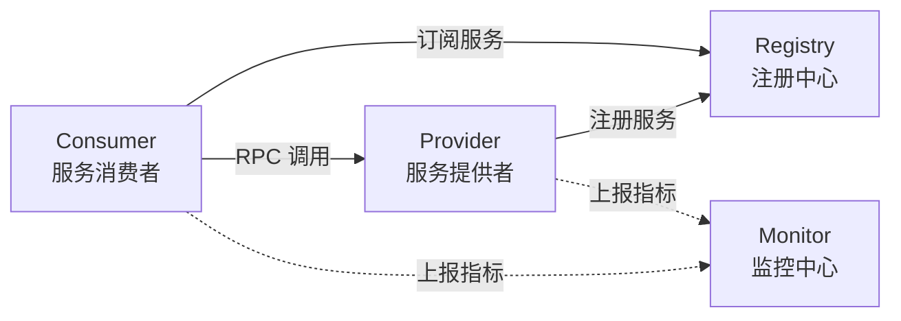
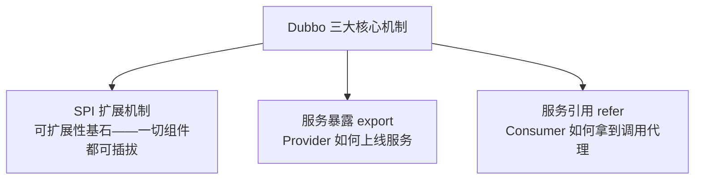
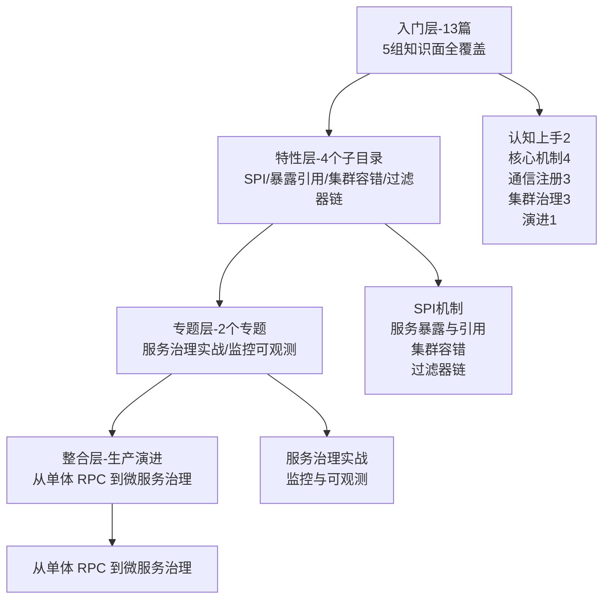

# Dubbo 系列导读 · 从一个 RPC 调用到微服务治理

> 📖 本系列共 14 篇（0_导读 + 13 正文），覆盖 Dubbo 整个知识面：认知上手、核心机制、通信注册、集群治理、演进。
> 本篇是第 0 篇导读：先建立「Dubbo 架构大图」心智模型，再决定读哪条路。

## 一、为什么需要这套系列

Dubbo 是 Java 生态最主流的 RPC + 微服务框架，也是国内互联网公司落地微服务的首选。但学 Dubbo 常见两种极端：

- **只会抄配置**：照着文档抄 application.yml，把服务调通，但 SPI、服务暴露、服务引用、集群容错这些核心机制一知半解，出了问题（服务没注册上、负载不均衡、调用超时雪崩）不知道怎么定位
- **只看源码不看场景**：一头扎进源码，但不知道每个机制解决什么业务问题，看完就忘

这套系列的设计思路：**先建立「Dubbo 架构大图」心智模型，再逐个拆解核心机制**。主线是「Dubbo 怎么让一次 RPC 调用跑起来 + 扛得住」，支线是 SPI / 暴露 / 引用 / 集群容错这些核心机制。先会「用起来」，再会「看懂原理」，最后会「生产落地 + 演进」。

## 二、全局心智模型：Dubbo 架构大图

Dubbo 的架构大图（四个角色 + 一次调用）：

支撑这四大角色运转的，是 Dubbo 三大核心机制：

> tips：(知识地图) 「四个角色 + 三大机制」是整套 Dubbo 知识的主干：角色回答「谁参与调用」，机制回答「调用怎么跑起来」。SPI / 负载均衡 / 集群容错 / 服务治理都挂在「机制」这条线上。

## 三、系列导航表（13 篇）

| 序号 | 篇目 | 深度 | 一句话定位 | 对标参考 |
|---|---|---|---|---|
| 0 | 系列导读 | 全景 | Dubbo 架构大图 + 阅读路径 | - |
| 1 | Dubbo 是什么与生态全景 | 入门 | RPC 定位 / 微服务生态 / Apache 项目 | 官方文档 |
| 2 | 快速上手 | 入门 | 第一个 Dubbo 服务 + Spring Boot 集成 | 官方文档 |
| 3 | 核心概念与架构 | 入门 | Provider/Consumer/Registry/Monitor/协议 | 官方文档 |
| 4 | SPI 扩展机制 | 入门 | Dubbo 可扩展性基石 | 宋小生《Dubbo3 源码深入解析》 |
| 5 | 服务暴露 | 入门 | export 流程 | 宋小生《Dubbo3 源码深入解析》 |
| 6 | 服务引用 | 入门 | refer 流程 | 宋小生《Dubbo3 源码深入解析》 |
| 7 | 注册中心集成 | 入门 | Nacos/ZooKeeper/注册发现 | 官方文档 |
| 8 | 通信协议 | 入门 | dubbo:// / triple:// / HTTP2 | 官方文档 |
| 9 | 线程模型 | 入门 | Netty + 业务线程池/线程池隔离 | 官方文档 |
| 10 | 负载均衡 | 入门 | Dubbo 内置策略 | 官方文档 |
| 11 | 集群容错 | 入门 | Cluster/Failover/熔断 | 官方文档 |
| 12 | 服务治理 | 入门 | Admin/限流/降级/灰度/路由 | 官方文档 |
| 13 | 版本演进 | 入门 | 2.x 接口级 → 3.0 应用级 + Triple → 3.3 | 官方文档 |

## 四、从点到面：四层进阶路径

入门层 13 篇把 Dubbo 铺全之后，真正的深度在后面三层——这也是本系列「从点到面」的设计：

| 层级 | 定位 | 规模 | 适合 |
|---|---|---|---|
| 入门层 | 点：每个主题一篇，建立完整认知 | 13 篇 | 所有读者必读 |
| 特性层 | 点 × 深：核心机制源码级挖透 | 4 个子目录 × 2-4 篇 | 按兴趣挑重点 |
| 专题层 | 面：服务治理 + 可观测组合拳 | 2 个专题 | 解决生产问题 |
| 整合层 | 体系：Dubbo 生产演进收束 | 1 篇 | 想看清全貌时读 |

## 五、入门读者最容易踩的 3 个认知误区

### 误区 1：以为 Dubbo 和 Spring Cloud 是「二选一」的竞品

「要么 Dubbo 要么 Spring Cloud」是常见误解。两者定位不同：Dubbo 是 **RPC 框架**（关注远程调用本身），Spring Cloud 是 **微服务全家桶**（关注配置、网关、熔断、链路等一整套）。实际生产中两者常混用——用 Dubbo 做 RPC，用 Spring Cloud 或自研做服务治理周边。选型的正确问题不是「Dubbo 还是 Spring Cloud」，而是「RPC 用谁 + 周边治理用谁」。

### 误区 2：以为会用注解 = 懂 Dubbo

「会写 @DubboService / @DubboReference、能调通」不等于「懂 Dubbo」。SPI 怎么加载、服务怎么暴露和引用、集群怎么容错，这些才是 Dubbo 的核心竞争力。不懂这些，遇到「扩展点不生效」「服务暴露失败」「负载不均」就只能猜。本系列的价值就在于把注解背后那层「掀开」看。

### 误区 3：以为 Dubbo 2.x 和 3.x 只是版本号

「2.x 升 3.x 就是改个依赖版本」是危险的误解。Dubbo 3.0 是一次**架构级升级**：从「接口级服务发现」切换到「应用级服务发现」、新增基于 HTTP/2 的 Triple 协议、全面拥抱云原生。这对注册中心数据量、可观测、跨语言互通都是质变，不是小版本迭代。

> tips：(三点区分) Dubbo 是「RPC 框架」不是「微服务全家桶」（和 Spring Cloud 定位不同、可混用）；会「用注解」不等于懂「SPI/暴露/引用」；3.0 是「架构级升级」不是「版本号迭代」。这三个误区是新手最容易栽的，正文里每个都对应多篇讲透。

## 六、怎么读这套系列

- **零基础 / 刚入行**：从 0 按顺序读到 13，每天 2-3 篇，一周建立完整 Dubbo 认知
- **有 1-3 年经验**：先读 1-2（认知上手），再重点读 4 SPI、5 暴露、6 引用、10 负载均衡、11 集群容错（工作里最常踩的 5 个），然后进特性层看源码级实现
- **要上生产 / 做治理**：直接读 12 服务治理 + 专题层（服务治理实战 / 监控可观测）
- **想彻底吃透**：读完入门层 + 特性层后进整合层，看「从单体 RPC 到微服务治理」的演进叙事

---

下一篇将讲 **1_Dubbo 是什么与生态全景**：Dubbo 在 RPC 生态里的位置、它解决了什么问题、和 Spring Cloud 到底是什么关系——待正文落盘后补链接。
