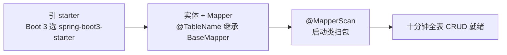
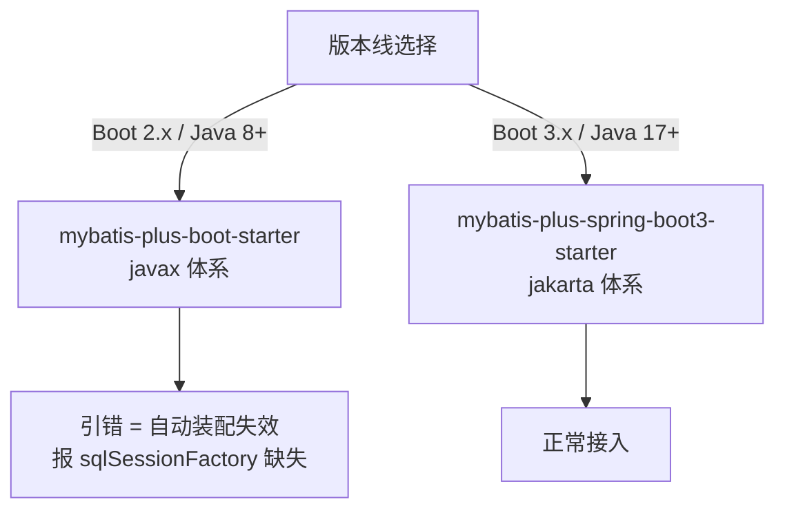

# 快速上手与工程集成

> 一句话摘要：MyBatis-Plus 接入 Spring Boot 只需三步——引 starter、继承 BaseMapper、加注解扫瞄；真正容易出问题的不是这三步，而是依赖版本匹配和插件注册位置。

## 一句话摘要

在 Spring Boot 3.x 工程里接入 MyBatis-Plus（3.5.x）：引入 `mybatis-plus-spring-boot3-starter`，实体类加 `@TableName`、Mapper 继承 `BaseMapper`，启动类加 `@MapperScan`——十分钟后你就有了全表 CRUD。但 starter 要选对 Boot 版本线、插件要显式注册才生效，这两个坑占了新手问题的八成。



## 一、三步接入

### 1.1 引依赖：starter 要选对版本线

```xml
<!-- Spring Boot 3.x（Java 17+）用这个 -->
<dependency>
    <groupId>com.baomidou</groupId>
    <artifactId>mybatis-plus-spring-boot3-starter</artifactId>
    <version>3.5.17</version>
</dependency>
```

**最容易踩的坑在这里**：starter 有两个——`mybatis-plus-boot-starter`（给 Boot 2.x / Java 8+）和 `mybatis-plus-spring-boot3-starter`（给 Boot 3.x / Jakarta 命名空间）。Boot 3 项目引了旧 starter，启动时找不到数据源自动配置或报 `javax` 相关 ClassNotFound——因为 Boot 3 已经全面转向 `jakarta` 命名空间，旧 starter 装配的是旧体系。

> 💡 实战提示：版本对齐口诀——Boot 2 配 `mybatis-plus-boot-starter`，Boot 3 配 `mybatis-plus-spring-boot3-starter`；MP 版本号统一由 dependencyManagement 管理，不要在依赖里各写各的版本。

### 1.2 实体与 Mapper：注解 + 继承

```java
@TableName("t_user")          // 表名映射（类名驼峰转下划线不匹配时必须显式指定）
public class User {
    @TableId(type = IdType.AUTO)   // 主键策略：数据库自增
    private Long id;
    private String name;           // 驼峰 name ↔ 下划线 name
    private String userName;       // 驼峰 userName ↔ 下划线 user_name（默认开启映射）
}

@Mapper
public interface UserMapper extends BaseMapper<User> {
    // 单表 CRUD 零方法：selectById/insert/updateById/deleteById/selectList 全部自动注入
}
```

```java
// 启动类：扫 Mapper 包（不加这个，Mapper Bean 不存在，注入报错）
@SpringBootApplication
@MapperScan("com.example.mapper")
public class App { public static void main(String[] args) { SpringApplication.run(App.class, args); } }
```

### 1.3 配置：yml 最小集

```yaml
mybatis-plus:
  configuration:
    map-underscore-to-camel-case: true   # 驼峰映射（3.x 默认 true，显式写出利于阅读）
    log-impl: org.apache.ibatis.logging.stdout.StdOutImpl   # 开发期打印 SQL，生产删除
  global-config:
    db-config:
      id-type: auto                       # 全局主键策略
```



## 二、验证：第一个 CRUD 跑起来

```java
@SpringBootTest
class UserMapperTest {
    @Autowired UserMapper userMapper;

    @Test
    void crud() {
        User u = new User(); u.setName("张三"); u.setUserName("zhangsan");
        userMapper.insert(u);                     // INSERT INTO t_user (name,user_name) VALUES (?,?)
        User loaded = userMapper.selectById(u.getId());
        loaded.setUserName("zs"); 
        userMapper.updateById(loaded);            // UPDATE t_user SET user_name=? WHERE id=?
        userMapper.deleteById(u.getId());
    }
}
```

跑通后看控制台打印的 SQL——**这是理解 MP 的第一手材料**：你调的是 Java 方法，落地的是标准 SQL，映射规则一目了然。开发期开着 SQL 日志写业务，出问题第一时间能对上「方法 ↔ SQL」。

## 三、工程集成的三个高频问题

**Q1：启动报 `Property 'sqlSessionFactory' or 'sqlSessionTemplate' are required`？**
十有八九是 starter 选错（Boot 3 引了 Boot 2 的 starter）或数据源没配（`spring.datasource.url` 缺失）——MP 的自动装配建立在数据源就绪之上。

**Q2：字段映射不上，查出来是 null？**
默认驼峰映射只处理「userName ↔ user_name」这种规则变换；数据库字段是不规则缩写（如 `user_nm`）时，用 `@TableField("user_nm")` 显式指定。反过来，不想映射的字段加 `@TableField(exist = false)`。

**Q3：插件（分页/乐观锁）加了依赖没生效？**
3.5.9+ 插件拆成可选依赖，且必须显式注册 `MybatisPlusInterceptor` Bean——依赖到位 ≠ 功能生效。插件链的注册方式与顺序，特性层插件机制篇展开。

## 与 MyBatis 原生工程的区别

从 MyBatis 迁移到 MP 是**叠加不是替换**：原有 XML、`SqlSessionFactory` 配置全部保留，MP 只是让新 Mapper 多继承一个 `BaseMapper`。混用姿势：单表走 MP 通用方法，复杂 join 写 XML——两套在同一个 Mapper 接口里共存，按方法来源自动路由。

## 常见误区

- **误区一：引了 starter 就有分页**。分页是插件，3.5.9+ 要单独引 `mybatis-plus-jsqlparser` 依赖并注册拦截器——只加 starter 查分页，返回的是全量数据
- **误区二：`@MapperScan` 和 `@Mapper` 二选一就行**。都写最稳：`@MapperScan` 管 包扫描范围，`@Mapper` 标记接口身份；只靠 `@Mapper` 需要每个接口都标注且确保扫到
- **误区三：开发期的 SQL 日志能带上生产**。StdOutImpl 直接 System.out 打印，生产用 slf4j 实现并控制级别，否则日志风暴

## 典型场景

- **新项目**：Boot 3 + MP starter + 默认驼峰映射，十分钟起步，单表需求当天清零
- **老 MyBatis 项目引入 MP**：加依赖不加配置，新表用 BaseMapper，老 XML 不动——渐进式迁移零风险
- **多模块工程**：`@MapperScan` 指到各模块 mapper 包（支持数组），依赖统一放父 pom 管版本

## 5W 速记卡

| W | 一句话 |
|---|---|
| What | MP 接入 Boot 三步：引 starter、继承 BaseMapper、@MapperScan |
| Why | 把接入成本压到十分钟，把出错点收敛到版本线和插件注册 |
| Where | Spring Boot 项目（2.x 与 3.x 用不同 starter） |
| When | 新项目直接上；老 MyBatis 项目叠加引入渐进迁移 |
| Who | 会 MyBatis 的团队零成本；新手按本文三步可跑通 |

## 自测三问

1. **Boot 3 项目该引哪个 starter？**
   - `mybatis-plus-spring-boot3-starter`。旧 starter 面向 Boot 2/javax 体系，在 Boot 3 下自动装配会失效。

2. **实体字段和表列名对不上怎么办？**
   - 规则变换靠驼峰映射（默认开），不规则用 `@TableField("列名")` 显式指定，非表字段加 `exist = false`。

3. **为什么插件加了依赖却不生效？**
   - 插件是可选依赖 + 必须显式注册拦截器 Bean。依赖、注册、顺序三件事都要对，特性层会拆源码。

## 📌 数据与事实声明

- 写于 2026-09-09，基于 MyBatis-Plus 3.5.17 + Spring Boot 3.5.x 实测口径；starter 双版本线是 Boot 2→3 Jakarta 演进的产物，随 Boot 4 演进关注官方更新
- 「3.5.9+ 插件拆为可选依赖（mybatis-plus-jsqlparser）」来自官方升级说明
- 免责：版本坐标与配置项以 mybatis.plus 官方文档为准

## 📚 参考资料

| 类型 | 标题 | 来源 |
|---|---|---|
| 官方文档 | MyBatis-Plus 安装（含 starter 区分） | mybatis.plus/guide/install.html |
| 官方文档 | Spring Boot 3 迁移（Jakarta 命名空间） | github.com/spring-projects/spring-boot/wiki |
| 官方文档 | 注解处理器（@TableName/@TableId/@TableField） | mybatis.plus/guide/annotation.html |
