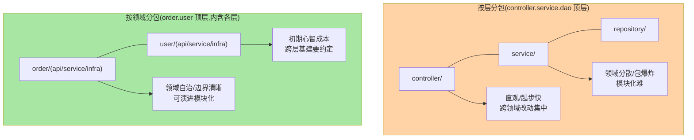
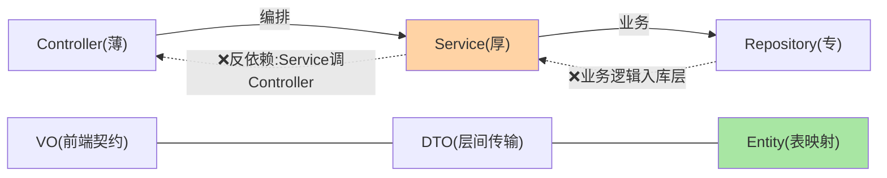

# 分层架构与包结构规范：从模板到治理

> 「项目怎么分包、层怎么划」是每个团队的第一个工程决策——它决定代码往哪放、依赖往哪流、新人多快上手。这篇讲清分层的机制依据（依赖方向约束）、两种主流包结构的取舍、DTO/VO 分层的边界，以及让规范「活下来」的治理手段。

> **本文核心**：分层的本质是**依赖方向的单向约束**（Controller → Service → Repository，反向依赖即架构腐蚀）；包结构两派——**按层分包**（controller/service/repository 顶层包，小项目直观）vs **按领域分包**（order/user/payment 顶层包内含各层，领域自治与模块化演进的载体）。**机制链**：依赖方向约定 → 包结构落地 → DTO/VO 隔离内外模型 → 工具强制（ArchUnit/编译期检查）→ 演进到模块化。

## 一句话摘要

分层不是仪式是**变更管理**：层内高内聚（改一处影响面小）、层间单向依赖（上层可换实现、下层不知上层）。三个工程要点：① **Controller 薄**（参数校验与编排，业务零实现）、**Service 厚**（业务规则的唯一家）、**Repository 专**（数据访问不含业务）——厚度失衡是分层失守的第一信号；② **DTO/VO/Entity 三模型分离**（对外契约、层间传输、持久化映射各自演化——直接把 Entity 吐给前端是「表结构泄露」级事故的开端）；③ **规范要用工具锁**（ArchUnit 规则化依赖检查进 CI——口头分层三个月必破）。

## 一、为什么分层值得当第一个规范

无分层（或分层名存实亡）的演化路径：Controller 里写 SQL → 业务逻辑散在三个层 → 改一个需求动十处代码、没人敢重构——**复杂度没有消失，只是从「结构」转移到了「人脑」**。分层的价值就是把这个复杂度显式化、局部化：每层有明确职责（职责即「改动的原因」——单一职责原则的分层表达），依赖单向流动（下层稳定、上层多变，稳定层不被多变层污染）。

## 5W 速记卡

| 维度 | 一句话 |
|---|---|
| What | 依赖单向约束 + 按层/按领域两派包结构 + 三模型分离 + 工具锁 |
| Why | 分层是复杂度的显式化管理，防架构腐蚀 |
| When | 新项目立项、存量重构、多人协作规范建立 |
| Where | 工程骨架 + CI 检查 |
| How | 定分层职责 → 选包结构 → 分离模型 → ArchUnit 进 CI |

## 二、两派包结构对比



**选型口径**：3-5 人小项目按层分包（简单够用）；预期多团队/模块化演进（互指「演进到 Modulith/微服务」的路径）按领域分包起步——**按领域分包的领域边界即未来模块边界**（演进期权价值）。两派的共同铁律不变：依赖单向（领域包之间的依赖方向也要管——order 调 user 只经 user 的 api 内层）。

## 三、三模型分离与转换

| 模型 | 服务对象 | 演化驱动力 | 事故形态（不分离时） |
|---|---|---|---|
| Entity | 数据库表 | 表结构变更 | 表字段直接暴露给前端（契约耦合） |
| DTO | 服务间/层间 | 内部重构 | 内部改动引爆调用方 |
| VO/响应体 | 前端契约 | 产品需求 | 加字段删字段的全链震荡 |

**转换的位置**：Controller 层做 VO↔DTO（对外契约翻译）、Service 纯 DTO（业务无视图概念）、Repository 做 Entity↔DTO——**每层的模型对齐它的变更驱动力**（前端变更不碰 Entity、表变更不碰 VO）。转换代码用 MapStruct（编译期生成，互指 mybatis-plus 生态的工程实践）——手写 getter/setter 转换是规范的第一个被偷工处。

依赖方向与违规形态：



## 四、让规范活下来：工具锁与评审位

```text
ArchUnit 规则示例（进 CI，失败即阻断）:
- layeredArchitecture().layer("Controller").definedBy("..controller..")
  .whereLayer("Controller").mayNotBeAccessedByAnyLayer() ...
- noClasses().should().dependOnClassesThat().resideInAPackage("..controller..")
  .because("Service 不得反向依赖 Controller")
- 字段注入禁用/Entity 不得出现在 controller 包 —— 团队规则代码化
评审位: 新模块骨架 PR 过规范模板(包结构+依赖检查+示例分层)
```

**规范的存活公式**：模板（新项目复制即合规）+ 工具（CI 自动检查）+ 评审位（骨架 PR 过规范）——三件齐备规范才不靠自觉。**量级演进**：十人内「包结构约定 + ArchUnit」够用；百人/多模块演进到 **Spring Modulith**（模块边界显式化 + 验证工具 + 事件解耦）或独立 Maven 多模块（编译期强制隔离——依赖违规从「检查发现」升级为「编译不过」）——**约束强度随组织规模升级**。

## 五、事故推演：一次「分层腐化」的复盘

某项目两年演化：Controller 里出现了直接 JdbcTemplate 查询（「临时需求」）；Service 互相循环注入（跨领域直接调用）；Entity 上标了 @JsonProperty 直接序列化给 App 端。后果爆发点：一次表重构（password 字段改名）导致 App 端解析失败——**表结构变更穿透到了移动端**（Entity 直接暴露的代价）；一次 Controller 重构发现业务逻辑散在 14 处无法安全迁移。复盘修复：三模型分离改造（半年）、ArchUnit 规则从零建立、循环依赖治理（互指 IoC 系列的设计层讨论）。**教训**：分层腐化不是一次大错，是一百次「临时方便」——工具锁的价值就是把一百次小偏离在 CI 拦下。

## 业内惯例

- **新项目骨架模板化**：脚手架（含包结构/分层示例/ArchUnit/转换工具配置）一键生成——规范的最低成本落地
- **领域包内三层命名统一**（api/application/infrastructure 或 controller/service/repository——选一套全员统一），跨领域只经 api 层——领域间依赖规则写进 ArchUnit
- **构造器注入为默认**（final 字段 + 构造器，Lombok @RequiredArgsConstructor）——字段注入的可测性与循环依赖掩盖问题已成共识（Boot 4.x 时代 @Autowired 字段注入是遗留写法）
- **3.x/4.x 视角**：分层规范与版本无关；Spring Modulith（官方模块化方案，6.x+）持续成熟是领域分包路线的官方加持

## 六、常见误区

- **「分层 = 建 package」**：建了包但 Service 反调 Controller、Controller 写业务——**分层是依赖约束不是目录**，没有工具锁的分层只是目录
- **DTO 泛滥成「字段搬运工」**：五层传递五次转换全同构——转换的价值在「模型边界」，无边界差异的两层共用一个模型（领域内 DTO 可复用，跨边界才建新模型）
- **「按领域分包就不能按层了」**：领域内照样分层（order/service 是领域内的层）——两派是「顶层切法」之争，层内约束两派都需要
- **Interface + Impl 全覆盖**：无多实现预期的 Service 全写接口是 2010 年代的仪式——只为 mock 的接口用 Mockito 直接 mock 类即可（机制依据：类代理早已成熟，互指 AOP 系列的 CGLIB）

## 七、你们可能会问

**Q1：Service 之间能互调吗？**
同领域内可以（一个 Service 编排另一个）；跨领域调用走对方 api 层（或应用事件解耦）——「跨领域直捅别人 service 内部」是边界破坏的开始。

**Q2：一个大 Service 几千行怎么办？**
按业务能力拆（OrderQueryService/OrderPaymentService——读写分离的自然拆分线）+ 编排 Service 收口——拆的依据是「变更原因」（互指 CQS/DDD 战术模式的知识关联），不是行数。

**Q3：多模块 Maven 的时机？**
编译期隔离需求出现时（团队边界/独立发布/依赖硬隔离）——模块化的收益是强制隔离，代价是构建复杂度——单团队内 Modulith（单应用内模块验证）常是甜点位。

## 八、自测三问

1. 分层的机制本质（依赖单向）与两派包结构的选型口径？
2. 三模型各自的演化驱动力与转换位置？
3. 规范存活的公式（模板+工具+评审位）与 ArchUnit 的角色？

## 开放问题

- 模块化的官方路线（Modulith）与多模块/微服务的边界自动化判定（什么信号该升级约束强度）值得组织级沉淀——目前多靠架构师经验。
- AI 辅助编码放大了「规范遵守」问题（生成代码不管分层）——ArchUnit 类机器检查从「规范保障」升格为「AI 协作时代的必选项」。

## 📎 核心带走

- **核心一句话**：分层 = 依赖单向约束的工程化（包结构两派选型 + 三模型分离 + 工具锁）——分层腐化靠 CI 拦不靠自觉
- **机制链**：定依赖方向 → 选包结构（按层/按领域）→ 模型分离（VO/DTO/Entity 对齐变更驱动力）→ ArchUnit 进 CI → 规模化升级 Modulith/多模块
- **失效点/边界**：无工具锁的分层是目录；跨领域直调破坏边界；约束强度随组织规模升级

## 💡 实战提示

- 💡 脚手架模板（包结构+示例+ArchUnit）是规范的最低成本分发——没有就本周建一个
- 💡 ArchUnit 规则库按团队沉淀（分层/命名/禁注入方式），新规则从评审高频修正项提炼
- 💡 决策口径：按层 vs 按领域——看「会不会多团队/模块化演进」；会，按领域（演进期权）；不会，按层（简单）

## 📌 数据与事实声明

- 写于 2026-09-10，规范框架为工程实践的归纳；Spring Modulith 为官方模块化方案（6.x+ 演进）
- 事故推演为分层腐化的典型模式匿名化复述
- 免责：规范细节按团队形态裁剪

## 📚 参考资料

| 类型 | 标题 | 来源 |
|---|---|---|
| 官方项目 | Spring Modulith | spring.io/projects/spring-modulith |
| 开源工具 | ArchUnit（com.tngtech.archunit） | archunit.org |
| 实践书 | 《Single Responsibility 应用讨论/架构相关公开实践》 | 技术社区公开文章 |
| 关联系列 | 本仓库 IoC 系列（循环依赖设计层）/ mybatis-plus 工程实践 | 本仓库 |
