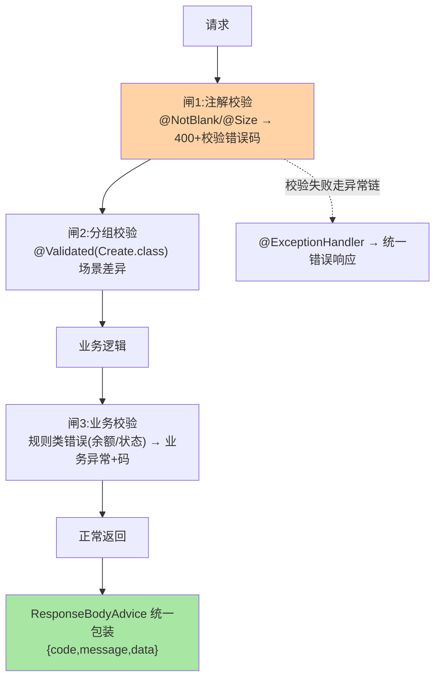
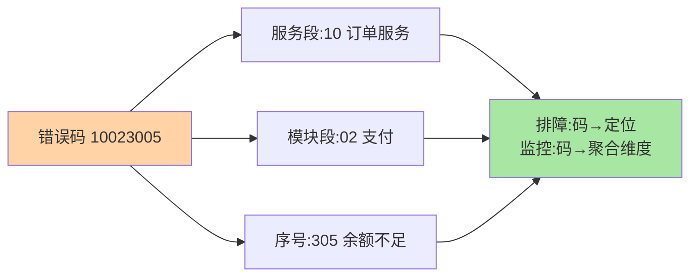

# 接口规范：统一响应、错误码与参数校验落地

> 一个接口对外交付，三件事必须统一：**响应体结构**（成功失败的形状）、**错误码体系**（错误怎么被识别定位）、**参数校验**（坏请求怎么被挡在门外）。这篇把三件套从「约定文档」落到「代码与机制」。

> **本文核心**：统一响应的机制载体（**ResponseBodyAdvice**——所有 @ResponseBody 响应的统一包装钩子 + 需要豁免清单防重复包装）；错误码体系（**分段编号**：服务段+模块段+序号——错误码是「可检索的错误坐标」不是数字装饰）；校验三道闸（**注解校验**（@NotBlank/@Size 声明式）→ **分组校验**（同对象不同场景）→ **业务校验**（Service 内规则）——三道闸各拦一类错误）。**机制链**：请求 → 注解校验拦截（400/错误码）→ 业务校验（业务错误码）→ 正常 → 统一响应包装 → 返回。

## 一句话摘要

三件套的设计深意：**统一响应**的价值在「调用方解析成本归零」（拿到的形状永远可预期——`{code, message, data}` 或 ProblemDetail 标准）；**错误码**的价值在「错误可检索可归因」（分段结构让任何人从码反查到「哪个服务哪个模块什么错」——排障与监控聚合的锚点）；**参数校验**的价值在「坏数据进不了业务层」（注解校验挡格式、分组挡场景、业务校验挡规则——校验越靠前修复成本越低）。**三者共同构成接口的「契约层」**——与实现解耦、对外稳定、机器可校验。

## 一、为什么接口规范是团队第一公约

无规范的接口演进：A 接口返回裸对象、B 接口返回 `{status,msg,result}`、C 接口错误时返回 200 加 message——调用方为每个接口写一套解析与容错；错误排查时「用户看到失败了」但没人知道哪个环节哪个码——**接口形状的不统一是调用方与排障的双重税**，且随接口数线性放大。

## 5W 速记卡

| 维度 | 一句话 |
|---|---|
| What | 统一响应（Advice 包装）+ 分段错误码 + 校验三道闸 |
| Why | 接口形状统一是调用方与排障的共同地基 |
| When | 新项目第一周、存量接口规范化改造 |
| Where | ResponseBodyAdvice + 错误码枚举 + 校验注解体系 |
| How | 定响应体 → 定错误码分段 → 注解/分组/业务三道闸落地 |

## 二、统一响应与三道闸全景



**包装豁免清单是隐藏工程点**：第三方回调（按对方协议）、文件流下载、Actuator 端点——ResponseBodyAdvice 的 supports 过滤（按注解/路径豁免）——**「统一」与「例外」的边界要显式管理**（豁免清单进代码注释与文档）。

错误码的「可检索坐标」结构：



## 三、错误码体系设计

```text
分段结构示例: 10-02-305
  10        服务段(订单服务)
  02        模块段(支付模块)
  305       序号段(余额不足)
实现载体: 错误码枚举(码+默认文案+HTTP状态建议) + BizException 携带
  enum OrderErrorCode { PAY_BALANCE_INSUFFICIENT("10023005","余额不足") ... }
监控聚合: 按码统计错误分布 → 错误码即监控维度
演进口径: 新项目可评估 ProblemDetail(RFC 7807,type/detail/标准字段)——标准协议+自造码分层共存
```

**错误码的治理红线**：一码一义（复用码 = 检索灾难）、码与 HTTP 状态的映射关系成文（全 200 派 vs 语义状态码派——团队选边并写死在 advice）、废弃码不回收改作他用。

## 四、校验三道闸的分工

| 闸 | 拦什么 | 载体 | 错误表现 |
|---|---|---|---|
| 注解校验 | 格式错（空/长度/格式/范围） | Bean Validation 注解 + @Valid | 400 + 字段级错误明细 |
| 分组校验 | 场景差（新增要 id 空、更新要 id 有） | @Validated(Group.class) + groups | 400 + 场景化明细 |
| 业务校验 | 规则错（余额/状态/唯一性） | Service 内显式校验 + BizException | 业务码 + 业务文案 |

**三道闸的次序价值**：格式错在 Controller 层拦截（成本最低、信息最准——字段级定位）；业务规则必须在 Service（需要数据访问）；**校验位置 = 校验所需信息的层次**——这条原则处理一切「校验该放哪」的争议。

**量级演进视角**：十个接口靠约定就能统一；百接口要码表与模板；千接口必须码生成流水线（新码 CI 校验不冲突、码表自动发布到调用方文档）——规范的治理强度随接口量级升级，码表的规模化治理是千接口量级的主战场。

## 五、事故推演：一次「错误码复用」的排障灾难

某团队错误码体系运行一年：`10001` 初期定义「参数错误」，后来的人查不到码表就近复用——最终 10001 承载了 7 种含义（参数空/格式错/状态冲突/上游超时…）。故障夜：监控显示 10001 错误率飙升 40 倍，值班无法判断是攻击、是上游故障还是发布引入——**错误码失去检索性 = 错误失去归因性**，故障定位时间从分钟级拉长到小时级（最终靠逐条看日志还原）。修复：错误码全量盘点（140 个码 7 种歧义）、一码一义重建、码表进代码仓（枚举即文档）、CI 检查新码不与历史冲突。**教训**：错误码是基础设施不是注释——治理强度等同表结构。

## 业内惯例

- **响应体模板 + 豁免清单进脚手架**：新项目第一天就统一（改造存量的成本十倍于起步统一）
- **错误码枚举即码表**（代码即文档，检索有唯一真相源）；HTTP 状态映射关系写死在统一异常处理
- **校验注解的分组体系命名规范化**（Create/Update/Query 三个标准组起步）——分组名混乱是分组校验被弃用的主因
- **3.x/4.x 视角**：Bean Validation 体系跨版本稳定（Boot 4 搭配 Jakarta Validation 3.x）；ProblemDetail 是响应体标准化的官方演进方向

## 六、常见误区

- **全 200 + code 判断**：把协议语义（HTTP 状态）全塞进 body——监控/网关/重试体系全依赖 HTTP 状态，「全 200」等于自废协议层；推荐语义状态码（4xx 客户端错/5xx 服务端错）+ body 内错误码细化
- **统一包装忘了流响应**：文件下载被包成 JSON（流被消费）——豁免清单的遗漏形态，Advice 的 supports 判断要覆盖 StreamingResponseBody/binary 场景
- **校验注解堆在 Entity 上**：校验注解应标在 DTO/VO（对外契约层）——Entity 是持久化模型，两套关注点（互指篇 1 三模型分离）
- **message 直接给用户看**：开发文案（「校验失败:xxx must not be null」）直达用户——文案体系（错误码 → 用户文案映射）与日志文案分层

## 七、你们可能会问

**Q1：统一响应和 ProblemDetail 选哪个？**
对外 REST API（多方调用）ProblemDetail 更标准；内部体系（自有前端）统一响应体（code 体系承载业务语义）更顺手——两者可分层（ProblemDetail 骨架 + 自有 code 字段），演进期共存。

**Q2：校验失败的错误明细怎么组织？**
字段级明细数组（field + message）而非拼接字符串——前端可逐字段标注；BindingResult 的 FieldErrors 结构化输出是标准做法。

**Q3：跨字段校验（endDate > startDate）用什么？**
类级自定义注解（@DateRange ConstraintValidator）——注解校验体系支持类级约束，跨字段逻辑不逃逸到 Service（守闸 1 的边界）。

## 八、自测三问

1. 统一响应的机制载体与豁免清单的必要性？
2. 错误码分段结构与治理红线（一码一义）？
3. 三道闸的分工原则（校验位置 = 校验所需信息的层次）？

## 开放问题

- OpenAPI 契约优先（接口定义即代码生成 + 校验规则下放契约层）在压缩「手写校验」的空间——校验体系的声明化与契约化是演进方向。
- AI 生成接口的时代，机器可校验的规范（错误码结构化、响应 Schema 化）价值放大——规范的消费者从「人」扩展到「模型」，规范形态随消费者演进而演进。

## 📎 核心带走

- **核心一句话**：接口规范三件套 = 统一响应（Advice 包装+豁免管理）+ 分段错误码（一码一义的检索体系）+ 校验三道闸（格式/场景/规则分层拦截）
- **机制链**：注解校验（400 字段明细）→ 分组校验 → 业务校验（业务码）→ 统一包装；异常路径经 advice 汇入统一错误响应
- **失效点/边界**：错误码复用即归因灾难；全 200 自废协议层；校验注解标错模型层

## 💡 实战提示

- 💡 三件套模板（响应体+码表枚举+校验示例组）进脚手架——新服务第一天合规
- 💡 错误码监控按码聚合出 Top 榜——错误码体系的价值兑现位
- 💡 决策口径：HTTP 状态用语义码（4xx/5xx）+ body 错误码细化——协议层与业务层各司其职
- 💡 标准协议与自有体系的取舍：ProblemDetail 标准通用、自有 code 承载业务语义——对外走标准、对内走体系的分层共存最稳

## 📌 数据与事实声明

- 写于 2026-09-10，规范框架为工程实践归纳；Bean Validation/ProblemDetail 为 Jakarta/Spring 官方口径
- 事故推演为错误码治理失效的典型模式匿名化复述
- 免责：规范细节按团队契约评审

## 📚 参考资料

| 类型 | 标题 | 来源 |
|---|---|---|
| 官方文档 | Bean Validation / Spring ProblemDetail | jakarta.ee、docs.spring.io |
| 公开标准 | RFC 7807 Problem Details | ietf.org |
| 关联系列 | 本系列篇 1（三模型分离）/ WebMVC 系列篇 2（异常链） | 本目录 |
