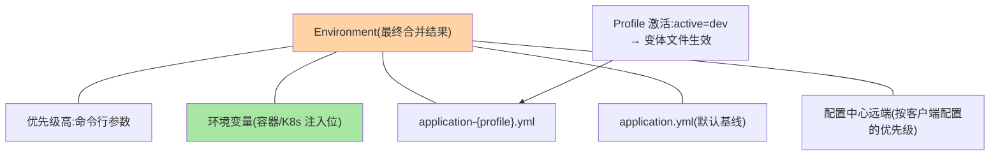

# 配置管理与多环境切换：从 application.yml 到配置中心

> 同一份代码跑四个环境（dev/test/pre/prod），差异全在配置——**配置的加载优先级、Profile 的切换机制、敏感配置的管理、配置中心的接入**，这篇把「配置从哪来、谁覆盖谁、怎么不泄密」一次讲透。

> **本文核心**：配置体系的三个机制层——**加载优先级链**（命令行 > 环境变量 > application-{profile}.yml > application.yml > 默认值——「外层覆盖内层」是 Spring 配置的宪法）；**Profile 激活机制**（spring.profiles.active 多途径 + profile 分组 + 4.x 的 profile 变体细化）；**敏感配置通道**（环境变量/JVM 参数不落盘 → 加密配置（jasypt 类）→ 密管/Vault——敏感等级决定通道等级）。**机制链**：默认配置 ← profile 覆盖 ← 外部化（env/命令行）← 配置中心远端——层层覆盖收敛出最终 Environment。

## 一句话摘要

配置管理的核心心智是「**覆盖链**」：所有配置源汇进 Environment（互指启动系列篇 1 的②阶段），按优先级合并——排查「为什么这个值不生效」就是沿链逐层核对（`/actuator/env` 端点看合并结果与来源，**配置排障第一工具**）。三个工程要点：① **Profile 管「环境形态」**（dev 的日志级别、prod 的数据源——环境差异的载体），但**跨环境真正敏感的值不该进 git 仓**（Profile 文件里写死生产密码 = 泄露事故的标准剧本）；② **配置中心管「动态与集中」**（互指治理域 config-center 系列的机制原理——本篇只讲 Spring 侧接入形态）；③ **配置的量级治理**（配置项数量随服务增长爆炸——分层归类与命名规范防配置腐化）。

## 一、为什么配置管理总在「出事」

配置事故的三个高发面：**覆盖链不知情**（环境变量悄悄覆盖了 yml——「本地好好的线上不对」）；**敏感配置进仓**（application-prod.yml 的密码随代码仓库扩散——历史提交永久留存）；**环境漂移**（四个环境的配置各自手改，差异没人说得清——「为什么 prod 多一行」成谜）——三个面的共同根源：配置被当「文件」而不是「有生命周期的环境资产」管理。

## 5W 速记卡

| 维度 | 一句话 |
|---|---|
| What | 加载优先级链 + Profile 激活 + 敏感通道 + 配置中心接入 |
| Why | 配置事故高发在覆盖不知情/泄露/漂移三面 |
| When | 多环境体系搭建、配置泄露治理、配置中心接入 |
| Where | Environment + Profile 文件 + 配置中心客户端 |
| How | 默认 ← profile ← 外部化 ← 中心，层层覆盖；敏感走独立通道 |

## 二、覆盖链与 Profile 全景



**Profile 的机制细节**：激活多途径（yml 声明/环境变量/命令行——生产用环境变量注入防「yml 里写死 prod 结果本地也 prod」）；**profile 分组**（`spring.profiles.group.prod=@dev-common`——组合复用）；**4.x 视角**：profile 变体与配置导入（spring.config.import）体系持续细化（多文档 yml 的 `---` 分段 + spring.config.activate.on-profile 的声明式分段是现代写法）。**排障铁律**：`/actuator/env` 看最终值与来源层——比肉眼比对十个文件快一百倍。

## 三、敏感配置的三级通道

| 级别 | 通道 | 机制 |
|---|---|---|
| 一般 | yml 进仓 | 非敏感默认值 |
| 敏感 | 环境变量/启动参数 | 不落代码仓（K8s Secret/CI 变量注入） |
| 高敏 | 密管/加密属性源 | jasypt 加密串/ Vault 属性源（互指治理域 config-center 篇 8 的加密选型） |

**红线**：生产凭据不进 git（哪怕 private 仓——泄露半径包含全员+历史+CI 日志）；环境变量注入位（K8s Secret/部署平台变量）是标准通道；密管是高敏的终态。

## 四、配置中心接入的 Spring 形态

```text
形态1: 属性源扩展(主流) —— 配置中心客户端把远端配置包装为高优先级 PropertySource
  进 Environment 覆盖链(Nacos/Apollo 客户端机制,互指治理域 config-center 篇 3-4)
  + @RefreshScope 动态刷新(配置变了 Bean 重建,互指治理域篇 4 的热生效链)
形态2: spring.config.import 声明式导入(ConfigTree/自建导入源)
  —— 4.x 强化: import 语义统一外部源声明
取舍: 中心化动态(中心客户端) vs 声明式简单(import)——按「是否需要运行时动态」定
```

敏感配置的泄露路径与通道演进：


## 五、事故推演：一次「环境变量覆盖」的诡异故障

某服务上线后间歇超时：代码与 test 环境全同、仅 prod 异常。排查两小时无果——最后 `/actuator/env` 揭晓：部署平台的全局变量里有历史遗留 `spring.datasource.hikari.maximum-pool-size=2`（三年前临时压测设置）——**环境变量层静默覆盖了 yml 的 50**，连接池耗尽导致超时。修复：清理遗留变量 + 环境变量清单纳入变更管理 + env 端点对比进发布检查单。**教训**：覆盖链是双向的权力——灵活与危险同源，**每一层都要有清单**（谁在注入环境变量要有台账），排障第一问永远是「env 端点看最终值」。

## 业内惯例

- **env 端点进发布检查单**：发布前 diff 关键配置（数据源/池参数/开关）的最终值与来源——覆盖事故的预防针
- **环境变量注入台账化**（部署平台变量 = 变更面，纳管等同代码变更）
- **Profile 文件只放「形态差异」**（日志级别/端点开关），**值差异（密码/地址）走注入**——文件里出现生产凭据即评审打回
- **3.x/4.x 视角**：spring.config.import 与多文档分段是 2.4+ 的现代基线（legacy 的 spring.profiles 废弃写法清理）；4.x 的配置导入体系继续扩展（ConfigTree 类面向容器的源）

## 六、常见误区

- **「yml 里的值就是生效值」**：Environment 是合并结果——任何高优先级层都能覆盖；「不信文件信端点」
- **@Value 与 @ConfigurationProperties 混用无标准**：批量配置（一组相关项）用 @ConfigurationProperties（类型安全+校验+IDE 提示），零散注入用 @Value——团队统一倾向前者（配置类化是防腐化手段）
- **配置项无命名规范**：`db.url`/`database.url`/`datasource.jdbc` 并存——命名空间规范（技术域.组件.属性）在配置爆炸前建立
- **以为 @RefreshScope 万能**：动态刷新只对标记的 Bean 生效且重建有代价（互指治理域篇 4 的热生效边界）——「能不能热刷新」进配置项登记表

## 七、你们可能会问

**Q1：K8s 环境配置怎么组织？**
ConfigMap 挂非敏感（application.yml 覆盖或 SPRING_* 环境变量）、Secret 挂敏感、配置中心管动态——三层各司其职（互指 K8s 系列与治理域 config-center 的分工讨论）。

**Q2：本地开发配置怎么与团队同步？**
application-local.yml（gitignore）+ application-local.yml.example（进仓说明结构）——「本地差异」与「团队基线」分离的标准做法。

**Q3：配置中心挂了配置还在吗？**
客户端快照兜底（互指治理域 config-center 篇 3 的快照机制）——Spring 侧的体现是 PropertySource 已加载的值继续生效，启动重启也能从本地快照恢复。

## 八、自测三问

1. 覆盖链的优先级排序与排障工具（env 端点）？
2. 敏感配置三级通道与红线？
3. Profile 与配置中心的分工（形态差异 vs 动态集中）？

## 开放问题

- 配置的 GitOps 形态（配置变更走 PR + CI 下发）与配置中心的热更通道并存——「变更的严肃性分级」（PR 级 vs 秒级）是配置治理的新维度。
- AI 时代配置漂移检测（实际生效值 vs 声明基线的自动对账）是可预期的工具化方向——配置治理工具随演进持续升级。

## 📎 核心带走

- **核心一句话**：配置管理 = 覆盖链心智（外层覆盖内层、排障信 env 端点）+ Profile 管形态 + 敏感走独立通道 + 中心管动态
- **机制链**：默认 yml ← profile 变体 ← 环境变量/命令行 ← 配置中心远端 → Environment 合并 → @ConfigurationProperties 绑定
- **失效点/边界**：环境变量静默覆盖（台账+端点 diff 防御）；Profile 文件禁生产凭据；动态刷新有边界

## 💡 实战提示

- 💡 env 端点是配置排障的 X 光——培训新人第一课「不信文件信端点」
- 💡 部署平台环境变量建台账（变量名/负责人/日期）——覆盖链的每一层都可审计
- 💡 决策口径：批量配置 @ConfigurationProperties、零散 @Value；配置中心只进「需要动态」的项——不是所有配置都值得上中心

## 📌 数据与事实声明

- 写于 2026-09-10，机制主线 Spring Boot 4.1.1（gh 实测）；spring.config.import 自 2.4 为标准、4.x 扩展
- 事故推演为覆盖链事故的典型模式匿名化复述
- 免责：具体配置按环境架构评审

## 📚 参考资料

| 类型 | 标题 | 来源 |
|---|---|---|
| 官方文档 | Spring Boot Reference（Externalized Configuration / Features） | docs.spring.io |
| 关联系列 | 本仓库治理域 config-center 系列（机制原理互指）/ K8s 系列 | docs/architecture/service-governance/ |
| 社区沉淀 | 多环境配置实践公开文章 | 技术社区公开文章 |
