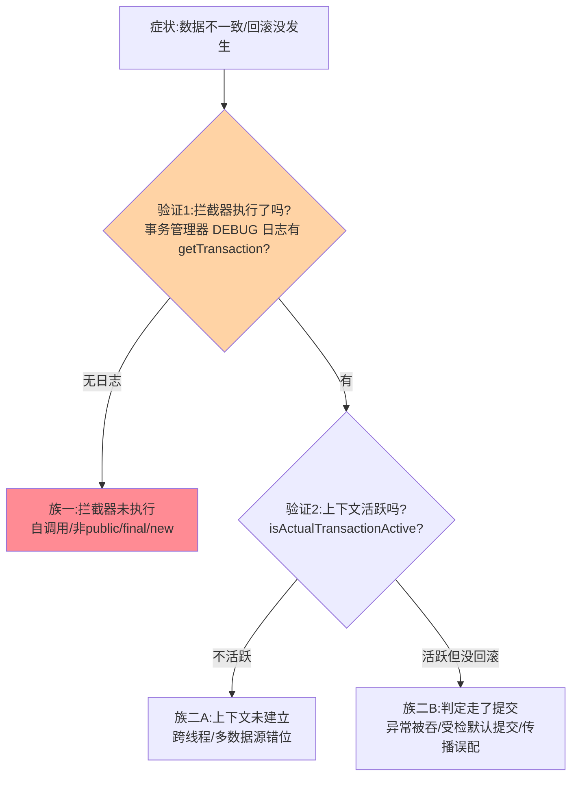
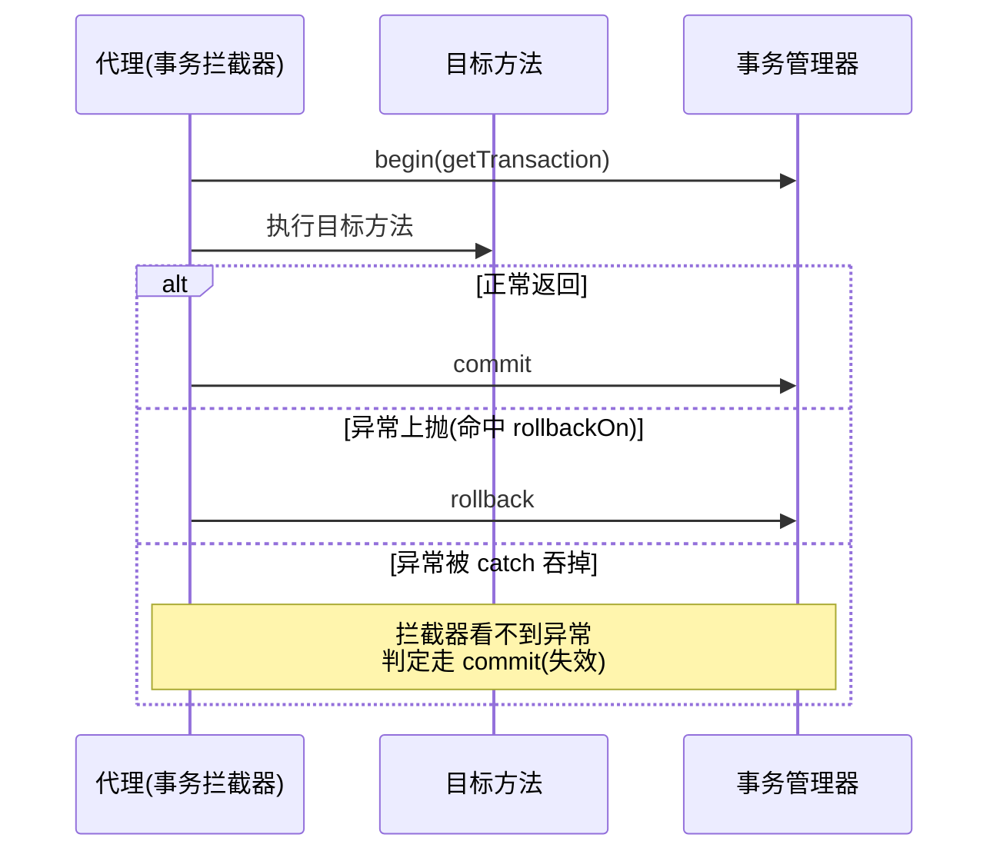
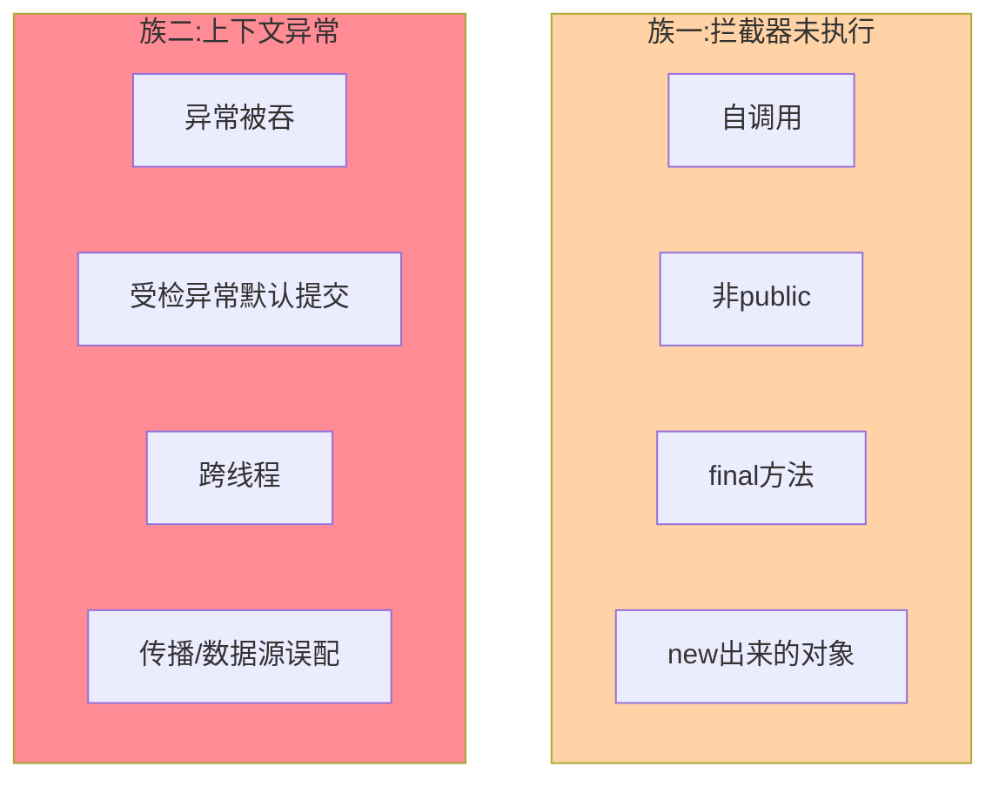
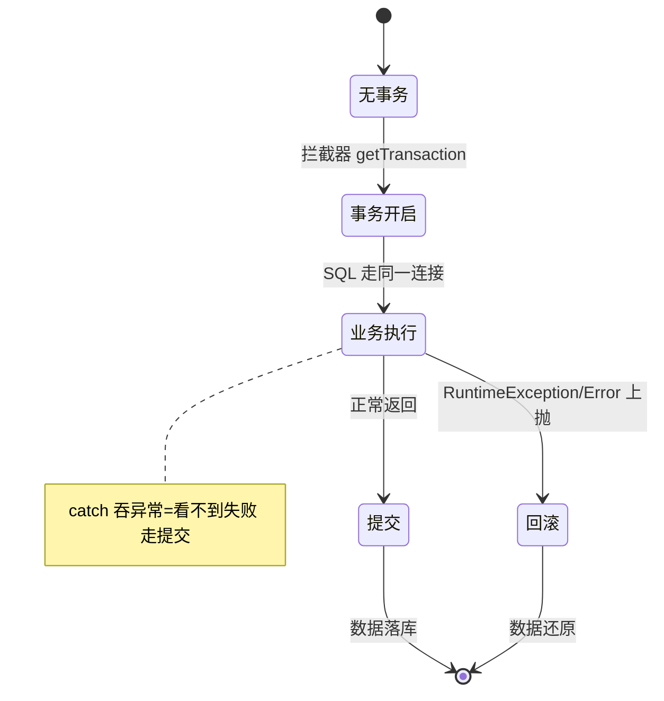

# 事务失效场景排查手册：八场景逐个击穿（本质/写法/坑）

> 「事务没生效」是数据一致性的第一杀手。特性层《@Transactional 事务代理源码》给了两个机制事实——本篇把八类失效场景**逐个拆到本质**：每个场景都按固定五问展开（机制本质含源码位置 / 具体原因 / 错误写法与正确写法 / 实践坑 / 验证手段），不再用一张压缩表格带过。

> **本文核心**：八类失效全部还原到两个机制事实——**①事务拦截器包在代理外层（不走代理 = 拦截器不执行）；②事务连接以 ThreadLocal 租约绑定当前线程（不过渡 = 上下文不存在）**。每个场景的排查都是先验证这两个事实、再核对回滚判定——失效可以叠加并存，「修好一个」不等于「修完了」。

机制链：症状 → 验证①（拦截器执行了吗）→ 验证②（上下文活跃吗）→ 归因到具体场景 → 按本篇场景节取修复 → 防复发（验证代码化）。

## 一句话摘要

排查手册的组织法：按「**验证手段**」分组（先问「事务到底有没有开」——事务管理器 DEBUG 日志 / `TransactionSynchronizationManager.isActualTransactionActive()` 打点——**先验证再归因**，别直接背清单修）；失效两大族四列表（族一「拦截器未执行」：自调用/非 public/final/new；族二「上下文异常」：跨线程/传播误配/异常被吞/受检默认提交/多数据源错位）。**修复原则**：机制修复（消除自调用结构/@Lazy 断环）优于开关修复——开关是遗留的容忍不是设计。

## 归因树：两个验证点的二分定位



## 一、排查的底座：两个机制事实与两个验证点

**机制事实一（拦截器在代理外层）**：@Transactional 由 AOP 动态代理实现，事务拦截器（TransactionInterceptor）包在目标方法外层——begin → 你的方法 → commit/rollback。**不经过代理的调用，拦截器根本不执行**。

**机制事实二（连接是 ThreadLocal 租约）**：事务开始时从连接池取连接、绑定到当前线程的 ThreadLocal；方法内所有 MyBatis/JDBC 操作从 ThreadLocal 取**同一个连接**；提交/回滚后解绑归还。**换线程 = 拿不到这个连接 = 脱离事务**。

两个验证点（排查的第一动作，永远先做这两个）：

```java
// 验证1:拦截器执行了吗?——开事务管理器 DEBUG 日志
// logging.level.org.springframework.jdbc.support.JdbcTransactionManager=DEBUG
// 有 "Creating new transaction" 日志 = 拦截器执行了

// 验证2:事务上下文活跃吗?——业务代码内打点
boolean active = TransactionSynchronizationManager.isActualTransactionActive();
```

## 二、八场景逐个击穿



### 场景 1：自调用——最高频的失效
### 场景 1：自调用——最高频的失效

**机制本质**：`this.update()` 里的 `this` 是**目标对象本身**，不是 Spring 注入的代理对象——事务拦截器织在代理上，绕过代理 = 拦截器根本不存在。源码视角：代理持有的目标对象引用（`TargetSource`）与运行时的 `this` 是两个对象，AOP 拦截链只挂在代理的调用入口。

**具体原因**：同类内「公开方法 A 调用本类带 @Transactional 的方法 B」——A→B 的调用是普通 Java 方法分派（虚调用），不经过代理。

**错误写法 → 正确写法**：

```java
// ❌ 错误:自调用,this 绕过代理,B 的事务不生效
public void orderRefund() {
    validate();
    this.deductStock();        // 无事务!
}

// ✅ 正确一:注入自身代理(自注入)
@Autowired private OrderService self;
public void orderRefund() {
    validate();
    self.deductStock();        // 走代理,事务生效
}

// ✅ 正确二(更常用):拆 Bean——把 deductStock 挪到独立 Service
```

**实践坑**：自注入在循环依赖检查下要确认可用（Boot 2.6+ 默认禁循环依赖，自注入通常豁免，但版本行为要实测）；`AopContext.currentProxy()` 需要 `@EnableAspectJAutoProxy(exposeProxy = true)`，容易忘配。

**验证**：给 deductStock 内部抛异常，观察数据是否回滚 + 事务日志是否出现。

### 场景 2：受检异常默认提交——最反直觉的默认值（本节细拆）

**现象**：方法声明 `throws Exception`，业务里抛了自定义异常，**数据照样提交了**——开发者以为「抛异常 = 回滚」。

**机制本质（源码级）**：事务拦截器捕获异常后，调用 `RuleBasedTransactionAttribute.rollbackOn(Throwable ex)` 决定回滚与否。它的默认实现只有一行判断：

```java
// RuleBasedTransactionAttribute（父类 DefaultTransactionAttribute）默认语义
public boolean rollbackOn(Throwable ex) {
    return (ex instanceof RuntimeException || ex instanceof Error);
}
```

**受检异常（如 IOException、自定义的 `extends Exception`）不在列 → 返回 false → 走提交**。这是刻意的设计而非疏忽：受检异常在 Java 语义里被定义为「调用方应当处理的业务结果」（余额不足、库存不够）——框架不替你判断「业务失败要不要保留部分数据」，把回滚决策权交回给 rollbackFor 声明。

**具体原因**：你的自定义异常 `BizException extends Exception`（受检）——拦截器按默认规则放行提交。

**错误写法 → 正确写法**：

```java
// ❌ 错误:受检异常,默认提交
@Transactional
public void pay() throws BizException {
    deductBalance();
    if (insufficient) {
        throw new BizException("余额不足");   // extends Exception → 不回滚!
    }
}

// ✅ 正确一:精确声明回滚哪些异常(推荐,语义显式)
@Transactional(rollbackFor = BizException.class)
public void pay() throws BizException { ... }

// ✅ 正确二:业务异常改继承 RuntimeException(团队常用基类模式)
public class BizException extends RuntimeException { ... }

// ✅ 正确三:编程式手动标记
@Transactional
public void pay() {
    try {
        deductBalance();
    } catch (BizException e) {
        TransactionAspectSupport.currentTransactionStatus().setRollbackOnly();
    }
}
```

**实践坑**：① `rollbackFor = Exception.class` 一刀切会把「想保留的业务结果」也回滚（如「记录一次失败尝试」的落库操作被连带回滚）——更精细的做法是按异常类型精确声明（`rollbackFor = BizException.class`，多个异常逗号分隔）；② 声明了 `rollbackFor` 的同时又在内部 catch 住，等于白配——**catch 与 rollbackFor 是叠加关系不是覆盖关系**；③ 团队规范的常见收敛：自定义业务异常统一继承 RuntimeException + 全局规约「业务异常必须 runtime 族」，从源头消掉这个坑。

**验证**：测试里制造受检异常抛出，断言数据被回滚（测试在事务内抛异常看最终数据）——回滚失效在 CI 就该炸，不进生产。

### 场景 3：异常被 try-catch 吞掉

**机制本质**：拦截器靠「方法抛出异常」感知失败——异常在方法内部被 catch 且不上抛，拦截器看到的是「正常返回」，判定走提交。**异常的传播路径就是回滚的信号路径**，信号被截断回滚就不发生。

**错误写法 → 正确写法**：

```java
// ❌ 错误:catch 后吞掉继续走,拦截器判定正常
@Transactional
public void batchPay(List<Order> orders) {
    for (Order o : orders) {
        try {
            payOne(o);
        } catch (Exception e) {
            log.error("pay fail", e);   // 吞了,事务照常提交
        }
    }
}

// ✅ 正确:catch 后手动标记回滚(整批回滚)
catch (Exception e) {
    log.error("pay fail", e);
    TransactionAspectSupport.currentTransactionStatus().setRollbackOnly();
}
// 或按业务需要:失败的收集起来,成功的留下——那就别用一个大事务包全部
```

**实践坑**：catch 后只记日志是最常见的「以为处理了」；`setRollbackOnly` 标记后**本事务内后续 SQL 还能执行但最终一定回滚**——语义是「死刑缓期」，别在标记后继续做「必须成功」的写操作。

**验证**：制造一条失败的子操作，断言整批数据状态。

### 场景 4：跨线程——ThreadLocal 租约不过渡

**机制本质**：事务连接绑定在发起线程的 ThreadLocal 上；新开线程（`new Thread`/线程池提交）执行 DB 操作时，ThreadLocal 里没有租约 → 拿的是**新的自动提交连接**——主线程回滚管不到子线程的写入。**事务边界天然是线程边界**。

**错误写法 → 正确写法**：

```java
// ❌ 错误:事务内开线程写库
@Transactional
public void process() {
    updateMain();                          // 在事务里
    executor.submit(() -> insertLog());    // 子线程:独立自动提交连接
}

// ✅ 正确:事务外异步化(事务只包主操作)
public void process() {
    transactionalUpdateMain();             // 事务方法
    executor.submit(() -> insertLog());    // 事务外,独立一致性
}
```

**实践坑**：主线程事务还没提交、子线程就去读库——读到的是旧值（主库未提交对外不可见）。「事务内异步读自己刚写的数据」读不到，是这个机制的最常见变体。

**验证**：子线程内打 `isActualTransactionActive()` ——false 即脱离事务。

### 场景 5：方法非 public / final——代理的技术边界

**机制本质**：CGLIB 子类代理无法覆写 final/private 方法（字节码层面禁止覆写）；JDK 动态代理基于接口，非接口方法天然不在代理面。**AspectJ 通知在非 public 上也无效**（Spring AOP 的方法可见性约束）。

**正确写法**：事务方法 public + 类可继承 + 通过代理调用。**坑**：`final` 加在「以为只是优化」的方法上——升级 JDK/框架后偶发失效，静态扫描把「事务方法上的 final」列为检查项。

### 场景 6：REQUIRES_NEW 与传播误配

**机制本质**：传播属性决定「加入现有事务还是开新事务」——`REQUIRES_NEW` 挂起外层事务、独立提交/回滚。**误配形态**：内层 `REQUIRES_NEW` 的操作在外层回滚后依然保留（审计日志类场景的正确语义，业务数据场景就是脏数据）。

**实践写法**：审计日志、操作流水用 REQUIRES_NEW（无论外层成败都要留痕）；业务数据一律 REQUIRED（跟随外层成败）。**坑**：内外层用同一个连接池，REQUIRES_NEW 需要第二个连接——连接池小时外层挂起 + 内层等连接 = 死锁形态（自锁），池容量要预留。

### 场景 7：多数据源错位

**机制本质**：多数据源下事务管理器绑定特定 DataSource——「事务管理器管 A 库、SQL 打到 B 库」时，B 库的写不受该事务控制。**验证**：打印事务管理器实际持有的连接 URL 与目标库比对。

**实践写法**：路由数据源（AbstractRoutingDataSource）场景下，事务开始前完成路由（分片键决定）；跨库操作不用本地事务硬包——改最终一致或分布式事务（互指本目录篇 2）。

### 场景 8：长事务假死——事务内干了不该干的事

**机制本质**：事务的边界 = 连接的占用窗口 + 锁的持有窗口——事务内调远程接口/大计算，连接与行锁全程持有，拖垮连接池与并发。**实践写法**：重活（RPC/计算/文件）移出事务，事务内只做「校验 + DB 读写」；大批量分批提交。

## 质疑者追问链：失效边界的三层深挖

**质疑**：加了 @Transactional 就该有事务——失效了难道不是 Spring 的 bug 吗？

**追问一层：Spring 是怎么让 @Transactional 生效的？** AOP 动态代理——事务拦截器包在目标方法外层（begin → 你的方法 → commit/rollback）。**所有失效的第一归因点：你的这次调用，走没走这个代理？**

**再追问：自调用为什么绕过了代理？Spring 为什么不用字节码改写根治？** `this` 是目标对象不是代理——拦截链只挂在代理入口。字节码织入（AspectJ）技术可行，Spring 不选的取舍：运行时代理保持**零侵入 + 可卸载 + 生态兼容**，宁可留下「自调用失效」这个已知边界并文档化——能力换复杂度的架构权衡。

**再深一层：拦截器执行了就一定安全吗？** 不是——第二战场在「事务上下文」：ThreadLocal 租约的建立与传递，跨线程不过渡、多数据源可能错位——两个事实都验证过才谈得上回滚判定。


## 步骤级操作：一次事务失效排查的完整规程（前置/命令/验证/回退）

**前置条件**：已确认两个验证点（拦截器日志开关已开、业务代码可加打点）；已获得变更窗口或排查授权。

```text
Step 1 复现并固定症状:记录「哪条数据不一致、哪次操作触发」
      命令: 走一遍触发路径,记录时间点
Step 2 验证1 拦截器: 开 DEBUG 日志重走触发路径
      命令: logging.level.org.springframework.jdbc.support.JdbcTransactionManager=DEBUG
      验证: 日志有无 "Creating new transaction"
Step 3 验证2 上下文: 业务代码内临时打点
      命令: log.info("tx active={}", TransactionSynchronizationManager.isActualTransactionActive())
      验证: true=走了代理看回滚判定 / false=归因族一
Step 4 按本篇场景节归因修复(改结构/改注解/拆方法)
Step 5 回归验证: 重复 Step 1 路径,断言数据一致
回退: 改动均为代码级——git revert 即回退;若动过配置(rollbackFor 等),恢复原值并复测
```

**参数级配置清单**（事务相关的高频参数速查）：

| 参数 | 默认值 | 生产推荐 | 为什么 |
|---|---|---|---|
| `rollbackFor` | RuntimeException/Error | 关键写路径加 Exception.class | 受检异常默认提交（场景 2） |
| `transactionTimeout` | -1(不限) | 按业务 SLA 设(常见 5-30s) | 防长事务占连接 |
| `propagation` | REQUIRED | 按语义显式声明 | 默认语义在嵌套场景易误读 |
| `isolation` | DEFAULT | 多数用默认 | 隔离级别变更影响面大,单独立项 |


## 八场景的两族分布图：一图记住失效全景



## 事务生命周期状态图：提交与回滚的分岔点



## 三、事故推演：一次「修复了但没修对」的双杀

**当时**：某交易系统退款后库存没回滚，资损告警。值班定位到「服务内部自调用」嫌疑（退款方法调库存方法），把内部调用改成「注入自身代理再调」——库存回滚恢复，事故关闭。

**一周后复发**：另一条退款路径出现新的不一致——库存回滚了、账户流水没记。**排查**：用两个验证点过一遍——拦截器这次执行了（第一次修复有效），但异常在中途被 catch 住转了返回码（场景 3）——第一次修复只消除了被验证的那个失效，**两个失效场景原本就并存**。

**复盘沉淀**：① 单点修复后必须跑「全路径事务验证」——关键写路径逐场景过两个验证点；② 失效场景可叠加，「修好一个」≠「修完了」；③ 防复发机制化：关键写路径的单测必须断言「异常时数据真的回滚了」——**验证代码化**，不依赖人眼（回滚失效在 CI 就炸，不进生产）。

## 四、反方案分析：声明式与编程式的分工

- **声明式 @Transactional**（默认推荐）：零侵入、语义清晰——失效边界全部来自「代理机制」。适合标准服务层写方法。
- **编程式 TransactionTemplate**：边界显式在代码里——没有代理失效问题，多线程可各自开事务，异常语义完全自主。代价：样板代码与嵌套可读性。适合：跨线程边界、复杂部分提交、声明式搞不定的场景。
- **为什么不用「全局 catch 转异常」根治异常被吞**：治标且破坏异常语义（吞异常本身可能是合理业务分支）；为什么不默认 `rollbackFor=Throwable`——Error 不该回滚重试。**每个默认值都在保护某个语义**，覆盖前先回答它保护什么。

## 五、量级演进视角：失效面随架构长大

量级演进下失效面逐档变形：单体 10 万 QPS 以内，事务失效是「单应用内排查」（两个验证点够用，万级到十万级变化靠配置消化）；拆微服务后失效面扩大到「跨服务一致性」（本地事务手册只覆盖一半，另一半是最终一致——互指分布式事务系列）；多数据源/分库再叠加「路由与事务边界错位」；引入 MQ 后多出「事务内发消息」的时序问题（事务消息/本地消息表，互指分布式事务系列）——**排查手册随架构量级长节，两个机制事实始终是底座**。

## 六、防复发：从「人记得」到「机器拦」

1. **单测断言回滚**：关键写路径测试制造异常、断言数据还原——回滚失效在 CI 就炸。
2. **ArchUnit 静态规则**：禁「同类内调用带 @Transactional 的方法」结构——规约写成测试。
3. **事务活性打点**：关键路径埋 `isActualTransactionActive()` 断言/日志——生产端持续探针。
4. **失效清单进 review checklist**：新代码对照八场景扫一遍——人工兜底放最后但要有。

## 你们可能会问

**Q1：给类里所有方法都加 @Transactional 是不是就安全了？**
不是——自调用、跨线程照旧失效；且全方法事务拉长连接占用与锁窗口，把「失效问题」换成「性能问题」。事务标注按「需要原子性的写方法」精确给。

**Q2：REQUIRES_NEW 什么时候真的需要？**
「内层结果不受外层回滚影响」的语义真需要时——典型如操作审计日志（外层失败也要留痕）。前提是意识到内外是两个独立事务，不是当「嵌套」用。

**Q3：测试环境事务明明生效，生产为什么失效？**
先对齐语义：测试框架的 @Transactional 默认回滚（数据还原），生产是真实提交——两者语义不同。生产失效回本篇两个验证点，不拿测试感受推断生产。

## 开放问题

- 虚拟线程（Loom）普及后 ThreadLocal 语义变化对事务上下文传递的影响——Spring 事务的线程绑定模型是否会被 Scoped Value 取代，值得版本级跟踪。
- 静态分析对事务失效的检出率（跨方法调用图）在提升，「失效清单」可能逐步被 IDE/CI 规则接管。

## 🎯 核心带走

- **核心一句话**：八类失效全部还原到两个机制事实——拦截器在代理外层（不走代理 = 不执行）、连接是 ThreadLocal 租约（换线程 = 脱离事务）；排查永远从两个验证点开始
- **逐场景一句话**：自调用改代理调用；受检异常显式 rollbackFor；catch 后 setRollbackOnly；跨线程拆边界；非 public 改可见性；REQUIRES_NEW 只给审计类；多数据源对齐路由；重活出事务
- **失效点/边界**：失效可叠加并存（双杀事故）；修复后必须全路径回归；受检异常的默认值是语义声明
- **设计边界**：声明式事务的能力 = 代理的能力；编程式是边界外的兜底手段

## 💡 实战提示

- 💡 值班第一动作打两个验证点（拦截器日志 + 事务活跃性），不是翻清单逐条试。
- 💡 单测制造异常断言数据还原——回滚失效在 CI 就炸，不进生产。
- 💡 事务内禁远程调用/MQ 发送——长事务假死与消息时序问题的共同根源。
- 💡 团队规范收敛：业务异常统一继承 RuntimeException + 关键写路径显式 rollbackFor。
- 💡 失效场景清单进 review checklist——人工兜底放最后，但要有。

## 📌 数据与事实声明

- 写于 2026-09-11（升级重写：排查手册从压缩表格扩为逐场景五问拆解）；失效机制以 Spring Framework 官方文档（Transaction Management）与 TransactionInterceptor/RuleBasedTransactionAttribute 源码公开口径为准；「受检异常默认提交」为 rollbackOn 默认实现的直接推论
- 事故推演为业内高频失效模式的匿名化叙事，非特定公司事件
- 免责：传播行为与默认值以官方文档为准

## 📚 参考资料

| 类型 | 标题 | 来源 |
|---|---|---|
| 官方文档 | Spring Framework Docs（Transaction Management） | docs.spring.io |
| 官方源码 | spring-framework（TransactionInterceptor / RuleBasedTransactionAttribute） | github.com/spring-projects/spring-framework |
| 关联系列 | 特性层《@Transactional 事务代理源码》 | 本仓库同目录 AOP 与代理系列 |
| 关联系列 | 本目录篇 2《多数据源事务边界》 | 本目录 |
