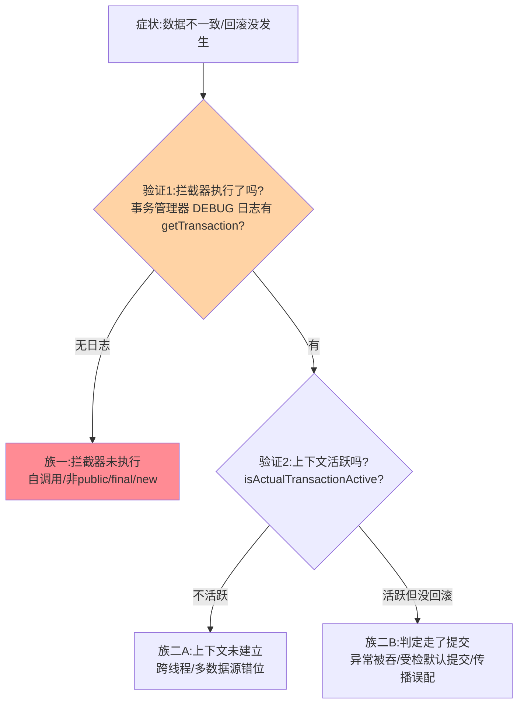
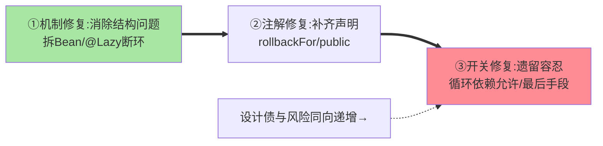

# 事务失效场景排查手册：从清单背诵到机制推演

> 「事务没生效」是数据一致性的第一杀手。特性层《@Transactional 事务代理源码》给了两个机制事实（拦截器在方法外层 + ThreadLocal 连接租约）——本篇把它工程化：**排查手册形态**（症状→机制→验证→修复四列表）+ 事故推演 + 防复发机制。

> **本文核心**：失效排查的**机制归因法**——每个失效场景都能还原到「拦截器没执行」（自调用/非代理调用）或「事务上下文没建立/没传递」（线程/传播/异常判定）两个根因族。**机制链**：症状（数据不一致/回滚没发生）→ 归因族判定（拦截器执行了吗→ThreadLocal 有连接吗→回滚判定走了吗）→ 四列表核对 → 修复 + 防复发。

## 一句话摘要

排查手册的组织法：按「**验证手段**」分组（先问「事务到底有没有开」——`DataSourceTransactionManager` 的 DEBUG 日志 / `TransactionSynchronizationManager.isActualTransactionActive()` 打点——**先验证再归因**，别直接背清单修）；失效两大族的四列表（族一「拦截器未执行」：自调用/非 public/final 方法/类内部 new；族二「上下文异常」：跨线程/传播误配/异常被吞/受检异常默认提交/多数据源错位）。**修复原则**：机制修复（消除自调用结构/@Lazy 断环）优于开关修复（开循环依赖允许、开代理增强）——开关是遗留的容忍不是设计。

## 一、为什么「背清单」排查慢

八大场景清单（互指特性层事务篇的完整版）的问题是**没有验证步骤**——数据不一致时盲试八种修法，可能「修好了但不知道为什么」（巧合性修复）。**机制归因法**先验证两个事实（拦截器执行了吗？事务上下文活跃吗？）——两个验证把排查空间砍掉 75%，再对剩下的清单核对——**从穷举变二分**。

## 5W 速记卡

| 维度 | 一句话 |
|---|---|
| What | 两族归因 + 四列排查手册 + 验证手段 + 防复发 |
| Why | 清单背诵是穷举，机制归因是二分 |
| When | 数据不一致排查、事务规范建设、新人培训 |
| Where | 事务管理器日志 + isActualTransactionActive 打点 |
| How | 验证拦截器/上下文 → 归因族 → 四列表 → 修复防复发 |

## 二、两族归因与验证手段

**两个验证的实现**：① 事务日志（`logging.level.org.springframework.orm.jpa=DEBUG` 或 DataSourceTransactionManager 级——开启事务/提交/回滚全程留痕）；② 活跃性打点（业务代码内 `TransactionSynchronizationManager.isActualTransactionActive()` 输出——直接回答「此刻在不在事务里」）——两个都是分钟级接入。

失效修复手段的优先级：

## 三、四列排查手册（症状→机制→验证→修复）

| 场景 | 机制根因 | 验证表现 | 修复 |
|---|---|---|---|
| 自调用 | this 调用不经代理（特性层篇 2） | 无事务日志、活跃性 false | 拆 Bean/@Lazy 自注入/AopContext |
| 非 public 方法 | 属性源默认只解析 public | 注解存在但无日志 | 改 public + 接口化 |
| 异常被 try-catch | 拦截器视为正常返回 | 日志有 begin 无 rollback | 异常上抛或手动 setRollbackOnly |
| 受检异常提交 | rollbackOn 默认 false | rollback 日志缺失 | rollbackFor=Exception.class（规范默认） |
| 跨线程 | ThreadLocal 不跨线程 | 主线程活跃、子线程 false | 上下文传递/事务边界不跨线程 |
| REQUIRES_NEW 误配 | 独立事务隔离了回滚 | 两段独立 begin/commit | 重新评估传播语义 |
| 多数据源错位 | 绑定 key（DataSource）对不上 | 事务管理器操作了另一套连接 | 路由与事务管理器对齐（互指入门层篇 16） |
| 长事务假死 | 事务内远程调用挂起 | begin 后长时间无 commit | 重活出事务、超时设置 |

**量级演进视角**：单体时代事务失效是「单应用内排查」（两个验证点够用）；拆微服务后失效面扩大到「跨服务一致性」（本地事务手册只覆盖一半，另一半是最终一致——互指分布式事务系列）；多数据源/分库场景再叠加「路由与事务边界错位」——排查手册随架构量级长节，两个机制事实始终是底座。

## 四、事故推演：一次「修复了但没修对」的双杀

订单服务「退款后库存没回滚」：值班看到自调用嫌疑，把内部调用改成「注入自己再调」——**库存回滚了，但一周后新的不一致**：某退款路径里异常被 catch 住转返回码（族二B）——第一次修复消除了族一症状，掩盖了并存的族二问题。复盘：排查时**只修验证过的那个失效**（库存问题归因到自调用并验证），同时跑「全路径事务验证」（关键路径的退款/库存各场景过一遍两个验证点）——「单点修复 + 全路径回归」防并发失效残留。**教训**：失效场景可以叠加（一次事故多个失效并存）——验证驱动而不是清单驱动。

## 业内惯例

- **rollbackFor=Exception.class 进注解默认模板**（受检默认提交是历史约定——规范对齐直觉）
- **事务方法签名的团队约束**：public + 业务语义命名（transferXxx/createXxx——事务边界可读）
- **事务验证打点进联调环境**（isActualTransactionActive 在测试环境常开——开发期就能发现族一失效）
- **3.x/4.x 视角**：事务机制跨版本稳定；失效场景清单二十年间几乎不变（机制没变失效就不变——**这部分知识的保值度是 Spring 全家桶里最高的**）

## 五、常见误区

- **「修好了」不验证机制**：症状消失 ≠ 机制修复（巧合性修复会在别的路径复发）——修复后跑两个验证点确认
- **测试环境事务行为= 生产**：测试的 @Transactional 回滚测试数据（测试注解语义）——行为差异要在集成测试里用真实提交验证
- **把事务当性能优化（手动关事务）**：为提速裸奔写操作——一致性换性能是架构决策不是局部优化（真要异步化走 MQ 最终一致，互指治理域容错系列）
- **只查 @Transactional 方法**：失效也可能在「以为有事务实际没有」的调用方（漏标注解）——验证点放在「数据操作的现场」而不是「注解的现场」

## 六、你们可能会问

**Q1：怎么快速验证「这个方法会不会回滚」？**
两个验证点 + 一次实验：开事务日志、活跃性打点，然后故意抛异常跑一次——有 rollback 日志即机制在；没有按两族归因。

**Q2：MyBatis-Plus / JPA 的事务失效有差异吗？**
失效机制同源（Spring 事务层的两个事实），差异只在数据访问侧的连接获取——排查手册通用，存储侧细节互指各自生态系列。

**Q3：分布式场景（跨服务）这个手册还适用吗？**
本手册管本地事务；跨服务的一致性（最终一致/TCC/Saga）是另一套体系（互指 MySQL 分库分表篇 3 与分布式事务系列）——先分清「一个事务还是多个事务的编排」再选手册。

## 七、自测三问

1. 两个验证点（拦截器执行/上下文活跃）怎么实现？为什么先验证再归因？
2. 四列表能复述多少行？各自归到哪一族？
3. 「单点修复 + 全路径回归」防什么？

## 开放问题

- 事务失效的静态检测（IDE/ArchUnit 规则识别自调用 @Transactional、非 public 标注）在工具化——「失效场景的编译期拦截」比运行后排障更优，规则库值得沉淀。
- 声明式事务的边界表达力（注解无法表达的条件性回滚）与编程式的组合使用是长期张力——二十年的演进里失效清单几乎未变，是 Spring 知识体系里保值度最高的一块。

## 📎 核心带走

- **核心一句话**：事务失效排查 = 两个验证点先行（拦截器执行？上下文活跃？）+ 两族归因 + 四列表核对——验证驱动不清单驱动
- **机制链**：症状 → 验证1（日志）→ 族一（代理边界）→ 验证2（活跃性）→ 族二（上下文/判定）→ 修复 + 全路径回归
- **失效点/边界**：失效可叠加（单点修复+全路径回归）；测试环境事务语义有差异；跨服务是另一套体系

## 💡 实战提示

- 💡 两个验证点的接入模板进团队文档（事务日志配置 + 活跃性打点片段）——排查准备 10 分钟
- 💡 ArchUnit 加两条规则：@Transactional 方法必须 public、同类调用检测（能静态拦的不留运行时）
- 💡 决策口径：修复顺序——机制修复（消除结构问题）> 注解修复（补 rollbackFor）> 开关修复（遗留容忍最后用）
- 💡 一致性保障与开发效率的取舍：声明式事务让边界声明零成本，失效排查成本是其隐含对价——规范模板与静态检测压低对价

## 📌 数据与事实声明

- 写于 2026-09-10，机制归因基于特性层《事务代理源码》的两个机制事实（方法外层 + ThreadLocal 租约）；失效清单与 Spring 官方文档口径一致
- 事故推演为叠加失效的典型模式匿名化复述
- 免责：具体修复按业务事务语义评审

## 📚 参考资料

| 类型 | 标题 | 来源 |
|---|---|---|
| 官方文档 | Spring Framework Docs（Transaction Management 声明式注解） | docs.spring.io |
| 关联系列 | 本仓库特性层《@Transactional 事务代理源码》（机制底座互指） | 本目录 |
| 关联系列 | MySQL 事务系列（存储侧互指）/ mybatis-plus 生态 | docs/data/mysql/ |
