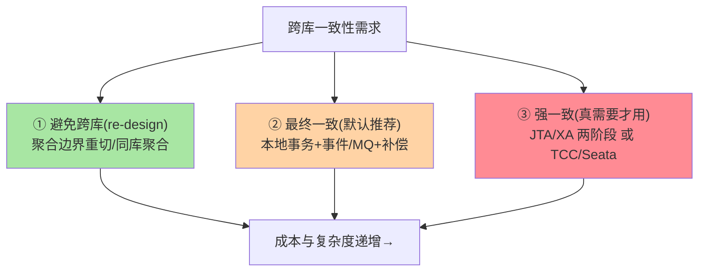
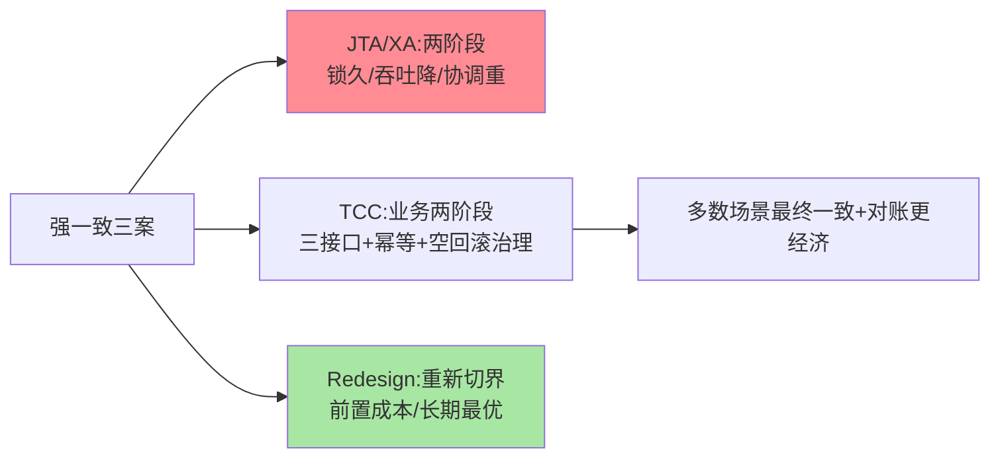

# 多数据源事务边界与分布式事务思路：本地事务的天花板与出路

> 一个事务跨两个库，@Transactional 管不了——**多数据源是本地事务的天花板线**。这篇讲清天花板的机制（为什么跨库回滚不了）、Spring 侧的管理方案（动态路由/多事务管理器/JTA 的取舍）、以及跨库一致性的三条出路（避免跨库 > 最终一致 > 强一致方案）。

> **本文核心**：天花板的机制根源——**Spring 事务绑定单一 DataSource**（ThreadLocal 的 key 是 DataSource 实例，一个事务一个连接一个库——跨库 = 两个独立事务，A 成功 B 失败无法联动回滚）。**机制链**：多数据源场景 → 路由（AbstractRoutingDataSource/分库中间件）→ 事务管理器对哪个库生效 → 跨库边界的处理策略选型（避免/最终一致/强一致）。

## 一句话摘要

三条出路的选型排序（默认推荐序）：**① 避免跨库**（业务 redesign——同库聚合、按聚合根重新切分边界，互指分库分表篇 2 的分片键设计——最便宜的一致性是不需要一致性）；**② 最终一致**（本地事务 + 事件/MQ 异步补偿——互指治理域容错与 MQ 系列，覆盖九成跨库场景）；**③ 强一致**（JTA/XA（Spring 的 ChainedTransactionManager/JtaTransactionManager——两阶段提交，性能代价与运维复杂度）或业务级两阶段（TCC/Seata 类——业务侵入换性能）——留给真需要原子跨库的场景（资金类）。**Spring 侧的多数据源管理**：静态多源（每源独立事务管理器 + @Transactional 指定 transactionManager）、动态路由（AbstractRoutingDataSource + 路由 key 的 ThreadLocal——**路由切换与事务边界的错位是事故高发位**，互指特性层事务篇的多数据源失效行）。

## 一、为什么本地事务跨不了库

一个 @Transactional 事务的物理构成：**一个事务管理器 → 一个 DataSource → 一个 Connection**（特性层事务篇的 ThreadLocal 租约）——原子性、隔离性都是**单连接内**的数据库能力。跨两个库 = 两个连接各开各的事务——**「提交了 A 再提交 B」之间没有原子性**（B 失败时 A 已提交无法回卷）——这不是 Spring 的缺陷，是单连接事务模型的天花板。理解天花板才能选对出路：所有跨库一致性方案都是「绕开或补课」这两个思路的变体。

## 5W 速记卡

| 维度 | 一句话 |
|---|---|
| What | 单 DataSource 绑定的机制 + 多源管理 + 三条出路选型 |
| Why | 跨库是本地事务的天花板，出路选型是架构决策 |
| When | 多数据源设计、跨服务数据一致性、分库后事务治理 |
| Where | 路由层 + 事务管理器配置 + 消息/补偿基建 |
| How | 先避免跨库 → 不行上最终一致 → 真需原子才强一致 |

## 二、天花板与三条出路全景



**三路的判据**：业务能容忍短暂不一致吗（能→②；不能→为什么不能，是体验问题还是资金问题——体验问题重新评估容忍度）；跨库频率与关键度（偶发非核心→② 加对账兜底；高频核心资金→③）；**「先挑战需求再选方案」**——很多「必须强一致」经业务确认后是「分钟级可容忍」。

三种强一致方案的代价对比：



**量级演进视角**：单库时代无此问题；读写分离（路由特例）→ 分库（跨库写出现，天花板到达）→ 微服务化（跨库升级为跨服务，本地消息表/Saga 编排登场）→ 多机房多活（一致性与单元化叠加，互指稳定性域容灾篇）——一致性问题的量级随架构演进逐级放大，三出路的选型框架在每一级都适用。

## 三、Spring 侧多数据源管理

```text
形态1: 静态多源(数据源各配各的)
  两个 DataSource + 两个 TransactionManager
  @Transactional("orderTxManager") / @Transactional("userTxManager")
  → 各管各的本地事务(跨库原子性仍无!只是两套独立事务)
形态2: 动态路由(AbstractRoutingDataSource / 分库中间件)
  路由 key(ThreadLocal) 决定每次 getConnection 走哪个源
  ⚠️ 事务开启后连接已绑定 → 事务内切换路由 key 不换连接!
  → 「先路由后开事务」的调用顺序纪律(特性层事务篇失效行的机制根源)
形态3: JTA/链式(ChainedTransactionManager / Atomikos/Narayana)
  多个事务管理器串联(顺序提交/回滚)——缓解(缩小不一致窗口)而非解决(非原子)
```

**形态3 的诚实认知**：ChainedTransactionManager 是「尽力链式回滚」——链中间失败时前面的已提交（窗口缩小但非原子）；真原子要 JTA/XA（两阶段提交——准备阶段全部就绪才提交）——XA 的代价（锁持有时间长、吞吐下降、参与者协调复杂度）是它十年不普及的原因。**TCC（Try-Confirm-Cancel）**用业务逻辑实现两阶段（Try 预留资源 → Confirm 确认/Cancel 释放）——性能优于 XA、业务侵入大（每个参与方实现三接口 + 幂等 + 空回滚处理）——Seata 类框架把模式工程化。

## 四、典型场景与事故推演

**事故剧本（以为有事务的跨库写）**：订单库 + 库存库分库后，代码保持「一个 @Transactional 方法写两库」——联调正常（顺序都成功）；生产 B 库偶发超时——**订单已提交、库存没扣**（对不上账）。排查发现 @Transactional 只绑定了订单事务管理器（库存操作静默走独立自动提交）——**「事务以为在管、实际只管一半」**。修复：短期加对账补偿任务（最终一致）；长期按聚合根重切边界（订单与库存操作的事件驱动编排）。**教训**：分库瞬间就要审计「跨库写清单」——天花板在拆库那刻就到了，不是出事那天。

## 业内惯例

- **拆库前先审计跨库事务清单**：列出所有跨库写路径——每条给「避免/最终一致/强一致」的归属决策（拆库方案的必答题，互指分库分表篇的迁移清单）
- **最终一致的标配三件**：本地消息表/事务消息（保发出）+ 消费幂等（保不重）+ 对账兜底（保最终发现）——互指 MQ 事务消息系列与容错幂等篇
- **路由与事务的顺序纪律**：动态数据源场景「先定路由 key 再进事务方法」（进方法前 key 已定）——写进编码规范
- **3.x/4.x 视角**：Spring 事务抽象与多源管理跨版本稳定；分布式事务的生态重心在「消息最终一致 + 编排」（Saga/Seata 等框架持续演化，互指分布式事务系列的全景）

## 五、常见误区

- **「加了 @Transactional 就有事务」**：多源场景要看绑定哪个管理器——**注解不指定就用默认（@Primary）**，另一库的写裸奔——事故剧本的机制
- **ChainedTransactionManager 当原子用**：它是「链式尽力」不是「原子」——把缓解当解决会在极端并发下出对账差
- **TCC 当万金油**：三接口 + 幂等 + 空回滚/悬挂的处理成本极高——只有资金级原子需求才值得（大多数场景最终一致 + 对账更经济）
- **路由切库在事务内**：连接已绑定，切换无效——「事务内路由不生效」不是 Bug 是绑定机制（特性层篇 2 的 ThreadLocal 事实）

## 六、你们可能会问

**Q1：读写分离算多数据源问题吗？**
读从库的事务语义：只读查询走从库（无事务要求）、写走主库——路由按「操作类型」定（读写分离中间件处理），事务内强制读主库（防主从延迟读旧数据，互指 MySQL 复制系列的延迟治理）——是路由特例不是跨库一致性问题。

**Q2：本地消息表方案的机制是什么？**
业务写库与「待发消息」同库同事务（原子的本地一致）→ 后台任务扫表发 MQ → 消费方幂等处理 → 对账兜底——**用「本地原子 + 异步投递」绕开跨库原子**（互指 MQ 事务消息篇的同源机制）。

**Q3：什么时候真需要 JTA/XA？**
多库原子且无法 redesign、且最终一致的窗口业务完全不可容忍（部分资金核心）——XA 在现代微服务的出场率低（锁与吞吐代价），多数「强一致诉求」被 TCC 或 redesign 化解。

## 七、自测三问

1. 本地事务跨不了库的机制根源（单 DataSource 绑定）？
2. 三条出路的选型判据与默认推荐序？
3. 「事务内路由不生效」与「注解只管一半」的机制解释？

## 开放问题

- 跨服务一致性的编排标准化（Saga 模式的 DSL 化/框架化）在演进——「最终一致的工程复杂度」被框架逐步吸收，出路②的成本在下降。
- 数据库内核级分布式事务（NewSQL 的原生跨节点事务，互指 MySQL 系列的开放问题）如果普及，「应用层分布式事务」整个议题可能被下沉。

## 📎 核心带走

- **核心一句话**：单 DataSource 绑定是本地事务的天花板——出路选型「避免跨库 > 最终一致 > 强一致」，Spring 多源管理各有边界（Chained 是缓解不是原子）
- **机制链**：多源需求 → 路由/多管理器形态选择 → 跨库边界归属决策（三出路）→ 最终一致三件套（消息/幂等/对账）
- **失效点/边界**：注解不指定管理器 = 另一库裸奔；事务内路由无效；拆库那刻就要审计跨库写清单

## 💡 实战提示

- 💡 拆库方案模板必含「跨库写清单 + 一致性归属」两节——没这两节的拆库方案不批
- 💡 最终一致三件套（消息表/幂等/对账）按场景组合——缺对账的最终一致是「最终不一致」
- 💡 决策口径：强一致诉求先做「容忍度复核」（多数可重评估为分钟级可忍）——真资金原子再上 TCC/XA

## 📌 数据与事实声明

- 写于 2026-09-10，机制基于特性层事务篇的两个机制事实；XA/TCC 为公开方案口径（Seata 等框架文档）
- 事故推演为分库跨库写的典型模式匿名化复述
- 免责：一致性方案按业务语义评审

## 📚 参考资料

| 类型 | 标题 | 来源 |
|---|---|---|
| 官方文档 | Spring Framework Docs（Transaction → Multiple Transaction Managers） | docs.spring.io |
| 关联系列 | 本仓库 MySQL 分库分表篇 2-3 / MQ 事务消息系列 / 治理域容错幂等篇 | docs/ |
| 开源框架 | Seata（AT/TCC 模式文档） | seata.apache.org |
