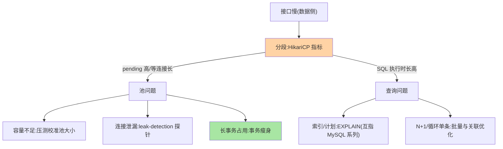
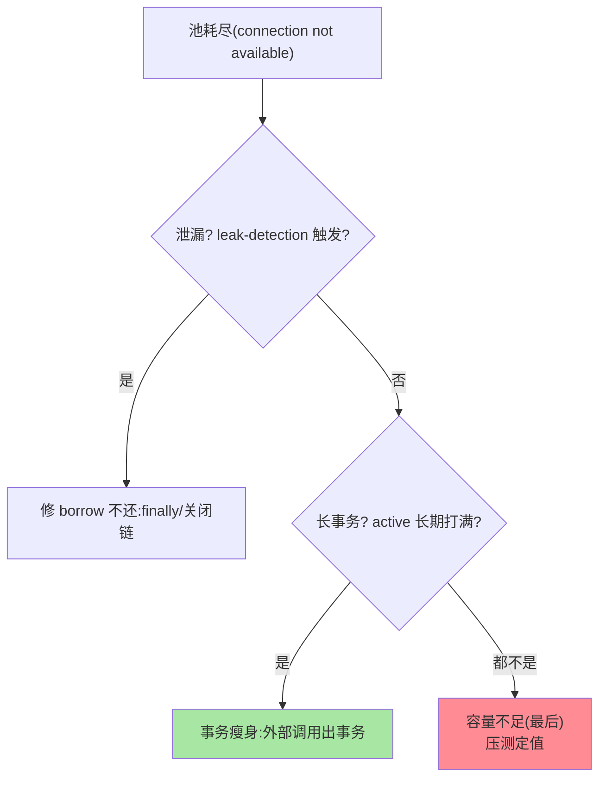

# 慢 SQL 与连接池问题定位：Spring Boot 侧的数据访问排障

> 「接口慢」的两大数据侧根因：**慢 SQL**（查询本身慢）与**连接池耗尽**（拿连接排队慢）——症状相似（都是延迟），机制完全不同。这篇讲 Spring Boot 侧（HikariCP + MyBatis/JPA）的定位法：怎么区分、怎么看证据、怎么修。

> **本文核心**：两类问题的**区分证据**——慢 SQL 看**数据库侧**证据（慢查询日志/执行计划，互指 MySQL 系列的 EXPLAIN 深度解读）；连接池耗尽看**应用侧**证据（HikariCP 的 active/pending 指标、`connection is not available` 异常）。**机制链**：请求 → 获取连接（池的借出队列——耗尽时等 `connection-timeout`）→ 执行 SQL（慢查询在数据库侧耗时）→ 归还连接——延迟发生在哪一段决定修法。

## 一句话摘要

定位的第一刀（**分段计时**）：`HikariCP` 指标区分「等连接时长」与「SQL 执行时长」——等连接长 = 池问题（容量/泄漏/长事务占用）、SQL 执行长 = 查询问题（索引/计划/量级——归 MySQL 系列的优化链）。**连接池的三类根因**：容量不足（压测校准 maximum-pool-size）、**连接泄漏**（borrow 不还——finally 缺失/长事务——`leak-detection-threshold` 是泄漏探针）、**长事务占用**（事务里干慢活——互指特性层事务篇的「事务保持短小」惯例兑现位）。**慢 SQL 的 Spring 侧治理位**：慢 SQL 阈值与采集（MyBatis 拦截器/P6Spy 类）、N+1 检测（JPA/MyBatis 的关联查询放大——日志级暴露）、批量写规范（循环单条 insert 的反模式）。

## 一、为什么「接口慢」要先分两段

数据侧延迟的两段物理路径：**借连接（池）→ 执行（库）**——修法完全不同（池问题调容量/修泄漏；库问题加索引/改 SQL）——不分段的排查在两边乱试。HikariCP 的 Micrometer 指标（hikaricp.connections.active/pending/await）天然给出分段证据——**指标先看，压测后调**。

## 5W 速记卡

| 维度 | 一句话 |
|---|---|
| What | 两段分段定位法 + 池三类根因 + 慢 SQL 治理位 |
| Why | 池耗尽与慢 SQL 症状同（延迟）修法异 |
| When | 接口延迟排查、连接池告警、慢查询治理 |
| Where | HikariCP 指标 + 慢 SQL 采集 + MySQL 慢日志 |
| How | 分段计时 → 池 or 库 → 各自证据链 → 修复 |

## 二、两段定位与池三类根因



**池容量的反直觉**：不是越大越好——连接池过大反而伤性能（数据库侧的连接开销/锁竞争加剧/上下文切换）——HikariCP 官方口径的池大小公式（`connections = core_count * 2 + effective_spindle_count` 量级）远小于多数人的直觉值（几百）——**「池满就调大」是第一反应错**，先看三类根因（泄漏/长事务常是真相）。

池耗尽三连查的排查顺序：



## 三、慢 SQL 的 Spring 侧治理位

```text
采集位: MyBatis 拦截器/P6Spy(应用侧慢 SQL 日志,带 SQL 与耗时)
        ↔ MySQL 慢查询日志(数据库侧,互指 MySQL 性能篇)
检测位: N+1 检测(关联查询放大——JPA 的 hibernate.session.events/
        MyBatis 的日志级统计:一次请求 SQL 条数告警)
规范位: 批量写(forEach 单条 insert → batch 模式,互指 mybatis-plus 工程实践)
        深分页/大结果集(互指 MySQL 索引优化篇的延迟关联)
```

**N+1 的机制**：列表查 1 次 + 循环内每条查详情 N 次（每次几 ms × N = 秒级延迟）——单条都「不慢」但总量慢——**应用侧 SQL 计数（每次请求 SQL 条数）是 N+1 的显影剂**（单请求 SQL 数 > 50 即嫌疑）。

## 四、典型场景与事故推演

**事故剧本（池耗尽的真凶是长事务）**：服务间歇性 `connection is not available, request timed out after 30000ms`——第一反应加池大小（10→50），短暂缓解后复发且更凶。指标回看：active 长期打满、无 pending 高峰前兆；leak-detection 未触发（不是泄漏）——**真凶是一个事务方法内调外部风控接口**（同步 HTTP，超时 8 秒）——高峰期该方法并发占用几十连接干等外部调用。修复：外部调用移出事务（互指特性层事务篇纪律）、池回调 10（50 的容量让数据库侧雪上加霜）。**教训**：池耗尽三连查（泄漏探针→长事务审计→最后才是容量）——「调大池」是最后一个选项不是第一个。

## 业内惯例

- **HikariCP 指标进大盘**（active/pending/await/usage 四件——池健康的一屏视图）
- **leak-detection-threshold 常开**（预发默认配——泄漏在预发暴露不在生产爆发）
- **单请求 SQL 条数统计**（N+1 的显影剂——条数阈值告警）
- **3.x/4.x 视角**：HikariCP 为 Boot 默认池（2.0+ 至今）；4.x 的池指标与 Micrometer 集成更完备——机制稳定、观测增强

## 五、常见误区

- **池满就调大**：先查三类根因——泄漏与长事务是常见真相，盲目调大把压力转嫁给数据库
- **慢 SQL 只看应用侧日志**：应用侧知道「慢」不知道「为什么慢」——EXPLAIN 执行计划才是归因（互指 MySQL 系列的索引失效手册）
- **N+1 靠感觉发现**：单条都快没有「慢查询」——只有 SQL 条数统计能显影（列表页「1+N 条 SQL」的形态）
- **事务里调外部服务**：占着连接干等外部——池耗尽的第一嫌疑人（事故剧本的标准形态）

## 六、你们可能会问

**Q1：池大小到底设多少？**
起点：核数 × 2 + 磁盘数（量级 10-20 起步）→ 压测（TPS 与池等待曲线的拐点）→ 定值——比「照着别人的 50」科学，比「算无遗策」务实。

**Q2：MyBatis 和 JPA 的排障有差异吗？**
分段定位法通用；差异在治理位——JPA 的 N+1 有原生检测（生成 SQL 可见）、MyBatis 靠拦截器统计——生态细节互指各自系列。

**Q3：读写分离后慢 SQL 排查变化吗？**
读从库的慢 SQL 要确认「发生在哪个库」（主从的硬件/负载差异）——路由层的执行库标记进日志，否则归因错库。

## 七、自测三问

1. 两段定位法（等连接 vs 执行）的指标依据？
2. 池耗尽三连查的顺序？为什么调大池是最后选项？
3. N+1 为什么单条不慢总量慢？显影剂是什么？

## 开放问题

- 慢 SQL 的自动归因（采集到 EXPLAIN 的自动关联 + 索引建议）在数据库产品/AI 工具演进中——排障链路在被工具压缩。
- 虚拟线程时代「每请求一线程 + 同步 JDBC」的池压力模型变化（并发能力上升 → 池成为更早的瓶颈点）——池容量与虚拟线程的协同调优是新课题（互指 Java 系列虚拟线程篇），排障模型随并发形态持续演进。

## 📎 核心带走

- **核心一句话**：数据访问排障 = 两段定位（等连接 vs 执行）+ 池三连查（泄漏→长事务→容量最后）+ 慢 SQL 的 EXPLAIN 归因（归 MySQL 系列）
- **机制链**：请求 → 池借出（pending/active 证据）→ SQL 执行（慢日志/条数证据）→ 归还；泄漏探针与长事务审计是池健康的守门员
- **失效点/边界**：调大池是最后选项；N+1 靠条数显影不靠单条耗时；事务内外部分离

## 💡 实战提示

- 💡 HikariCP 四指标 + 单请求 SQL 条数进标准大盘——数据侧健康的两屏
- 💡 leak-detection 预发常开 + 事务内外部调用的 ArchUnit 规则——两大隐患静态拦
- 💡 决策口径：池容量核数×2 起步压测定值；慢 SQL 归因必看 EXPLAIN——应用侧只定位不归因
- 💡 吞吐与稳定性的取舍：池调大是拿数据库的稳定性换应用层的等待缓解——跨层权衡要两端一起算

## 📌 数据与事实声明

- 写于 2026-09-10，HikariCP 为 Spring Boot 默认连接池（2.0+ 至 4.x 延续）；池大小公式为 HikariCP 官方 wiki 口径
- 事故推演为长事务池耗尽的典型模式匿名化复述
- 免责：参数按应用压测校准

## 📚 参考资料

| 类型 | 标题 | 来源 |
|---|---|---|
| 官方文档 | HikariCP（Pool Sizing / Metrics） | github.com/brettwooldridge/HikariCP |
| 关联系列 | 本仓库 MySQL《索引失效排查手册》《EXPLAIN 深度解读》（归因互指） | docs/data/mysql/ |
| 官方文档 | Spring Boot Data Access（连接池配置） | docs.spring.io |
