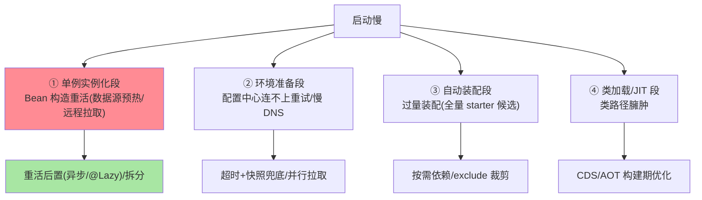

# 启动慢与启动失败排查：按阶段归因的排障法

> 启动问题的排障地图就是启动流程本身（互指特性层启动源码篇）：**慢要按阶段打点找大头，失败要按阶段归类找层**。这篇把「启动 3 分钟」「启动报错 20 种」收敛成两张可执行的排查表。

> **本文核心**：启动排障 = **阶段化归因**。慢的四个大头（单例实例化段的 Bean 构造重活 / 环境准备段的配置中心网络 / 自动装配段的过量装配 / 类加载段）；失败的三层归类（**环境层**（配置/连接）→ **定义层**（Bean 冲突/条件装配）→ **实例化层**（构造异常/循环依赖）——与 refresh 的阶段一一对应）。**机制链**：StartupStep 打点 → 慢定位到阶段 → 该阶段的标准嫌疑清单；失败读异常栈定位阶段 → 层级归因 → 对应修法。

## 一句话摘要

**启动慢的量化先行**：ApplicationStartup（BufferingApplicationStartup）打点各阶段与各 Bean 耗时——「感觉慢」变「哪个 Bean 占 40 秒」；四个大头的治理各有正解（重 Bean 构造挪异步/懒加载、配置中心加超时与本地兜底、装配按需裁剪 exclude、CDS/AOT 走构建期优化）。**启动失败的读栈法**：异常栈最顶端的 Spring 框架帧指示阶段（BeanCreationException→实例化层、BeanDefinitionStoreException→定义层、ConfigDataResourceNotFoundException→环境层），**先归层再读业务信息**——同一类报错的修法高度收敛。

## 一、为什么启动排障要「阶段化」

启动是一段**串行流水线**（六阶段，互指启动源码篇）——任何一环慢/挂都表现相同（「启动慢」「起不来」），但根因与修法按阶段完全不同——**不做阶段归因的排障 = 每次都全链碰运气**。阶段地图把 20 种报错收敛成 3 层、把「慢」收敛成 4 个大头——排查从漫游变查表。

## 5W 速记卡

| 维度 | 一句话 |
|---|---|
| What | 启动慢四大头 + 启动失败三层归因 + 量化工具 |
| Why | 启动是串行流水线，阶段归因收敛排障路径 |
| When | 启动超 SLA、启动失败值班、启动优化专项 |
| Where | ApplicationStartup 打点 + 异常栈框架帧 |
| How | 量化定位阶段 → 嫌疑清单核对 → 层级归因修复 |

失败三层归因与读栈法：

## 二、启动慢四大头排查表

**量化工具链**：BufferingApplicationStartup（阶段与 Bean 级打点，导出 JSON 分析）→ startup 日志（`Started app in 30s (beans=200)` 的 beans 数异常膨胀是过量装配信号）→ Spring Boot 4 的启动指标与 actuator/startup 端点——**先拿数据再动手**是启动优化的铁律（盲改懒加载常引首请求尖刺，互指启动源码篇的懒加载边界）。

## 三、启动失败三层归因表

| 层 | 典型异常 | 标准嫌疑 | 修法方向 |
|---|---|---|---|
| 环境层 | ConfigDataResourceNotFound / 配置中心连接失败 / Could not resolve placeholder | 配置文件缺失、profile 错、中心地址/凭证错、网络 | 补配置/修注入/加快照兜底 |
| 定义层 | BeanDefinitionOverrideException / NoSuchBeanDefinition（装配期）/ Ambiguous mapping | 同名冲突、条件装配不命中、扫描范围错、缺依赖 | exclude/条件核对/包范围修 |
| 实例化层 | BeanCreationException（含循环依赖变体）/ UnsatisfiedDependency | Bean 构造抛异常、依赖缺失、循环依赖、@Value 解析失败 | 读业务栈修构造/补 Bean 定义/@Lazy 断环 |

**读栈法**：栈顶框架帧定层 → 层内再读 `Caused by` 链的业务信息（真正的根因常在最底部的 Caused by）——**「框架帧定层、Caused by 定因」**两步走。

**量级演进视角**：单体几百 Bean 启动 20 秒可接受；微服务化后单服务 Bean 反而少（启动 10 秒级）；真正的量级拐点在**弹性扩容**（百实例同时启动 = 配置中心/数据库连接池的并发冲击）与**Serverless**（冷启动秒级要求倒逼 CDS/AOT/native）——启动时长的量级要求由部署形态决定，排障与优化跟着形态走。

## 四、典型场景与事故推演

**事故剧本（启动 8 分钟）**：某服务扩容后启动 8 分钟、批量重启全超时。量化打点揭晓：一个「缓存预热 Bean」在构造里同步拉全量商品数据（300 万条、4 分钟）+ 配置中心无超时重试（挂时再吃 3 分钟）。修复：预热改异步（启动后并行刷）+ 中心客户端超时 3 秒与快照兜底——启动回到 40 秒。**教训**：启动慢几乎从不是「框架慢」，是「业务把启动当初始化窗口用」——重活的后置纪律（互指启动源码篇的业内惯例）在扩容场景兑现价值。

## 业内惯例

- **启动 SLA 进监控**（启动时长告警——慢化是渐变的，基线对比先于人感）
- **启动打点常开**（BufferingApplicationStartup 的开销可忽略，预发默认开）
- **批量重启演练**（扩容场景的启动时长 = 真实容量）——大促前必测「全量重启恢复时长」
- **3.x/4.x 视角**：CDS/AOT（4.x 强化）把启动优化推进构建期——排障方法不变，优化手段多了构建期一层

## 五、常见误区

- **盲开全局懒加载**：启动快了、首请求尖刺 + 装配错误推迟暴露——按 Bean 分级（互指启动源码篇）
- **读栈只看最顶**：顶层是框架帧（信息少），根因在 Caused by 链底部——养成翻到链尾的习惯
- **「起不来就重启试试」**：环境层问题（配置缺失/中心不可达）重启不变——先归层，重启只对偶发性有效
- **忽视 beans 数量增长**：每次加依赖 beans 涨几十——装配膨胀是启动慢化的温水，startup 日志的 beans 数要盯

## 六、你们可能会问

**Q1：启动日志怎么开 DEBUG 看细节？**
`--debug` 开启动诊断（含 ConditionEvaluationReport，互指装配篇）；`logging.level.org.springframework=DEBUG` 看框架层细节（噪声大，定位用完关）。

**Q2：循环依赖报错但看不懂哪个环？**
报错信息含 「The dependencies of some of the beans in the application context form a cycle」+ Bean 链——链就是环路径；4.x 的报错提示更友好（建议 @Lazy 或重构，互指 IoC 系列篇 2）。

**Q3：native/CDS 形态的启动排障一样吗？**
阶段地图通用、细节不同（native 无运行时装配——定义层问题在构建期暴露；排障主战场移到 build 日志）——形态演进排障方法跟着迁移。

## 七、自测三问

1. 启动慢四大头与各自正解？量化工具链？
2. 失败三层归因表与「框架帧定层、Caused by 定因」读栈法？
3. 为什么「启动慢几乎不是框架慢」？

## 开放问题

- 启动性能的持续回归（CI 里跑启动基准防慢化渐变）工具化程度还低——启动 SLA 的工程化是明显缺口。
- Serverless/弹性场景把「启动时长」从运维指标升级为「弹性速度」的核心竞争力——启动优化的业务价值在重估。

## 📎 核心带走

- **核心一句话**：启动排障 = 阶段化归因（慢的四大头 + 失败的三层表）——量化先行（ApplicationStartup）、读栈两步（框架帧定层、Caused by 定因）
- **机制链**：打点定位阶段 → 嫌疑清单核对 → 重活后置/装配裁剪/构建期优化；失败 → 层归因 → 对应修法
- **失效点/边界**：盲开懒加载有代价；重启不治环境层；beans 数膨胀是慢化信号

## 💡 实战提示

- 💡 预发常开 BufferingApplicationStartup + 启动时长基线告警——慢化早知道
- 💡 值班手册贴「三层归因表 + 读栈法」——启动失败的 80% 查表可解
- 💡 决策口径：启动优化先量化再动手——重活后置 > 装裁裁剪 > 懒加载 > CDS/AOT（收益与风险同向递增）

## 📌 数据与事实声明

- 写于 2026-09-10，机制主线 Spring Boot 4.1.1（gh 实测）；CDS/AOT 为 3.3+/4.x 强化的官方演进
- 事故推演为启动慢典型模式的匿名化复述
- 免责：具体阈值按应用基线定

## 📚 参考资料

| 类型 | 标题 | 来源 |
|---|---|---|
| 官方文档 | Spring Boot Reference（ApplicationStartup / CDS/AOT） | docs.spring.io |
| 关联系列 | 本仓库特性层《启动流程源码》篇 1（阶段地图互指） | 本目录 |
| 社区沉淀 | 启动优化公开实践 | 技术社区公开文章 |
