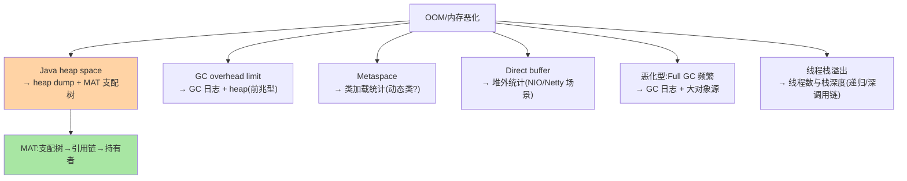
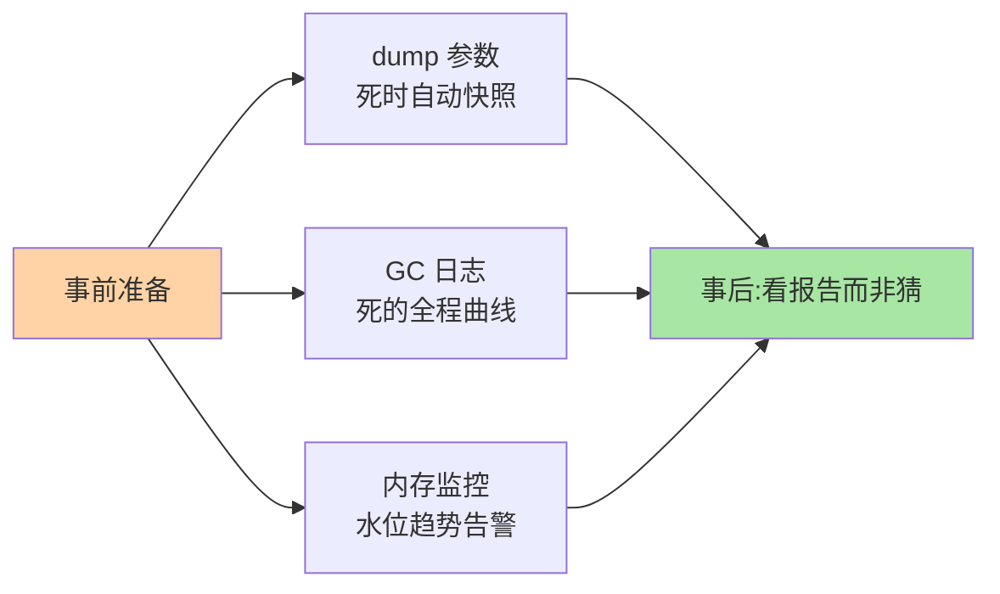

# 内存与 OOM 问题定位：从现象到堆栈的定位法

> 线上 OOM 是排障压力最大的场景（服务已死、时限紧迫）。这篇按「**现象分类 → 堆证据采集 → 按类型归因**」三步给出可执行的定位法——OOM 不是一种病，是六种病，每种各有标准取证与嫌疑人。

> **本文核心**：OOM 的类型学——**Java heap space**（对象泄漏/容量不足）、**GC overhead limit**（GC 挣扎，heap 的前兆）、**Metaspace**（类加载失控：动态类生成）、**Direct buffer**（堆外缓冲泄漏）、**GC 恶化型不 OOM**（Full GC 频繁、延迟尖刺）。**机制链**：监控发现（内存曲线/GC 次数）→ 证据采集（-XX:+HeapDumpOnOutOfMemoryError 的 dump / jcmd / arthas 在线诊断）→ MAT 分析（支配树找大头对象 → 引用链找持有者）→ 按类型对嫌疑人清单。

## 一句话摘要

定位法的三步纪律：**① 现象分类先行**（六种 OOM/恶化形态，类型决定取证路径——Metaspace 问题看类加载而不看堆 dump）；**② 证据在手再推理**（HeapDumpOnOutOfMemoryError 参数是黄金配置——事发自动留 dump，事后分析不慌；线上无 dump 的 OOM 排查难度翻十倍）；**③ 归因到 Spring 的常见嫌疑人**（缓存无界（本地 Map 缓存无淘汰）、ThreadLocal 泄漏（线程池下不 remove，互指拦截器篇）、大查询一次性加载、动态类生成（CGLIB 代理场景/脚本引擎）、连接/流未关闭）。**OOM 排障的本质是「让死掉的服务留下尸检报告」**——dump 参数、GC 日志、监控曲线三件套在事前配好，是 OOM 排障的全部准备。

## 一、为什么 OOM 排障要靠「事前准备」

OOM 时刻服务已死——**事后无法再现**（现场消失）；偶发性 OOM 无法按需触发——**证据必须在死前配置好自动采集**：dump 参数（死时自动快照）、GC 日志（死的全过程曲线）、监控（死的背景）——三件套齐备的 OOM 排障是「看报告」，缺件的排障是「猜」。

## 5W 速记卡

| 维度 | 一句话 |
|---|---|
| What | 六种 OOM 类型学 + 三件套证据 + Spring 嫌疑人清单 |
| Why | OOM 现场不可再现，靠事前配置的自动取证 |
| When | OOM 值班响应、内存水位治理、容量规划 |
| Where | JVM 参数 + dump 分析（MAT）+ arthas 在线 |
| How | 类型分类 → dump/引用链 → 嫌疑人清单核对 |

## 二、六种类型与取证路径

事前三件套的准备全景：

## 三、Spring 侧嫌疑人清单（heap 型高发）

| 嫌疑人 | 机制 | 识别特征（MAT 里长这样） |
|---|---|---|
| 无界本地缓存 | Map 缓存无淘汰/TTL | 单一 Map 占比 40%+、Entry 海量 |
| ThreadLocal 泄漏 | 线程池复用不 remove | 线程 ThreadLocalMap 里业务对象滞留 |
| 大结果集 | 一次性查全表 | 大数组/ArrayList（百万级元素） |
| 代理/动态类失控 | 频繁生成代理类 | Metaspace 型：类加载器异常增殖 |
| 流/连接未关 | IOException 路径漏 close | Finalizer 队列堆积/直接内存涨 |
| 队列堆积 | 生产消费失衡 | BlockingQueue 元素百万级 |

**定位法**：MAT 支配树（Dominators）看「谁占大头」→ Leak Suspects 报告（自动嫌疑分析）→ 引用链（Path to GC Roots）看「谁持有它不放」——**大头 + 持有者 = 嫌疑人**，再对照清单归因到代码位。

## 四、典型场景与事故推演

**事故剧本（隔天定时 OOM）**：服务每天凌晨 OOM 重启。dump 分析：一个 `Map<Long, List<Order>>` 占堆 60%——定时任务每小时拉「当天全部订单」放进 Map 逐条处理，处理完不清（「以为下次覆盖」——但 Map 是按订单 ID put 的累积结构）。修复：任务结束 clear + 改为分页流式处理（每批 500 条，互指 MySQL 系列的分批纪律）。**教训**：「定时任务 + 累积容器」是 OOM 的经典配方——累积结构的生命周期要有显式终点。

## 业内惯例

- **三件套事前配**：`-XX:+HeapDumpOnOutOfMemoryError -XX:HeapDumpPath=...` + GC 日志（Xlog:gc*）+ 内存监控（水位/Full GC 告警）——OOM 黄金准备
- **arthas 在线诊断进工具箱**（不重启的 heap/类加载/线程检查——生产排障的瑞士军刀，dashboard/heapdump/sc 常用）
- **内存水位治理先于 OOM**（老年代水位趋势告警在 OOM 前数天就能发现泄漏曲线——趋势比阈值更早）
- **3.x/4.x 视角**：JVM 侧（GC/ZGC 演进、容器内存感知）持续改进；Spring 侧虚拟线程（Boot 4 推荐 Java 21+）带来新注意点（虚拟线程海量创建下的 ThreadLocal 语义——本地缓存该用 ScopedValue 思路审视）

## 五、常见误区

- **OOM 后只看日志猜**：日志的 OOM 类型只是分类起点——没有 dump 的推理是盲猜；先把三件套配上再谈排障
- **加大内存当修复**：泄漏型 OOM 加内存 = 延长发作间隔（曲线斜率不变）——容量问题才加内存，泄漏问题修引用
- **Full GC 频繁当 JVM 问题调参**：频繁 Full GC 的根因九成是「对象分配行为」（大对象/泄漏/缓存膨胀）——先看对象再调 GC 参数
- **忽视容器内存上限**：容器 OOM Kill（cgroup 层）与 JVM OOM 是两回事——`-XX:MaxRAMPercentage` 让堆自适应容器限额，两者错配是「容器被杀但 JVM 没事」的根源

## 六、你们可能会问

**Q1：dump 文件太大（几个 G）怎么分析？**
MAT 支持 index 索引分块处理；先看 Leak Suspects（自动摘要）再钻支配树；在线工具（arthas dashboard/heapdump 指定区域）可缩小取证面。

**Q2：怎么区分「容量不足」与「泄漏」？**
曲线形态：容量不足 = 高水位平稳（分配速率超过回收能力）；泄漏 = 持续爬升（老年代只升不降）——**趋势线是判别器**（互指稳定性域监控篇的水位思维）。

**Q3：Spring Boot 4 + 虚拟线程时代的内存注意点？**
虚拟线程本身轻量（栈按需），但**海量并发下的 ThreadLocal 复制成本**与**每线程本地缓存膨胀**是新形态——pinning（synchronized 阻塞载体线程）与 ScopedValue 的迁移是 4.x 时代的跟进点（互指 Java 语言系列的虚拟线程篇）。

## 七、自测三问

1. 六种 OOM 类型与各自的取证路径？
2. 「三件套」是哪三件？为什么 OOM 排障靠事前准备？
3. 容量不足与泄漏的曲线判别法？

## 开放问题

- 内存问题的 AI 辅助归因（dump 自动分析给出代码级嫌疑）在工具链演进中——MAT 的 Leak Suspects 是雏形，「dump 到代码行」的自动化值得跟踪。
- 虚拟线程/新 GC（ZGC 代际）持续改变「内存问题的形态学」——类型学要随 JVM 演进更新。

## 📎 核心带走

- **核心一句话**：OOM 排障 = 类型学分类 + 事前三件套取证（dump/GC 日志/监控）+ Spring 嫌疑人清单归因——让死掉的服务留下尸检报告
- **机制链**：监控发现 → 类型分类 → dump 支配树+引用链 → 大头+持有者 → 清单归因到代码位
- **失效点/边界**：加内存不治泄漏；容器 Kill ≠ JVM OOM；趋势线判别容量与泄漏

## 💡 实战提示

- 💡 三件套进基础镜像默认参数——OOM 准备是平台级配置不是应用级选择
- 💡 水位趋势告警（爬升曲线）比 OOM 阈值告警早数天——治未病
- 💡 决策口径：归因路径——heap 型先 MAT（证据驱动）、Metaspace 型先查动态类、恶化型先看分配源；调参永远最后
- 💡 快速止血与根修的取舍：加内存/定时重启是争取时间的止血，泄漏引用的修复才是根修——两件事都要做，先后分明

## 📌 数据与事实声明

- 写于 2026-09-10，JVM 类型学为 HotSpot 口径（Boot 4.1 时代的 JDK 17-25 支持范围）；虚拟线程注意点为 Java 21+ 口径
- 事故推演为累积容器泄漏的典型模式匿名化复述
- 免责：JVM 参数以目标 JDK 版本文档为准

## 📚 参考资料

| 类型 | 标题 | 来源 |
|---|---|---|
| 官方文档 | JDK Troubleshooting Guide（HotSpot） | docs.oracle.com |
| 开源工具 | Eclipse MAT / Arthas | eclipse.org/mat、arthas.aliyun.com |
| 关联系列 | 本仓库 Java 语言系列（JVM/虚拟线程）/ MySQL 系列（分批纪律） | docs/backend/java/ |
