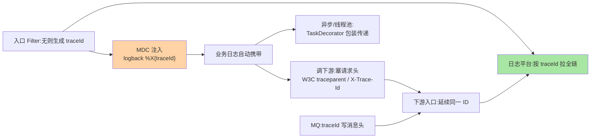
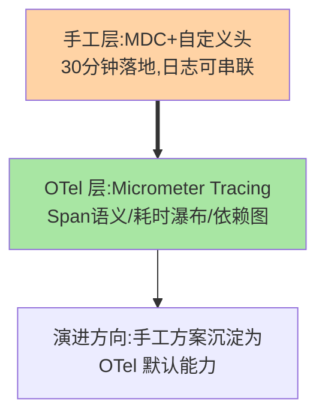

# 线上日志链路与灰度发布：traceId 串联与变更安全

> 排障的两大基础设施：**日志链路**（一次请求跨服务跨线程的日志能串起来——traceId 体系）与**灰度发布**（变更出问题时爆炸半径可控）。这篇讲 Spring Boot 侧的落地：MDC + 透传机制、结构化日志、以及与治理域灰度体系的衔接。

> **本文核心**：日志链路 = **traceId 的生成（入口 Filter/拦截器）→ 存储（MDC，日志框架自动输出）→ 透传（跨服务：HTTP 头/RPC 附件；跨线程：装饰器/上下文传递）**；结构化日志（JSON 格式）让日志从「文本」变「数据」（可检索可聚合）。**机制链**：入口生成 traceId → MDC 注入（logback pattern 自动带）→ 调用下游时塞头 → 下游入口延续 → 全链日志同 traceId → 检索聚合；灰度与治理域体系衔接（发布侧互指优雅上下线，路由侧互指服务路由）。

## 一句话摘要

traceId 体系的两个机制难点：**跨线程传递**（线程池复用下 MDC 是 ThreadLocal——任务提交时要显式包装（TtlRunnable/TaskDecorator），虚拟线程时代语义再演进（互指 Java 系列虚拟线程篇））与**跨服务透传**（HTTP 用标准头（W3C traceparent 或自定义 X-Trace-Id）、MQ 把 traceId 写消息头、异步要显式——透传断点即链路断点）。**结构化日志的工程价值**：JSON 行（字段化 traceId/level/logger/业务字段）让日志平台（ELK/Loki 类）能按字段检索聚合——「查某用户全部请求」「统计某错误分布」从 grep 变查询。**与观测体系的关系**：traceId 是「穷人版全链路追踪」（日志级串联），完整 tracing（Span 语义/耗时分析）用 Micrometer Tracing/OpenTelemetry（互指稳定性域追踪篇）——两者互补，traceId 是兜底基础。

## 一、为什么「日志串不起来」是排障第一痛

跨服务故障排查的典型困境：用户反馈失败——网关日志有记录、订单服务日志有报错、下游超时——**但三段日志无法对齐**（各自时间戳相近的请求成百上千）——排查靠「时间戳 + 参数猜」。traceId 把「猜对齐」变「精确串联」——一次请求全链日志一个 ID，检索一次拉全链——**排障效率的十倍改进来自这一个小机制**。

## 5W 速记卡

| 维度 | 一句话 |
|---|---|
| What | traceId 生成/MDC/透传 + 结构化日志 + 灰度衔接 |
| Why | 跨服务排障的对齐痛与变更爆炸半径控制 |
| When | 可观测建设、排障提效专项、发布体系治理 |
| Where | Filter/拦截器 + logback + 日志平台 |
| How | 入口生成 → MDC → 头透传 → 全链同 ID → 字段化检索 |

## 二、traceId 全链路机制



**三个断点的高发位**：线程池（裸提交 Runnable 丢上下文——装饰器包装是标准修法）、MQ（生产者塞头/消费者取头要显式）、异步响应式/WebFlux（ThreadLocal 模型失效——上下文放 Reactor Context）。**清理配对**（finally remove——线程池复用下的串扰预防，互指 WebMVC 篇 2 的 afterCompletion 纪律）。

## 三、结构化日志与检索体系

```text
logback 配置要点(ecs-logback / logstash-logback-encoder 类):
  JSON 行输出:timestamp/level/logger/thread/traceId + 业务字段(MDC)
  → 采集(Filebeat/Agent) → 平台(ELK/Loki) → 检索(traceId:xxx 精确拉链)
  → 聚合(error 码分布/接口 Top 慢)
日志分级纪律:ERROR(告警级,带栈)/WARN(可自愈异常)/INFO(关键路径)/DEBUG(默认关)
```

**量级演进**：小团队文件日志 + grep 够用；多服务必须集中平台（检索 traceId 的价值兑现位）；高流量加采样策略（全量 ERROR/WARN + 采样 INFO）——日志量是成本项，分级与采样是治理位。

traceId 手工方案与 OTel 体系的分层：



## 四、灰度发布：与治理体系的衔接

Spring Boot 侧的灰度落位：**发布编排**（滚动/金丝雀由部署系统与发布策略执行——互指优雅上下线系列篇 4 的三策略）；**流量分配**（权重路由/泳道染色——互指服务路由系列的标签与泳道机制）；**Spring 侧的配合点**——配置驱动开关（feature flag 走配置中心热更，互指工程实战篇 3）、actuator 健康检查配合摘流（readiness 状态接入发布系统）、优雅停机（server.shutdown=graceful 与排空衔接）——**Spring 提供机制原语，编排归治理体系**。

## 五、典型场景与事故推演

**事故剧本（无 traceId 的两小时）**：支付失败率突增——网关/支付/风控三个团队各自翻日志，靠「时间戳 ±2 秒 + 金额参数」人肉对齐，两小时定位到风控超时。事后建设：traceId 全链（两周）+ 结构化日志进平台（一个月）——同类故障再发时定位 5 分钟（traceId 一搜全链现形）。**教训**：排障时长的差距在「基础设施」不在「人的熟练度」——观测建设的 ROI 用排障时长度量。

## 业内惯例

- **traceId 头用标准协议优先**（W3C Trace Context 的 traceparent——与 OTel 生态兼容），自定义头做兜底
- **ERROR 日志配告警**（错误日志率是告警维度——ERROR 静默等于没有）
- **日志脱敏进规范**（手机号/身份证打码——日志的合规边界，互指仓库隐私纪律）
- **3.x/4.x 视角**：Micrometer Tracing（Boot 3+ 官方观测抽象）替代 Spring Cloud Sleuth；Boot 4 的观测与虚拟线程上下文传递持续适配——traceId 手工方案向 OTel 标准靠拢是演进方向

## 六、常见误区

- **traceId 只在 HTTP 链做了**：线程池/MQ 两断点没做——链路在「最需要排查的异步段」断掉（异步恰是高发故障区）
- **日志当审计库用**：日志的定位是排障与观测（有损可丢弃），审计要求数据库级不丢——两个语义两个存储
- **灰度= 发布系统的事**：Spring 侧的 readiness/graceful shutdown/配置开关是灰度机制的原语——应用侧不配合（健康检查假实现），编排系统空转
- **全量 INFO 在高流量场景**：日志成本与 IO 压力——采样与分级是常态，全量只留 ERROR/WARN

## 七、你们可能会问

**Q1：Micrometer Tracing/OTel 和手工 traceId 选哪个？**
手工 MDC+头方案 30 分钟落地（小团队够用）；OTel 体系给全链 Span 语义（耗时瀑布/依赖图）——有观测平台基建就上 OTel，traceId 是它的自然子集；两者不冲突（OTel 的 traceId 同样进日志）。

**Q2：虚拟线程下 MDC 还能用吗？**
能（ThreadLocal 语义在虚拟线程保留），但百万虚拟线程的上下文复制成本与 ScopedValue 的设计动机——新代码关注 ScopedValue 演进（互指 Java 系列虚拟线程篇），存量 MDC 继续工作。

**Q3：日志平台选型（ELK vs Loki）？**
检索能力与成本的取舍：ELK（全文检索强、资源重）vs Loki（标签索引轻、与 Grafana 一体）——按检索模式（是否需要全文）与已有体系选，互指稳定性域监控篇的观测栈讨论。

## 八、自测三问

1. traceId 的三个断点（线程池/MQ/响应式）与各自修法？
2. 结构化日志让「排障动作」发生什么变化？
3. Spring 侧灰度的三个配合原语？

## 开放问题

- OpenTelemetry 的全面标准化（日志/指标/追踪三信号统一）在收敛各家方案——观测的「手工时代方案」会逐步沉淀为 OTel 的默认能力。
- AI 辅助排障（traceId 拉链后自动摘要故障时间线）是可预期的下一步——日志链路是 AI 排障的数据地基。

## 📎 核心带走

- **核心一句话**：日志链路 = traceId 生成→MDC→透传（三断点要补）+ 结构化日志进平台；灰度靠治理体系编排、Spring 出原语（readiness/graceful/开关）
- **机制链**：入口生成 → MDC 自动输出 → HTTP/MQ/线程池透传 → 全链同 ID → 平台按 ID 拉链 → 分钟级定位
- **失效点/边界**：断点在异步段最痛；日志≠审计存储；日志分级与脱敏是纪律

## 💡 实战提示

- 💡 traceId 三断点（线程池装饰器/MQ 头/响应式 Context）写进代码模板——新建服务不再漏
- 💡 ERROR 日志率告警 + traceId 检索演练进值班培训——基建的价值靠使用兑现
- 💡 决策口径：有观测平台走 OTel/Micrometer Tracing，无平台先手工 traceId 落地（30 分钟）——先有链路再谈体系
- 💡 全量与采样的取舍：日志成本与排障粒度的权衡——ERROR/WARN 全量、INFO 采样、DEBUG 按需，分级即取舍

## 📌 数据与事实声明

- 写于 2026-09-10，机制主线 Spring Boot 4.1.1（Micrometer Tracing 为 3.x+ 官方观测线，Sleuth 已终态）；W3C Trace Context 为公开标准
- 事故推演为观测建设 ROI 的典型模式匿名化复述
- 免责：工具选型按组织基建评审

## 📚 参考资料

| 类型 | 标题 | 来源 |
|---|---|---|
| 官方文档 | Spring Boot Observability / Micrometer Tracing | docs.spring.io、micrometer.io |
| 公开标准 | W3C Trace Context | w3.org |
| 关联系列 | 本仓库治理域 stability 追踪篇 / graceful-shutdown 灰度篇 | docs/architecture/service-governance/ |
