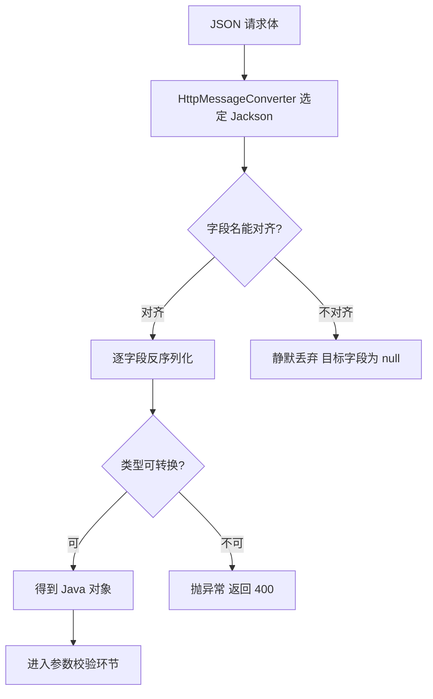
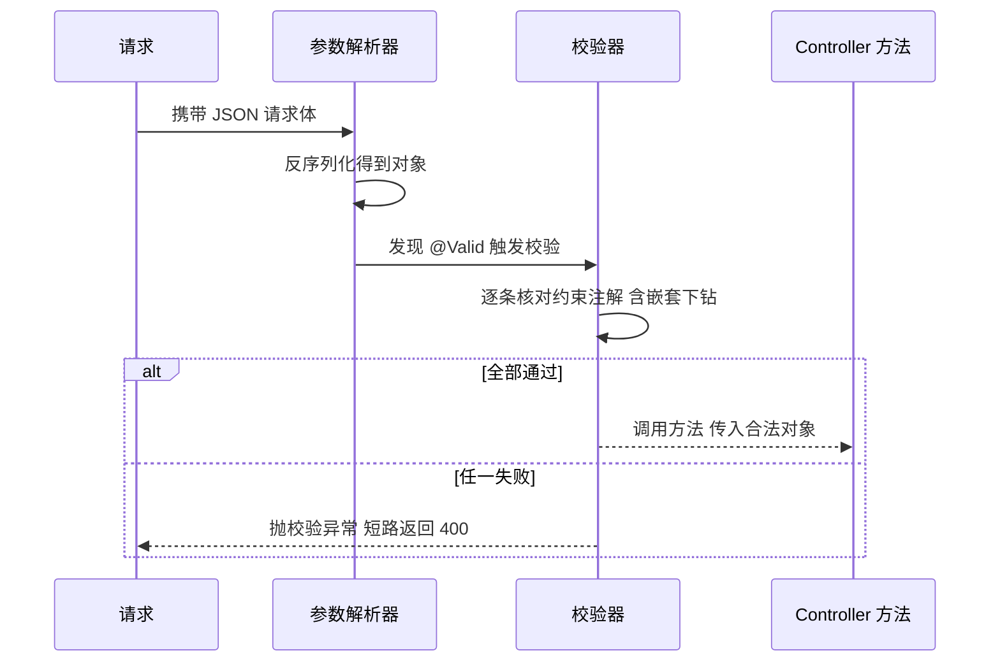

# 参数绑定与校验

> **一句话摘要**：参数绑定的本质是「每个入参找一个解析器认领」：路径变量、查询串、请求体各走各的通道；校验的本质是「对象填充完之后、方法执行之前，由校验器按注解逐条检查」——两道工序都在 Controller 方法执行前的链路上完成。

## 🎯 本文核心

**核心机制一句话**：三类绑定注解对应三种数据来源——`@PathVariable` 读 URI 模板、`@RequestParam` 读查询串/表单、`@RequestBody` 读请求体反序列化；Bean Validation 则在 `@Valid`/`@Validated` 标记的参数上触发，失败统一抛 `MethodArgumentNotValidException`，根本走不进方法体。

**机制链**：`请求到达 → 参数解析器认领入参 → 类型转换与填充 → 校验器逐条核对约束注解 → 全部通过才调用方法 → 失败提前返回 400`。把握这条链就能解释几乎所有校验失效：凡是「没走到链路上」的校验（内部 new 的对象、非 Spring 管理的调用）都不生效。

## 一、背景：请求参数如何进入方法

HTTP 请求是纯文本，Java 方法要的是强类型对象，中间的转换分三类通道：

```java
@GetMapping("/users/{id}")
public Result detail(@PathVariable Long id,
                     @RequestParam(defaultValue = "1") int page,
                     @RequestHeader String token) { ... }

@PostMapping("/users")
public Result create(@RequestBody CreateUserCommand cmd) { ... }
```

- **URI 模板**：`/users/{id}` 里的占位符，`@PathVariable` 按名字取，适合资源定位；
- **查询串/表单**：`?page=2&size=10`，`@RequestParam` 取值，支持 `defaultValue` 与 `required=false`，适合筛选、分页这类可变输入；
- **请求体**：JSON 经 Jackson 反序列化成对象，`@RequestBody` 取值，适合创建/更新这类复杂结构。

类型转换的隐含过程值得看一眼原理：字符串到 `Long`/`int`/`LocalDate` 的转换由 `ConversionService` 的转换器完成，转不动就抛 `MethodArgumentTypeMismatchException` 返回 400。这个设计思想是「转换集中在框架层」——业务方法拿到的永远是转好的类型，不用到处写 parse。

💡 **实战提示**：路径变量表达「资源是谁」，查询参数表达「怎么筛选」，请求体表达「内容是什么」——按这个语义选注解，接口风格自动统一。把复杂对象塞查询串再用一堆 `@RequestParam` 接，是绑定方式误用的第一信号。

## 二、Jackson 序列化细节：三个高频坑

`@RequestBody` 的反序列化与响应序列化都由 Jackson 完成，三个细节最容易出事：

1. **命名策略**：JSON 字段 `user_phone` 与 Java 的 `userPhone` 靠 `@JsonProperty("user_phone")` 显式对齐，或全局配 `PropertyNamingStrategies.SNAKE_CASE`；对不上的字段静默为 null——不报错，这是最大的坑。
2. **日期与 Long 精度**：`LocalDate` 需要显式 `@JsonFormat(pattern = "yyyy-MM-dd")` 或全局格式；Long 超过 JavaScript 安全整数范围（2^53-1，ECMAScript 公开规范口径）时前端精度丢失，业内惯例是全局把 Long 序列化为字符串。
3. **未知字段与空值**：反序列化遇到 JSON 里的未知字段默认直接忽略（早期版本配置不当会抛错，现行公开文档默认忽略）；响应序列化的 null 字段是否输出、空集合怎么表示，建议全局统一决策，而不是每个接口自行其是。



## 三、Bean Validation：声明式校验

校验注解写在字段上，触发开关写在入参上：

```java
public record CreateUserCommand(
        @NotBlank(message = "用户名不能为空") String name,
        @Email String email,
        @Min(18) @Max(70) Integer age,
        @Valid @NotNull Address address) {}   // 嵌套对象必须再标 @Valid

@PostMapping("/users")
public Result create(@RequestBody @Valid CreateUserCommand cmd) { ... }
```

常用注解按用途记：`@NotNull`（非 null）、`@NotBlank`（非空白串）、`@NotEmpty`（集合/串非空）、`@Size`（长度/容量）、`@Pattern`（正则）、`@Min`/`@Max`/`@Email`。**嵌套对象字段上必须再加 `@Valid` 才会下钻校验**，这是漏校验的高发点。分组校验用 `@Validated(Create.class)` 指定组，同一对象在创建/更新场景适用不同约束子集。

校验失败的异常统一是 `MethodArgumentNotValidException`（请求体对象），表单绑定是 `BindException`，方法级参数（如 `@RequestParam` 上的约束，需类上标 `@Validated`）是 `ConstraintViolationException`——三种异常在第 12 篇统一捕获归一，前端拿到一致的错误结构。整条校验时序如下：



**追问链：校验为什么会静默失效**

- **追问 ①**：`@Valid` 是谁在检查？——不是注解自己有魔法，是 `RequestResponseBodyMethodProcessor` 在绑定完成后调用校验器执行检查；校验发生在方法执行前。
- **再追问**：为什么方法内部 new 出来的对象不校验？——校验由代理/处理器在特定链路位置触发，自己 new 的对象根本不在链路上，天然没人管它。
- **打破砂锅**：为什么类上标 `@Validated` 才能校验 `@RequestParam`？——方法级参数校验走的是 MethodValidation 后置处理器（AOP 机制），不是参数解析器；两条校验链路的触发点不同，这是历史演进留下的双轨设计，认知上分开记就不会混。

## 四、@Valid 与 @Validated 的区别

| 维度 | `@Valid` | `@Validated` |
|---|---|---|
| 来源 | JSR 标准（Jakarta Bean Validation） | Spring 扩展 |
| 分组校验 | 不支持 | 支持（`@Validated(组.class)`） |
| 嵌套下钻 | 支持（标在字段上） | 不用于字段下钻 |
| 典型位置 | `@RequestBody`/嵌套字段前 | 类上（触发方法级校验） |

选型推荐一句话：**请求体对象与嵌套字段用 `@Valid`；需要分组或在配置类/服务方法上触发方法级校验用 `@Validated`**。两者常常同时出现在一个接口里，各干各的，不是竞争关系。

💡 **实战提示**：校验注解的 message 一定写业务可读文案并考虑错误码映射——异常处理层会把它包装给前端，默认英文提示直接透出会带来大量无效沟通。

💡 **实战提示**：`@Size` 对 null 值不校验（约束规范语义：null 交给 `@NotNull` 管），「长度必填」要 `@NotNull` + `@Size` 组合，只写一个就是漏。

## 五、实践：一次静默漏校验的排查复盘

曾经接手过一个线上问题：创建接口偶尔收到 age 为空值的脏数据，但字段上明明标了 `@Max(70)`。排查路径值得复盘一遍：先确认校验依赖在（依赖缺失会启动报错，排除）；再查入参前有没有 `@Valid`——发现同事重构时把 `@Valid` 丢了，注解还在字段上，但触发开关没了，校验整体静默跳过。这次踩坑沉淀出两条团队纪律：**校验注解与触发开关必须成对出现，评审时把 `@Valid` 当作必查项**；以及新环境先发一个非法请求验证校验真的在工作，再接流量。

为什么不用「在方法体开头手写 if 校验」的替代方案？对比可见差距：手写校验逻辑与业务混在一起、规则无法复用、错误结构每个接口一套；声明式校验把「规则」和「触发」分离，规则可以跨接口复用，异常可以全局归一。真正需要权衡的是复杂跨字段规则——注解表达不了时不要硬塞，下沉到业务层写显式方法，可读性代价更低。这套「形状与状态分开、规则与触发分离」的设计哲学，值得在每个接口上想一遍为什么这么设计。

## 六、典型使用场景与选型

**什么时候用声明式校验**：入参结构固定、规则可枚举的表单/接口——覆盖日常大多数场景。**什么时候不用**：规则依赖数据库状态（如「用户名是否已被占用」）的检查放业务层，注解校验只做「形状」检查；这个边界的取舍依据是：形状错误 400 快速失败，状态错误走业务错误码。从分层架构看，校验位于 Web 模块的入口边界上，它的模块边界职责是「把明显非法的输入挡在业务层之外」，上下游分工清晰：入口管形状，领域管状态。

**量级分档 Trade-off**：约束来源是「校验成本 = 每请求一次注解遍历 + 反射读取」。10 万级日请求，全字段校验的代价可忽略，这一档的核心问题是「校验覆盖齐全」而不是「校验耗时」；千万级请求下重正则、深嵌套校验会进入火焰图，这一档的核心问题是「规则收敛」而不是「加更多注解」，把超长规则下沉到写入前的专门检查；亿级网关层只做长度/格式等廉价校验，昂贵校验留给业务层——这是成本驱动型思考方式：校验也是主链路开销，按单价分层放置。

**常见误区**：①以为注解写上就生效（缺 `@Valid` 开关、嵌套漏标、方法内部 new 对象，三种情况都静默跳过）；②把业务校验混进注解里越堆越多，最后没人说得清哪些规则在哪；③校验异常不统一处理，接口各自返回不同错误结构。

## 你们可能会问

**Q1：为什么字段是 `Integer` 而不是 `int`？**
`int` 无法区分「没传」和「传了 0」，`@Min` 对 null 也不校验；包装类型 + `@NotNull` 才能精确表达「必填的数字」，这对日期、枚举等可空字段同样适用。

**Q2：校验失败的异常对象里有什么？**
`MethodArgumentNotValidException` 携带全部 `FieldError`（字段名 + 违反的约束 + message），统一异常层把它转成「字段 -> 错误文案」的结构化响应，前端可以逐字段标红。

**Q3：自定义校验注解麻烦吗？**
不难：写一个 `@Constraint(validatedBy = XxxValidator.class)` 注解和一个实现 `ConstraintValidator` 的校验器即可，复杂跨字段规则（如「结束时间晚于开始时间」）用类级自定义注解表达。

**Q4：`@Validated` 标在服务类上也能校验方法参数吗？**
能，这就是方法级校验：类上标 `@Validated` 后，服务方法的 `@NotNull` 参数也会被 AOP 拦截校验——前提是该类是 Spring Bean，原理同第三节追问链。

**Q5：校验这套机制是怎么演进成现在这样的？**
从早年手工 if 校验，到 JSR 303 标准确立，再到 Spring 全链路集成与方法级校验的双轨并存——十几年的演变方向始终是「规则声明化、触发标准化」；理解这个演进脉络，就明白双轨不是缺陷而是兼容两代使用姿势的过渡形态。

## 5W 速记卡

| 维度 | 要点 |
|---|---|
| What | 绑定注解按数据来源取值；Bean Validation 按注解在方法执行前校验 |
| Why | 类型转换与校验收口到框架层，业务方法只处理合法输入 |
| When | 形状类规则用注解；状态类规则留业务层 |
| Where | 校验发生在 Controller 方法执行前的链路上 |
| How | `@RequestBody` 加 `@Valid`，嵌套字段再标 `@Valid`，异常统一捕获 |

## 自测三问

1. 三类绑定注解分别从哪里取值？（答：URI 模板/查询串与表单/请求体反序列化）
2. `@Valid` 与 `@Validated` 怎么分工？（答：标准校验与嵌套下钻用 @Valid；分组与方法级校验用 @Validated）
3. 校验静默失效的三种情况？（答：缺 @Valid 开关、嵌套漏标、对象不在链路上）

## 🎯 核心带走

**一句话**：绑定解决「值从哪来」，校验解决「值合不合法」；两者都发生在方法执行前，失效一定意味着「没走框架链路」。

**失效边界**：嵌套漏 `@Valid`、类内 new 对象、非 Bean 的方法级校验——排查顺序先看开关再看链路，最后才怀疑注解本身写错。

**留一个问题**：三种校验异常最终怎么变成统一错误结构？这正好是下一篇统一异常处理的入口问题。

## 下篇预告

下一篇 [11_过滤器拦截器与CORS-入门](./11_过滤器拦截器与CORS-入门.md)：校验之前请求还经过了谁——Filter、Interceptor 的执行位置契约，以及让前端团队又爱又恨的 CORS。

## 📌 数据与事实声明

- 绑定与校验机制描述基于 Spring Framework 与 Jakarta Bean Validation 官方公开文档；Jackson 默认行为以现行官方文档口径为准。
- Long 精度阈值引述 ECMAScript 公开规范；量级描述为业内认知，非实测。
- 场景均为抽象化的常见形态，不含真实公司信息。

## 📚 参考资料

| 资料 | 链接 |
|---|---|
| Spring 官方文档 · 注解控制器参数 | https://docs.spring.io/spring-framework/reference/web/webmvc/mvc-controller/ann-methods.html |
| Spring 官方文档 · 校验 | https://docs.spring.io/spring-framework/reference/core/validation.html |
| Jakarta Bean Validation 规范 | https://jakarta.ee/specifications/bean-validation/3.0/ |
| Jackson 官方文档 | https://github.com/FasterXML/jackson-docs |
