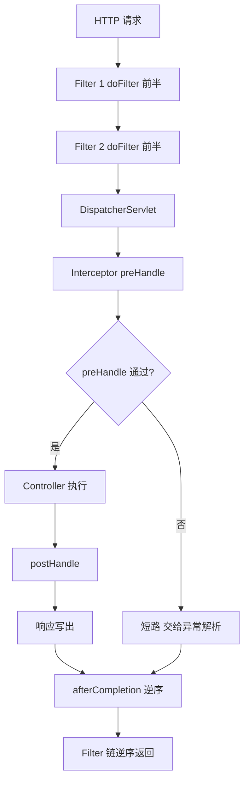
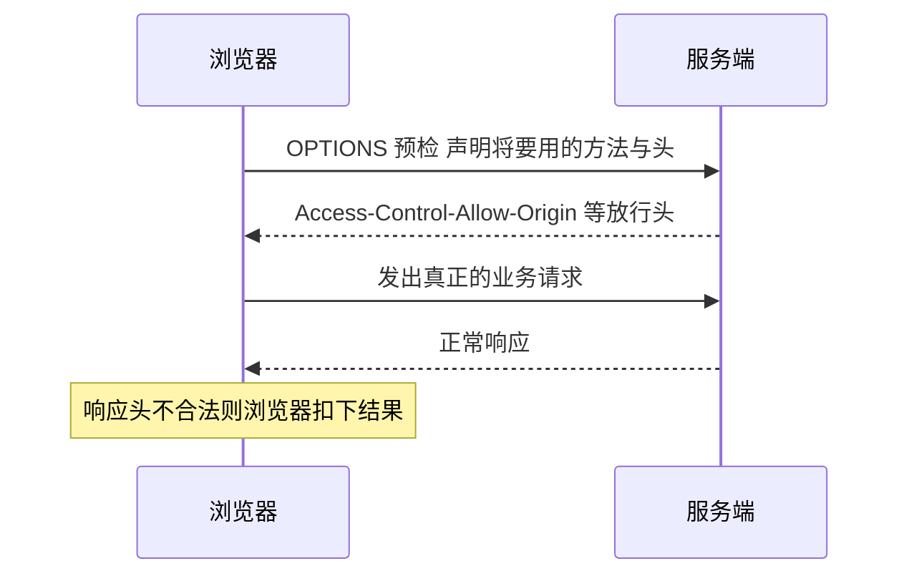

# 过滤器、拦截器与 CORS

> **一句话摘要**：Filter 是 Servlet 容器层的「安检门」，管一切请求；Interceptor 是 Spring MVC 层的「楼层门禁」，只管进 Handler 的请求；CORS 则是浏览器发起的「跨域通行证」机制——三者都在请求到达业务方法之前工作，但位置、能力、适用问题完全不同。

## 🎯 本文核心

**核心机制一句话**：Filter 工作在 DispatcherServlet 之前（Servlet 规范，容器调度）；Interceptor 工作在 DispatcherServlet 内部（Spring MVC 的 HandlerExecutionChain 环节，能感知要执行哪个方法）；CORS 是浏览器同源策略下的 HTTP 协议约定，靠响应头放行，不是任何一层的代码拦截。

**机制链**：`请求 → Filter 链 → DispatcherServlet → Interceptor preHandle → Controller → postHandle → 响应 → afterCompletion（逆序）→ Filter 链逆序返回`。执行顺序契约记这一条就够：**先过 filter 链再进拦截器；返回时按注册的逆序依次退出，像洋葱**。

## 一、背景：请求链路上的两道横切点

编码设置、登录校验、接口耗时日志——这些逻辑要挂在请求链路上，但挂在哪有讲究。容器层（Filter）能看到原始的请求与响应，却不知道「这个请求将被哪个方法处理」；MVC 层（Interceptor）能拿到 HandlerMethod（知道要执行谁），却拿不到经过容器包装前的原始流。**位置决定了能力，能力决定了选型**——这是本篇唯一需要记住的底层原理。

**追问 ①**：为什么有了 Filter 还要造 Interceptor？——Filter 是 Servlet 规范，天生不知道 Spring 的存在；拦截器能读 handler 信息、能接入 Spring 的异常体系与依赖注入，处理 MVC 场景更顺手。这是框架在标准规范之上包一层「更好用 API」的典型设计思想。
**再追问**：两者的执行顺序在框架里怎么保证？——Filter 链由容器按注册顺序构造；拦截器按 `WebMvcConfigurer` 的注册顺序进入，`afterCompletion` 逆序执行，保证资源释放的对称性。
**打破砂锅**：postHandle 能改响应体吗？——基本不能。`@ResponseBody` 的响应在消息转换器写出时已生成，postHandle 拿到的只是 ModelAndView；这也是「响应统一包装放第 12 篇而不是拦截器」的原因。

## 二、核心：Filter 与 Interceptor 全对比

```java
@Component
public class TraceFilter implements Filter {
    @Override
    public void doFilter(ServletRequest req, ServletResponse res, FilterChain chain)
            throws IOException, ServletException {
        long start = System.currentTimeMillis();
        chain.doFilter(req, res);            // 放行，不调则请求到此为止
        log.info("total {}ms", System.currentTimeMillis() - start);
    }
}

@Component
public class AuthInterceptor implements HandlerInterceptor {
    @Override
    public boolean preHandle(HttpServletRequest req, HttpServletResponse res, Object handler) {
        return checkToken(req);              // false 直接短路，方法不执行
    }
    @Override
    public void afterCompletion(HttpServletRequest req, HttpServletResponse res,
                                Object handler, Exception ex) {
        // 无论成功失败都会执行，适合清理 ThreadLocal
    }
}
```

| 维度 | Filter | HandlerInterceptor |
|---|---|---|
| 规范归属 | Servlet 容器规范 | Spring MVC |
| 执行位置 | DispatcherServlet 之前 | 之内、Handler 前后 |
| 能拿到 | 原始 request/response | handler 对象、ModelAndView |
| 异常去向 | 进容器 error 机制，`@ControllerAdvice` 接不住 | 进 `HandlerExceptionResolver`，统一异常可处理 |
| 注册方式 | `FilterRegistrationBean`（可控顺序与路径）或 `@Component` | `WebMvcConfigurer#addInterceptors` |
| 典型用途 | 编码、全局安全头、链路追踪打点 | 登录态、权限、接口级审计 |

完整执行顺序与退出路径一图收束：



注册方式的取舍要展开说：`@Component` 简单但拦截所有请求且顺序难控；`FilterRegistrationBean` 可以设 order、只匹配指定路径，生产推荐。拦截器还能配 `excludePathPatterns` 白名单，把登录页、健康检查摘出去——白名单设计的原则是「默认放行的路径要有明确清单」，防止新接口默认裸奔。

💡 **实战提示**：过滤器里修改请求体要小心——`request.getInputStream()` 只能读一次，包装 `ContentCachingRequestWrapper` 时记得放行的是包装对象，否则下游 `@RequestBody` 读到空流，排查半天发现是「流被读没了」。

## 三、机制：CORS 跨域

**同源策略**是浏览器的安全机制：协议、域名、端口任一不同即「跨域」，浏览器会拦截跨源响应。注意责任边界——是**浏览器**在拦，服务端之间的调用（curl、服务间 HTTP）没有这个问题。这是理解 CORS 的第一原理：它是一份「服务器声明允许谁跨源访问」的协议，浏览器负责执行。

跨域请求分两类：

1. **简单请求**：GET/POST/HEAD 且头部受限，浏览器直接发出，但响应若没有合法的 `Access-Control-Allow-Origin` 头，浏览器把响应扣下不给页面 JS。
2. **预检请求**：带自定义头（如 `Authorization`）、Content-Type 为 JSON 等情况，浏览器先发一个 `OPTIONS` 询问，服务端答「允许」才发正式请求。排查「接口在浏览器失败但 Postman 正常」时，先看网络面板里是不是有个 OPTIONS 被拒了。



配置层面 Boot 提供两种入口：局部 `@CrossOrigin`（单个 Controller/方法）与全局 `WebMvcConfigurer#addCorsMappings`。**携带凭证（cookie）时有个硬约束**：`allowCredentials(true)` 下 `allowedOrigins` 不能是 `*`，必须写明确来源清单（公开文档明确口径）——这条规则踩中就是浏览器直接报错，且报错信息指向性弱。

💡 **实战提示**：CORS 报错十有八九出在预检——全局配置改完，先用浏览器网络面板确认 OPTIONS 的响应头，再怀疑业务代码；配置了两个入口（局部注解 + 全局映射）时容易互相覆盖，留一处统一管理。

## 四、Filter 与 Interceptor 的区别（选型决策）

区别的判断标准只有一个：**这件事需不需要发生在 Spring 语境之外**。

- 需要「不管什么请求都执行」（编码、全局安全响应头、链路 trace 打点）→ Filter；
- 需要「知道目标方法是谁、要用 Spring 的异常与注入」（登录态、权限、接口审计）→ Interceptor；
- 需要保护「浏览器用户的数据安全」（跨源放行）→ CORS 配置，与前两者不是同类问题。

为什么不用「所有逻辑都塞进 Filter」的反方案？对比一下代价：登录校验放 Filter 后拿不到 HandlerMethod（无法按接口粒度控制权限）、异常脱离 Spring 处理体系、依赖注入也别扭；而把编码设置放拦截器又会导致静态资源请求绕过设置。分层放对的架构价值在十年演进里反复被验证——从单体到微服务，这套上下游位置契约始终成立，变的只是每层里面跑的具体逻辑。

曾经的线上案例：登录校验写在 Filter 里，抛了个自定义业务异常想统一返回错误结构，结果前端收到的是容器默认错误页——复盘后才知道 Filter 阶段的异常根本不经过 `@ControllerAdvice`。这个踩坑的代价换来的教训是：**需要统一异常结构的校验逻辑放拦截器**，Filter 只做「失败即中断」的粗粒度检查。为什么这么设计？因为异常解析器挂在 DispatcherServlet 内部，容器层的故障它物理上够不着——这不是配置遗漏，而是两层错误处理机制天然分离的设计思想，读 Servlet 规范里 error page 的定义就能把这条原理追到底。

## 五、典型使用场景与选型

**什么时候用 Filter**：字符编码、CSP/XSS 防护头、请求与响应的整体日志、与 Spring 无关的容器级处理。
**什么时候用 Interceptor**：登录态与权限、接口级耗时、绑定用户上下文到 ThreadLocal（记得在 afterCompletion 清理，防止线程复用导致串数据——这是高发事故）。
**什么时候不用拦截器**：要处理静态资源与 `/error` 之外的容器级路径时拦截器够不着，降级到 Filter；要读/改请求体内容的逻辑优先考虑在 Filter 层包装，但务必评估流可重复读的代价。

**量级分档 Trade-off**：约束来源是「这两层横切代码在每条请求的主链路上，最接近入口、放大效应最强」。10 万级日请求，链路里做几次 map 查找与日志毫无压力，这一档的核心问题是「放对层」而不是「极致开销」；千万级请求下入口层多做一次远程校验（如每请求查 Redis 鉴权）都会顶住入口带宽，这一档的核心问题是「入口零远程调用」，本地缓存或网关侧完成；亿级流量把鉴权与限流前移到网关，应用内 Filter 只留 trace 打点——这是入口驱动型思考方式：越靠前的逻辑越要做减法。从跨系统架构视角看，这三层横切点也是内外模块边界的一部分：容器层挡非 HTTP 层面的脏流量，MVC 层挡未授权访问，业务层挡非法状态，各挡各的，上下游职责不重不漏。

**常见误区**：①把业务校验写进 Filter 却指望统一异常处理兜底（接不住）；②拦截器 preHandle 抛异常后以为 afterCompletion 不执行（会执行，资源清理逻辑要放在那里而不是 postHandle）；③CORS 配置 `*` 又开凭证，浏览器直接拒绝。

## 你们可能会问

**Q1：`@WebFilter` 注解和 `FilterRegistrationBean` 用哪个？**
`@WebFilter` 需要额外开启 Servlet 注解扫描且顺序控制弱；Boot 下推荐 `FilterRegistrationBean`——order、URL 匹配、开关都是显式配置，符合「配置可查」的原则。

**Q2：多个 Filter 和多个 Interceptor 的顺序怎么定？**
Filter 按 registration 的 order 升序；Interceptor 按注册顺序进、逆序出。跨层顺序固定是「所有 Filter → 拦截器 → Controller」，这个契约不因注册顺序改变。要是追问一句「为什么不让我自由指定跨层顺序」——因为两层由不同体系调度（容器与框架），保证固定的先后契约才能让各层代码对自己的前后置条件有确定预期，这是顺序契约而不是能力限制；换一种做法（比如把拦截器逻辑全部改写成 Filter）理论上可行，但代价是放弃 Spring 语境，得不偿失。

**Q3：为什么 OPTIONS 请求会打到我的拦截器？**
预检请求默认也会走完整链路，可能被登录拦截器拒掉导致 CORS 失败。惯例是把 OPTIONS 放行或依赖 Spring 的 CORS 处理在拦截器之前完成，排查时先确认预检响应头。这条行为多年间也有过演变——各版本对预检请求的处理时机细节不同，升级版本后跨域行为突变时，先查官方迁移说明再动手改配置。

**Q4：拦截器能拿到 Controller 方法的参数值吗？**
preHandle 只有 HandlerMethod（方法签名），拿不到实际参数值。要审计参数内容，用 AOP 在方法层拿，或过滤器里用可重复读的包装流，各取所长。

## 5W 速记卡

| 维度 | 要点 |
|---|---|
| What | Filter 管容器层一切请求；Interceptor 管 MVC 层 Handler；CORS 管浏览器跨源放行 |
| Why | 横切逻辑要挂载，但不同逻辑属于不同层 |
| When | 全局粗粒度用 Filter；需要 Spring 语境用 Interceptor；跨域配 CORS |
| Where | 先 Filter 链，后拦截器，响应时逆序退出 |
| How | FilterRegistrationBean + WebMvcConfigurer；凭证跨域禁 `*` |

## 自测三问

1. Filter 和 Interceptor 的执行位置差在哪一站？（答：Filter 在 DispatcherServlet 之前，Interceptor 在其内部的执行链上）
2. Filter 里抛的异常会被 `@ControllerAdvice` 处理吗？（答：不会，走容器 error 机制）
3. 带凭证的 CORS 配置有什么硬约束？（答：来源必须写明确清单，不能用通配符）

## 🎯 核心带走

**一句话**：位置决定能力——Filter 是容器安检门，Interceptor 是 MVC 门禁，CORS 是浏览器通行证；选型只看「这件事属于哪一层」。

**失效边界**：Filter 异常进不了统一异常处理；postHandle 改不了 JSON 响应；预检请求会被拦截器误伤；凭证 + 通配符必被浏览器拒绝。

**开放问题**：微服务化之后，鉴权应该继续留在应用拦截器，还是前移到网关统一做？两种路线都有团队在用，取舍取决于信任边界划在哪——值得结合自己的部署形态想清楚再定。

## 下篇预告

横切逻辑各就各位之后，下一篇 [12_统一异常处理与响应封装-入门](./12_统一异常处理与响应封装-入门.md) 收拢响应出口：异常怎么兜底、错误码怎么设计、响应体怎么统一。

## 📌 数据与事实声明

- Filter/Interceptor/CORS 机制描述基于 Servlet 规范、Spring 与 MDN 公开文档；allowCredentials 约束为公开文档明确口径。
- 量级与性能表述为业内认知，非实测数据；案例已匿名化，不含真实公司与系统信息。

## 📚 参考资料

| 资料 | 链接 |
|---|---|
| Spring 官方文档 · 过滤器 | https://docs.spring.io/spring-framework/reference/web/webmvc/filters.html |
| Spring 官方文档 · 拦截器 | https://docs.spring.io/spring-framework/reference/web/webmvc/mvc-interceptors.html |
| Spring 官方文档 · CORS | https://docs.spring.io/spring-framework/reference/web/webmvc-cors.html |
| MDN · CORS | https://developer.mozilla.org/zh-CN/docs/Web/HTTP/CORS |
