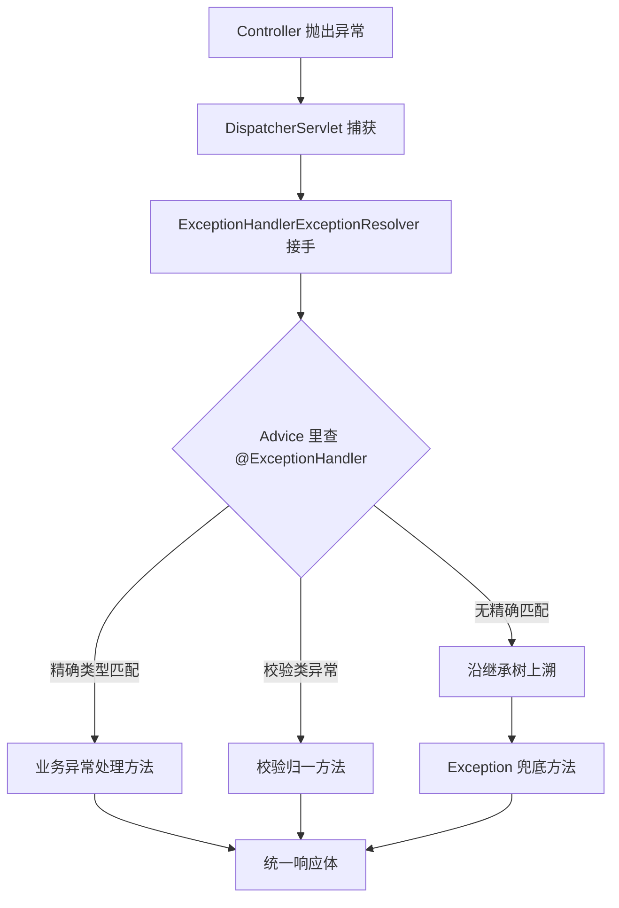
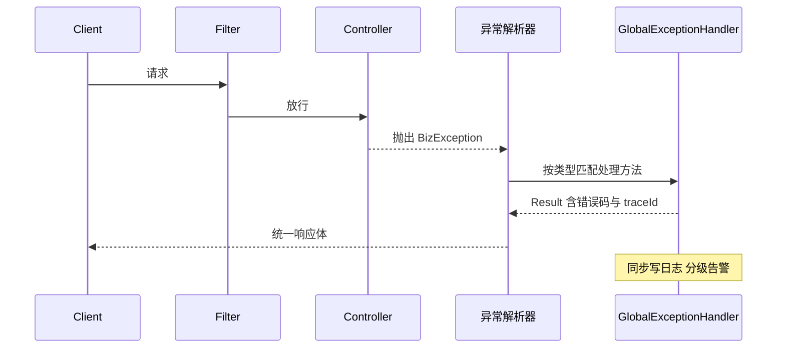

# 统一异常处理与响应封装

> **一句话摘要**：`@RestControllerAdvice` 是全站异常的「总收口」——Controller 抛出的任何异常先经过异常解析器链，按「最具体的 `@ExceptionHandler` 优先」匹配处理方法，最后统一变成结构化响应体；没有精确匹配时由兜底方法接住，保证任何异常都不会以原始堆栈形态漏给前端。

## 🎯 本文核心

**核心机制一句话**：异常处理的本质是「给异常解析器链注册一个后置出口」——DispatcherServlet 调用 Handler 抛异常后，`ExceptionHandlerExceptionResolver` 在标了 `@RestControllerAdvice` 的 Bean 里查找能处理该异常的方法，按类型匹配度（继承树上最近的优先）选中一个执行，返回值直接作为响应。

**机制链**：`方法抛异常 → DispatcherServlet 捕获 → 依次询问 HandlerExceptionResolver 链 → ExceptionHandlerExceptionResolver 查 @ExceptionHandler → 精确匹配优先、逐级上溯到 Throwable 兜底 → 生成统一响应`。这条链解释了两个关键事实：为什么 Filter 里的异常收不住（解析器在 MVC 内部），以及为什么必须写一个 `Exception` 兜底方法（匹配上溯的终点）。

## 一、背景：异常散落 vs 统一出口

没有统一处理的接口长这样：每个方法 try-catch 一遍，catch 里各自拼错误 JSON；漏写的异常变成 500 白页加一堆堆栈。三个直接代价——响应结构不一致（前端每个接口写一套解析逻辑）、错误处理逻辑与业务混在一起、堆栈信息泄露风险。统一出口的设计思想是「错误也是一种正常响应」：异常在框架层被翻译成约定的结构，业务代码只管「该抛就抛」，翻译工作全站只做一遍。

**追问 ①**：异常都吞掉了，会不会掩盖问题？——统一出口不等于统一吞掉：翻译给前端的是错误码与安全文案，日志层仍要完整记录堆栈并分级告警，两条通道分开。「对外收敛、对内详尽」是这套机制的第一原则。
**再追问**：`@ControllerAdvice` 的作用范围是全站吗？——默认所有 Controller，但可以用 `basePackages`/`assignableTypes` 限定到某组接口，实现不同业务模块各自的处理策略；多个 advice 的顺序由 `@Order` 决定，前面的先尝试。
**打破砂锅**：异常方法里又抛异常怎么办？——解析阶段抛出的异常会终止正常解析、进入容器兜底流程（error 页/`ErrorController`），所以异常处理方法本身要极简，不再依赖外部资源。

## 二、核心：匹配规则与处理方法

```java
@RestControllerAdvice
public class GlobalExceptionHandler {

    // 业务异常：带错误码，正常分支
    @ExceptionHandler(BizException.class)
    public Result<Void> handleBiz(BizException e) {
        log.warn("biz error: {}", e.getMessage());
        return Result.fail(e.getCode(), e.getMessage());
    }

    // 校验异常归一：三类校验异常统一成字段级错误
    @ExceptionHandler({MethodArgumentNotValidException.class, BindException.class})
    public Result<Void> handleValid(BindException e) {
        String msg = e.getBindingResult().getFieldErrors().stream()
                .map(f -> f.getField() + " " + f.getDefaultMessage())
                .collect(Collectors.joining("; "));
        return Result.fail(ErrorCode.PARAM_INVALID, msg);
    }

    // 兜底：任何没被上面接住的异常
    @ExceptionHandler(Exception.class)
    public Result<Void> handleUnknown(Exception e) {
        log.error("unexpected", e);          // 对内：完整堆栈
        return Result.fail(ErrorCode.SYSTEM_ERROR, "系统繁忙，请稍后再试");  // 对外：安全文案
    }
}
```

匹配优先级的原理值得单独强调：抛出 `BizException` 时，`@ExceptionHandler(BizException.class)` 和 `@ExceptionHandler(Exception.class)` 都「能」处理，解析器选**继承树上距离最近**的那个——精确优先，这是确定性规则，不是注册顺序的巧合。`@ControllerAdvice` 与 `@RestControllerAdvice` 的区别只在返回值处理：前者方法返回值走视图解析，后者每个方法默认带 `@ResponseBody` 直出 JSON——接口型服务无脑选后者。



## 三、机制：异常兜底顺序的设计

推荐的四层兜底顺序，从具体到一般：

| 层级 | 覆盖异常 | 处理方式 | 日志级别 |
|---|---|---|---|
| 1 业务异常 | `BizException` | 错误码 + 业务文案 | warn |
| 2 已知系统异常 | 超时、限流、依赖不可用 | 归一到系统码，可重试提示 | error |
| 3 校验/参数异常 | 校验失败、JSON 解析失败 | 字段级错误清单 | info |
| 4 未知异常 | `Exception` | 安全文案 + 告警 | error + 告警 |

这个顺序的设计哲学是「**可预期的异常走错误码，不可预期的异常走告警**」：业务异常是流程的一部分（如余额不足），不该触发告警；未知异常是系统在喊救命，必须吵到值班的人。日志级别跟着这个判断走，告警规则挂在 error 上，误报自然就少。从请求到响应的完整协作时序如下：



曾经复盘过一次线上告警风暴：某个下游短暂超时，几分钟内告警被同一条错误刷爆，真正的问题反而被淹没。排查结论是异常兜底没分层——可重试的瞬态错误和真正的故障走了同一条告警通道。那次踩坑之后的改进就是上表的四层结构，同类风暴再没出现过。

💡 **实战提示**：兜底方法对外文案固定为「系统繁忙」一类的中性提示，把技术细节（SQL 报错、依赖名）只留在日志里——异常文案是最常见的信息泄露点，这也是安全基线的公开建议。

## 四、业务异常与系统异常的区别

两者的区别决定处理方式，混用是响应设计的万恶之源：

- **业务异常**：流程内的预期分支。特征是有明确错误码、文案可直接给用户看、不需要告警。用受检语义表达（`throw new BizException(ORDER_NOT_FOUND)`）。
- **系统异常**：流程外的意外故障。特征是用户看不懂也不该看懂细节、需要告警与修复动作。让它在兜底层被翻译，不在业务代码里到处 catch。

衡量标准一句话：**如果这个异常发生了，值班的人需要做什么？什么都不用做的是业务异常，需要动手的是系统异常。** 用这个标准给团队定分界，错误码体系才守得住模块边界。

## 五、统一响应体设计

```java
public record Result<T>(int code, String message, T data, String traceId) {
    public static <T> Result<T> ok(T data) { ... }
    public static <T> Result<T> fail(int code, String message) { ... }
}
```

错误码分层设计：用整数段位区分来源——比如公开口径上常见的「1 开头系统级、4 开头请求方问题、5 开头服务方问题」的粗分法（借鉴 HTTP 状态码语义）；业务码在段内细分。两条纪律：错误码一旦对外发布永不复用（前端可能写死判断）；`traceId` 必进响应体，用户反馈问题时能直接检索日志，排障效率天差地别。

兼容性取舍：新接口全量包响应体没问题，但**老接口回归包装属于破坏性变更**——前端解析逻辑会挂。工程惯例是不动存量、新接口统一，或者网关层按路由版本做包装切换，代价是多一层配置复杂度。为什么不用「每个接口自行决定要不要包装」的反方案？对比一下：自由决定在接口少时灵活，接口过百之后响应结构必然分裂，前端要维护多套解析分支——约定优于配置的架构演进规律在这里同样成立，统一响应体的收益随接口数量上升，而自由度通常只在项目最初几个月被用到。

💡 **实战提示**：`traceId` 要从入口贯穿——Filter 里生成放进 MDC，日志 pattern 输出，响应头带回；三处串起来，「用户截图一个 traceId 就能定位整条链路」才算落地。

## 六、典型使用场景与选型

**什么时候用全局 advice**：所有 REST 接口——没有例外场景，这是现代接口服务的默认配置。**什么时候不用（覆盖不到的地方要有预案）**：Filter 阶段异常、404 这类进不到 Handler 的请求、异步任务与消息消费里的异常——它们不经过 MVC 解析器链，各自需要专门通道（`ErrorController` 定制、任务层 try-catch、消费端重试策略），误以为 advice 全知全能是最常见的认知误区。

**量级分档 Trade-off**：约束来源是「异常处理成本集中在日志与告警通道，不在处理方法本身」。10 万级日请求，error 日志全量落盘没有压力，这一档的核心问题是「分层正确」而不是「日志采样」；错误量到千万级，异常风暴会打爆日志磁盘与告警通道，这一档的核心问题是「限流聚合」，同错误码告警做窗口聚合与采样；亿级平台则要把异常治理做成体系——错误码字典化、告警分级路由、值班升级机制——这是运营驱动型思考方式：异常处理的下半场在流程而不是代码。这套治理体系也是跨系统架构能力的试金石：错误码要在上下游服务间约定透传规则，上游收到下游错误码是原样透出还是翻译重组，模块边界划在哪里，都要在架构层面先说清楚。

## 你们可能会问

**Q1：异常处理方法能拿到请求上下文吗？**
能，方法参数里可以直接声明 `HttpServletRequest`、`HandlerMethod` 等，框架会注入；日志里带上 URI，定位效率翻倍。

**Q2：`@ExceptionHandler` 写在 Controller 类内部和写在 advice 里有什么区别？**
类内部的只处理本类异常且优先级更高，适合个别接口的特殊处理；advice 是全局兜底。两者共存时先找类内再找全局。

**Q3：怎么返回自定义 HTTP 状态码？**
处理方法返回 `ResponseEntity<Result<Void>>` 或方法上标 `@ResponseStatus`——业务响应码和 HTTP 状态码是两层语义，都该认真设置，别全站永远 200。

**Q4：校验异常为什么有时候报 `BindException` 有时候报 `MethodArgumentNotValidException`？**
历史演变产物：后者继承自前者，`@RequestBody` 触发的是后者、表单绑定触发前者；现代版本里按父类统一 catch 即可，公开文档也是这么建议的。

**Q5：能不能在业务代码里继续 try-catch，把异常都就地消化掉？**
如果追问「那 advice 还剩什么用」就明白了——就地 catch 后每个接口还是要自己决定响应结构，统一出口形同虚设。为什么不这么设计？对比可见：就地 catch 的另一种做法是「异常继续抛、翻译集中做」，业务代码保持干净，错误结构全站一致——这套分工的思想实验做一遍就清楚：抛出点不管表达，翻译点不管业务，各干各的，这是职责单一设计思想在异常处理上的投影，也是官方推荐的处理姿势为什么这么设计的原因。

## 5W 速记卡

| 维度 | 要点 |
|---|---|
| What | `@RestControllerAdvice` + `@ExceptionHandler` 全站收口，统一响应体输出 |
| Why | 响应结构一致、错误与业务解耦、堆栈不泄露 |
| When | 异常按「精确优先、逐级上溯」匹配；兜底方法必须有 |
| Where | MVC 解析器链内；Filter/异步任务覆盖不到，需另设通道 |
| How | 业务/系统/校验/未知四层兜底；traceId 全链路贯穿 |

## 自测三问

1. 两个 `@ExceptionHandler` 都能处理同一异常时选谁？（答：继承树上最近的精确匹配）
2. 业务异常和系统异常的分界标准？（答：值班的人要不要动手）
3. 哪些异常 `@ControllerAdvice` 接不住？（答：Filter 阶段、进不到 Handler 的 404、独立线程池任务）

## 🎯 核心带走

**一句话**：统一异常处理 = 精确匹配的翻译器 + 永远存在的兜底 + 对外收敛对内详尽的双通道日志。

**失效边界**：advice 覆盖不到 MVC 之外（Filter、404、异步任务）；异常方法自身抛异常会逃逸到容器兜底；老接口回归包装是破坏性变更。

**留一个问题**：异常兜底拿到的是「错误」这一种结果，但一个接口的成功响应也该长一个样——响应封装的约定应该由谁维护、放在哪一层，才能既统一又不失灵活？值得在自己的代码库里找答案。

## 下篇预告

Web 链路三部曲到此收束。下一篇 [13_数据源与JDBC基础-入门](./13_数据源与JDBC基础-入门.md) 进入数据访问层：连接怎么建、连接池为什么是标配、JDBC 在框架里的位置。

## 📌 数据与事实声明

- 异常处理机制描述基于 Spring Framework 官方公开文档；错误码段位划分借鉴 HTTP 状态码公开语义，属业内通行惯例而非强制标准。
- 告警与日志量级表述为业内认知，非实测数据；案例已匿名化，不含真实公司与系统信息。

## 📚 参考资料

| 资料 | 链接 |
|---|---|
| Spring 官方文档 · 异常处理 | https://docs.spring.io/spring-framework/reference/web/webmvc/mvc-ann-rest-exceptions.html |
| Spring 官方文档 · @ControllerAdvice | https://docs.spring.io/spring-framework/reference/web/webmvc/mvc-controller/ann-advice.html |
| Spring Boot 官方文档 · 错误处理 | https://docs.spring.io/spring-boot/reference/web/servlet.html |
