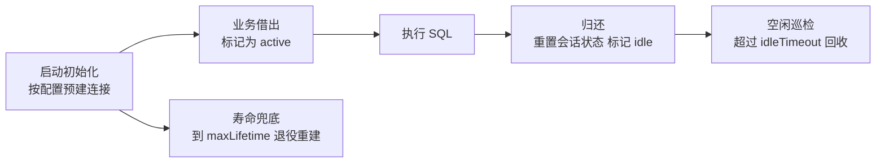
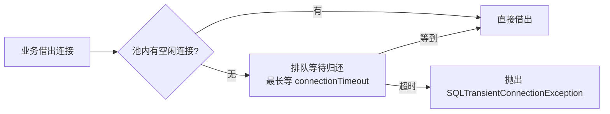

# 数据源与 JDBC 基础

> 连接池为什么是标配、HikariCP 核心参数怎么想、JdbcTemplate 怎么用——Java 访问数据库的地基篇。

## 🎯 本文核心

**数据源 = 拿连接的工厂 + 连接池的托管封装**。Boot 把「选池、建池、注入」收编成一次引依赖：引入 `spring-boot-starter-jdbc` 后，自动配置检测到类路径上的 HikariCP，就装配出一个 `HikariDataSource` Bean，再按 `spring.datasource.*` 与 `spring.datasource.hikari.*` 填参数——业务代码直接注入即可，全程没有一行建连代码。

机制链：**引 starter → 条件装配 HikariDataSource → 读配置初始化连接池 → 容器注入 → 业务借还连接**。这条链想通了，后面「池参数怎么配」「为什么借不到连接」都有解题抓手。

## 一句话摘要

JDBC 原生开发最贵的动作是「每次操作都完整建一次连接」——TCP 握手、认证、会话初始化，业内认知的量级是毫秒到几十毫秒一次。连接池把这个成本摊薄成「启动时建好、用时借用、用完归还」。Boot 默认绑定 HikariCP，日常只需记住三个参数直觉：**池大小给小不给大、connectionTimeout 是「借不到等多久」、maxLifetime 是「一条连接最多活多久」**，其余交给默认值。

## 一、背景：JDBC 原生开发痛在哪

用原生 JDBC 写过一遍完整流程，就明白池要解决什么：

```java
Class.forName("com.mysql.cj.jdbc.Driver");              // 1. 注册驱动（老式写法）
try (Connection conn = DriverManager.getConnection(url, user, pwd)) {  // 2. 完整建连
    PreparedStatement ps = conn.prepareStatement("SELECT id, name FROM account LIMIT ?");
    ResultSet rs = ps.executeQuery();                   // 3. 执行
    while (rs.next()) { /* 手动取列映射 */ }             // 4. 逐列取值
}                                                       // 5. try-with-resources 关闭
```

四个痛点：**建连昂贵**——`getConnection` 背后是完整的握手与认证，高并发下这笔固定成本被每个请求重复支付；**无上限保护**——来多少请求开多少连接，数据库端连接数会被冲爆；**连接泄漏难查**——异常路径没走到 close，连接就悄悄流失；**映射啰嗦**——列名到字段的转换全靠手写。

连接池的回答：启动时预建一批连接放在池里，业务「借出—使用—归还」，池负责上限控制、健康检查与失效重建。这也是把昂贵资源的创建与使用解耦的通用设计思想——线程池、HTTP 连接池、对象池，底层是同一套原理，这类池化组件在整体架构里都处在「业务与昂贵资源之间」的中间层。



从 DriverManager 直连到 DataSource 池化，是 Java 访问数据库方式的第一次演进；Boot 再把「建池配池」这一步自动配置化，是第二次演进——两次演进的方向都是「让业务代码离机械操作更远」。

## 二、核心：Boot 怎么自动配置数据源

引入 `spring-boot-starter-jdbc`（或任何依赖数据源的 starter）后，配置只需四行：

```yaml
spring:
  datasource:
    url: jdbc:mysql://127.0.0.1:3306/demo?useSSL=false
    username: demo
    password: demo
    driver-class-name: com.mysql.cj.jdbc.Driver   # 可省略: Boot 能从 url 前缀推断
```

驱动类名可以不写；想换连接池实现，只需替换依赖或用 `spring.datasource.type` 指定实现类——**数据源是接口抽象，连接池是实现**，这延续了「面向接口 + 条件装配」的一贯思路：默认给一个够用的，特殊需求可替换。

HikariCP 参数挂在 `spring.datasource.hikari.*` 下，日常真正要关心的只有这几个（默认值来自官方文档）：

| 参数 | 官方默认 | 直觉解释 |
|---|---|---|
| maximumPoolSize | 10 | 池上限，默认给得非常保守 |
| minimumIdle | = maximumPoolSize | 最小空闲数；官方建议与上限相等组成固定池 |
| connectionTimeout | 30000ms | 借不到连接最多等多久，超时报错 |
| maxLifetime | 1800000ms | 一条连接的寿命上限，到期退役重建 |
| idleTimeout | 600000ms | 空闲连接多久回收（固定池下不生效） |
| leakDetectionThreshold | 0（关闭） | 借出超过阈值未归还，日志打印持有堆栈 |

**池大小的直觉：给小不给大。** 为什么不用更大的池？数据库连接是数据库端的昂贵资源——每条连接对应服务端线程与内存，连接一多，上下文切换与锁竞争反而拉低吞吐。业内认知：HikariCP 官方 wiki 给过参考公式「池大小 ≈ 核心数 × 2 + 有效磁盘数」，4 核机器也就是 10 上下的量级——默认值 10 不是拍脑袋。高并发靠「缩短单请求占用连接的时间」解决，不靠堆连接数。顺带一句 HikariCP 的设计哲学：它的快，公开口径的解释是更少的同步开销与更薄的代码路径——「少做无谓的事」本身就是一种设计。

💡 实战提示：maxLifetime 必须小于数据库侧（或中间的代理、防火墙）的空闲断开时间（MySQL 侧对应 wait_timeout，公开口径常为数小时量级），并在中间留出余量。设大了会出现「池里留着、服务端已断」的死连接——借出来一用就报通信异常。

💡 实战提示：生产务必打开 leakDetectionThreshold（例如 60000ms）。连接泄漏是「池慢慢被打满」最常见的根因，持有堆栈一打，泄漏点当场现形，比事后翻代码快得多。

## 三、机制：借不到连接时发生了什么

`connectionTimeout` 超时报错是连接池问题的第一现场，这背后的机制值得拆一遍——借出等待与超时判定的原理，是所有连接池故障排查的入口：



多连接池对比一句带过：HikariCP 胜在轻量与稳定，是 Boot 默认；Druid 胜在内置监控与 SQL 防火墙能力，很多团队按运维习惯选它（业内认知）。两者参数体系大同小异，把池当可替换组件看，选型成本很低——数据源在数据访问架构里是入口层，换实现不动业务代码。

## 四、实践：JdbcTemplate 与典型使用场景

**典型使用场景**：内部工具、数据订正脚本、SQL 少结构简单的服务用 JdbcTemplate 直访；复杂业务系统用 ORM（下一篇），JdbcTemplate 退居脚本与运维场景；连接池则在所有业务服务里无差别标配。

JdbcTemplate 把「取连接—建语句—执行—映射—释放」模板化，只留 SQL 与映射给你：

```java
// 单值查询
int count = jdbcTemplate.queryForObject(
        "SELECT COUNT(*) FROM account WHERE status = ?", Integer.class, "ACTIVE");

// 列表查询 + 行映射
List<Account> list = jdbcTemplate.query(
        "SELECT id, name FROM account LIMIT ?",
        (rs, rowNum) -> new Account(rs.getLong("id"), rs.getString("name")),
        100);
```

💡 实战提示：数据订正脚本用 JdbcTemplate 时同样要走事务（TransactionTemplate 或受管事务），别让「脚本例外」变成数据不一致的口子——脚本与业务在同一事务纪律下，复盘时才对得上账。

**线上排查叙事（匿名化）**：某服务高峰期批量报 `connection is not available, request timed out after 30000ms`。排查路径三步：先看池指标——active 连接顶到上限，池被打满；再查慢 SQL——一条统计查询没走索引，单次要跑好几秒，连接被长期占住不还；最后查泄漏——打开 leakDetectionThreshold 后，日志里有持有堆栈指向一段异常分支没走归还路径的代码。复盘动作：治理慢 SQL、补齐泄漏点归还路径、把池指标接进告警——此后池耗尽告警基本绝迹。慢 SQL 与连接池问题的完整定位方法，见专题层《[慢 SQL 与连接池问题定位](../../专题层/SpringBoot数据与事务深度/3_慢SQL与连接池问题定位-深度.md)》。

## 与 DriverManager 直连的区别

| 对比 | DriverManager 直连 | 数据源 + 连接池 |
|---|---|---|
| 建连时机 | 每次操作完整建连 | 启动预建 + 借还复用 |
| 上限保护 | 无，请求有多少连多少 | 池上限兜住数据库 |
| 泄漏治理 | 靠人肉检查 close | 巡检、寿命回收、泄漏堆栈 |
| 与 Spring 集成 | 每处手写 | Bean 注入，事务体系复用同一连接 |

取舍：直连零依赖，适合一次性脚本与教学演示；代价是开销、无保护、难排查三样全占——业务服务一律走池。

## 什么时候用 / 什么时候不用

- **用 JdbcTemplate + 连接池**：内部工具、批处理、数据订正、简单 CRUD 服务——SQL 数量少，引入 ORM 反而重
- **不用，换 ORM**：动态查询多、多表映射复杂、随业务持续演进的项目——交给下一篇 MyBatis
- **不用，换池实现**：需要内置监控面板或 SQL 审计能力时再考虑换池；没有这类诉求，默认 HikariCP 就是稳态选择

## 常见误区

- **误区一：池越大越好**。连接是数据库端资源，池大会把压力原样转移成服务端线程切换与锁竞争——给小不给大
- **误区二：maxLifetime 越长越省**。超过服务端空闲断开时间的连接是「看着活着、其实断了」——寿命上限必须留余量
- **误区三：借不到连接就先加大池**。根因多数是慢 SQL 或泄漏占住连接——不除根因，池翻倍只是把报警延后

## 追问链：打破砂锅问到底

- **第一层追问：池凭什么能复用一条连接？** 归还时池会重置会话状态（事务、临时变量），下一位借用者拿到的是「干净」连接——复用的本质是「重置」而非「续用」
- **再追问：重置会不会有洗不干净的情况？** 所以才有 maxLifetime 兜底——不管状态是否洗净，寿命到了就物理重建，用一次重建成本换确定性
- **打破砂锅：为什么不干脆每次用完就关掉？** 回到背景——握手与认证是每个请求都付不起的固定成本；池的全部价值就是把它从「每请求」摊薄到「每寿命周期」

## 你们可能会问

1. **为什么 Boot 默认选 HikariCP？** 速度、稳定性与极轻依赖的均衡，经过大规模生产验证（公开口径）。默认选择不需要你操心，除非有监控面板类特殊诉求。
2. **minimumIdle 要不要设小于 maximumPoolSize？** 官方建议固定池（两者相等）：权衡下来，弹性伸缩省下的少量资源抵不过连接频繁建断的抖动——固定池是可预测性优先的设计取舍。
3. **连接池参数需要专门压测调优吗？** 常规业务默认值够用；真要动，先在预发压测、一次只动一个参数、前后对比池指标——没有观测的调参是玄学。
4. **JdbcTemplate 会被 MyBatis 完全取代吗？** 不会——SQL 为中心的脚本与批处理场景它一直顺手；两者是分工不是替代。

留一个问题：如果数据库前面还隔着一层分库分表代理，maxLifetime 该以哪一层的超时为准？这个疑问在多数据源篇还会再碰到。

## 5W 速记卡

| W | 一句话 |
|---|---|
| What | 连接的工厂 + 池化托管，Boot 自动配置的 HikariDataSource |
| Why | 建连昂贵且无上限保护，池用「复用 + 上限」兜住两头 |
| Where | spring.datasource.* 与 spring.datasource.hikari.* |
| When | 业务服务标配；池问题先查慢 SQL 与泄漏，再动参数 |
| Who | 业务代码只管借还，自动配置与池管其余一切 |

## 自测三问

1. **为什么默认池上限只有 10？** 数据库连接是服务端昂贵资源，业内认知的参考量级是「核心数 × 2 + 磁盘数」；吞吐靠缩短占用时间，不靠堆连接。
2. **借连接超时报什么错、先查什么？** SQLTransientConnectionException；顺序是池指标 → 慢 SQL → 泄漏堆栈，最后才考虑调参数。
3. **maxLifetime 为什么必须小于数据库的空闲断开时间？** 大于它就会出现池内死连接——借出即通信异常；留余量让池在服务端断开前主动重建。

## 不同量级下的连接策略

十万级日请求：默认池（上限 10 上下）加基本监控就够，这一档的核心问题是「别让慢 SQL 占住连接」，而不是「把池调大」；千万级：要读写分离与多实例分摊（第 16 篇的伏笔），连接策略开始向架构层演进；亿级：池参数只是配角，分库分表与单元化才是主战场——量级再上一层，连接池会退居幕后。

## 🎯 核心带走

- 数据源 = 拿连接的工厂 + 池化托管；Boot 一次引依赖完成选池、建池、注入，业务只管借还
- 机制三支柱：复用靠「借出—归还 + 状态重置」，上限靠池容量兜底，确定性靠 maxLifetime 重建
- 三个参数直觉：池给小不给大 / connectionTimeout 是「等多久」/ maxLifetime 是「活多久」（小于服务端断开时间）
- 池耗尽排查顺序：池指标 → 慢 SQL → 泄漏堆栈，最后才是动参数
- 边界：本篇只覆盖单数据源——多库与读写分离的形态是第 16 篇的事

## 下篇预告

连接借出来之后，同一业务的多条 SQL 怎么保证「要么全成、要么全不成」？下一篇 [14_事务管理](./14_事务管理-入门.md)：@Transactional 的正确打开方式与经典失效场景。

## 📌 数据与事实声明

- 写于 2026-09-23，基于 Spring Boot 3.5.x 口径；HikariCP 参数默认值引自官方配置清单
- 池大小参考公式、建连开销与连接池选型现状为业内认知（公开口径），非精确基准数据
- 免责：以 Spring Boot 与 HikariCP 官方文档为准

## 📚 参考资料

| 类型 | 标题 | 来源 |
|---|---|---|
| 官方文档 | Spring Boot Data SQL（datasource 与连接池配置） | docs.spring.io/spring-boot/reference/data/sql.html |
| 官方文档 | HikariCP Configuration 清单 | github.com/brettwooldridge/HikariCP |
| 书 | 《Spring 实战》第 6 版·数据持久化章 | 参考资料 |
