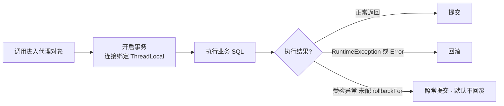
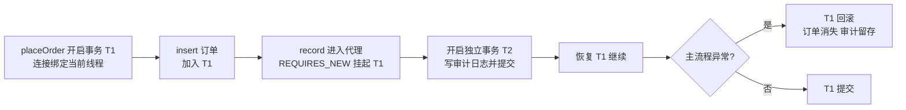

# 事务管理

> @Transactional 怎么用才不出事、REQUIRED 与 REQUIRES_NEW 的场景直觉、rollbackFor 与经典失效场景——数据一致性的第一道防线。

## 🎯 本文核心

**@Transactional = 用 AOP 代理把「开事务—执行—提交/回滚」模板化**。你声明边界，代理负责机械动作：进方法前拿连接开事务并绑定到当前线程，方法正常返回就提交，抛出运行时异常就回滚。

机制链：**调用进入代理对象 → 开启事务、连接绑定 ThreadLocal → 执行业务 → 无异常提交（RuntimeException/Error 回滚）→ 释放连接**。所有经典失效场景，根源都逃不出两条——「调用没经过代理」或「异常类型不在回滚范围」。

## 一句话摘要

声明式事务的正确姿势三句话：**注解标在 public 方法上；回滚范围显式写 `rollbackFor = Exception.class`；事务边界取最小必要**。传播行为先掌握两个——REQUIRED（默认，加入当前事务，管「同生共死」）与 REQUIRES_NEW（挂起当前事务另开独立事务，管「你回滚你的、我提交我的」），覆盖九成业务场景。

## 一、背景：为什么声明式事务能成为默认

没有声明式事务的年代，事务靠手写：

```java
// 编程式事务：边界与样板混在一起
transactionTemplate.execute(status -> {
    accountDao.deduct(order.getAccountId(), order.getAmount());
    orderDao.insert(order);
    return order.getId();
});
```

```java
// 声明式事务：边界就是一行注解
@Transactional(rollbackFor = Exception.class)
public Long createOrder(Order order) {
    accountDao.deduct(order.getAccountId(), order.getAmount());
    orderDao.insert(order);
    return order.getId();
}
```

两条路能力等价，工程体验天差地别：编程式把事务样板嵌进业务（适合脚本、局部精确控制）；声明式把样板抽给代理，业务只剩「在哪开、在哪停」这一个决策——从编程式到声明式，是事务使用方式的第一次演进，也是它成为默认的原因。代价藏在后面：**代理是唯一的守门员，绕过代理等于没有事务**，这是失效场景的总根源。

声明式事务一次调用的完整执行机制，先看全景再拆细节：



## 二、核心：@Transactional 与 rollbackFor

```java
@Transactional(rollbackFor = Exception.class)  // 回滚范围显式放大到受检异常
public void transfer(TransferCmd cmd) {
    accountDao.deduct(cmd.from(), cmd.amount());
    accountDao.add(cmd.to(), cmd.amount());
}
```

三个最常用的属性：

| 属性 | 默认 | 工程用法 |
|---|---|---|
| rollbackFor | RuntimeException + Error | 常规写 `Exception.class`，把受检异常纳入回滚 |
| readOnly | false | 查询方法标 true，驱动层与连接层都能做优化 |
| timeout | -1（不限制） | 给事务设定兜底时长，防大事务长期占连接 |

**rollbackFor 背后有个反直觉的默认**：Spring 只对 RuntimeException 与 Error 回滚，受检异常默认照常提交。为什么这么设计？Spring 的设计取舍是：受检异常在语言语义里代表「可预期、可恢复的业务分支」（比如余额不足返回失败），框架不该替你决定「它一定是失败」——于是把选择权留给你。代价是每个团队都要记住这条默认，所以 `rollbackFor = Exception.class` 成了事实上的团队规范写法（业内认知）。

## 三、机制：传播行为与连接绑定

传播行为回答的问题是：**当前方法要事务时，外面已经有一个事务，你加不加、换不换？** 七种全景一句带过：REQUIRED 加入或新建（默认）、SUPPORTS 有则加入没有就非事务执行、MANDATORY 强制要求外层已有事务、REQUIRES_NEW 挂起外层另起新事务、NOT_SUPPORTED 挂起外层以非事务跑、NEVER 禁止在有事务时进入、NESTED 在当前事务里开保存点。日常只需要两个：

| | REQUIRED（默认） | REQUIRES_NEW |
|---|---|---|
| 直觉 | 同生共死 | 你回滚你的、我提交我的 |
| 典型场景 | 下单主流程：扣款 + 建单 | 操作流水、审计日志：主流程回滚也要留痕 |
| 连接 | 复用外层事务的连接 | 挂起外层，另拿一条连接开独立事务 |

```java
@Transactional(rollbackFor = Exception.class)
public void placeOrder(Order order) {
    orderDao.insert(order);                     // 主流程: REQUIRED
    auditRecorder.record("CREATE_ORDER", order); // 内部 REQUIRES_NEW: 独立提交
}
```



底层支撑是**连接与线程的绑定**：事务信息（连接、隔离级别）放进 ThreadLocal，同一事务内的所有 DAO 操作从 ThreadLocal 拿同一条连接，才能「一起提交一起回滚」。这个机制处在「业务层与数据访问架构之间」的中间层：业务声明边界，上下游的 DAO 无感知共享同一连接。它也解释了两件事：一是同一事务内的 DAO 不需要传 connection 参数；二是**跨线程的代码默认不在同一事务里**——子线程拿不到父线程的绑定。

## 四、实践：失效场景点名与大事务治理

**失效场景点名**（点到为止，完整清单见专题层《[事务失效场景排查手册](../../专题层/SpringBoot数据与事务深度/1_事务失效场景排查手册-深度.md)》，代理原理见特性层《[@Transactional 事务代理源码](../../特性层/深入理解AOP与代理/2_Transactional事务代理源码-深度.md)》）：

1. **自调用**：同类里 `this.check()` 直接调用了带 @Transactional 的方法——调用走的是 this 引用，绕过代理，注解形同虚设
2. **受检异常不回滚**：方法抛 IOException 之类，默认照常提交——rollbackFor 没写就是埋雷
3. **非 public 方法**：代理只拦 public 入口，标在 protected/包级方法上不生效
4. **异常被吞**：try-catch 吃掉异常不重抛——代理感知不到异常，照常提交
5. **跨线程**：新开线程执行写库——ThreadLocal 绑定不在，各自为战

**线上排查叙事（匿名化）**：某交易服务出过一个经典案例——下单失败后订单表干净回滚了，但「操作流水」表里也什么都不剩，审计诉求完全落空。排查时先怀疑流水代码没执行，日志显示执行了；再对事务日志复盘，发现流水写入用的是默认 REQUIRED，加入了主事务——主事务回滚，流水跟着陪葬。修复：流水写入改 REQUIRES_NEW 独立提交，并补了一条团队约定——「审计与流水类写入默认独立事务」。

**事务边界的治理直觉：取最小必要。** 事务内不做远程调用、不发消息、不写文件——这些动作又慢又不可回滚，只会把数据库连接和锁攥得更久。业内认知：大事务是长尾故障的高发源——undo 膨胀、锁等待、连接被占满，三个故障一个根因。拆法是把查询与外部交互挪出事务，只把「必须原子」的写操作圈在里面；随业务演进不断收缩边界，是事务治理的主线。

💡 实战提示：排查「明明加了注解为什么不生效」，先问一句——调用方拿到的是代理对象还是 this？单元测试里直接 new 出来的对象永远没有事务。

💡 实战提示：readOnly = true 不只是标记——连接驱动会做只读优化，某些框架还会据此走只读库路由（多数据源篇展开），查询方法默认加上是低成本高收益的习惯。

💡 实战提示：给团队定一个统一的注解模板（rollbackFor 加超时一并写全），评审时只看业务逻辑不看事务样板——样板统一之后，「谁漏写了 rollbackFor」在代码评审里一眼就能看出来。

## 与编程式事务的区别

| 对比 | 声明式 @Transactional | 编程式 TransactionTemplate |
|---|---|---|
| 边界表达 | 注解声明，一整段方法 | 代码块显式圈定，粒度任意 |
| 失效风险 | 有（绕过代理即失效） | 无，执行就是事务 |
| 适用 | 常规业务方法 | 脚本、方法内局部精确控制 |

取舍：声明式换来极低的表达成本，代价是要理解代理机制才能避开失效陷阱；对失效风险零容忍的局部逻辑（比如资金核心链路的关键段），编程式反而更可控。

## 什么时候用 / 什么时候不用

- **用 @Transactional**：单库内的多表原子写——下单扣库存、转账两边动账，默认选择
- **不用，改编程式**：事务边界只覆盖方法内一小段、或需要按条件动态决定提交/回滚
- **不用，换分布式方案**：跨库、跨服务的写一致——本地事务管不到，多库架构下的思路预览见专题层《[多数据源事务边界与分布式事务思路](../../专题层/SpringBoot数据与事务深度/2_多数据源事务边界与分布式事务思路-深度.md)》

## 常见误区

- **误区一：注解加了就一定回滚**。默认只回滚运行时异常——受检异常要显式 rollbackFor，这是最高频的一条坑
- **误区二：事务方法里调用同类其他事务方法会重新开事务**。自调用不走代理，内层注解被无视——传播行为只在「代理到代理」之间生效
- **误区三：事务越早开越保险**。事务里混入 RPC 与慢查询，本质是把数据库连接当锁用——边界取最小必要才是保险

## 追问链：打破砂锅问到底

- **第一层追问：为什么受检异常默认不回滚？** Spring 的设计取舍：受检异常语义上是「可预期的业务分支」，框架不替你定性成败——选择权留在 rollbackFor 里
- **再追问：那自调用为什么拦不住？** 事务是代理对象在方法外围织入的逻辑；this 调用是对象内部直通，压根没经过代理这道门——失效的不是事务，是「你以为的入口」
- **打破砂锅：为什么设计成代理模式而不是编译期改写字节码？** 代理对业务代码零侵入、随容器装配按需生效，代价是绕过代理即失效；字节码增强能堵住这个洞但复杂度与排障成本陡增——这是 Spring 一以贯之的「简单优先」设计思想

## 你们可能会问

1. **七种传播行为要背吗？** 不用背，按场景想：默认 REQUIRED；要「独立提交不受主事务影响」用 REQUIRES_NEW；NESTED 需要部分回滚保存点时才想起它。其余四种极少用。
2. **隔离级别这里为什么不展开？** 它是数据库层面的概念（读已提交、可重复读等），Spring 只是透传——工程上先弄清 MySQL 默认可重复读与读已提交的取舍，再回头看注解怎么传值更顺。
3. **同类方法怎么调用才能让事务生效？** 要么把方法拆到另一个 Bean（最干净），要么注入自身代理（self-injection），要么用 AopContext——三种都比「拆方法」绕，优先拆。
4. **一个方法里两个 REQUIRES_NEW，第一个提交后第二个失败，第一个会回滚吗？** 不会——它们是独立事务，这正是 REQUIRES_NEW 的语义；要「全成全败」就用默认 REQUIRED。

留一个问题：主事务 REQUIRES_NEW 先拿一条连接、再持有原连接，两个事务各占一条连接——如果池子很小，会发生什么？顺着这个问题想下去，就是连接池与事务的联动故障。

## 5W 速记卡

| W | 一句话 |
|---|---|
| What | 用 AOP 代理把「开—提交—回滚」模板化的声明式事务 |
| Why | 边界一行注解，业务与事务样板解耦 |
| Where | public 业务方法上 + rollbackFor 显式声明 |
| When | 单库多写要原子就用；跨库跨服务另寻方案 |
| Who | 代理是唯一守门员——绕过代理即失效 |

## 自测三问

1. **审计日志想「主流程回滚也留痕」，传播行为怎么选？** REQUIRES_NEW——挂起主事务、独立提交；代价是多占一条连接，池要留余量。
2. **注解加了但方法抛受检异常却提交了，为什么？** 默认回滚范围只有 RuntimeException 与 Error——补 rollbackFor = Exception.class。
3. **同类里 this 调用带注解的方法为什么失效？** 调用没经过代理，事务逻辑无处织入——拆 Bean、或注入代理对象调用。

## 不同量级下的事务策略

十万级日请求：单库 REQUIRED + rollbackFor 就够，这一档的核心问题是「别把失效场景带上线」，而不是堆机制；千万级：大事务治理成为显式课题——边界最小化、外部交互出事务、超时兜底；亿级：跨库跨服务的一致性让本地事务退场，事务方案走向分布式体系的演进（TCC、基于消息的最终一致），那是分布式事务系列的疆域。

## 🎯 核心带走

- @Transactional = 代理模板：进代理开事务绑线程，无异常提交，RuntimeException/Error 回滚
- 三个肌肉记忆：标 public、rollbackFor 显式写、边界最小必要
- 传播行为先会两个：REQUIRED 同生共死，REQUIRES_NEW 独立提交留痕
- 失效总根源两条：调用绕过代理、异常不在回滚范围——排查失效先问「走的谁」和「抛的什么」
- 边界：本篇是单库事务；跨库跨服务的一致性是分布式事务篇的事

## 下篇预告

事务保证了多条 SQL 的原子性，但 SQL 本身怎么管理？下一篇 [15_MyBatis集成](./15_MyBatis集成-入门.md)：starter 集成、Mapper 代理、#{} 与 ${} 的安全差异。

## 📌 数据与事实声明

- 写于 2026-09-23，基于 Spring Boot 3.5.x / Spring Framework 6.x 口径；传播行为与回滚默认规则引自 Spring 官方文档
- 大事务与故障关联性、团队规范写法为业内认知（公开口径）
- 免责：以 Spring Framework 官方文档为准

## 📚 参考资料

| 类型 | 标题 | 来源 |
|---|---|---|
| 官方文档 | Transaction Management（声明式事务与传播行为） | docs.spring.io/spring-framework/reference/data-access/transaction.html |
| 官方文档 | Using @Transactional | docs.spring.io/spring-framework/reference/data-access/transaction/declarative.html |
| 深入篇 | 本仓库《事务失效场景排查手册》 | docs/backend/java/ecosystem/spring-boot/专题层/SpringBoot数据与事务深度/ |
