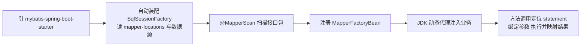
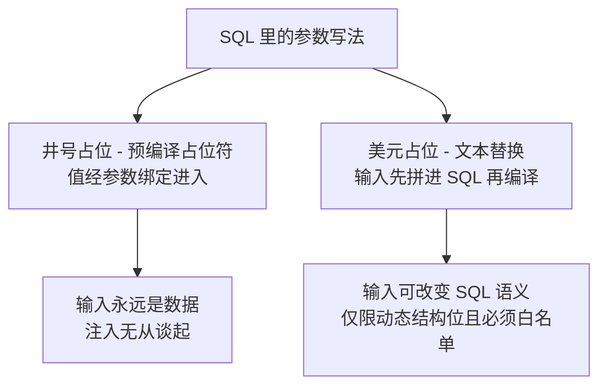

# MyBatis 集成

> mybatis-spring-boot-starter 做了什么、Mapper 代理怎么来的、#{} 与 ${} 的安全差异、分页的直觉——半自动 ORM 入门。

## 🎯 本文核心

**MyBatis 集成 = 把「接口方法」翻译成「SQL 执行」的代理体系**。mybatis-spring-boot-starter 干两件事：自动装配 `SqlSessionFactory`（读 mapper XML 与数据源），并把 `@MapperScan` 扫到的接口注册成代理 Bean——业务里 `@Autowired` 拿到的 Mapper 实现，是运行期生成的动态代理。

机制链：**引 starter → 自动配置 SqlSessionFactory → @MapperScan 扫接口 → 生成 JDK 动态代理 → 注入业务 → 方法调用翻译成 SQL 执行**。理解「你写的接口没有实现类」这一点，MyBatis 的一半疑惑就消失了。

## 一句话摘要

MyBatis 的定位是**半自动 ORM：SQL 归你写，机械活（连接、参数、结果映射）归它**——与 JPA 的「全自动」相比，换来的是对 SQL 的完全掌控。日常集成三步走（依赖、扫描、写 XML），安全上记住一条铁律：**#{} 是预编译占位符，${} 是文本替换**——参数一律 #{}，动态表名排序字段才允许 ${} 且必须白名单。

## 一、背景：ORM 的两条路线

对象与关系数据库之间隔着「映射」这道墙，两种拆墙思路：

- **全自动（JPA/Hibernate）**：框架按对象关系映射生成 SQL——开发效率高，代价是复杂查询时 SQL 不可控、调优困难
- **半自动（MyBatis）**：SQL 手写、映射交给框架——SQL 可控可调优，代价是每个查询都要自己写

业内认知：国内业务系统里 MyBatis 系占主流，与「复杂查询多、SQL 需要精细调优」的业务形态强相关；这不是技术优劣，是业务形态与团队经验的匹配。两条路线的深入选型对比见 MyBatis-Plus 系列《[与 JPA 选型](../../../mybatis-plus/入门层/从零开始认识MyBatisPlus系列/15_与MyBatisJPA选型-入门.md)》。

放在数据访问架构的分层里看：从手拼 JDBC 到 JdbcTemplate 是第一次演进（模板化机械动作），到 MyBatis 是第二次演进（SQL 与映射职责分离），再到 MyBatis-Plus 是第三次（通用样板彻底收走）——本篇处在第二级，也是国内业务项目的主力层。

## 二、核心：三步完成 Boot 集成

```yaml
# 第 1 步: 引 mybatis-spring-boot-starter 依赖(略)
mybatis:
  mapper-locations: classpath:mapper/*.xml      # 第 2 步: 指明 XML 位置
  type-aliases-package: com.example.demo.entity  # 实体别名包
```

```java
// 第 3 步: 启动类或配置类上扫描 Mapper 接口
@SpringBootApplication
@MapperScan("com.example.demo.mapper")
public class DemoApplication { public static void main(String[] args) {
    SpringApplication.run(DemoApplication.class, args);
} }

public interface AccountMapper {
    Account selectById(@Param("id") Long id);
    int updateStatus(@Param("id") Long id, @Param("status") String status);
}
```

**Mapper 扫描的机制**：`@MapperScan` 触发扫描，把包下所有接口注册为 `MapperFactoryBean`，最终暴露的是 JDK 动态代理对象；不用 `@MapperScan` 也可以在每个接口上标 `@Mapper`，但接口一多就成了重复劳动——**工程惯例是统一扫包，一次声明全局生效**。把装配机制整体收进 starter，让你只写接口不写实现，是这套集成最值得体会的设计哲学。代理对象收到方法调用后，按「接口全名 + 方法名」定位到 XML 里的 statement，绑定参数、交给 SqlSession 执行、映射结果返回。



## 三、机制：#{} 与 ${} 的安全差异

这是 MyBatis 使用中最重要的一条机制分界：

```xml
<select id="selectByStatus" resultType="Account">
    SELECT id, name FROM account WHERE status = #{status}
</select>
```

- **#{}**：翻译成 JDBC 预编译语句的 `?` 占位符，值经参数绑定传入——值就是值，不参与 SQL 语法结构，注入无从谈起
- **${}**：先做字符串替换再编译——用户输入被直接拼进 SQL 文本，`' OR '1'='1` 这类输入能改变 SQL 语义，这就是 SQL 注入

| | #{} | ${} |
|---|---|---|
| 底层行为 | PreparedStatement 占位符 + 参数绑定 | 文本替换后再编译 |
| 安全性 | 防注入 | 有注入面 |
| 适用 | 一切值参数（where 值、insert 值） | 动态表名、排序字段等「结构位」 |

**为什么 ${} 无法被 #{} 取代？** 预编译占位符只能出现在「值」的位置，表名、列名、排序方向是 SQL 结构的一部分，占位符表达不了——所以动态结构位只能 ${}，同时**必须白名单校验**（枚举比对，拒绝自由文本）。白名单不是补充动作，而是「安全与灵活」之间的设计取舍里必须支付的那一半成本。两条路径的原理差异一图看清：



动态 SQL 初识：`<if>` 按条件拼片段、`<where>` 智能处理 AND 前缀、`<foreach>` 展开 IN 列表——本质是「用 XML 标签拼字符串」，会写 Java 条件拼接就会写它。

**分页的直觉**：分页有两种做法——内存分页（查全量再截取，数据量大时是事故温床，生产禁用）与物理分页（翻译成 `LIMIT offset, size`，数据库只返回当页）。生产一律物理分页，通常借分页插件自动改写 SQL（拦截器机制）；**深分页**（offset 巨大时变慢）是它的进阶课题，见 MyBatis-Plus 系列《[分页插件](../../../mybatis-plus/入门层/从零开始认识MyBatisPlus系列/7_分页插件-入门.md)》。

## 四、实践：XML 与注解的边界、典型使用场景

**典型使用场景**：业务系统的数据访问主力层；多表关联、动态条件、需要 DBA 评审 SQL 的金融类项目尤其适配；JdbcTemplate 管脚本，MyBatis 管业务——数据访问层内部分工明确。

- **简单 CRUD 用注解**：`@Select`/`@Update` 直接写在接口上，一眼看到 SQL
- **复杂动态 SQL 用 XML**：条件分支多、结果映射复杂、SQL 需要单独评审维护时，XML 是更好的载体——这也是团队协作的边界：XML 可代码评审、可统一归档
- **结果映射**：列名与字段名不一致时用 `resultMap` 显式映射，或开启驼峰转换配置一步到位
- **架构中的位置**：Mapper 层处在业务层与数据库之间的数据访问架构中间层——上游 Service 只依赖接口，下游 SQL 的演进（加索引 hint、改写法）不惊动业务代码，这正是「接口与实现分离」在数据层的落地

💡 实战提示：本地联调把 Mapper 包的日志级别调到 DEBUG，能直接看到实际执行的 SQL 语句与绑定参数——这是映射错误、参数漏传类问题最快的发现手段，上线前记得调回去。

💡 实战提示：团队规范建议「参数一律 #{}，出现 ${} 必须注释说明为什么不能用 #{} 并附白名单校验」——把安全判断显式留在代码评审环节，而不是靠人记住。

**线上排查叙事（匿名化）**：某列表页曾被外部安全扫描检出 SQL 注入风险点。排查路径：先定位注入面——是一个按排序字段拼接的动态查询；再查实现——排序字段用了 ${} 且未校验，任意文本直接进 SQL；复盘动作是把可选排序收敛成枚举白名单、全库 grep 排查同类写法、把「${} 必须白名单」写进评审清单。这件事的教训：注入面往往不在「值」的位置，而在「看起来无害的结构参数」上。

💡 实战提示：性能排查时先看 SQL 本身——开启 MyBatis 的 SQL 日志（或数据库慢查询日志）确认实际执行的语句与参数，再谈索引与缓存；「映射配置错了导致查询串数据」这类问题，也是靠打印实际 SQL 最快发现。

## 与 JPA 的区别

| 对比 | MyBatis | JPA/Hibernate |
|---|---|---|
| SQL 控制权 | 完全手写 | 框架生成，可被 JPQL 干预 |
| 上手曲线 | 会 SQL 就会 | 要学实体映射与持久化上下文 |
| 复杂查询 | 直接写 SQL，无翻译损耗 | 复杂时退化到原生 SQL |
| 数据库迁移 | SQL 随方言走 | 屏蔽方言，迁移成本低 |

取舍：MyBatis 用「每查询手写 SQL」换来可控与可调优；JPA 用「框架接管」换来跨库与开发速度——业务 SQL 复杂、DBA 深度参与的项目选 MyBatis 更顺，标准 CRUD 为主、追求模型驱动的项目 JPA 更省。

## 什么时候用 / 什么时候不用

- **用 MyBatis**：查询形态复杂多变、需要精确控制每条 SQL、团队 SQL 能力强的业务系统——国内业务项目的稳态选择
- **不用，用 JdbcTemplate**：就几条 SQL 的工具类项目——引入 Mapper 体系是杀鸡用牛刀
- **不用，用 JPA**：模型稳定、CRUD 为主、有多数据库适配诉求的产品型项目
- **增强需求**：通用 CRUD、条件构造器、分页插件这些「MyBatis 的样板消灭器」交给 MyBatis-Plus（本仓库有独立系列），不重复展开

## 常见误区

- **误区一：#${} 与 #{} 只是写法风格不同**。一个是文本替换一个是预编译占位——风格差异背后是注入面有无的本质区别
- **误区二：Mapper 接口自己写个实现类注入**。不需要也不应该——扫描注册的代理就是实现；自己再包一层只会破坏 statement 定位机制
- **误区三：分页先查全量再 subList**。内存分页在数据量上涨后必然演变成线上事故——从第一天就用物理分页

## 追问链：打破砂锅问到底

- **第一层追问：#{} 为什么能防注入？** 预编译在参数绑定前就完成了 SQL 语法的解析——用户输入只会以「数据」身份参与匹配，永远成不了「代码」
- **再追问：那 ${} 场景里的白名单为什么必须做？** 动态结构位绕不开文本替换，替换前就成了 SQL 的一部分——只有把可选值收敛成枚举，才能把「结构」从用户输入手里夺回来
- **打破砂锅：MyBatis 为什么选择「接口 + 代理」而不是让开发者写实现类？** 接口方法签名天然携带「statement 定位 + 参数 + 返回类型」全部信息，代理把机械翻译收走——这正是「约定大于实现」的设计思想：你声明意图，框架补全机制

## 你们可能会问

1. **XML 和注解写 SQL 有性能差异吗？** 没有——最终都解析成同一种 statement 执行；差异只在维护性，按复杂度选择载体即可。
2. **resultType 和 resultMap 什么时候必须用后者？** 列名与属性名对不上、一对一/一对多关联映射、需要类型处理器时——简单场景靠驼峰转换配置就够。
3. **多数据源时 Mapper 怎么分？** 按包拆分——不同包的 Mapper 绑定不同 SqlSessionFactory 与数据源，具体形态在下一篇展开。
4. **动态 SQL 标签嵌套太深可读性差怎么办？** 能用 SQL 片段（`<sql>` + `<include>`）复用的就抽出来；超过两层嵌套通常说明查询本身该拆视图或拆接口。

留一个问题：如果一个查询的 WHERE 条件完全由前端传入的字段动态决定，全部用 #{} 还有什么风险？顺着想就是「全表扫描的条件缺失」问题——动态 SQL 的安全不止注入一件事。

## 5W 速记卡

| W | 一句话 |
|---|---|
| What | 半自动 ORM：SQL 手写，连接、参数、映射交给框架的代理体系 |
| Why | 业务复杂查询需要 SQL 级的可控与可调优 |
| Where | mybatis-spring-boot-starter + @MapperScan + mapper XML |
| When | 业务系统数据访问主力；参数一律 #{}，结构位 ${} 加白名单 |
| Who | 开发者写接口与 SQL，动态代理补全执行机制 |

## 自测三问

1. **注入业务里的 Mapper 是什么对象？** 运行期生成的 JDK 动态代理——按「接口全名 + 方法名」定位 statement 并执行，接口本身没有实现类。
2. **动态排序字段为什么不能用 #{}？** 占位符只能绑定「值」，排序字段是 SQL 结构位——只能 ${} 且必须枚举白名单校验。
3. **深分页为什么慢、大方向怎么解？** offset 越大数据库扫描丢弃越多；方向是游标分页或延迟关联，物理分页插件只是入门第一步。

## 不同量级下的 MyBatis 使用

十万级日请求：注解 + 简单 XML、物理分页插件就够，这一档的核心问题是「别把注入面与内存分页带上线」，而不是堆框架；千万级：深分页、批量操作、SQL 评审流程成为显式课题——数据访问层开始有自己的规范与演进路线；亿级：读写分离与分库分表登场，Mapper 路由与数据分片接管「查哪张表」的决策——那是分库分表系列的疆域。

## 🎯 核心带走

- starter 自动装配 SqlSessionFactory，@MapperScan 扫接口生成动态代理——业务拿到的 Mapper 是代理不是手写实现
- 安全铁律：#{} 预编译占位防注入；${} 文本替换仅限动态结构位，且必须白名单
- 分页一律物理分页（插件改写 SQL），内存分页生产禁用；深分页是进阶课题
- 边界：单数据源下的 MyBatis；多数据源时 Mapper 按包路由——下一篇就是它

## 下篇预告

一个服务连多个数据库、读写各走一边怎么配？下一篇 [16_多数据源与读写分离](./16_多数据源与读写分离-入门.md)：多数据源三种形态与主从延迟的读策略。

## 📌 数据与事实声明

- 写于 2026-09-23，基于 Spring Boot 3.5.x / mybatis-spring-boot-starter 官方文档口径
- 国内外 ORM 路线占比为业内认知（公开口径），非精确统计数据
- 免责：以 MyBatis 与 mybatis-spring-boot 官方文档为准

## 📚 参考资料

| 类型 | 标题 | 来源 |
|---|---|---|
| 官方文档 | MyBatis-Spring-Boot-Starter | mybatis.org/spring-boot-starter/mybatis-spring-boot-autoconfigure/ |
| 官方文档 | MyBatis Dynamic SQL 与 Mapper XML | mybatis.org/mybatis-3/zh/dynamic-sql.html |
| 官方文档 | OWASP SQL Injection Prevention（预编译防注入） | owasp.org/www-community/attacks/SQL_Injection |
