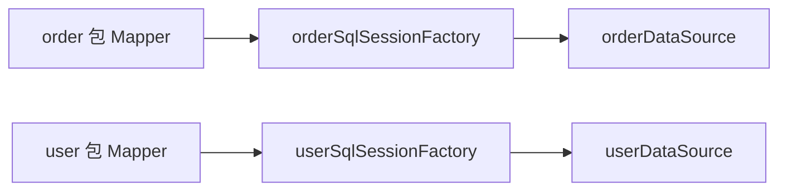
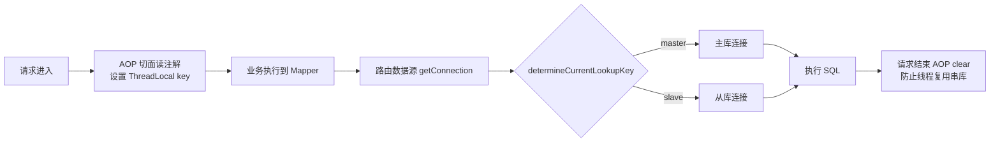

# 多数据源与读写分离

> 一个服务连多个库的三种配置形态、读写分离的路由直觉、主从延迟下的读策略——数据访问从单库走向多库的第一课。

## 🎯 本文核心

**多数据源的本质 = 拆掉「容器里只有一个 DataSource Bean」的默认假设，换成「多个实例 + 一套路由规则」**。第 13 篇的自动配置只在单数据源时生效；一旦有两个库，就要自己显式声明多个 DataSource，并回答「这次操作走哪个库」。

机制链：**配置多个 DataSource → 路由决策（按包/按注解/按中间件）→ 各自绑定 SqlSessionFactory 与事务管理器 → Mapper 落到指定库**。路由决策发生在「拿连接」那一刻——记住这句话，事务与路由的兼容问题就都能推出来。

## 一句话摘要

三种形态按复杂度递进：**静态分包绑定**（不同包的 Mapper 绑不同库，简单可靠）、**动态路由**（AbstractRoutingDataSource + ThreadLocal + 注解切换，同一工程内按方法粒度选库）、**代理层**（分库分表中间件接管路由，本篇只点名）。读写分离是动态路由最常见的应用：写走主库、读走从库，但必须直面主从延迟——**写后立刻读的场景要强制回主库**。

## 一、背景：单数据源的边界在哪

第 13 篇的自动配置隐含一个前提：一个服务一个库。撑不住的三种情况：**读写比例失衡**——读远多于写时，单库先把读能力打满；**业务分域**——核心交易与统计报表共用一个库，报表慢查询拖垮交易；**容量到顶**——单库写入上限到了，这是分库分表的前奏（本篇不展开）。

读写分离的部署形态：主库承接写，一个或多个从库承接读，主从之间通过复制同步（业内认知：同步延迟通常毫秒到秒级，取决于网络与从库负载）。延迟不可消除，只能设计读策略绕行——这是本篇最重要的工程判断，也是读能力扩展道路上第一次需要认真对待的演进。

## 二、核心：三种配置形态

### 形态一：静态分包绑定

不同包的 Mapper 各自绑定 DataSource、SqlSessionFactory、事务管理器——配置量大但行为确定，没有运行时切换逻辑：

```java
@Configuration
@MapperScan(basePackages = "com.example.mapper.order",
            sqlSessionFactoryRef = "orderSqlSessionFactory")
public class OrderDataSourceConfig {

    @Bean
    @ConfigurationProperties("spring.datasource.order")   // 绑定各自前缀的配置
    public DataSource orderDataSource() {
        return DataSourceBuilder.create().build();
    }

    @Bean
    public SqlSessionFactory orderSqlSessionFactory(DataSource orderDataSource) throws Exception {
        SqlSessionFactoryBean factory = new SqlSessionFactoryBean();
        factory.setDataSource(orderDataSource);
        return factory.getObject();
    }
}
```

另一组库照抄一份（user 包 + user 前缀）。**为什么拆三件套？** Mapper 代理要经 SqlSessionFactory 执行，而 SqlSessionFactory 固定持有一个 DataSource——绑定关系必须在装配期一次定死，这也决定了它「按包路由」的粒度：



### 形态二：动态路由 AbstractRoutingDataSource

把「多个库」包成一个可切换的虚拟数据源，运行时按 key 选库：

```java
public class RoutingDataSource extends AbstractRoutingDataSource {
    @Override
    protected Object determineCurrentLookupKey() {
        return DataSourceHolder.get();   // 从 ThreadLocal 取当前 key: master / slave
    }
}

public enum DataSourceHolder {
    ;
    private static final ThreadLocal<String> KEY = ThreadLocal.withInitial(() -> "master");
    public static void set(String key) { KEY.set(key); }
    public static String get() { return KEY.get(); }
    public static void clear() { KEY.remove(); }
}
```



开源的 dynamic-datasource 类组件把这套样板封装成 @DS 注解（业内认知），原理相同。形态三一句带过：分库分表中间件（如 ShardingSphere 这类开源方案）在 JDBC 层做透明路由，适用于分片诉求，超出入门范围。

💡 实战提示：ThreadLocal 路由的请求出口必须 clear——线程池会复用线程，残留的 key 会把下一个请求路由到错误的库，这类「串库」问题复现率低、排查极痛，切面统一清理是唯一可靠做法。

## 三、机制：读写分离路由与主从延迟的读策略

路由直觉：**写与「写后立刻读」走主库，一般读走从库**。只读事务（readOnly = true）标注给从库读，既表达意图也便于连接层优化。判断「这条读能不能走从库」的唯一标准是：**业务能不能容忍读到稍微旧一点的数据**。

主从延迟的三种读策略（延迟客观存在，业内认知为毫秒到秒级）：

| 策略 | 做法 | 适用 |
|---|---|---|
| 强制主库读 | 关键读固定路由主库 | 资金余额、库存校验——读错直接资损 |
| 写后读主库窗口 | 写操作后的短时间窗内，同请求的读回主库 | 修改资料后刷新详情页 |
| 从库读 + 容忍陈旧 | 列表、统计、他人主页等非关键读 | 绝大多数读场景 |

**为什么不能简单「读写分离一配了之」？** 因为「写后读」无处不在——下单后跳订单详情、改密码后重新登录校验，全都踩延迟窗口。策略选择是架构判断：宁可多几条主库读，也不能让资金类数据读到旧值。

💡 实战提示：事务与路由有一个硬边界——事务开启时连接已经从路由数据源借出并绑定线程，事务中途改 ThreadLocal 不会换库。所以「事务内切从库」的写法天然无效，跨库操作要么拆成两个事务，要么走分布式事务思路（见专题层《[多数据源事务边界与分布式事务思路](../../专题层/SpringBoot数据与事务深度/2_多数据源事务边界与分布式事务思路-深度.md)》）。

## 四、实践：典型使用场景与排查叙事

**典型使用场景**：报表与交易分库（统计查询隔离到独立库，交易主库不再被慢报表拖累）；读写分离（一主多从分摊读流量）；多租户按库隔离（租户流量路由到各自库）。

💡 实战提示：给每个数据源的连接池起独立的名字（poolName）——多库之后，监控面板与日志里的池指标、超时报错只有带上名字才分得清是谁在告警；混用默认名字的多库故障，光是「定位到哪个库」就要花掉排查的一半时间。

**线上排查叙事（匿名化）**：某服务收到反馈「改完昵称，刷新页面偶尔还是旧昵称，再刷一下又好了」。排查路径：复现规律——时好时坏指向缓存或副本不一致；查架构——读流量走了从库，主从延迟秒级波动；对时间线复盘——「偶发」的请求都落在写入后的一两秒内，命中延迟窗口。修复：写后读主库窗口 + 该接口强制主库读，问题消失。复盘沉淀的规则：**「写后立刻要读」的接口不参与读写分离**，在路由设计期就标出来，而不是等线上反馈。

**什么时候用 / 什么时候不用**：

- **用静态分包**：库与业务域一一对应（交易库/用户库），路由规则恒定——配置量换确定性，值得
- **用动态路由**：同一域内按读写切主从、或按租户/灰度动态选库——需要注解与切面体系支撑
- **不用，先做单库优化**：索引、慢 SQL、缓存都还有空间时，多数据源是过早复杂化——多一套数据源就多一套连接池、事务边界与故障面
- **不用，上中间件**：分片键明确的水平拆分场景，手写路由很快会演化成半成品中间件——直接用成熟方案

## 与分库分表的区别

| 对比 | 多数据源 / 读写分离 | 分库分表 |
|---|---|---|
| 解决什么 | 隔离与分摊读压力 | 单表数据量与写入容量到顶 |
| 路由粒度 | 库级（按包/按注解） | 行级（按分片键哈希） |
| 事务影响 | 跨库事务边界问题 | 跨片查询与分布式事务 |
| 入门成本 | 配置与路由规则 | 分片键设计与数据迁移 |

取舍：读写分离用「延迟管理」的复杂度换读能力横向扩展，是最划算的第一步；分库分表是容量问题的终极方案，代价贯穿存储、查询与事务三层——量级没到就别提前支付。

## 常见误区

- **误区一：配了读写分离就万事大吉**。写后读踩延迟窗口是必踩的坑——读策略是方案的一部分，不是运维插曲
- **误区二：事务方法里注解切换数据源**。连接在事务开始时已绑定，中途切换不生效——先拆事务再切库
- **误区三：每个数据源各配一个超大连接池**。多数据源的池是分摊总量，不是各自翻倍——池总量仍要对着数据库连接上限算账

## 追问链：打破砂锅问到底

- **第一层追问：为什么路由要靠 ThreadLocal 而不是方法传参？** 路由信息要在「业务代码感知不到」的深度（DAO/连接层）生效——ThreadLocal 是不污染方法签名的隐式上下文，代价是线程复用时必须清理
- **再追问：主从延迟为什么不能做成零？** 复制至少要「主库执行完、日志传输、从库重放」三步，物理上就存在传播时间；追求零延迟等于同步写所有副本，写入吞吐与可用性都会坍塌——这是 CAP 视角下的经典取舍
- **打破砂锅：为什么说「读写分离的第一课不是配路由，是盘点读场景」？** 路由配置一天就能上线，而「哪些读不容忍陈旧」的清单只有业务能回答——漏一条清单就埋一次资损隐患；先分类再路由，是多库架构设计思想里「先问业务再谈机制」的又一次落地

## 你们可能会问

1. **AbstractRoutingDataSource 会被淘汰吗？** 简单主从场景它依然够用且透明；分片、弹性扩缩容等复杂诉求会逐步走向代理层方案——理解路由原理比记住某个组件更重要。
2. **从库挂了怎么办？** 路由层要有健康检查与摘除（或中间件自带）——从库故障只是读能力缩水，主库不能被拖垮；这部分归生产化专题。
3. **一主多从，读请求怎么在从库间分配？** 简单轮询或负载均衡即可；关注点应放在从库延迟监控与告警上，而不是分配算法的花样。
4. **跨库的多表 JOIN 怎么办？** 静态分包形态下跨库 JOIN 直接不可用——要么冗余数据、要么应用层组装、要么把两表放进同一个库；跨库 JOIN 本身就是「这两个表也许不该分家」的设计信号。

留一个问题：如果写后读窗口内服务发生了重试或超时，主库读窗口的边界怎么界定才不会漏？这个问题往下挖就是分布式会话一致性的深水区。

## 5W 速记卡

| W | 一句话 |
|---|---|
| What | 多个 DataSource + 路由规则，替代「一个容器一个库」的默认假设 |
| Why | 读写分摊、业务分域、租户隔离——单库总有撑不住的一天 |
| Where | 静态分包 / AbstractRoutingDataSource + ThreadLocal / 代理层 |
| When | 写后读强制主库；事务内不切库；出口必须清理 ThreadLocal |
| Who | 路由配置是机制，读场景清单是业务——两者合起来才是方案 |

## 自测三问

1. **静态分包与动态路由怎么选？** 库与业务域一一对应且无运行时切换就分包（确定性优先）；要按方法/租户/读写动态选库才上路由。
2. **为什么事务中途切换数据源不生效？** 事务开启时连接已从路由数据源借出并绑定线程——切换 key 只影响下一次借连接，管不到已绑定的这条。
3. **资金类读为什么必须强制主库？** 主从延迟下从库可能读到旧值，资金场景读错就是资损——读正确性优先于读扩展性。

## 不同量级下的多数据源策略

十万级日请求：单库 + 缓存 + 索引优化基本够，这一档的核心问题是「别过早引入多数据源的复杂度」，而不是先拆库；千万级：读写分离与业务分域登场，延迟监控、读策略清单、跨库事务边界成为显式工程课题；亿级：分库分表与单元化接管容量问题，多数据源形态会演进为中间件托管的路由体系——从单库到多库再到分片，正是数据访问架构随业务量级的演进路线，本篇的三种形态是那条路线的前两级。

## 🎯 核心带走

- 多数据源 = 多个 DataSource + 路由规则；三种形态：静态分包、动态路由、代理层，按复杂度递进选用
- 路由发生在「拿连接」那一刻——事务一开连接就绑定，事务内切库天然无效
- 主从延迟不可消除，读策略三选一：资金类强制主库、写后读走主库窗口、非关键读容忍陈旧
- ThreadLocal 路由的出口必须 clear，否则线程复用串库
- 边界：本篇管「查哪个库」；「库内配置怎么管」是下一篇配置体系的事

## 下篇预告

库多了、环境多了，配置本身怎么不失控？下一篇 [17_配置体系与外部化配置](./17_配置体系与外部化配置-入门.md)：配置加载优先级与类型安全配置的工程价值。

## 📌 数据与事实声明

- 写于 2026-09-23，基于 Spring Boot 3.5.x 口径；AbstractRoutingDataSource 行为引自 Spring 官方文档
- 主从延迟量级、dynamic-datasource 类组件与 ShardingSphere 定位为业内认知（公开口径）
- 免责：以 Spring Framework 官方文档为准

## 📚 参考资料

| 类型 | 标题 | 来源 |
|---|---|---|
| 官方文档 | Data Access with JDBC（AbstractRoutingDataSource 一节） | docs.spring.io/spring-framework/reference/data-access/jdbc.html |
| 官方文档 | MySQL Replication（主从复制与延迟） | dev.mysql.com/doc/refman/8.0/en/replication.html |
| 深入篇 | 本仓库《多数据源事务边界与分布式事务思路》 | docs/backend/java/ecosystem/spring-boot/专题层/SpringBoot数据与事务深度/ |
