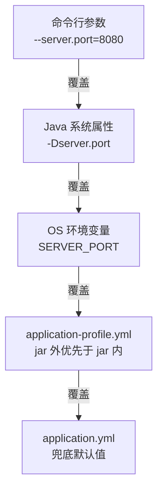
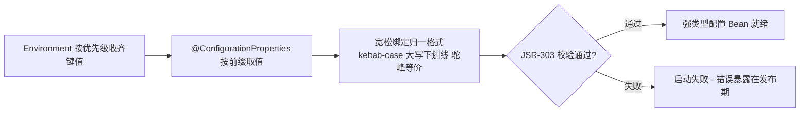

# 配置体系与外部化配置

> 配置从哪里来、谁覆盖谁、@ConfigurationProperties 与 @Value 怎么选——配置管理的完整体系，以及类型安全绑定的工程价值。

## 🎯 本文核心

**Boot 配置体系 = 多来源分层覆盖 + 类型安全绑定**。启动时把命令行、环境变量、application-{profile}、application 等来源按优先级收进 Environment；`@ConfigurationProperties` 再把散落的键值**按前缀批量绑定成强类型对象**，配错在启动期就报错。

机制链：**启动收集各来源 PropertySource（高优先级在前）→ Environment 统一按键查找 → 宽松绑定映射到配置类字段 → JSR-303 校验 → 失败即启动失败**。整条链路的底层逻辑只有一句话：**把配置当对象管，而不是当一堆字符串管**。

## 一句话摘要

配置优先级记一条主线：**越靠近运行时、越靠部署动作注入的来源，优先级越高**——命令行参数 > 环境变量 > application-{profile} > application。注入方式二选一：**单值快取用 @Value，成组配置用 @ConfigurationProperties**——后者有批量绑定、宽松绑定、校验与 IDE 提示四重工程价值，是配置管理的稳态选择。

## 一、背景：配置为什么不能写死在代码里

写死在代码里的配置（数据库地址、开关、阈值）每换一个环境就要重新打包——「一份构建，处处运行」变成「一个环境一次构建」。12-Factor 方法论把这条列为第一原则：**配置存储在环境里，代码与配置分离**（公开口径）。

Boot 的回答分两层：**来源层**——把环境变量、命令行、配置文件等所有可能的配置来源统一收口，按优先级覆盖成一份 Environment；**绑定层**——把 Environment 里的键值安全地装进 Java 对象。两层合起来，「环境差异」就退化成「不同来源放不同值」的搬运问题。放在应用架构里看，配置体系处在「构建产物与部署平台之间」的中间层：上游是代码仓库，下游是运行环境的注入通道，这一层设计得好不好，直接决定多环境部署的上下游协作是否顺畅。

## 二、核心：配置来源与优先级

优先级链（从高到低，引自官方文档的关键部分）：



记忆主线只有一句：**越靠上越「临时」，越靠下越「兜底」**——命令行是启动动作的一部分，环境变量是部署平台的注入通道（容器编排里最常用），文件是仓库里的默认值。

- **为什么环境变量优先级这么高？** 容器化部署的主流方式就是环境变量注入——同一份镜像，靠环境变量跑出开发/预发/生产三套行为，这是「镜像不可变」原则的配套设计
- **profile 文件的角色**：application-{profile} 承载环境差异，application 承载全环境共有默认值；多环境的完整玩法在下一篇展开
- **bootstrap 与 application 的分工**：bootstrap 是 Spring Cloud 体系里「配置中心自身的引导配置」（比如配置中心地址），先于 application 加载——不用配置中心就基本碰不到它

占位符是来源之间的连接件：`timeout: ${retry.timeout:3000}`——引用另一个键，冒号后是默认值；引用在绑定前完成解析。

## 三、机制：@ConfigurationProperties 与类型安全绑定

```java
@ConfigurationProperties(prefix = "app.order")
@Validated
public class OrderProperties {

    /** 单笔下单金额上限 */
    @Min(1)
    @NotNull
    private BigDecimal maxAmount;

    /** 支付超时秒数 */
    @Min(10)
    private int payTimeoutSeconds = 30;

    /** 支持的支付方式 */
    private List<String> payChannels = new ArrayList<>();
    // getter/setter 略
}
```

```yaml
app:
  order:
    max-amount: 50000        # 宽松绑定: max-amount 映射 maxAmount
    pay-timeout-seconds: 60  # kebab-case 与驼峰等价
    pay-channels:
      - WECHAT_PAY
      - UNION_PAY
```

**宽松绑定（relaxed binding）是来源多样性的必然**：环境变量只能大写加下划线（APP_ORDER_MAXAMOUNT），yml 惯用 kebab-case（max-amount），Java 字段是驼峰——绑定层把三种写法归一，各来源才能各用各的自然格式。

| | @ConfigurationProperties | @Value |
|---|---|---|
| 绑定粒度 | 前缀批量绑定成对象 | 单个键值 |
| 宽松绑定/嵌套/集合 | 支持 | 不支持（或很绕） |
| 校验 | JSR-303 启动期校验 | 无内建 |
| IDE 提示 | 配置元数据自动补全 | 无 |
| SpEL 表达式 | 不支持 | 支持 |

**类型安全配置的工程价值，四条都落在「错误前移」上**：

1. **启动期失败优于运行期失败**——配错类型、缺必填项、越界值，应用直接起不来；错误暴露在发布流水线而不是半夜的线上（启动校验 = 免费的部署前检查）
2. **重构安全**——配置项集中在配置类里，字段改名编译器全量追踪；散落的 @Value 字符串改名全靠人肉 grep
3. **配置即文档**——配置类的字段与注释就是这份配置的说明书；IDE 根据元数据自动补全，别人接手不用翻代码找键名
4. **可测试**——配置类是普通 Bean，单测里直接 new 一个塞值；@Value 字段只能靠反射或容器

从「字符串键值对」到「类型安全配置对象」，是配置管理方式的一次关键演进——绑定机制的全貌如下：



💡 实战提示：新配置项默认走 @ConfigurationProperties（哪怕只有一个字段）——将来扩展时不用迁移；@Value 留给真正的单值快取和需要 SpEL 的场景。

💡 实战提示：配置类上必加 @Validated 与约束注解——「配置缺失」这种本该在发布期拦住的问题，多一道约束就少一次线上回滚。

💡 实战提示：启动时加一段配置来源审计日志（打印各键实际从哪个来源取值）——排查「改了没生效」类问题时，这份清单能把半小时的怀疑缩减成一次对照。

## 四、实践：配置治理与典型使用场景

**典型使用场景**：业务参数对象化（订单上限、超时、开关统一进配置类）；多环境差异走 profile 文件加环境变量注入；敏感信息（密码、密钥）用环境变量注入或配置中心加密存储，明文不进代码仓库。

**线上排查叙事（匿名化）**：某服务改了 jar 包内的 application.yml 里一项超时参数，重新打包上线后行为毫无变化。排查路径：先确认打包内容——新值确实在 jar 里；再看启动参数——启动脚本里一直带着一个外部 application.yml 覆盖路径，jar 外文件优先级高于 jar 内，改动被旧文件压住了；复盘动作：把配置来源收敛为「外部文件一处」，jar 内只留兜底默认值，并在启动日志里打印生效的配置来源清单。教训一句话：**优先级链没吃透时，覆盖关系就是盲盒**。

**配置中心衔接**：配置条目多、变更频繁、多服务共享时，本地文件的治理上限就到了——Nacos、Apollo 这类开源配置中心提供集中管理与动态刷新（@RefreshScope 让 Bean 感知变更），工程实战见专题层《[配置管理与多环境切换实战](../../专题层/SpringBoot工程实战深度/3_配置管理与多环境切换实战-深度.md)》。入门期先建立的概念是：**配置中心只是把「来源」清单前面又加了一层，优先级与绑定机制原封不动**——从单文件到多环境再到集中治理，配置体系的演进始终围绕「来源与优先级」这两个词展开。

## 与硬编码常量的区别

| 对比 | 硬编码常量 | 外部化配置 |
|---|---|---|
| 变更方式 | 改代码重新构建发布 | 改来源，重启或热刷新生效 |
| 环境差异 | 分支或条件判断满天飞 | 不同环境不同来源 |
| 错误暴露 | 编译期（反而是优点） | 启动期校验兜住 |
| 审计与追溯 | 随代码版本 | 随配置版本与变更记录 |

取舍：硬编码换来编译期检查与最简单的调试，代价是每个环境变化都要走一次发布；外部化把变更从发布流程里解放出来，代价是要管理来源优先级与覆盖关系——治理得好是杠杆，治理不好是盲盒。

## 什么时候用 / 什么时候不用

- **用 @ConfigurationProperties + yml**：一切会随环境或运营调整的参数——超时、阈值、开关、地址，默认姿势
- **用 @Value**：孤立的单一取值、需要 SpEL 表达式、临时性内部开关
- **不用外部化，写常量**：业务规则中真正不变的常量（如进制、协议魔数）——把它们外部化只会让「配置面」无限膨胀，反而稀释真正需要运营关注的配置
- **不用本地文件，上配置中心**：多服务共享配置、需要动态刷新与变更审计时——本地文件管到这一步就该交棒

## 常见误区

- **误区一：改了 jar 内配置文件就一定生效**。高优先级来源（外部文件、环境变量、命令行）会盖住它——排查配置不生效，先列出当前所有生效来源
- **误区二：@Value 也能批量绑定嵌套结构**。它只认单个键值——要对象化就换 @ConfigurationProperties，别用 SpEL 硬拼
- **误区三：所有常量都外部化**。把不变的业务常量也推进配置，配置面膨胀后没人再分得清哪些可以改——外部化留给真正会变的值

## 追问链：打破砂锅问到底

- **第一层追问：为什么命令行优先级最高？** 命令行是最明确的「本次启动意图」——运维临时改端口、开调试，就是要求压过一切文件默认值；明确意图 > 部署注入 > 仓库默认，这条链的排序逻辑是「谁更具体谁赢」
- **再追问：宽松绑定为什么是必须的而不是锦上添花？** 没有它，环境变量（大写下划线）与 yml（kebab-case）根本无法映射到同一个字段——各来源的自然格式不可改变，只能让绑定层妥协
- **打破砂锅：为什么 Boot 坚持把配置做成类型安全绑定，而不是给个 Map 让你自己取？** Map 取值把类型错误、拼写错误全部推迟到运行期；类型绑定让错误在启动期爆炸、让重构有编译器护航、让 IDE 能补全——这是「fail-fast 前移」设计思想在配置维度的完整落地

## 你们可能会问

1. **配置文件用 yml 还是 properties？** 功能等价，yml 层级清晰适合结构化配置，properties 扁平直观；一个项目统一一种即可，混用徒增心智负担。
2. **配置改了必须重启吗？** 本地文件来源下是（重启读 Environment）；接了配置中心后配合 @RefreshScope 可动态刷新——但刷新范围与 Bean 的初始化方式有关，不是所有 Bean 都能热刷。
3. **同一前缀的配置类能多处复用吗？** 能——注册成 Bean 后谁需要注入谁；但一个前缀只绑一个类，多处散绑同前缀会互相打架。
4. **敏感配置写 yml 里加密一下行不行？** 加密方案（如 jasypt 类）能挡仓库侧的明文泄露，但密钥本身还是要落地——更稳的姿势是环境变量或配置中心的加密存储，仓库里只留占位。

留一个问题：如果同一个配置键在配置中心、环境变量、yml 三处都有值，最终生效的是哪一个？为什么这样排序而不是反过来？把这个问题带回优先级链图里推一遍，比背十遍清单都管用。

## 5W 速记卡

| W | 一句话 |
|---|---|
| What | 多来源分层覆盖的 Environment + 前缀批量绑定的类型安全配置 |
| Why | 配置与代码分离，环境差异退化成「不同来源放不同值」 |
| Where | application.yml / 环境变量 / 命令行 / 配置中心，全部收口 Environment |
| When | 会变的参数外部化进配置类；@Value 只管单值与 SpEL |
| Who | 绑定层吃掉格式差异，业务拿到的是强类型对象 |

## 自测三问

1. **命令行、环境变量、application.yml 同时配了一个键，谁生效？** 命令行 > 环境变量 > application（含 profile 变体）——越靠近启动意图优先级越高。
2. **为什么配置项建议用 @ConfigurationProperties 而不是 @Value？** 批量绑定、宽松绑定、启动期校验、IDE 元数据四重价值，错误前移到启动期且重构安全。
3. **配置改了没生效，第一反应查什么？** 优先级覆盖——列出当前生效的全部配置来源，确认旧值是不是被更高优先级来源压住。

## 不同量级下的配置策略

十万级日请求：几个服务、几份 yml，手工管理加启动期校验就够，这一档的核心问题是「别让配置散落」，而不是急着上配置中心；千万级：服务数量上来了，配置漂移与审计成为显式课题——多服务架构下配置中心统一收口、变更走审批；亿级：配置变更本身是高风险操作，灰度发布、变更审计、回滚预案一样不能少——配置体系随量级演进为「发布工程」的一部分。

## 🎯 核心带走

- 配置体系 = 来源优先级链（命令行 > 环境变量 > profile 文件 > application）+ 类型安全绑定，两层机制各管一件事
- @ConfigurationProperties 的价值是错误前移：启动期校验、重构安全、配置即文档、可单测
- 配置不生效先查覆盖关系——列出生效来源，别盯着文件怀疑人生
- 边界：本篇讲单应用的配置体系；多环境切换玩法与配置中心实战在下一篇与专题层展开

## 下篇预告

环境差异靠什么优雅切换？下一篇 [18_Profile多环境](./18_Profile多环境-入门.md)：profile 激活方式、多环境配置组织与常见误用。

## 📌 数据与事实声明

- 写于 2026-09-23，基于 Spring Boot 3.5.x 官方文档口径；配置来源优先级引自官方 Externalized Configuration 一节
- 12-Factor 原则为公开口径（12factor.net）；配置中心工具定位为业内认知
- 免责：以 Spring Boot 官方文档为准

## 📚 参考资料

| 类型 | 标题 | 来源 |
|---|---|---|
| 官方文档 | Externalized Configuration（来源与优先级） | docs.spring.io/spring-boot/reference/features/external-config.html |
| 官方文档 | Type-safe Configuration Properties | docs.spring.io/spring-boot/reference/features/external-config.html#features.external-config.typesafe-configuration-properties |
| 方法论 | The Twelve-Factor App（Config 一节） | 12factor.net/config |
