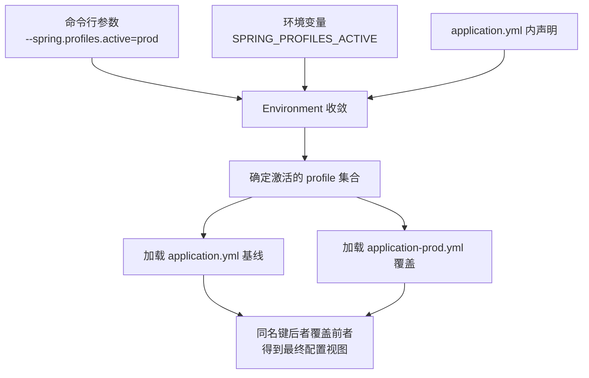
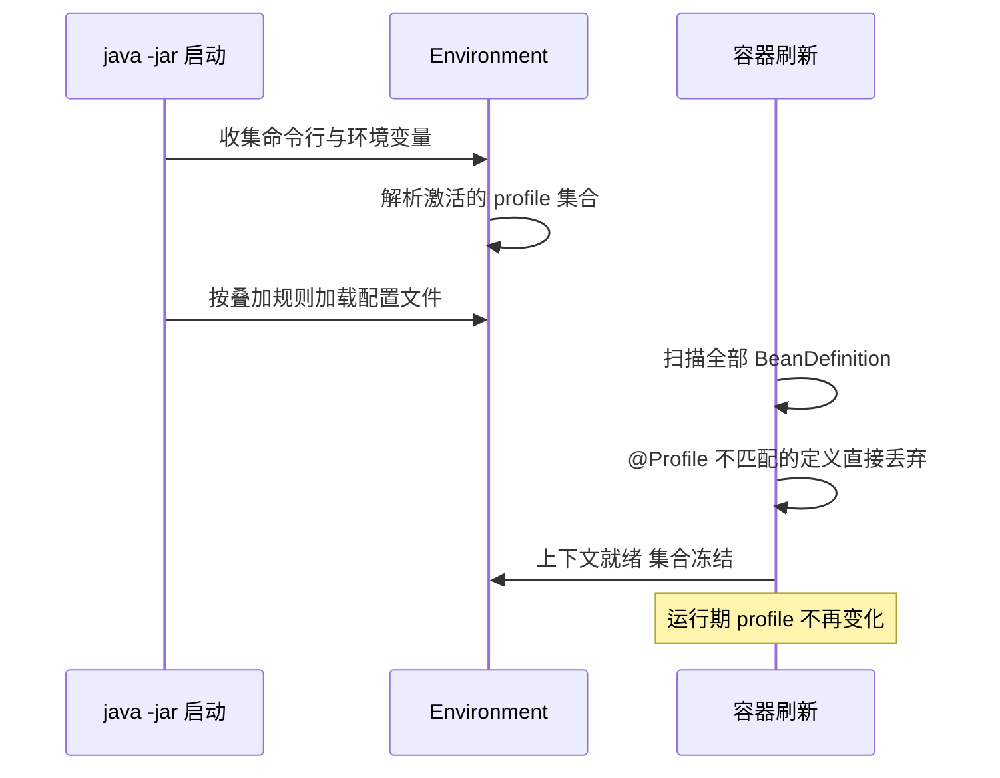

# Profile 多环境

> dev/test/prod 的环境隔离：application-{profile}.yml 怎么叠加、spring.profiles.active 怎么激活、为什么 Profile 只在启动期生效——把多环境的机制边界一次讲清。

## 🎯 本文核心

Profile 的本质是**「启动期的一次性筛选」**：启动时先从命令行/环境变量/配置文件里确定「激活的 profile 集合」，再按叠加规则加载 `application-{profile}.yml` 覆盖基线配置，同时把 `@Profile` 不匹配的 Bean 定义在容器刷新阶段直接丢弃。机制链一句话：**确定集合 → 叠加配置 → 过滤 Bean → 集合冻结**。运行期 profile 不可切换——这不是缺陷，而是设计取舍：环境边界在启动时钉死，才换来了运行期行为的可预测。

## 一句话摘要

Profile = 配置的「分环境覆盖」+ Bean 的「启动期过滤」：一套代码、多套 `application-{profile}.yml`，激活哪个 profile 就叠加哪份配置、装配哪批 Bean；集合在启动那一刻冻结，运行期只认启动时定下的世界。

## 一、背景：一套代码为什么要多套环境

同一个应用，本地开发连本地库、测试环境连测试库、生产连生产库——数据库地址、Redis 地址、日志级别、第三方网关、功能开关，全都随环境变。差异的清单不长，但每一项都是「连错就出事故」级别的：

| 配置项 | dev | test | prod |
|---|---|---|---|
| 数据库地址 | 本地容器 | 测试库 | 生产库 |
| 日志级别 | DEBUG | INFO | WARN |
| 第三方支付网关 | 沙箱 | 沙箱 | 生产网关 |
| 功能开关 | 全开 | 按需 | 灰度 |

如果靠「部署前手动改配置文件」，迟早出现配置漂移：改了忘提交、提交忘改回、dev 的调试开关被带进生产。Profile 机制就是要把「环境差异」从**人工动作**变成**机器规则**——这背后的设计思想是：凡是靠人重复执行且不允许出错的步骤，都应该收编进工具链。

## 二、核心机制：配置叠加与激活

### 2.1 命名约定与叠加规则

Spring Boot 的约定：`application.yml` 是所有环境共享的基线，`application-{profile}.yml` 只在该 profile 激活时加载，**且覆盖基线中的同名键**。

```yaml
# application.yml —— 全环境基线
spring:
  application:
    name: order-service
server:
  port: 8080
```

```yaml
# application-prod.yml —— 只在生产激活时叠加
spring:
  datasource:
    url: jdbc:mysql://prod-db-host:3306/order
logging:
  level:
    root: warn
```

追问一句：为什么这样设计成「基线 + 覆盖」两层，而不是每个环境一份完整文件？因为完整文件意味着三份内容里 80% 重复——重复就是漂移的温床。基线层放不变的部分，环境层只放差异，diff 一眼可见。当然这个设计也有代价：读配置时必须在脑中做一次「两层合并」，新人容易只看环境文件却漏了基线里的隐藏键。

### 2.2 激活方式与优先级

激活 profile 有多条通道，优先级从高到低（官方文档口径）：

```bash
# 1. 命令行参数：优先级最高，运维救急常用
java -jar app.jar --spring.profiles.active=prod

# 2. 环境变量：容器化部署的标准姿势
export SPRING_PROFILES_ACTIVE=prod
```

```yaml
# 3. 配置文件内声明：本地开发常用
spring:
  profiles:
    active: dev
```

命令行 > 环境变量 > 配置文件。这个顺序不是随意的：越靠外的通道越接近「运行现场」，改起来越不用动代码库——底层逻辑是「离部署动作越近的配置，覆盖力越强」。从早期「打包时替换文件」到如今的「一份产物 + 运行期注入」，这条演进路径的终点就是产物一致性。整条链路如下图：



### 2.3 @Profile：Bean 级别的环境开关

Profile 不只管配置文件，还能管 Bean 的装配。`@Profile` 标在配置类或组件上，匹配不上就在启动期被丢弃：

```java
@Configuration
public class PaymentConfig {

    @Bean
    @Profile("dev")
    public PaymentClient mockPaymentClient() {
        return new MockPaymentClient();   // 本地联调用假实现
    }

    @Bean
    @Profile("!dev")
    public PaymentClient realPaymentClient() {
        return new RealPaymentClient();   // 非 dev 用真实现
    }
}
```

`!dev` 表示「非 dev 环境生效」。同一接口两个实现，靠 profile 二选一——这正是把「if (环境 == 生产)」这类散落的分支代码，收编进容器装配的声明式写法。

### 2.4 追问链：为什么 Profile 不能运行期切换

这是本篇最值得打破砂锅的地方。

- **追问一**：配置文件改了，Profile 能不能像开关一样运行期切过去？——不能。profile 集合在 `Environment` 准备阶段就冻结了。
- **再追问**：为什么冻结？运行期改不是更灵活吗？——因为 profile 不只影响配置，还影响 **Bean 装配**。单例 Bean 在容器刷新时就实例化完毕，运行期切换意味着要把一批 Bean 换成另一批，依赖它们的地方全部要失效重建——等于半个应用热重载，一致性代价极高。
- **打破砂锅**：那真正的运行期变更需求怎么办？——区分两类：**值的变化**（改个阈值、换个地址）走配置中心 + `@RefreshScope` 动态刷新；**结构的变化**（换实现类）老老实实重启。Profile 负责启动期定边界，配置中心负责运行期调参数——两者的职责边界恰恰是「结构 vs 值」。



## 三、工程组织：分组、打包与敏感信息

### 3.1 分组 Profile（Boot 2.4+）

环境一复杂，「一个 profile」装不下语义：生产可能 = 生产库 + 生产 MQ + 生产灰度开关三套配置的组合。`spring.profiles.group` 把一组 profile 打包成一个逻辑环境：

```yaml
spring:
  profiles:
    group:
      prod: proddb,prodmq
      test: testdb,testmq
```

激活 `prod` 一个词，等于同时激活 `proddb` 与 `prodmq`——上游只认逻辑环境名，下游自由拆分配置文件。这是用「间接层」控制组合爆炸的典型手法。

### 3.2 与构建、容器的配合

Maven/Gradle 的 profile 与 Spring 的 profile 是两回事：前者管**构建期**（依赖、打包产物），后者管**运行期**。常见配合是构建一条产物、运行期用环境变量决定激活谁——只打一次包，各环境通用。这也是容器化时代的主流姿势：镜像不区分环境，K8s Deployment 里注入 `SPRING_PROFILES_ACTIVE`，同一镜像测完直接上生产，上下游链路里「产物一致性」才成立。

### 3.3 敏感信息不入库的纪律

`application-prod.yml` 里的数据库密码、密钥，绝不提交进代码库。替代方案按演进顺序有三种：环境变量注入（最简）、挂载 Secret 文件、配置中心托管 + 加密。红线只有一条：仓库里能看到的 prod 配置，只能有「结构」，不能有「值」。

## 四、实践：一次线上配置漂移的排查与复盘

分享一个典型的故障场景。某次迭代后，测试环境接口突然集体 404，排查了很久应用日志毫无异常，最后发现是有人为了本地调试方便，把某个 Controller 标了 `@Profile("dev")` 忘了还原——测试环境激活的是 `test` profile，这个 Bean 在启动期就被丢弃了，请求自然打不到。复盘得出三条 Action：一是环境专属 Bean 必须集中在独立配置类并加注释说明；二是 CI 里加一条冒烟测试，用 `test` profile 起容器并探活核心接口；三是 code review 时把「profile 相关改动」列为必检项。这类问题的共性是：**编译期完全无感、启动期静默消失、运行期才暴露**——profile 的过滤发生在 BeanDefinition 阶段，没有任何报错，只能靠约定与自动化兜底。

💡 **实战提示**：本地开发把 `spring.profiles.active=dev` 写在 `application.yml` 里提交，等于给每个人埋雷——用 IDE 的 Run Configuration 或启动参数注入，仓库里永远只保留「未激活」状态。

💡 **实战提示**：给每个环境文件头部写一行注释，列出「本文件与基线的差异清单」，并在 CI 里校验 `application-{dev,test,prod}.yml` 三件套是否同时存在——缺一份就该 fail，而不是等部署时才发现。

💡 **实战提示**：不确定当前激活了哪些 profile 时，启动日志第一行附近会打印 `The following profiles are active: xxx`；也可以注入 `Environment` 对象在启动钩子里显式打印，把「环境自证」变成健康检查的一部分。

💡 **实战提示**：测试代码里用 `@ActiveProfiles("test")` 显式声明，绝不依赖「碰巧没激活就是默认」——测试的环境边界越显式，越不容易在 CI 与本地之间行为不一致。

## 典型使用场景：什么时候用 Profile

**适合用**：数据库/中间件地址分环境、日志级别分环境、Mock 实现与真实实现切换、本地与 CI 的行为差异——凡是「随环境整体切换」的差异。放在多服务的系统架构里看，每个服务各自维护环境文件，还要保证上下游（服务调服务）激活的环境语义一致，这是 Profile 的能力边界之外的事，需要部署流水线统一约束。

**不要用**：频繁变化的业务参数（走配置中心）、用户级差异（走业务数据）、只有一两个键的差异（一个环境变量就够，别为一个键建一个文件）。判断标准一句话：差异是「环境维度的」才用 Profile，其他维度各有各的工具。

## @Profile 与条件开关的区别

两者都做条件装配，粒度不同：`@Profile` 按**环境名**过滤，语义是「这套实现只在 dev/生产用」；`@ConditionalOnProperty` 按**配置键值**过滤，语义是「这个功能由开关项控制」。选型经验：跟环境绑定的用 `@Profile`，跟功能开关绑定的用 `@ConditionalOnProperty`；如果一个开关在生产也要动态拨动，那两者都不合适——它已经越过了启动期边界，该交给配置中心。

## 常见误区与代价

- **误区一：把 prod 密码写进仓库里的环境文件**。历史里永远删不干净，代价是一次凭据泄露的全量轮换。
- **误区二：环境文件越拆越多却不建索引**。十个 profile 文件没人读得动，漂移重新发生——文件数量本身有维护成本。
- **误区三：用 Profile 做运行期开关**。它只在启动期生效，拿它当「热开关」用，改完不重启等于没改——这是最常见的翻车姿势。

## 量级 Trade-off：从三套 yml 到配置中心

小规模（单体应用、万级 QPS 以下，业内认知）：三套 `application-{profile}.yml` 完全够用，别过早引入配置中心。规模上来（几十个微服务、配置项上万，业内认知）：文件方案的上限是「人肉一致性」，此时配置中心（集中托管 + 动态推送 + 变更审计）的收益才会超过它的运维成本——这一档的核心问题从「怎么分环境」变成了「怎么管配置的生命周期」。百万级、千万级流量的系统，配置错误的影响半径是全站的，变更审计与灰度发布就从加分项变成了必选项。

## 你们可能会问

**Q1：`application.yml` 和 `application-{profile}.yml` 都配了同一个键，最终用谁？**
激活 profile 的文件覆盖基线。若同时激活多个 profile（如 `dev,local`），后声明的优先级更高（文档口径），常用于「dev 基础上再叠加个人本地覆盖」。

**Q2：没有激活任何 profile 时用哪份配置？**
只用基线 `application.yml`。也可以通过 `spring.profiles.default` 指定一个兜底 profile——但不推荐依赖兜底，显式声明激活项永远比隐式默认可审计。

**Q3：怎么在代码里判断当前激活了哪个 profile？**
注入 `Environment`，调 `env.getActiveProfiles()`。但先质疑一下自己：如果业务代码里到处在 `if (env == prod)`，说明该收编成 `@Profile` 装配或独立配置类了——分支判断散落是设计气味。

**Q4：多模块项目里每个模块都有自己的 application.yml，会互相覆盖吗？**
classpath 上多个 `application.yml` 只会加载第一个，其余被忽略——这是常见踩坑点。工程纪律：配置文件只放在启动模块，公共模块用「配置类 + 属性类」沉淀默认值。

## 🎯 核心带走

- **核心一句话**：Profile = 启动期的环境筛选器——确定集合、叠加配置、过滤 Bean，然后冻结。
- **机制链**：命令行/环境变量/配置文件 → Environment 收敛激活集合 → `application-{profile}.yml` 覆盖基线 → `@Profile` 不匹配的 BeanDefinition 丢弃 → 上下文就绪，集合不可变。
- **失效点/边界**：运行期不可切换（结构变化须重启）；配置文件多模块同名会被静默忽略；`@Profile` 过滤无任何日志报错，只能靠约定与冒烟测试兜底。

## 5W 速记卡

| 维度 | 内容 |
|---|---|
| What | 按 profile 名叠加配置文件、过滤 Bean 的启动期环境隔离机制 |
| Why | 把环境差异从人工动作变成机器规则，消灭配置漂移 |
| When | 启动期确定环境边界；运行期只调值不切环境 |
| Who | 配置文件、`@Profile` Bean、`Environment` 三层配合 |
| How | `--spring.profiles.active=prod` 激活 → 基线+覆盖合并 → 不匹配 Bean 丢弃 |

## 自测三问

1. `application-dev.yml` 与 `application.yml` 同时存在同名键，最终值是哪个？为什么设计成覆盖而不是报错？
2. 为什么 Profile 不能运行期切换？结构变化与值变化分别该用什么工具？
3. 某个 Controller 在测试环境消失且无任何报错，最可能的原因是什么？如何提前拦截？

## 开放问题

当配置中心全面接管后，Profile 的价值还剩多少？我的判断是：配置中心管「值」，Profile 管「装配结构与启动边界」，两者长期共存——但值得讨论的是，团队规模小、环境简单的阶段，直接上配置中心是否属于过度设计？这个问题的答案取决于变更频率与审计需求，没有统一结论。

## 📌 数据与事实声明

- 文中默认值与行为（叠加规则、激活优先级、分组语法、2.4 版配置数据处理变更）均为 Spring Boot 官方文档公开口径，以所用版本的官方文档为准。
- 「小规模/几十个服务/上万配置项」等分界为业内经验性认知，非精确统计，仅用于表达量级直觉。
- 实践叙事为匿名化的常见场景还原，不指向任何真实公司与系统。

## 📚 参考资料

| 资料 | 说明 |
|---|---|
| [Spring Boot 官方文档 · Profiles](https://docs.spring.io/spring-boot/reference/features/profiles.html) | Profile 机制的权威定义与 2.4+ 变更 |
| [Spring Boot 官方文档 · Externalized Configuration](https://docs.spring.io/spring-boot/reference/features/external-config.html) | 配置叠加与优先级的完整规则 |
| [Spring Framework 官方文档 · @Profile](https://docs.spring.io/spring-framework/reference/core/beans/environment.html#beans-definition-profiles-java) | Bean 级环境过滤的底层说明 |
