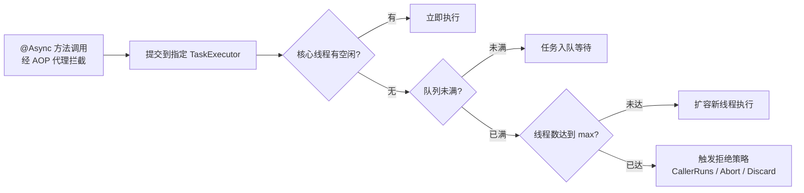
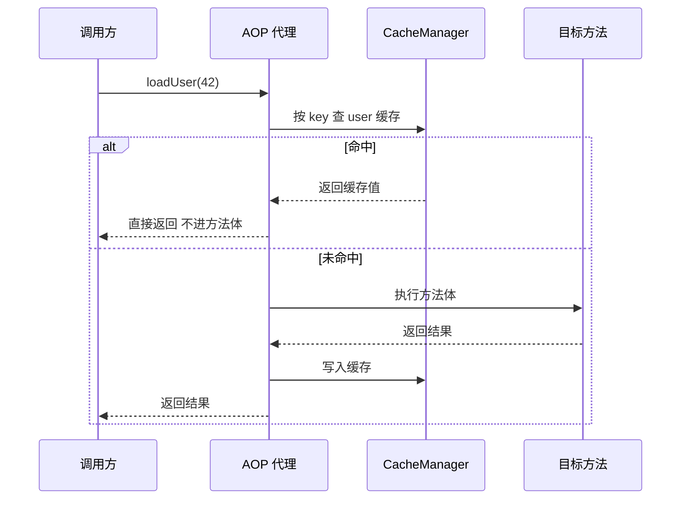

# 异步、定时与缓存集成

> @Async 的线程池陷阱、@Scheduled 的调度模型、@Cacheable 的缓存抽象——三个高频能力一次讲透，把「默认配置为什么危险」翻到机制层。

## 🎯 本文核心

这三件事共享同一个底层结构：**AOP 代理 + 线程/调度器 + 抽象层**。@Async 把方法提交到 TaskExecutor 异步执行（默认执行器偏保守，直上生产危险）；@Scheduled 把方法注册到调度器按节拍触发（默认单线程，一个任务堵全线）；@Cacheable 在方法调用前先查 CacheManager（默认内存 Map，无过期无上限）。机制链一句话：**注解声明意图 → 代理拦截调用 → 委托给执行器/调度器/缓存管理器**。真正要背下来的不是注解怎么写，而是「默认实现的水位线在哪、什么时候必须换」。

## 一句话摘要

@Async/@Scheduled/@Cacheable 都是「注解声明 + 代理委托」的组合拳：异步要自己定有界线程池，定时要知道默认单线程串行，缓存要理解注解只是抽象、实现由 CacheManager 决定——三者共同的安全法则是：默认配置能跑通 demo，但都到不了生产水位。

## 一、背景：为什么这三个能力总被一起讲

接口响应要快，耗时动作（发通知、生成报表、同步数据）得异步化；数据汇总、状态巡检要按节拍自动跑，这是定时；读多写少的热点数据不想每次都打数据库，这是缓存。从手写 Thread 与 Timer 到注解化编程模型，这条演进路线把接入成本压到一行注解——但能力的下限仍由底层设施决定。三者都是「主流程之外的辅助能力」，也都是**出问题不报错、出事故才显形**的类型——线程悄悄堆积、任务悄悄错过、缓存悄悄过期，正因为症状滞后，才要在入门阶段就把默认行为的边界搞清。

## 二、核心机制：@Async 与线程池

### 2.1 默认执行器为什么危险

先说结论：不配置线程池就用 `@Async`，相当于把方法的执行命运交给一套**不为业务负载设计**的默认策略。

- 原生 Spring 场景（只加 `@EnableAsync`、容器里没有任何 Executor Bean）：默认用 `SimpleAsyncTaskExecutor`——**每个任务新建一个线程，不复用、无上限**。任务提交速率一旦高于处理速率，线程数线性上涨，线程是重量级资源，涨上去就是线程爆炸（公开口径：这是 Spring Framework 的默认行为，非 Boot 场景）。
- Spring Boot 2.1+ 场景：自动配置了 `applicationTaskExecutor`，核心线程数默认 8、**队列默认无界**（官方文档默认值口径）。无界队列意味着任务永远进得去——高峰期任务在队列里排队，内存水位随积压上涨，响应延迟膨胀，极端情况堆内存被打满。

两种默认的危险形态不同：前者是「线程无上限」，后者是「队列无上限」。共同点一句话：**默认值的目标是「让 demo 跑起来」，不是「让系统扛住峰值」**。

### 2.2 自定义线程池：有界 + 拒绝策略

```java
@Configuration
@EnableAsync
public class AsyncConfig {

    @Bean("bizExecutor")
    public ThreadPoolTaskExecutor bizExecutor() {
        ThreadPoolTaskExecutor executor = new ThreadPoolTaskExecutor();
        executor.setCorePoolSize(8);
        executor.setMaxPoolSize(16);
        executor.setQueueCapacity(500);            // 有界队列：积压有上限
        executor.setThreadNamePrefix("biz-async-"); // 线程名可观测：排查日志的第一线索
        executor.setRejectedExecutionHandler(new ThreadPoolExecutor.CallerRunsPolicy());
        executor.initialize();
        return executor;
    }
}
```

```java
@Async("bizExecutor")   // 显式指定执行器，不依赖默认
public void sendNotify(Long orderId) { ... }
```

设计思想一句话：**容量有限 + 拒绝有策**。队列有界后，「满了怎么办」必须有答案：`CallerRunsPolicy` 让提交线程自己执行（天然背压，拖慢上游）；`AbortPolicy` 直接抛异常（快速失败）；丢弃类策略只适合可容忍丢失的场景（如日志上报）。没有银弹，按「任务丢了会怎样」来选——这就是为什么不用默认值、也为什么没有一个推荐值能通吃所有业务。

任务从提交到执行（或被拒绝）的流转如下图：



### 2.3 追问链：@Async 为什么会失效

- **追问一**：为什么同一个类里方法 A 直接调用带 `@Async` 的方法 B，异步不生效？——因为 `@Async` 靠 AOP 代理实现：外部调用先打到代理对象，由代理把调用切到线程池。自调用走的是 `this`，即原始对象，根本没经过代理。
- **再追问**：那把 `this` 换成从容器里拿自己的代理呢？——可以，但更好的解法是**按职责拆类**：把异步方法挪到另一个 Bean。需要绕代理才能工作的代码，本身就是「职责混在一起」的设计气味。
- **打破砂锅**：代理的本质是什么？——容器里注册的是「包裹了目标对象的代理壳」，事务、异步、缓存三类注解全靠这层壳工作。理解了这一点，三类注解的失效场景可以统一推导：**凡是没经过代理壳的调用（自调用、final 方法、private 方法），注解全部失效**——不需要逐个背，机制会自己给出答案。

## 三、机制：@Scheduled 定时任务

### 3.1 三种触发方式

```java
@Scheduled(fixedDelay = 5000)     // 上一次执行「结束」后等 5 秒再触发
public void syncOnce() { ... }

@Scheduled(fixedRate = 5000)      // 上一次执行「开始」后 5 秒触发（不管是否结束）
public void pollData() { ... }

@Scheduled(cron = "0 0 3 * * ?")  // cron 表达式：每天凌晨 3 点
public void dailyReport() { ... }
```

### fixedRate 与 fixedDelay 的区别

一句话：**fixedRate 看开始时刻，fixedDelay 看结束时刻**。fixedRate 适合「采样/巡检」类任务——节拍稳定，哪怕某次执行慢了，下次仍按节拍补上（默认单线程下会顺延排队）；fixedDelay 适合「上一次没做完就别开始下一次」的任务——比如同步任务，保证同一时刻只有一轮在跑。选错触发方式的代价很隐蔽：把幂等性没做好的同步任务配成 fixedRate，任务执行超过 5 秒时就会叠加执行，数据被并发写坏。

### 3.2 默认单线程与多实例问题

`@Scheduled` 默认注册的是**单线程调度器**（官方默认口径：调度线程池大小为 1）。这意味着：一个每 5 秒跑一次的任务如果卡住 10 分钟，期间**所有**定时任务全部停摆——不只是它自己。所以只要有两个以上定时任务，就显式配调度线程池：

```properties
spring.task.scheduling.pool.size=4
```

另一个更结构性的边界：`@Scheduled` 是**单机语义**。应用部署两个实例，同一个任务每台都会跑一遍——对巡检类是重复消耗，对写库类是数据错乱。分布式锁、分片、或独立调度平台（集中编排 + 分发执行）是三种常见解法，量级上来后多会收敛到独立调度平台，让业务应用只做执行者。

## 四、机制：@Cacheable 与缓存抽象

### 4.1 注解只是抽象，CacheManager 才是实现

```java
@Configuration
@EnableCaching
public class CacheConfig { }

@Cacheable(value = "user", key = "#userId")   // 命中缓存直接返回，不进方法体
public User loadUser(Long userId) { ... }

@CacheEvict(value = "user", key = "#userId")  // 更新后清缓存
public void updateUser(Long userId, User u) { ... }
```

`@EnableCaching` 之后，Spring 用 AOP 在方法调用前插一道「先查缓存」：命中则直接返回，未命中才执行方法并把结果写入缓存。查哪个缓存、用什么序列化、有没有过期时间，全部由 `CacheManager` 决定。不引入外部缓存时，Boot 默认给的是**基于内存的 ConcurrentMap 缓存**（官方口径）：没有过期时间、没有容量上限——数据只增不减，长期运行就是内存泄漏的温床。所以默认实现只适合开发验证；生产接 Redis 时引入相应 starter，`CacheManager` 自动切到 Redis 实现，注解一行不用改——**抽象层换实现不动业务代码**，这正是缓存抽象的设计目标。



### 4.2 本地缓存与远端缓存的取舍

本地缓存快在「进程内零网络开销」，代价是**多实例间不一致**（每个实例各一份副本）；远端缓存（Redis）天然共享，代价是每次读写多一跳网络。什么时候用哪个：极热点、可容忍秒级不一致的用本地；强一致要求、数据量大的用远端；两者都要的多级缓存组合，但要直面「先更库再删缓存」的一致性设计成本。不存在「又快又一致还简单」的选项——取舍是缓存永恒的主题。

## 五、实践：一次队列堆积的排查与复盘

一次真实形态的问题：某应用上线新功能后，接口响应逐渐从毫秒劣化到秒级，CPU 与连接池指标都正常，监控看不出毛病。排查过程：先看线程 dump，发现几十个 `biz-async-` 线程外，堆里还躺着上万条排队任务——原来新功能把「发站内信」标了 `@Async` 但用的是默认无界队列执行器，下游消息服务一抖动，处理速度下降，队列静默膨胀。复盘结论三条：一是线程池必须显式定义且有界，拒绝策略按业务语义选；二是队列深度要有监控指标（TaskExecutor 暴露了活跃/队列数据），水位超阈值就告警；三是异步任务也要有超时与降级，不能只进不出。这次故障的教训浓缩成一句话：**无界的东西（线程、队列、缓存）在系统里都是定时炸弹，爆炸时间由流量决定**。

💡 **实战提示**：`@Async` 方法返回值用 `void` 或 `CompletableFuture`，别用同步返回类型——前者丢异常无感知，后者才是「取回异步结果」的正确通道。

💡 **实战提示**：给异步与定时任务都打上独立线程名前缀，日志里一眼区分业务线程与池化线程——排查线程问题时，命名是成本最低的可观测性投资。

💡 **实战提示**：缓存 key 必须带业务维度（如 `user:{tenantId}:{userId}`），并把「缓存已清但库还没写完」的时间窗口想清楚——更新路径推荐「先更库、再删缓存」，配合过期时间做兜底。

💡 **实战提示**：`@Scheduled` 任务务必幂等且可重入——调度平台重试、实例重启、上一轮超时，都可能导致同一任务被执行两次，写操作没有幂等防线就是事故。

## 典型使用场景：什么时候用它们

**@Async 适合**：耗时不敏感结果的旁路动作（通知、日志、预热）。**不适合**：调用方需要结果才能继续的逻辑（那叫同步依赖），以及严格顺序要求的处理（该用消息队列）。什么时候用 @Async 什么时候上 MQ 的判断标准一句话：**丢了要不要紧、要重试吗、调用方在乎结果吗**——在乎就别用线程池硬扛。**@Cacheable 适合**：读多写少、key 可枚举、能容忍短暂过期的数据；不适合频繁写、强一致计数值。

## 常见误区与代价

- **误区一：以为加了 `@Async` 就异步了**。自调用、非 public 方法、没开 `@EnableAsync`，三种情况全部静默同步执行——性能问题可能因此原样保留。
- **误区二：把线程池队列设得「越大越保险」**。队列只是把拒绝延迟成积压，积压的代价（内存、延迟）比拒绝更隐蔽。
- **误区三：缓存一切**。缓存命中率的背后是淘汰与一致性成本，低命中率的缓存等于白付一层架构税。

## 量级 Trade-off：从单机注解到分布式设施

万级日请求的单体应用（业内认知量级）：注解三件套 + 默认设施基本够用，别急着上外部组件。十万级 QPS：线程池要按业务隔离（核心交易与旁路通知分池，避免互相打穿），缓存必须外置到 Redis 集群，定时任务开始需要分布式锁防重。到百万级、千万级：单机注解只能当「执行者」，编排、分片、补偿都该交给独立调度平台，缓存走多级架构并直面一致性设计——这一档的核心问题从「注解怎么配」升级为「故障半径怎么控」。每升一档，都是把「单机默认」换成「有界的、可观测的、可补偿的」。

## 你们可能会问

**Q1：@Async 标在 Controller 方法上会怎样？**
语法上可行，但等于让请求处理线程提前返回、响应与实际处理脱钩——接口语义会变得难以解释。异步能力应下沉到 Service 层，Controller 保持「请求-响应」语义纯粹。

**Q2：定时任务执行时间超过触发间隔会怎样？**
单线程调度器下顺延排队，多任务时还会阻塞别的任务；fixedRate 的错过节拍会尝试补偿执行。所以任务体必须评估最坏耗时，并给调度池留余量。

**Q3：缓存注解能标在同一个类内部互调的方法上吗？**
不能——与 `@Async` 同一个原因：自调用不经过代理，缓存拦截器没机会介入。这是三类注解共享的失效机理，理解一处即可统一推导。

**Q4：Redis 缓存对象需要什么条件？**
默认序列化要求可序列化；工程上更推荐显式配置 JSON 序列化，避免 JDK 序列化的黑盒与跨服务不兼容问题。

## 🎯 核心带走

- **核心一句话**：三个注解都是「代理拦截 + 委托给默认设施」，而三个默认设施（保守执行器、单线程调度器、内存 Map 缓存）都只到 demo 水位。
- **机制链**：注解声明 → AOP 代理拦截 → 委托 TaskExecutor / 调度器 / CacheManager → 未经代理的调用一律失效。
- **失效点/边界**：自调用失效是三类注解的共同死穴；默认线程池无界队列会静默积压；默认调度单线程会连环阻塞；默认缓存无过期无上限。生产前逐一显式化。

## 5W 速记卡

| 维度 | 内容 |
|---|---|
| What | @Async 异步执行、@Scheduled 定时触发、@Cacheable 缓存读写的注解化集成 |
| Why | 把旁路耗时、周期任务、热点读取从主流程剥离，注解声明即可接入 |
| When | 旁路不敏感结果才异步；周期任务须评估耗时与多实例；读多写少才缓存 |
| Who | AOP 代理 + TaskExecutor / 调度器 / CacheManager 三个底层设施 |
| How | 显式定义有界线程池、显式配调度池大小、显式选缓存实现与序列化 |

## 自测三问

1. `SimpleAsyncTaskExecutor` 与 Boot 自动配置的执行器，危险形态分别是什么？
2. 为什么自调用会让 @Async、@Cacheable 同时失效？推导依据是什么？
3. fixedRate 与 fixedDelay 的区别是什么？选错会引发什么问题？

## 开放问题

注解式异步/缓存的便利，让「旁路逻辑」的接入成本趋近于零——但也让滥用成本趋近于零。值得讨论的反思是：这类能力是否应该收口到一个团队级的封装层（统一线程池治理、统一缓存 key 规范），而不是任由每个业务自由标注？我的判断是收口的收益随团队规模上升，但小团队过早收口会牺牲灵活性，边界在哪值得结合变更频率持续观察。

## 📌 数据与事实声明

- 默认行为描述（SimpleAsyncTaskExecutor 逐任务建线程、Boot 自动执行器核心 8 线程/无界队列、调度器默认单线程、默认内存缓存无过期）均为 Spring Framework / Spring Boot 官方文档公开口径，以所用版本文档为准。
- 线程池参数、队列容量等具体数值为示例，实际取值需按压测结果定，文中量级分界为业内经验认知。
- 故障叙事为匿名化场景还原，不指向任何真实公司与系统。

## 📚 参考资料

| 资料 | 说明 |
|---|---|
| [Spring Boot 官方文档 · Task Execution and Scheduling](https://docs.spring.io/spring-boot/reference/features/executing-tasks.html) | 默认执行器与调度器配置的权威说明 |
| [Spring Framework 官方文档 · Async 注解](https://docs.spring.io/spring-framework/reference/integration/scheduling.html) | @Async/@Scheduled 的代理机制与失效边界 |
| [Spring 官方文档 · Cache Abstraction](https://docs.spring.io/spring-framework/reference/integration/cache.html) | 缓存抽象与 CacheManager SPI 设计 |
