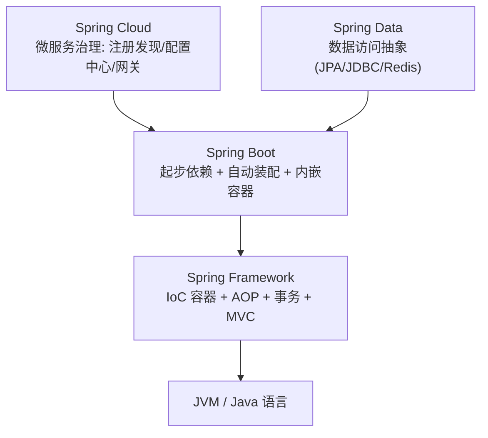
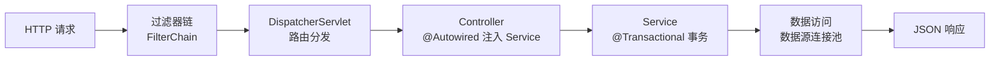

# Spring 生态与 Spring Boot 全景

> 先画地图再走路：Spring Framework / Boot / Cloud 各自解决什么问题，Boot 为什么能简化开发，3.5 与 4.x 主线怎么选。

## 一句话摘要

Spring 生态是分层的三层楼：Framework 提供 IoC/AOP 地基，Boot 在地基上用「起步依赖 + 自动装配 + 内嵌容器」消灭样板配置，Cloud 再往上补微服务治理。Boot 的价值不是新功能，而是把 Framework 的能力从「会配才会用」变成「引依赖就能跑」。

## 一、背景：Java Web 演进与 Spring 生态版图

最早的 Java Web 开发是什么样？写一个 Servlet 要在 web.xml 里注册，用一个 Service 要自己 `new` 或者手写工厂，连个数据库连接池都要自己挑、自己配、自己管生命周期。**框架能力是有的，但「装配」的成本全压在开发者身上**——这就是 Servlet 容器时代的手工装配痛点。

Spring Framework 的回答是 IoC 容器：对象的创建和组装交给容器（你声明「我需要什么」，容器负责「给你什么」），再加 AOP 把事务、日志这类横切逻辑从业务代码里抽出去。这一步解决了「对象从哪来」，但配置依然繁重——XML 时代一个中型项目几百行配置文件是常态。

于是版图分了层：



**Boot 在生态里的定位一句话：约定大于配置的启动器**。它不替代 Framework 的任何能力，只是把「这些能力怎么组装」按最常见的场景替你约定好了——你引入 `spring-boot-starter-web`，Tomcat、Spring MVC、Jackson 就全部就位，一行配置不写。

## 二、核心：为什么需要 Spring Boot

**起步依赖**消灭「该引哪些 jar」的问题。没有 Boot 时搭一个 Web 项目，你要自己找 spring-core、spring-web、spring-mvc、jackson、tomcat-embed…… 十几个 jar 的版本要互相兼容。`spring-boot-starter-web` 一个依赖把这组「惯用组合」打包，版本由 Boot 统一仲裁。

**自动装配**消灭「该怎么配」的问题。类路径上有数据源驱动和 JPA，Boot 就自动配好数据源和实体管理器；有 `spring-boot-starter-web`，就自动配好 MVC 和内嵌 Tomcat。约定不满足时你再用 `application.yml` 覆盖——**先约定，后覆盖**，配置量从几百行缩到几十行。

**内嵌容器**消灭「部署形态」的问题。传统部署要装 Tomcat、往 webapps 里丢 war；Boot 把 Tomcat 嵌进应用本身，`java -jar` 直接跑，容器化时代这个特性是天然亲和的。

版本主线的现实选择：**3.5.x 要求 Java 17+**，是当前生产主力；**4.x 推荐 Java 21**，代表下一代基线。选型看团队 JDK 版本与依赖生态的兼容矩阵，本系列以 3.5.x 为主线，4.x 差异文中标注。

## 三、关键概念：IoC / AOP / 自动装配的初印象

**IoC（控制反转）**：你不 `new UserService()`，你声明 `@Autowired UserService`——对象的创建、装配、生命周期全归容器。「控制」从你的代码反转到了容器手里，换来的是装配灵活和单例复用。

**AOP（面向切面）**：事务、日志、权限这类逻辑横切所有业务方法，写一遍切面统一生效，业务代码保持干净。`@Transactional` 能加个注解就管事务，背后就是 AOP 代理。

**自动装配的入口是 `@SpringBootApplication`**，它三合一：

```java
@SpringBootApplication
    = @SpringBootConfiguration   // 配置类身份
    + @EnableAutoConfiguration   // 开启自动装配（按类路径条件装配 bean）
    + @ComponentScan             // 扫描本包及子包的组件
```

记住这个三合一，后面的 Bean 生命周期、starter 机制、条件装配篇都会回到它。

一个请求在 Boot 应用里的处理上下游也就此定型：过滤器链 → DispatcherServlet → Controller（容器注入的 Service）→ 数据访问 → 响应序列化。整条链路的每一环都是自动装配好的 bean——这也是后续章节反复展开的主线。



版本选择的取舍本质是「新基线的收益 vs 生态迁移的代价」：4.x 带来更新的 JDK 基线与虚拟线程亲和，代价是第三方依赖必须完成 Jakarta 迁移；3.5.x 是当前生态兼容面最宽的安全线。

## 四、实践视角：怎么选版本与看官方文档

**典型场景**：新项目（微服务/中后台服务）→ Boot 3.5.x + Java 17 起步；维护老项目 → Boot 2.7 是最后一代 Java 8 线，升级路径 2.7 → 3.x 要过 Jakarta 命名空间迁移关。

**与官方文档的查询法**：Boot 官方维护 3.5 与 4.1 双版本文档，URL 里带版本号，查配置项时先确认右侧版本切换器对准你用的版本——配置项在代际间会增删。

**与 Java 语言系列的分工**：本系列讲 Boot 的「装配与工程」，Java 系列（同仓库 use-java）讲语言与 JVM——lambda、Stream、虚拟线程这些语言能力在那边，两系列配合阅读。

## 与 Framework 和 Cloud 的区别

| 对比 | Spring Framework | Spring Boot | Spring Cloud |
|---|---|---|---|
| 解决什么 | IoC/AOP/MVC 能力本身 | 能力的快速装配与运行 | 微服务治理问题 |
| 你写的还是它做的 | 能力是它的，装配是你的 | 装配也替你做了（约定+自动装配） | 治理组件的集成 |
| 类比 | 发动机 | 整车（发动机已装好） | 车队调度系统 |

一句话：**Boot 依赖 Framework，Cloud 依赖 Boot**——层级是叠加的，不是三选一。

## 常见误区

- **误区一：Boot 是新框架，要「学一套新的」**。Boot 的核心能力全是 Framework 的，学 Boot 主要学的是自动装配规则和配置体系，不是新编程模型
- **误区二：自动装配是魔法，出了问题没法查**。自动装配全按条件注解（`@ConditionalOnClass` 等）工作，`--debug` 启动能打印完整的条件评估报告，每一颗 bean 为什么有/没有都有据可查
- **误区三：版本越新越好，直接上 4.x**。先看关键第三方依赖（老 SDK、驱动）是否完成 Jakarta 迁移——升级的瓶颈从来不在 Spring 自己

## 自测三问

1. **Boot 替代了 Spring Framework 吗？**
   - 没有。Boot 建立在 Framework 之上，IoC/AOP/MVC 全部来自 Framework，Boot 只解决「装配与运行」。

2. **为什么引一个 starter 就能用一堆功能？**
   - starter = 一组惯用依赖的打包（起步依赖）+ 对应的自动装配配置类（按类路径条件生效）。

3. **3.5 和 4.x 怎么选？**
   - 看团队 JDK 与依赖生态：Java 17 起步选 3.5.x；已上 Java 21 且依赖生态就绪可评估 4.x。生产以稳定优先。

## 5W 速记卡

| W | 一句话 |
|---|---|
| What | Boot = Framework 能力的「约定大于配置」启动器 |
| Why | 消灭样板配置与依赖仲裁负担，`java -jar` 直接跑 |
| Where | JVM 服务端应用的默认起点 |
| When | 新项目即开即用；老项目经 2.7 → 3.x 迁移路径升级 |
| Who | 后端开发者入门 Spring 生态的第一站 |

## 下篇预告

下一篇 [2_第一个应用与工程结构](./2_第一个应用与工程结构-入门.md)：从 start.spring.io 生成第一个应用，看标准目录结构与 pom 里到底藏了什么。

## 📌 数据与事实声明

- 写于 2026-09-09，主线 Spring Boot 3.5.x（Java 17+），4.x 差异文中标注
- 行业认知：Boot 3.x 全面转向 Jakarta 命名空间（javax → jakarta），为官方迁移指南口径
- 免责：版本要求与配置项以 spring.io 官方文档为准

## 📚 参考资料

| 类型 | 标题 | 来源 |
|---|---|---|
| 官方文档 | Spring Boot Reference（3.5/4.1 双版本） | spring.io/projects/spring-boot |
| 官方文档 | Spring Framework Overview | docs.spring.io/spring-framework/reference/ |
| 书 | 《Spring 实战》第 6 版 | 参考资料 |
