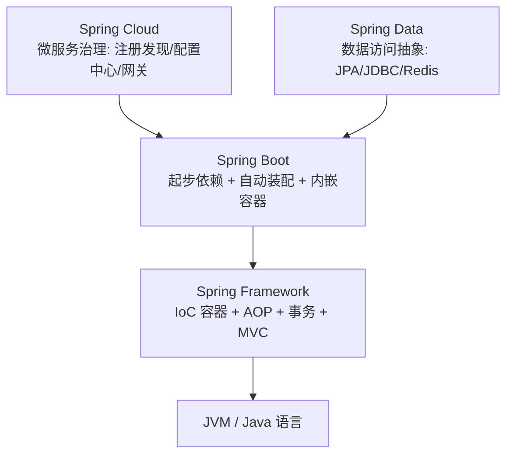
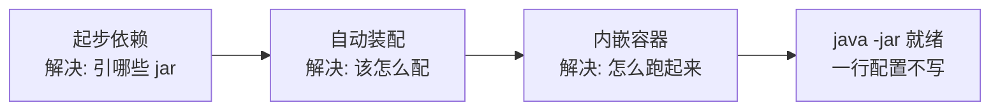
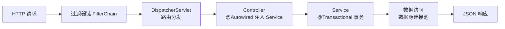

# Spring 生态与 Spring Boot 全景

> 先画地图再走路：Spring Framework / Boot / Cloud 各自解决什么问题，Boot 为什么能简化开发，3.5 与 4.x 主线怎么选。

## 🎯 本文核心

Spring 生态是一栋三层楼：**Framework 打地基（IoC/AOP/事务/MVC），Boot 做装修（起步依赖 + 自动装配 + 内嵌容器），Cloud 加电梯（微服务治理）**。Boot 的价值不是新功能，而是把 Framework 的能力从「会配才会用」变成「引依赖就能跑」。**机制链**：你引一个 starter → 类路径出现特征类 → 自动装配按条件注册 bean → 内嵌容器启动 → 应用就绪。记住这条链，本系列后面每一篇都是在放大其中的某一环。

## 一句话摘要

最早的 Java Web 开发，框架能力是有的，但「装配」的成本全压在开发者身上：写 Servlet 要注册 web.xml，用一个 Service 要自己 `new` 或者手写工厂，连数据库连接池都要自己挑、自己配、自己管生命周期。Spring Framework 用 IoC 容器回答了「对象从哪来」，Spring Boot 再回答「怎么零配置跑起来」——三者是叠加关系，不是三选一。

## 一、背景：Java Web 演进与 Spring 生态版图

回顾这段演进史，每个阶段都在解决上一代留下的痛：

- **Servlet 容器时代**：外装 Tomcat，组件手工装配，XML 配置几百行是中型项目常态
- **Spring Framework 时代**：IoC 容器接管对象创建与组装，AOP 把事务、日志这类横切逻辑从业务代码里抽出去——解决了「对象从哪来」，但配置依然繁重
- **Spring Boot 时代**：约定大于配置，装配也替你做了——配置量从几百行缩到几十行
- **Spring Cloud 时代**：单体能跑了，分布式的新问题（注册发现、配置中心、网关、熔断）在 Boot 之上补齐

版图分层一张图：



一句话定位：**Boot 依赖 Framework，Cloud 依赖 Boot**——层级是叠加的。Boot 不替代 Framework 的任何能力，只是把「这些能力怎么组装」按最常见的场景替你约定好了。

## 二、核心机制：Boot 三板斧如何消掉样板成本

Boot 简化开发的全部秘密就是三件套，每一件对应一类样板成本：

**① 起步依赖**消灭「该引哪些 jar」。没有 Boot 时搭一个 Web 项目，你要自己找 spring-core、spring-web、spring-mvc、jackson、tomcat-embed…… 十几个 jar 的版本要互相兼容。`spring-boot-starter-web` 一个依赖把这组惯用组合打包，版本由 Boot 统一仲裁——这是「约定大于配置」在依赖层的体现。

**② 自动装配**消灭「该怎么配」。类路径上有数据源驱动和 JPA，Boot 就自动配好数据源和实体管理器；有 `spring-boot-starter-web`，就自动配好 MVC 和内嵌 Tomcat。约定不满足时你再用 `application.yml` 覆盖——**先约定，后覆盖**。它的底层是条件装配（`@Conditional` 家族），篇 6 展开。

**③ 内嵌容器**消灭「部署形态」。传统部署要装 Tomcat、往 webapps 里丢 war；Boot 把 Tomcat 嵌进应用本身，`java -jar` 直接跑——容器化时代这个特性是天然亲和的，应用镜像自带运行时，环境一致性由镜像保证。

三板斧的接力关系：



**为什么这么设计？** Boot 的设计哲学是「opinionated（有主见的默认值）」：官方替你对 80% 的常见场景做主，剩下 20% 留覆盖口子。代价是默认值出问题时，你得先知道「有一个默认在那」才谈得上改它——这就是为什么学 Boot 的重点是搞懂它的装配规则，而不是背配置项。

## 5W 速记卡

| W | 一句话 |
|---|---|
| What | Boot = Framework 能力的「约定大于配置」启动器 |
| Why | 消灭样板配置与依赖仲裁负担，`java -jar` 直接跑 |
| Where | JVM 服务端应用的默认起点 |
| When | 新项目即开即用；老项目经 2.7 → 3.x 迁移路径升级 |
| Who | 后端开发者入门 Spring 生态的第一站 |

## 三、关键概念：IoC / AOP / 自动装配的初印象

**IoC（控制反转）**：你不 `new UserService()`，你声明 `@Autowired UserService`——对象的创建、装配、生命周期全归容器。「控制」从你的代码反转到了容器手里，换来的是装配灵活和单例复用。

**AOP（面向切面）**：事务、日志、权限这类逻辑横切所有业务方法，写一遍切面统一生效。`@Transactional` 能加个注解就管事务，背后就是 AOP 代理——原理入门见篇 7，代理机制的源码走读在特性层《深入理解AOP与代理》。

**自动装配的入口是 `@SpringBootApplication`**，它三合一：

```java
@SpringBootApplication
    = @SpringBootConfiguration   // 配置类身份
    + @EnableAutoConfiguration   // 开启自动装配（按类路径条件装配 bean）
    + @ComponentScan             // 扫描本包及子包的组件
```

记住这个三合一，后面的 Bean 生命周期、starter 机制、条件装配篇都会回到它。

一个请求在 Boot 应用里的处理上下游也就此定型：



整条链路的每一环都是自动装配好的 bean——这也是后续章节反复展开的主线。

## 四、版本主线：3.5.x 与 4.x 的取舍

版本选择的本质是「新基线的收益 vs 生态迁移的代价」：

- **3.5.x 要求 Java 17+**：当前生产主力，生态兼容面最宽
- **4.x 推荐 Java 21**：下一代基线，带来更新的 JDK 能力（虚拟线程亲和）与更干净的内部分层

选型决策树一句话：新项目看团队 JDK 与关键依赖——Java 17 起步选 3.5.x；已上 Java 21 且第三方依赖完成 Jakarta 迁移，可评估 4.x。**升级的瓶颈从来不在 Spring 自己，而在老 SDK、老驱动是否完成 Jakarta 命名空间迁移（javax → jakarta）**。维护老项目则记住：Boot 2.7 是最后一代 Java 8 线，2.7 → 3.x 要专门过迁移关。

不同规模的团队路径也不同（业内认知口径）：十万行代码以内的小服务，直接新基线起步，历史包袱为零；百万行级的老应用，升级要按模块灰度推进，先把测试覆盖补齐再动命名空间；亿级请求的核心链路，升级窗口要跟大促节奏错开，一般先在边缘服务试点一个季度再推核心。

## 五、典型使用场景

- **新项目起步**：微服务/中后台服务直接 Boot 3.5.x + Java 17，从 start.spring.io 五分钟到第一个接口（篇 2）
- **维护老项目**：Boot 2.7 维持运行，按「依赖 Jakarta 迁移就绪度」排升级路线
- **公司内组件封装**：把日志埋点、加解密等公共能力包成 starter（篇 6）
- **容器化交付**：内嵌容器 + `java -jar` 是镜像化的天然入口（篇 23）
- **查官方文档**：Boot 官方维护 3.5 与 4.x 双版本文档，查配置项时先确认版本切换器对准你用的版本——配置项在代际间会增删

## 六、与 Framework 和 Cloud 的区别

| 对比 | Spring Framework | Spring Boot | Spring Cloud |
|---|---|---|---|
| 解决什么 | IoC/AOP/MVC 能力本身 | 能力的快速装配与运行 | 微服务治理问题 |
| 装配谁做 | 能力是它的，装配是你的 | 装配也替你做了（约定 + 自动装配） | 治理组件的集成 |
| 类比 | 发动机 | 整车（发动机已装好） | 车队调度系统 |
| 学什么 | 编程模型本身 | 装配规则与配置体系 | 治理模式与容错 |

常见误解是把它当「三选一」的竞品关系——恰恰相反，它们是逐层依赖：没有 Framework 的 IoC，Boot 的自动装配无从谈起；没有 Boot 的启动器，Cloud 的治理组件每家都要自己写一遍样板。从架构分层看，这套体系的思想很典型：每层只解决增量问题，下层能力通过约定透传上来——这也是判断「一个库该不该引入」的架构直觉：看它站在哪一层、是否与现有层次重叠。

## 七、常见误区与适用边界

- **误区一：Boot 是新框架，要「学一套新的」**。Boot 的核心能力全是 Framework 的，学 Boot 主要学的是自动装配规则和配置体系，不是新编程模型
- **误区二：自动装配是魔法，出了问题没法查**。自动装配全按条件注解工作，`--debug` 启动能打印完整的条件评估报告，每一颗 bean 为什么有/没有都有据可查
- **误区三：版本越新越好，直接上 4.x**。先看关键第三方依赖是否完成 Jakarta 迁移——框架升级的工程判断是「生态先行」
- **不适用边界**：极端小工具（几百行的命令行脚本）用原生 JDK 反而更轻；Boot 的价值随工程复杂度上升而放大，一个脚本也谈不上装配成本

## 八、实践叙事：一次「起不来」的排查复盘

新人生涯几乎必遇的一类问题：依赖加了、代码抄了，应用就是起不来。把一次典型排查复盘记在这里——某次本地启动报 `NoSuchMethodError`，类路径上有两个版本的 JSON 库。排查路径三步：先看报错栈找到冲突类名，再跑 `mvn dependency:tree` 定位是谁带进来的旧版本，最后在 pom 里对肇事依赖加 `<exclusions>`。这类问题的本质是**依赖仲裁失守**：parent 只管 Spring 生态的版本，第三方 jar 自带的传递依赖仍可能冲突。复盘的教训是「加依赖前看一眼它拖家带口带了谁」，而不是出了事再查。生产环境的同款问题更隐蔽——启动不报错、运行到特定分支才炸，所以依赖冲突要在 CI 阶段拦，不要赌运行期。

## ❓ 你们可能会问

**Q1：Boot 替代了 Spring Framework 吗？**
没有。Boot 建立在 Framework 之上，IoC/AOP/MVC 全部来自 Framework，Boot 只解决「装配与运行」。两者是楼层关系：Framework 是地基，Boot 是装修好的整层。

**Q2：为什么引一个 starter 就能用一堆功能？**
starter = 一组惯用依赖的打包（起步依赖）+ 对应的自动装配配置类（按类路径条件生效）。依赖解决「类在不在」，条件装配解决「配不配」——两件事接力完成「引依赖即得功能」。

**Q3：3.5 和 4.x 怎么选？**
看团队 JDK 与依赖生态：Java 17 起步选 3.5.x；已上 Java 21 且依赖生态就绪可评估 4.x。生产以稳定优先，升级窗口避开业务高峰。

## 自测三问

1. Spring 生态三层各自解决什么问题？
2. Boot 三板斧分别消灭哪类样板成本？
3. 为什么说「升级瓶颈不在 Spring 自己」？

## 💡 实战提示

- 💡 查配置项先对准版本文档——Boot 代际间配置项会增删，拿旧版本文档的配置抄到新版本是常见事故源
- 💡 加任何第三方依赖前跑一次 `mvn dependency:tree` 看传递依赖，冲突在引入时发现比运行时发现便宜十倍
- 💡 与 Java 语言系列分工：本系列讲 Boot 的「装配与工程」，语言与 JVM（lambda、Stream、虚拟线程）归同仓库 Java 系列，两系列配合阅读
- 💡 追问一下「约定」的来源：Boot 的默认值不是拍脑袋，而是社区二十年惯例的收敛——理解默认值背后的 why，比背默认值本身更抗版本迭代

## 🔍 追问链与开放问题

**追问一**：Boot 替你做了装配，那装配出错了谁负责？
再追问一层：自动装配的「条件」是谁定义的？答案是对应 starter 的作者——所以选 starter 本质是在选「默认值的作者」，官方 starter 的默认值经过大规模验证，第三方 starter 则要看维护活跃度。打破砂锅问到底：条件评估失败会怎样？大多数条件下是「静默跳过」，少数（如配置绑定失败）是启动失败——这个「静默」正是篇 6 要拆的机制。

**开放问题（值得讨论）**：当 GraalVM 原生镜像把「运行时动态装配」推向「编译期静态确定」，Boot 的自动装配模型会怎么演化？特性层《深入理解安全与原生》系列有初步答案，但「约定大于配置」在 AOT 约束下的边界仍在演进中——这是留给读者观察的主线。

## 🎯 核心带走

- **核心一句话**：Spring 生态是叠加的三层楼——Framework 给能力，Boot 给装配（起步依赖 + 自动装配 + 内嵌容器），Cloud 给治理；Boot 的本质是「有主见的默认值 + 覆盖口子」
- **机制链**：引 starter → 类路径出现特征类 → 条件装配注册 bean → 内嵌容器启动 → `java -jar` 就绪
- **失效点/边界**：默认值不合适时必须先知道「有默认在」才能改；依赖仲裁只覆盖 Spring 生态，第三方传递依赖要自己防；升级瓶颈在生态 Jakarta 迁移，不在框架本身

## 📌 数据与事实声明

- 写于 2026-09-23，主线 Spring Boot 3.5.x（Java 17+），4.x 差异文中标注
- 行业认知：Boot 3.x 全面转向 Jakarta 命名空间（javax → jakarta），为官方迁移指南口径；版本基线要求（3.5.x/Java 17、4.x 推荐 Java 21）为公开文档口径
- 免责：版本要求与配置项以 spring.io 官方文档为准

## 📚 参考资料

| 类型 | 标题 | 来源 |
|---|---|---|
| 官方文档 | Spring Boot Reference（3.5 双版本） | spring.io/projects/spring-boot |
| 官方文档 | Spring Framework Overview | docs.spring.io/spring-framework/reference/ |
| 官方指南 | Spring Boot 迁移指南（2.7 → 3.x） | github.com/spring-projects/spring-boot/wiki |
| 书 | 《Spring 实战》第 6 版 | 参考资料 |
| 系列导航 | Spring Boot 系列目录 | `docs/backend/java/ecosystem/spring-boot/index.md` |

## 下篇预告

下一篇 [2_第一个应用与工程结构](./2_第一个应用与工程结构-入门.md)：从 start.spring.io 生成第一个应用，看标准目录结构与 pom 里到底藏了什么。
