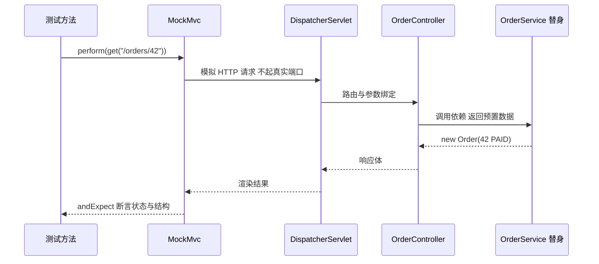
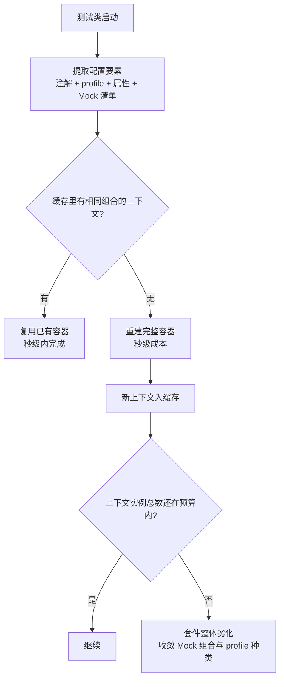

# 测试实践

> @SpringBootTest 全量上下文、@WebMvcTest/@DataJpaTest 切片测试、上下文缓存机制——Spring 测试的分层取舍与配置隔离，一次讲清。

## 🎯 本文核心

Spring 测试的本质是**「上下文装配范围」的分级控制**：@SpringBootTest 拉起完整应用上下文（真实、全面、慢），切片测试只装配某一层的基础设施（Web 层/持久层，快但窄），纯单元测试完全不碰容器（最快、无框架语义）。机制链一句话：**测试注解决定装什么 → TestContext 按配置组合缓存上下文 → 不同的注解/属性/Mock 组合生成不同的上下文实例**。测试慢的根源往往不是断言多，而是上下文被反复重建——理解缓存键，才能守住测试套件的执行成本。

## 一句话摘要

测试速度与覆盖面是一对无法两全的取舍：@SpringBootTest 全真但秒级起步，切片测试只装一层百毫秒级，纯单元测试毫秒级但脱离容器语义；工程答案是**金字塔分层**——大量单元测试打底、切片测试验证层契约、少量全量测试兜底集成正确性。

## 一、背景：测试金字塔与 Spring 的位置

测试金字塔的分层逻辑（业内认知的经典模型）：底层单元测试数量最多、跑得最快；越往上数量越少、越慢越贵。Spring 应用的问题是：核心逻辑几乎都长在容器里——Service 依赖注入的 Bean、Controller 依赖的参数解析、Repository 依赖的数据源。想测它们，就得回答「容器装多少」：

| 层级 | 装配范围 | 量级感受（业内认知） | 用途 |
|---|---|---|---|
| 纯单元测试 | 不装容器 | 毫秒级 | 纯逻辑、算法、转换 |
| 切片测试 | 只装一层设施 | 百毫秒级 | 层契约（路由/SQL/序列化） |
| 全量上下文 | 完整应用 | 秒级到十秒级 | 集成正确性兜底 |

`spring-boot-starter-test` 把全套工具打包好：JUnit 5 做测试框架、AssertJ 做流式断言、Mockito 做 Mock、Spring Test 提供上下文基建（官方 starter 口径），加一个依赖即齐活。放在系统整体架构里看，测试还是模块上下游契约的「锚点」：接口一旦偏离约定，最先报警的应该是切片测试，而不是联调现场的同事。

## 二、核心机制：@SpringBootTest 全量上下文

```java
@SpringBootTest(webEnvironment = SpringBootTest.WebEnvironment.RANDOM_PORT)
class OrderFlowTest {

    @Autowired
    TestRestTemplate rest;   // 随机端口起真实服务，避免端口冲突

    @Test
    void createOrder() {
        ResponseEntity<String> resp = rest.postForEntity("/orders", new OrderReq("sku-1", 2), String.class);
        assertThat(resp.getStatusCode()).isEqualTo(HttpStatus.OK);
    }
}
```

三个工程要点：一是默认 `webEnvironment = MOCK`，起的是 Mock Servlet 环境、不监听端口，适合配合 MockMvc；二是 `RANDOM_PORT` 才是「真 HTTP」路径，起真实服务做端到端断言；三是全量上下文会触发全部自动配置——数据源、连接池、缓存一个不少，所以没有外部依赖时要么用内嵌件，要么把对应 Bean Mock 掉。这也是它慢与全的根源：**装得越全，越接近真实，启动成本越高**。

## 三、机制：切片测试——只装一层

切片测试的机制：`@WebMvcTest` 只启用 Web 层相关的自动配置（Controller、参数校验、异常解析、MockMvc），Service/Repository 一概不装——想不报错就必须用 `@MockBean` 把依赖换成替身。`@DataJpaTest` 反过来，只装 Repository 与内嵌数据库，Web 层完全不出现。

```java
@WebMvcTest(OrderController.class)
class OrderControllerTest {

    @Autowired
    MockMvc mvc;

    @MockBean
    OrderService orderService;   // Web 层测试里，Service 只是替身

    @Test
    void getOrder() throws Exception {
        given(orderService.load(42L)).willReturn(new Order(42L, "PAID"));
        mvc.perform(get("/orders/42"))
           .andExpect(status().isOk())
           .andExpect(jsonPath("$.status").value("PAID"));
    }
}
```

### @WebMvcTest 与 @SpringBootTest 的区别

一句话：**验证对象不同**。@WebMvcTest 验证「HTTP 契约」——路由映射、参数校验、状态码、响应结构，业务逻辑被 Mock 隔离在门外；@SpringBootTest 验证「组装后的整体」——层与层的真实接线、事务传播、配置生效。前者跑得快、失败时定位精确到层；后者跑得慢、但能暴露「单层都对、拼起来错」的集成缺陷。选型经验一句话：**每层的契约用切片守，关键链路的组合用全量兜**。

切片的设计目标很明确：把「层契约」从集成测试里拆出来单独守——请求进入 MockMvc 后的流转全程不碰真实业务 Bean，见下图：



## 四、追问链：测试为什么越写越慢

- **追问一**：项目测试从几十秒涨到十几分钟，测试代码明明没多多少，慢在哪？——Spring TestContext 框架会按「配置组合」缓存上下文：配置相同的测试类共享同一个容器实例，配置不同就重建一个。慢，通常是上下文实例悄悄变多了。
- **再追问**：什么算「配置不同」？——缓存键包含注解组合、`@ActiveProfiles`、内联属性、**`@MockBean` 的替换清单**等。两个测试类只要 Mock 掉的 Bean 集合不同，就是两个上下文——`@MockBean` 用得越「随手」，上下文越碎片化。这个机制的设计取舍在于：用「组合精确隔离」换取「语义零污染」，代价就是组合数量直接体现在容器数量上。
- **打破砂锅**：为什么 Mock 会改变缓存键而普通注解不会？——因为 `@MockBean` 是对容器定义的**结构性修改**：替换某个 Bean 定义后，依赖注入的结果随之变化，这个容器实例与原配置的容器不再等价，复用会污染测试语义。所以工程纪律是：**收敛 Mock 组合的种类**（比如统一在一个抽象测试基类里定义标准替身集），上下文数量才守得住。另一个 related 技巧是 `@DirtiesContext`——显式声明「这个测试弄脏了容器」，但代价是强制重建，只做兜底不做常规手段。

上下文如何被复用或重建，见下图：



## 五、实践：测试配置隔离

**环境隔离**：测试类用 `@ActiveProfiles("test")` 显式钉死环境，测试专用配置放 `application-test.yml`——与被测代码同库但边界清晰，绝不「碰巧」用到开发配置。

**数据隔离**：`@DataJpaTest` 默认对每个测试方法开事务并在结束时回滚（官方默认行为），方法间互不污染；走真 HTTP 的全量测试没有这层保护，需要自行清理或用唯一数据集隔离。

**依赖隔离**：Mock 替身（`@MockBean`）适合「依赖的行为不构成本次验证目标」的场景；要验证 SQL 真实语义时，用 Testcontainers 在容器里起真实中间件——**替身换速度，真实件换置信度**，这是一组典型的设计取舍，按测试目标选，不追求一步到位。顺带一提这条路线的演进：Boot 3.4 起官方把 `@MockBean` 迁移到 Spring Framework 的 `@MockitoBean`（公开口径），语义一致、归属变化，新旧项目按版本文档对齐即可。

## 六、实践：一次 CI 测试劣化的排查与复盘

真实形态的问题：某项目 CI 从 6 分钟慢慢劣化到 40 分钟，没人改过测试框架。排查从「分模块计时」入手，定位到集中在某几个新测试类；再打印上下文创建日志（TestContext 支持输出每次上下文构建），发现全套件竟然构建了几十个上下文实例——根因是新同学每写一个测试类就按需 `@MockBean` 一两个不同的 Bean，Mock 清单各不相同，缓存键全部失效。复盘三条 Action：一是建立标准测试基类，统一替身组合，新增依赖时改基类而不是各自 Mock；二是 CI 增加上下文实例数监控，超阈值即告警；三是把「切片优先、全量兜底」写进团队测试规范。这次复盘的最大收获：**测试套件的性能是架构问题，不是写法问题**——它由上下文组合策略决定，事后优化远不如事前约定。

💡 **实战提示**：断言用 AssertJ 的链式风格（`assertThat(x).isEqualTo(y)`），失败信息自带上下文——排障时省掉一轮「重新跑一遍看现场」的成本。

💡 **实战提示**：给测试起「行为名」而不是「方法名」——`should_reject_when_stock_not_enough` 比 `test3` 在失败报告里可读性高一个量级。

💡 **实战提示**：核心资金类、库存类逻辑的单元测试覆盖是红线——这类逻辑的缺陷代价不对称，宁可多写边界用例（零、负数、并发、精度），也不要指望集成测试偶然兜住。

💡 **实战提示**：测试里断言要「一次到位」——先构造状态、再执行动作、最后集中断言；断言夹在动作中间，失败时无法区分「是构造错了还是动作错了」。

## 典型使用场景：什么时候用哪种测试

**纯单元测试**：金额计算、状态机流转、工具转换——逻辑内聚、无容器语义。**切片测试**：Controller 契约、Repository 查询语义、JSON 序列化——每层独立演进时守契约。**全量测试**：下单主链路、支付回调这类跨层关键组合，数量少而稳。**不要用**全量测试做的：覆盖所有边界分支（慢且定位糊）——边界归单元层。决策一句话：**按「验证目标在哪一层」选装配范围，而不是按「哪个写起来顺手」**。

## 常见误区与代价

- **误区一：只写 @SpringBootTest**。全量测试当单元测试用，套件必然劣化到没人愿意本地跑——测试的「反馈速度」一旦丢了，测试体系就开始腐烂。
- **误区二：Mock 一切外部依赖**。替身打得越深，测试越「自说自话」：真实 SQL 的语法错、序列化的字段不匹配，Mock 世界里永远测不出来。
- **误区三：测试数据依赖执行顺序**。上一个测试残留的状态让下一个「碰巧通过」，一旦并行化或单独执行就翻车——每个测试都应自成世界。

## 量级 Trade-off：测试套件的成本曲线

小项目（几十个测试，业内认知量级）：随手 @SpringBootTest 也能接受，规范成本高于收益。中等规模（几百上千个测试）：必须分层，上下文实例数要控制，否则 CI 时长以分钟级膨胀。再往上（多模块、测试代码到万级行、服务本身承载十万级以上请求——断言执行次数随代码规模进入十万级乃至百万级，业内认知）：测试基建要产品化——并行执行、按层分流水线、失败快速重试、上下文数量预算。这一档的核心问题是「如何让测试套件随代码同速演进」，而不是「某个测试怎么写」。每上一档，都要求把「写测试的个体习惯」升级为「管测试的集体机制」——这是测试体系自己的架构演进，与业务系统的架构取舍同构。

## 你们可能会问

**Q1：单元测试为主的项目还需要 Spring 测试设施吗？**
需要，但比例下降。业务逻辑下沉为不依赖容器的领域对象后，单元层占大头；Spring 测试设施专守「层契约」与「组装正确性」——比例大概是金字塔形状，不是二选一。

**Q2：@MockBean 与纯 Mockito 的 @Mock 有什么区别？**
`@Mock` 只是测试方法内部的一个替身对象，与容器无关；`@MockBean` 会把替身**注册进上下文、顶掉同类型 Bean**，被测对象注入到的是替身。前者不改变缓存键，后者改变——这也是它们对套件速度影响不同的根源。

**Q3：@Transactional 标在测试类上，事务真的会回滚吗？**
默认会（官方默认行为）：测试结束回滚，不落库。但这层魔法只对「进了事务边界」的代码生效——测试里起了独立线程或用了新事务传播，数据就真实写进去了，需要显式清理。

**Q4：本地快、CI 慢，一般是什么原因？**
常见三类：CI 上上下文冷启动没有本地的多轮复用、外部依赖（数据库/中间件）在 CI 环境延迟高、测试并行度配置不同。先计时分层定位，再对症处理，不要凭感觉加超时。

## 🎯 核心带走

- **核心一句话**：Spring 测试 = 按「装配范围」分级的取舍题——全量求真、切片求快、单元求密度，上下文缓存决定套件成本。
- **机制链**：测试注解 → TestContext 提取配置组合（含 Mock 清单）→ 命中缓存复用容器 / 未命中重建 → 组合越碎、上下文越多、套件越慢。
- **失效点/边界**：@MockBean 改变缓存键；@Transactional 回滚护不住独立线程与新事务；切片测试测不出层间集成缺陷。守住替身组合的种类，就是守住套件速度。

## 5W 速记卡

| 维度 | 内容 |
|---|---|
| What | 单元/切片/全量三层测试设施与上下文缓存机制 |
| Why | 按验证目标选择装配范围，平衡速度与置信度 |
| When | 层契约用切片、关键组合用全量、纯逻辑下沉单元层 |
| Who | starter-test 套件 + TestContext 缓存 + Mock 替身体系 |
| How | 收敛 Mock 组合与 profile 种类，控制上下文实例数量 |

## 自测三问

1. @WebMvcTest 与 @SpringBootTest 分别验证什么？失败的定位成本有何差异？
2. 为什么两个 Mock 清单不同的测试类无法共享上下文？
3. 测试中的 @Transactional 回滚在什么情况下会失效？

## 开放问题

测试覆盖率数字常被当作质量指标，但它衡量的是「执行过的代码」，不是「验证过的行为」——断言稀薄的测试覆盖率再高也兜不住回归。值得讨论的是：团队应该考核「关键链路的断言密度」还是「整体覆盖率门槛」？我的判断是前者更接近质量本质，但度量成本更高，这个权衡没有标准答案，值得结合缺陷回溯数据持续校准。

## 📌 数据与事实声明

- 各层测试的装配范围与默认行为（@WebMvcTest 只装 Web 层、@DataJpaTest 事务回滚、上下文缓存键构成、Boot 3.4 的 @MockitoBean 迁移）均为 Spring 官方文档公开口径，以所用版本文档为准。
- 各层级执行耗时、测试数量分界为业内经验认知，随机器与项目差异浮动，非精确基准。
- CI 劣化叙事为匿名化场景还原，不指向任何真实公司与系统。

## 📚 参考资料

| 资料 | 说明 |
|---|---|
| [Spring Boot 官方文档 · Testing](https://docs.spring.io/spring-boot/reference/features/testing.html) | starter-test 与切片测试的权威说明 |
| [Spring Framework 官方文档 · TestContext Framework](https://docs.spring.io/spring-framework/reference/testing/unit.html) | 上下文缓存机制的底层文档 |
| [Testcontainers 官网](https://testcontainers.com/) | 容器化真实中间件测试方案 |
