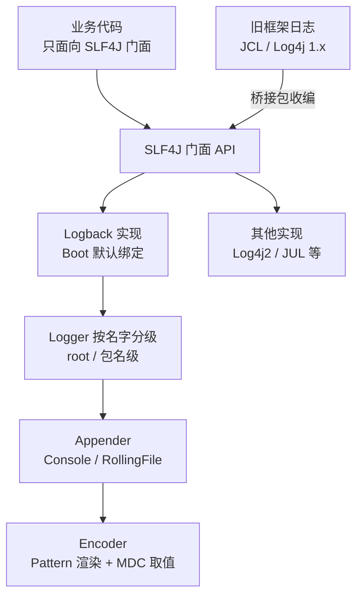
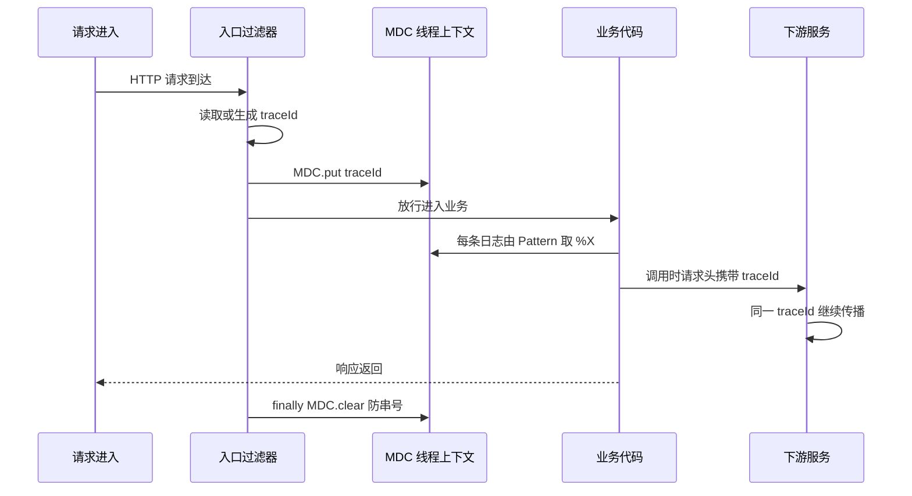

# 日志体系

> 默认 Logback 从哪来、级别怎么控制、文件怎么滚动、MDC 链路标识怎么贯穿——把排障第一现场的底层结构一次讲清。

## 🎯 本文核心

Spring Boot 日志体系的本质是**「门面与实现分离」的三层结构**：业务代码只面向 SLF4J 门面编程，Boot 默认把实现绑到 Logback（同源生态、性能与稳定性的设计取舍），再由 Appender 决定日志去往控制台还是滚动文件。机制链一句话：**Logger 按名字分级 → 事件经门面流向 Appender → Encoder 按格式渲染 → Pattern 里 %X 取 MDC 上下文实现链路标识**。排障时能不能一眼串起一次请求的全部日志，取决于 MDC 是否在入口就埋进了 traceId——这是日志体系里性价比最高的一项基建。

## 一句话摘要

日志 = 门面（SLF4J）+ 实现（默认 Logback）+ 格式与滚动（Pattern/RollingPolicy）+ 上下文（MDC 链路标识）：业务代码写门面，实现随 starter 默认装配，级别与滚动用配置调，链路串联靠 MDC——四层各司其职，排障现场才立得住。

## 一、背景：为什么需要门面，为什么默认是 Logback

`System.out.println` 为什么不可用：无级别（不能按需开关）、无格式（没有时间与上下文）、无目的地（只进标准输出，不落盘不滚动）、同步阻塞（打印本身就是开销）。日志框架解决的正是这四件事。从裸打印到门面加实现，这条演进的主线只有一条：**把「打出字符串」升级为「可管理的事件流」**。

框架的演进史（公开口径的脉络）解释了今天的默认格局：早期 Log4j 一统，后出现门面 SLF4J 把「API 与实现」解耦；Log4j 原作者接着写了 Logback——与 SLF4J 同一作者、原生实现门面接口（无桥接损耗）；后来 Log4j2 又以异步性能见长。回头看这段十数年的架构演变，Boot 选择 Logback 作默认：**同源、零桥接、够用**。这个设计的本质是门面模式的价值：业务代码永远写 `LoggerFactory.getLogger(...)`，底下实现随便换——上下游依赖里各自的日志实现，也靠「桥接包」统一收编到门面上，避免一个进程多套日志管道。反过来看它的代价：桥接与实现混在同一 classpath 时会冲突——「多个 SLF4J 绑定」警告就是这里出的问题，排除冗余桥接包即可。



## 二、核心机制：级别与配置

### 2.1 级别体系：日志的第一道闸门

级别从低到高：`TRACE < DEBUG < INFO < WARN < ERROR`。Logger 按名字成树状（root 在顶，包名逐级往下），**子 Logger 未显式配置时继承父级**，事件级别低于生效级别时直接丢弃——这是成本最低的性能开关：生产把 root 设为 INFO，DEBUG 日志在门面层就被拦下，连格式化都不发生。

Boot 里的配置入口极其简单（这条约定优于配置的设计思想贯穿整个日志体系）：

```properties
logging.level.root=info
logging.level.com.example.order=debug      # 指定包单独放开
logging.level.org.springframework=warn     # 压框架内部噪音
```

追问一句：为什么改动级别不用重启就能生效？——Logback 支持配置热扫描（`logging.config` 指向的文件可配 scan 周期），且级别检查发生在每次打印时——所以运维救急时改级别是实时动作，不必等发版。这也是「级别是闸门不是开关」的含义：**闸门随时可调，代价远低于发版**。

### 2.2 文件输出与滚动策略

控制台日志随进程生灭，生产必须落盘并滚动。Boot 的快捷属性足以覆盖常规需求：

```properties
logging.file.name=logs/app.log
logging.logback.rollingpolicy.file-name-pattern=logs/app.%d{yyyy-MM-dd}.%i.log.gz
logging.logback.rollingpolicy.max-file-size=100MB
logging.logback.rollingpolicy.max-history=30
logging.logback.rollingpolicy.total-size-cap=20GB
```

这组默认策略是「按天 + 按大小双维度滚动，历史压缩、超期清理」。为什么必须两个维度都有？追问下去就清楚：只按时间滚，单日日志就能写爆磁盘；只按大小滚，文件数无限增多。双维度 + 总量上限（total-size-cap）+ 历史上限（max-history），四道约束才把「日志吃掉磁盘」这条路真正封死。这是用惨痛故障换来的工程共识。

需要更细的控制（按业务维度分文件、自定义触发器）时，写 `logback-spring.xml`（Boot 专属扩展：支持 `<springProfile>` 按环境差异化配置），但从便捷属性起步、确有需要再上 XML，避免一上来就背整份配置。

### 2.3 MDC：链路标识的机制底层

一次请求穿过过滤器、Service、消息发送、下游调用，几十行日志散落在文件各处——没有标识，排障等于大海捞针。MDC（Mapped Diagnostic Context）的机制：**一个绑定在当前线程上的键值表**，Pattern 里用 `%X{traceId}` 取值输出。

```java
try {
    MDC.put("traceId", UUID.randomUUID().toString());
    orderService.create(req);     // 本次调用链上所有日志自动带上 traceId
} finally {
    MDC.clear();                  // 线程复用前必须清理，否则串号
}
```

两个关键边界：一是 **finally 里 clear**——容器线程是复用的，不清理会把上一个请求的 traceId 带给下一个请求，这是最隐蔽的日志事故之一；二是**异步边界会断**——MDC 跟线程走，@Async、线程池里取不到值，需要在任务提交时复制上下文（装饰 Runnable）再恢复。再打破砂锅问一层：为什么 MDC 设计成绑线程，而不是绑请求？——因为日志 API 的调用点只拿到「当前执行流」，并不知道「请求」这个概念；线程是 JVM 里唯一稳定的执行身份。这个选择的代价就是异步断链——理解了因，也就记住了果：**凡是换了线程的地方，都要手动搬运上下文**。全链路追踪的通用做法：入口（过滤器/网关）生成或接收 traceId 写入 MDC，跨进程调用时放进请求头向下游透传——上下游共用同一个标识，链路才能拼成完整证据链。一条请求的标识流转如下图：



## 三、实践：一次无法串联的线上排查与复盘

真实形态的问题：某服务偶发超时，用户反馈只给了时间点。排查时按时间区间拉日志，同一个接口一分钟内上千次调用，日志长得一模一样，无法区分哪几行属于出问题的那次请求——排查从「找证据」退化为「猜」。最后靠下游服务日志里的请求 ID 反向比对，耗时数小时才定位到慢查询。复盘三条 Action：一是入口过滤器统一生成 traceId 写入 MDC，所有 Pattern 加 `%X{traceId}`；二是跨服务调用在 HTTP 头透传 traceId，消息体里附带业务单号；三是把「任意一条日志能否反查整条链路」列为日志验收标准。这次故障的教训：**日志的可检索性与可串联性是设计出来的，不是打出来的**——打得多不等于查得到。

💡 **实战提示**：占位符 `log.info("order {} paid", orderId)` 优于字符串拼接——级别不够时参数不格式化，热点路径上零额外成本；这也是门面 API 设计的核心收益之一。

💡 **实战提示**：ERROR 日志必须带上下文与堆栈（`log.error("pay failed, orderId={}", id, e)`，最后一个参数传异常对象才有完整堆栈）——只有一句 message 的 ERROR 等于把现场销毁了。

💡 **实战提示**：日志里严禁输出密码、令牌、身份证号等敏感字段，手机号、邮箱脱敏后再打——日志系统通常权限宽于业务库，是泄露的高发通道。

💡 **实战提示**：给 ERROR 级别单独配一个 Appender 落独立文件并接告警——错误日志的出现频率是系统健康度最直接的信号，混在海量 INFO 里等于没有信号。

## 典型使用场景：什么时候怎么用

**开发期**：DEBUG 放开看细节，控制台输出为主。**测试期**：按环境调级别（接入 Profile 机制，`<springProfile>` 或 `logging.level` 差异化），验证滚动策略真实生效。**生产**：INFO 起步、ERROR 独立文件 + 告警、滚动策略全部显式配置。**什么时候不用文件日志**：容器化环境下把标准输出交给采集器统一收集（十二要素应用的主张，公开口径），滚动交给采集端的轮转策略——两种模式别混用，混用的结果通常是「两套日志对不齐」。

## 日志门面与日志实现的区别

一句话：**门面是 API 约定，实现是引擎**。SLF4J 定义「怎么打」（接口），Logback 决定「怎么落」（输出、滚动、异步）。区别带来的工程规则：业务代码依赖里只出现门面；实现与桥接包由构建统一管理，杜绝多绑定；换实现（Logback 换 Log4j2）业务代码零改动，只换依赖与配置。判断自己项目是否做对了：任意一个业务类，import 里不应该出现具体实现包的名字。

## 常见误区与代价

- **误区一：日志越多越好**。无级别纪律的海量 INFO 把有效信息淹没，存储成本线性上涨，检索反而变慢——日志的价值密度比总量重要。
- **误区二：MDC 只 put 不 clear**。线程复用导致 traceId 串号，排障时把两条链路的证据搅在一起——比没有 traceId 更误导。
- **误区三：滚动策略默认不配**。单文件无限增长，磁盘打满时最先挂掉的往往是日志所在的系统盘——连累整个进程，代价远超日志本身。

## 量级 Trade-off：从单机文件到日志平台

小系统（万级日请求，业内认知量级）：滚动文件 + 运维登机 grep 就够，别急着建采集管道。十万级 QPS：日志量进入每日百万行、千万行量级，必须走「采集器 → 消息管道 → 存储检索」的平台化路线，同步写文件的 IO 开销也要认真评估（异步 Appender 换吞吐、代价是极端情况下可能丢尾部日志——可靠性换性能的经典取舍）。亿级请求量级：存储成本成为主要矛盾，采样、分级留存（ERROR 全量、DEBUG 不落盘）、冷热分层是必选项。这一档的核心问题从「日志怎么打」变成了「日志数据的生命周期怎么管」。

## 你们可能会问

**Q1：为什么我的项目里同时出现 Logback 和 Log4j 的日志格式？**
classpath 上混入了多个实现或桥接——某个依赖自带 Log4j 依赖。用依赖分析找出引入点，排除旧实现、保留桥接包，让所有日志统一走 SLF4J 一条管道。

**Q2：异步日志什么时候用，丢日志怎么办？**
高并发、日志量大、同步写成为瓶颈时用。队列有界，打满时的丢弃策略可配——对审计类、不能丢的日志留在同步 Appender，可丢的诊断日志走异步，按重要性分管道，不要一刀切。

**Q3：MDC 在 @Async 方法里取不到值，怎么解决？**
MDC 绑定线程，异步切换线程后自然丢失。解法是提交任务时把 MDC 快照复制进任务上下文、执行时恢复——许多线程池封装库内置了此能力，或用任务装饰器统一处理。

**Q4：日志该存多久？**
合规要求优先（审计类日志有法定留存期限的行业，以监管要求为准），其次才是排障需要——通常 ERROR 与审计长留、业务 INFO 留数周、DEBUG 不进生产（业内常见口径），按存储成本与检索频率定档。

## 🎯 核心带走

- **核心一句话**：日志体系 = 门面（SLF4J）定 API、实现（默认 Logback）管输出、Pattern 与滚动管格式与容量、MDC 管链路串联。
- **机制链**：业务调门面 → 级别闸门过滤 → Appender 分管道 → Encoder 渲染（%X 取 MDC）→ 滚动策略控磁盘 → 采集平台做检索。
- **失效点/边界**：MDC 跨线程断链（异步要复制快照）、线程复用忘 clear 导致串号、多实现混绑冲突、滚动不配磁盘打满。四条边界各配一条工程纪律。

## 5W 速记卡

| 维度 | 内容 |
|---|---|
| What | 门面 + 实现 + 滚动 + MDC 四层构成的日志基础设施 |
| Why | 排障第一现场：无级别/无格式/无落地的打印等于没有现场 |
| When | 级别闸门按环境调，滚动与告警生产必须显式配 |
| Who | SLF4J 门面、Logback 引擎、Appender/Encoder、MDC 上下文 |
| How | 入口埋 traceId → Pattern 输出 %X → 跨进程透传 → 异步边界复制快照 |

## 自测三问

1. 日志门面与日志实现的区别是什么？为什么业务代码只能依赖门面？
2. 滚动策略为什么需要时间、大小、总量、历史四个维度一起约束？
3. MDC 的机制底层是什么？哪两种场景会导致它失效？

## 开放问题

结构化日志（JSON 格式、字段化输出）正在替代传统文本 Pattern——机器可解析的代价是人眼可读性下降，本地开发与线上采集要维护两套格式。值得讨论的是：结构化是否应该在入门项目就全量推行？我的判断是采集平台就绪后再切换收益最大，但未定论——它取决于团队对「人查日志」与「平台查日志」的比重判断，值得结合实际检索行为持续评估。

## 📌 数据与事实声明

- 默认实现（Logback）、配置属性名、级别语义、MDC 线程绑定机制均为 Spring Boot / SLF4J / Logback 官方文档公开口径，以所用版本文档为准。
- 日志量级、留存期限、采样策略等分界为业内经验认知，涉合规场景以监管要求为准。
- 排障叙事为匿名化场景还原，不指向任何真实公司与系统。

## 📚 参考资料

| 资料 | 说明 |
|---|---|
| [Spring Boot 官方文档 · Logging](https://docs.spring.io/spring-boot/reference/features/logging.html) | 默认日志体系与滚动属性权威说明 |
| [Logback 官方手册](https://logback.qos.ch/manual/) | Appender/Encoder/滚动策略的机制细节 |
| [SLF4J 官网](https://www.slf4j.org/) | 门面与绑定、桥接关系的权威解释 |
