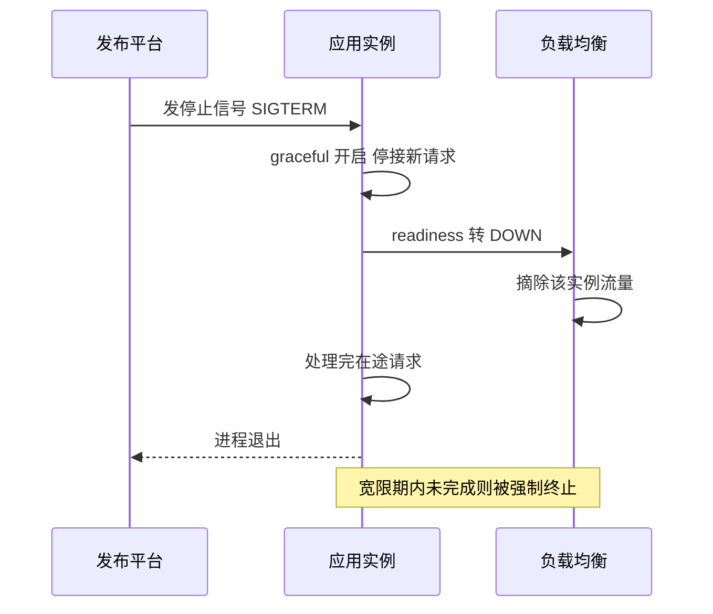

# Actuator 监控与生产就绪

> 端点暴露的安全边界、health 聚合机制、Micrometer 指标与 Prometheus 对接、探针与优雅停机——应用上线后的可观测性底座一次建好。

## 🎯 本文核心

Actuator 的本质是**「把应用内部状态暴露成标准化端点」**：health 聚合各组件健康位、metrics 经 Micrometer 门面输出指标、env/beans 等诊断端点透视容器内部。机制链一句话：**端点暴露（enabled）与发布（exposure）分两级控制 → health 由一组 HealthIndicator 聚合出总状态 → metrics 统一记到 Micrometer，再由注册表适配成监控系统格式 → 探针消费 health，平台决定流量与重启**。贯穿全篇的一条红线：**端点是给机器和运维内网用的，不是给公网的——暴露策略错一档，就是安全事故**。

## 一句话摘要

Actuator = 应用的「体检接口集」：health 回答「现在能不能接流量」，metrics 回答「长期运行得怎么样」，诊断端点回答「内部发生了什么」——暴露多少、给谁看、被谁消费，三个决策做完，生产就绪的地基就打好了。

## 一、背景：上线不是结束，而是失去视野的开始

本地开发出问题，打断点、看日志都行；应用一上线，进程跑在远端容器里，你与它之间只剩三种通道：日志（发生了什么）、指标（趋势与水位）、端点（当前状态）。可观测性的三支柱各有分工（业内通行的划分口径），Actuator 承担的是「标准化的状态出口」：不给它，每个应用都要自造一套状态接口；有了它，健康检查、指标抓取、发布探针全部对着同一套标准消费。从「应用各管各的」到「平台统一消费」，这条平台化演进路径的终点是：**观测能力成为系统架构里的公共设施，一次投入覆盖所有应用的上下游团队**。

## 二、核心机制：端点与暴露策略

### 2.1 两级控制：enabled 与 exposure

Actuator 对端点做了两级开关：`enabled` 管端点是否可用，`exposure` 管是否通过 Web 发布出来。默认只发布 `health`（官方默认口径）——这个默认就是安全取向：**能力全留着，出口先收紧**。

```properties
management.endpoints.web.exposure.include=health,info,metrics,prometheus
management.endpoints.web.exposure.exclude=env,beans,threaddump,heapdump
```

### 2.2 哪些端点绝不能公开

把常用端点按敏感度分档：

| 端点 | 内容 | 暴露建议 |
|---|---|---|
| health | 聚合健康状态 | 可发布，细节按权限收 |
| info / metrics | 构建信息、指标列表 | 内网发布 |
| env / configprops | **全部配置项（含密钥明文）** | 禁止公开 |
| heapdump | **完整堆内存快照（含数据与凭据）** | 禁止公开 |
| threaddump | 线程栈 | 仅诊断场景、按权限开 |
| shutdown | 触发优雅关闭 | 默认不启用，开了即「远程关机按钮」 |

env 与 heapdump 是历史上泄露事故的高发项（业内公开的安全事件分析口径）：前者把配置里的数据库密码、第三方密钥直接吐出来，后者把内存里的用户数据、凭据整体快照下载。所以暴露策略的纪律只有一条：**公网一律只留 health（甚至只留探针专用路径），其余全部收进内网并叠加认证**。若是绕过应用直接暴露在网关之外的写法，等于把「体检报告 + 内存 dumping 工具」挂在了公网——这不是夸张，是每年都在重复发生的真实事故类型。

### 2.3 health 聚合机制与健康位

`/actuator/health` 不是单一检查，而是**一组 HealthIndicator 的聚合**：数据源、Redis、磁盘空间、消息中间件，各有一个指示器报 `UP/DOWN`，聚合取最差值——任何一个 DOWN，整体就是 DOWN。这背后是「依赖不可用 = 应用不可用」的保守哲学：对「能不能接流量」这个问题，宁可错杀不可放过。

```java
@Component
public class PaymentChannelIndicator implements HealthIndicator {

    @Override
    public Health health() {
        boolean ok = channelClient.ping();     // 检查关键依赖的真实可用性
        return ok ? Health.up().withDetail("channel", "reachable").build()
                  : Health.down().withDetail("channel", "timeout").build();
    }
}
```

自定义指示器的价值：**默认指示器只覆盖「连接性」，业务的关键依赖要自己补**。健康细节默认对外隐藏（`show-details` 默认 never，官方口径）——总状态给探针用，细节留给内网排障，同一份数据两种视角。

## 三、机制：metrics 与 Prometheus 对接

### 3.1 Micrometer：指标门面

日志有 SLF4J，指标有 Micrometer——同一个门面思想在不同领域的重演：业务代码面向 `MeterRegistry` 记数（计数器、计时器、仪表），数据落到哪个监控系统由注册表适配决定。它的设计目标同样一致：业务侧学习一次、后端存储随便换。HTTP 请求耗时、JVM 内存与 GC、连接池水位，Boot 已自动配好常用指标；业务指标（下单数、支付成功率）自己记：

```java
registry.counter("biz.order.created", "channel", channel).increment();
```

### 3.2 与 Prometheus 的对接直觉

引入 `micrometer-registry-prometheus` 并暴露端点后，`/actuator/prometheus` 以文本格式输出全部指标的当前值。Prometheus 的工作模型是**拉取（pull）**：服务端按固定周期主动来抓，时序数据落库，告警规则在服务端配置，Grafana 把时序画成面板。这条链路的分工直觉：**应用只负责「把指标摆出来」，抓取、存储、告警、可视化全是监控平台的事**——应用侧零状态，这是 pull 模型对应用最友好的地方；推与拉的取舍是监控系统多年演变沉淀的结果，各有适用场景，但对「应用侧保持简单」这个目标而言，pull 的解耦更彻底。


### 追问链：指标为什么不能随便加标签

- **追问一**：给计数器加个 `userId` 维度，能按用户查，不是更好吗？——不行。时序库的每一条时间序列由「指标名 + 全部标签组合」唯一定义，标签取值空间一大，序列数量爆炸。
- **再追问**：序列多了会怎样？——抓取变慢、存储膨胀、查询变慢，监控平台整体劣化，业内称之为基数爆炸（cardinality explosion，公开口径的常见问题）。百万用户量级下按用户打标，序列数直接进入千万级——监控系统先于业务被压垮。
- **打破砂锅**：标签的正确用法是什么？——**标签只装「低基数维度」**：渠道、环境、状态码、接口名；高基数实体（用户号、订单号）的追踪交给日志与链路系统。这一条是指标体系的边界，越界必然翻车，只是时间问题。

## 四、实践：探针与优雅停机

### liveness 与 readiness 探针的区别

容器平台用两个探针消费 health，语义不同（K8s 公开口径）：**readiness（就绪）失败 → 从负载均衡摘除流量**，应用还在跑，只是暂不接客，适合依赖抖动的临时降级；**liveness（存活）失败 → 重启容器**，认定进程已不可救药。两者用反的代价很大：把重依赖检查挂到 liveness 上，下游一抖动就触发连锁重启，小故障被放大成雪崩。配套的还有启动探针，照顾启动慢的应用，避免初始化期间被误杀。摘流的另一半是停机：从「直接终止进程」到「先摘流、再善后、最后退出」，这是发布体系多年演进的共识——`server.shutdown=graceful` 开启后，收到停止信号先停止接收新请求、把存量请求处理完再退出，与平台的终止宽限期（grace period）配合——**优雅停机的本质是「给在途请求留出善后时间」**。



## 五、一次「全绿却超时」的排查与复盘

真实形态的问题：某服务健康检查一直是 UP，但接口偶发超时，监控面板上错误率却几乎为零。排查思路：先对比「健康位」与「真实体验」的差异——health 只探了连接性，连接池实际已长期处于耗尽边缘，获取连接的等待时间在缓慢上涨；把这个等待时间做成指标打出来后，水位曲线与超时曲线完全吻合。复盘三条 Action：一是自定义指示器纳入「业务可用性」语义（能拿到连接、能完成一次轻量往返），而不只是「TCP 连得上」；二是把连接池等待、队列深度这类「前兆指标」接上告警，别等错误率起来了才响应；三是健康检查与业务指标对同一问题都要有视角，二者互相印证。这次复盘沉淀的判断：**health 是瞬时的位，metrics 是连续的曲线——位回答「现在」，曲线回答「正在走向哪里」**，生产就绪两者都要有。

💡 **实战提示**：管理端点单独占一个端口（`management.server.port`），与业务端口隔离——诊断端点不随业务入口暴露，网关配置出错时多一层保险。

💡 **实战提示**：health 检查要轻——探针频率高（秒级），检查逻辑里别做重查询；默认指示器已经足够快，自定义检查保持同样的克制。

💡 **实战提示**：业务大盘的黄金指标先建齐四个：流量、错误率、延迟、饱和度（业内通行的四金指标口径）——面板先于告警存在，告警先于故障发生。

💡 **实战提示**：`/actuator` 的路径、端口与暴露清单写进发布检查单，每次上线核验一遍「公网探不到、内网可诊断」——暴露策略是配置，配置就会被改，核验是唯一可靠的防线。

## 典型使用场景：什么时候用 Actuator

**必须用**：接容器平台的探针、接统一监控采集、发布前后的状态确认。**谨慎用**：shutdown 端点（平台有能力优雅停机时，应用内开它是多余的风险面）。**什么时候不用**：单体内部工具、无运维诉求的演示项目——暴露面为零优先。决策一句话：**只要生产环境存在，端点暴露策略就必须显式声明**，默认收紧、按需放开，与安全默认值的方向保持一致。

## 常见误区与代价

- **误区一：`exposure.include=*` 一把梭**。诊断端点全量发布，配置与内存快照裸奔——一次安全扫描全部命中，整改成本远高于当初省下的配置时间。
- **误区二：health 加细节直接 show-details=always**。组件地址、版本、依赖清单对外可见，给探测方递情报——细节按角色授权，公网只给 UP/DOWN。
- **误区三：把业务熔断逻辑挂进 liveness**。依赖抖动触发重启风暴，故障半径从「降级」放大到「全实例重启」——探针语义要与应用生命周期绑定，不与业务波动绑定。

## 量级 Trade-off：从裸端点到监控体系

小规模（个位数实例、万级日请求，业内认知量级）：暴露 health + metrics，接一个轻量抓取即可，别急着建全套平台。十万级 QPS、几十个实例：指标采集与告警必须平台化，管理端口隔离、认证接入成为硬要求；指标基数开始需要治理（标签纪律写进规范）。百万级、千万级流量：可观测性是多系统联合作战——指标、日志、链路三支柱互通（用统一标识关联，一次请求的三类证据可互查），监控数据自身的容量规划与降级策略也要设计，上下游任何一个采集环节都可能成为新瓶颈。这一档的核心问题从「应用怎么暴露指标」变成「观测数据自身怎么扛住规模」。

## 你们可能会问

**Q1：health 一直 UP，为什么还会出故障？**
health 位是「连接性 + 关键依赖可达」的瞬时快照，慢查询、连接池耗尽、队列堆积这类「正在劣化」的状态位上看不出来——所以要配合前兆指标与告警，位与曲线互补。

**Q2：探针频率多少合适？**
平台默认通常秒级到十秒级（K8s 默认口径可查文档）；应用侧要做的是保证检查逻辑足够轻，让高频探测不构成负担，而不是去放宽频率。

**Q3：自定义 HealthIndicator 里能调数据库做重检查吗？**
不建议。探针高频触发，重检查等于高频自压；业务可用性建议走「轻量探测 + 指标曲线」组合，指示器里只保留低成本判断。

**Q4：Prometheus 拉不动了怎么办？**
pull 失败会让曲线断线，应用本身不受影响——这正是 pull 模型的解耦优点；监控平台侧有抓取失败告警，应用侧无需为「被监控」开发重试逻辑。

## 🎯 核心带走

- **核心一句话**：Actuator = 标准化的状态出口——health 给「能不能接流量」，metrics 给「运行得怎么样」，诊断端点给「内部发生了什么」，暴露策略决定给谁看。
- **机制链**：端点 enabled/exposure 两级控制 → HealthIndicator 聚合健康位 → Micrometer 门面计量 → 注册表适配 → Prometheus 拉取 → Grafana 呈现；探针消费 health 驱动摘流与重启。
- **失效点/边界**：env/heapdump 公开即泄露；liveness 挂重依赖会放大故障；高基数标签炸监控；health 全绿挡不住慢性劣化。四条边界各有一条纪律。

## 5W 速记卡

| 维度 | 内容 |
|---|---|
| What | health/metrics/诊断端点组成的生产就绪出口 + Micrometer 指标门面 |
| Why | 上线后失去内视能力，需要标准化通道让平台与运维消费应用状态 |
| When | 探针驱动摘流与重启；指标驱动告警与容量决策 |
| Who | Actuator 端点、HealthIndicator、Micrometer、Prometheus/Grafana |
| How | 默认收紧暴露 → 探针接 health → 指标接 pull 采集 → 黄金指标建面板 |

## 自测三问

1. env 与 heapdump 为什么绝对不能公网暴露？泄露的内容分别是什么？
2. liveness 与 readiness 探针的区别是什么？用反会引发什么连锁反应？
3. 为什么指标标签不能装用户号这类高基数维度？正确的归属是哪里？

## 开放问题

「健康」的定义权在谁手里——应用自己声明，还是平台按统一标准判定？自定义指示器表达力强，但每个应用一套标准会让平台难以横向比较；统一标准省心，又盖不住业务的真实可用性。值得讨论的是分层答案：平台管「进程与连接」的底线标准，业务管「关键依赖与链路」的自定义层——这个边界是否稳定，留一个开放问题随实践检验。

## 📌 数据与事实声明

- 默认行为（仅暴露 health、show-details 默认关闭、pull 模型、探针语义、graceful 停机机制）均为 Spring Boot / Micrometer / K8s 官方文档公开口径，以所用版本文档为准。
- 实例数、流量规模等分界为业内经验认知；黄金指标为业内通行的监控方法论口径。
- 安全事件类型与故障叙事为匿名化的常见场景归纳，不指向任何真实公司与系统。

## 📚 参考资料

| 资料 | 说明 |
|---|---|
| [Spring Boot 官方文档 · Production-ready Features](https://docs.spring.io/spring-boot/reference/actuator/index.html) | 端点、health、指标暴露的权威说明 |
| [Micrometer 官方文档](https://micrometer.io/docs) | 指标门面与注册表适配机制 |
| [Prometheus 官方文档](https://prometheus.io/docs/) | pull 模型与数据模型（标签/序列）权威定义 |
