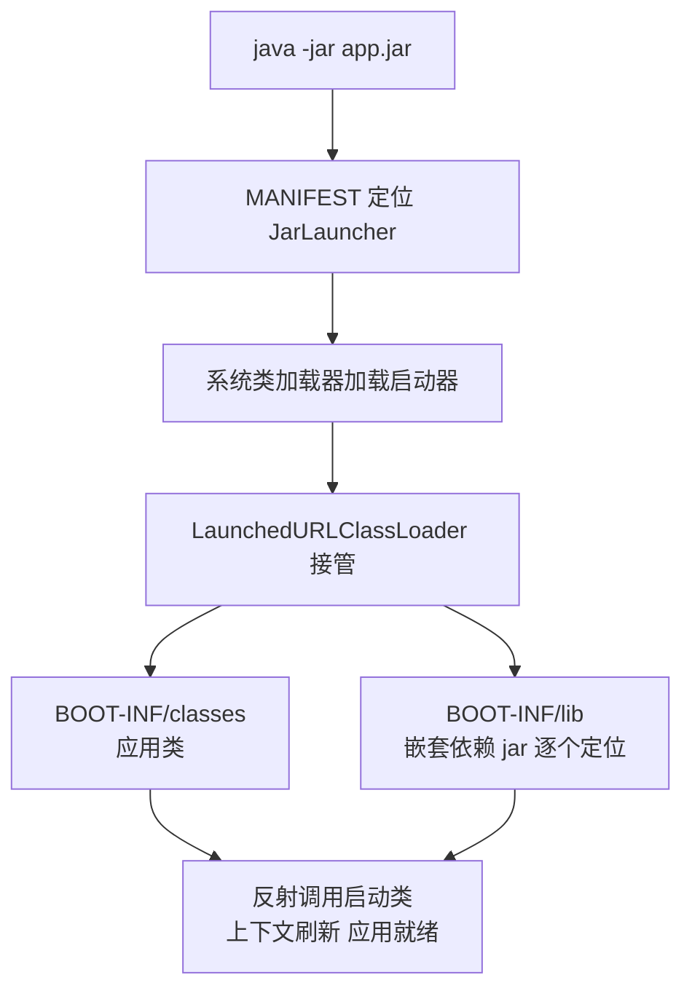
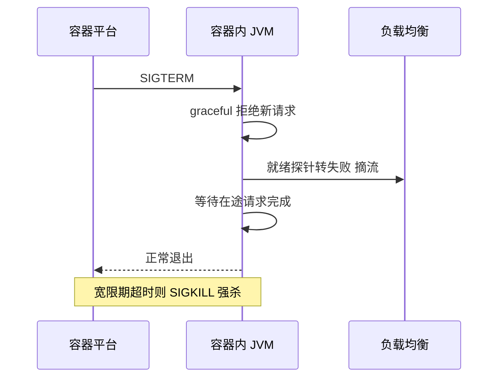

# 部署与容器化

> fat jar 为什么能直接跑、分层镜像为什么快、JVM 在容器里怎么看内存、优雅停机怎么收尾——从构建产物到上线的最后一公里，讲的是机制不是命令。

## 🎯 本文核心

部署的本质是**「产物 + 运行环境 + 生命周期收尾」三件事的工程化**：fat jar 用自定义类加载器把「应用 + 全部依赖 + 启动器」封成一个可执行产物；分层镜像利用「依赖层稳定、应用层多变」的差异让构建缓存命中；容器里的 JVM 必须显式声明内存上限意识（默认可能按宿主机内存估算堆）；优雅停机则负责把「进程退出」变成「流量无损交接」。机制链一句话：**产物自包含 → 镜像分层缓存 → 内存参数对齐容器配额 → 信号驱动的优雅退出**——每一环都是上一环的续篇。

## 一句话摘要

Spring Boot 部署 = fat jar（自包含可执行产物）+ 分层镜像（把不变量与变量分开以命中缓存）+ 容器内存参数（JVM 与容器配额对齐，防 OOMKilled）+ 健康检查与优雅停机（进程有秩序地来与走）——四件事共同把「能跑」变成「好部署」。

## 一、背景：构建产物与部署形态的演变

部署形态经历了三代（公开口径的通行划分）：虚机时代传 war 包、手工配置环境，环境一致性靠人；fat jar 时代「一个文件带走一切」，`java -jar` 即启动；容器时代把「产物 + 运行环境」一起封进镜像，一致性从「配置管理」变成「镜像即环境」。这条演变的主线始终是同一个问题：**怎么让「在我这里能跑」等于「在任何地方能跑」**。容器给了目前最彻底的答案，但答案的地基仍然是 fat jar——它是容器内的运行单元。

## 二、核心机制：fat jar 为什么能直接跑

### 2.1 结构与可执行性

用 `spring-boot-maven-plugin` 打包后的 jar 结构（官方口径）：

```
app.jar
├── META-INF/MANIFEST.MF          ← Main-Class 指向 JarLauncher
├── org/springframework/boot/loader/…   ← Boot 自定义启动器与类加载器
└── BOOT-INF/
    ├── classes/                  ← 你的代码与资源
    └── lib/                      ← 全部依赖 jar 原样嵌入
```

普通 jar 只能被 classpath 引用，fat jar 却能 `java -jar` 直接跑——魔法在 MANIFEST 里：Main-Class 不是你的启动类，而是 Boot 的 `JarLauncher`。追问一层：JDK 自带的 URLClassLoader 只能读「一层」jar，fat jar 里嵌套的依赖 jar 对它不可见，为什么 Boot 能加载？——Boot 带了自己的 `LaunchedURLClassLoader`，支持嵌套 jar 的定位与读取；`java -jar` 先起 Launcher，Launcher 再用这套类加载器把 BOOT-INF 下的类与依赖装进应用上下文。再追问一层：Launcher 加载的类与你的应用类，加载器路径如何分开？——启动器由系统类加载器加载，应用类与依赖全部交给 LaunchedURLClassLoader，两层各管各的空间，避免污染。打破砂锅问到底：为什么 JDK 不直接支持嵌套 jar？——jar 规范本身没有嵌套语义，嵌套读取需要自定义流式解析，Boot 在应用层解决了它——代价是 fat jar 无法被外部工具当作普通依赖引用（想复用其中的类，得解包），这是自包含换来的已知设计取舍。



### 2.2 fat jar 与解包部署的区别

fat jar 的对立面是「解包后部署」（把依赖铺到目录、classpath 指过去）。区别在加载与缓存两个维度：fat jar 从嵌套流里读类，首次加载略慢（业内有可感知的差距，幅度依版本而定）；解包部署类读取快，且对解压工具、调试器更友好。容器化之后这个取舍被重新定价：**镜像本身就是「解包」的物理形态**，构建时解包部署 + 分层缓存成为主流姿势——产物自包含的需求交给镜像层，fat jar 只作为容器内的启动入口保留。

## 三、机制：分层镜像与构建优化

### 3.1 分层的原理：不变量与变量分开

镜像构建是逐层叠加、逐层缓存的：某一层没变，后续层直接复用缓存。应用镜像里，依赖 jar 几乎每次构建都不变，业务代码每次都变——**把不变的依赖放底层、多变的应用放顶层**，依赖层缓存长期命中，重建镜像只需打包薄薄的应用层。这个设计思想与构建工具的增量编译同源：变量与不变量分离，成本只花在变化上。Boot 2.3+ 原生支持分层（官方 layers 口径）：构建时输出 layers 清单（dependencies / snapshot 依赖 / 应用类各归其层），配合 Dockerfile 分阶段构建，先拷贝解出的依赖层、最后才拷业务层：

```dockerfile
FROM eclipse-temurin:17-jre AS builder
WORKDIR /app
COPY app.jar .
RUN java -Djarmode=layertools -jar app.jar extract

FROM eclipse-temurin:17-jre
WORKDIR /app
COPY --from=builder /app/dependencies/ ./
COPY --from=builder /app/spring-boot-loader/ ./
COPY --from=builder /app/snapshot-dependencies/ ./
COPY --from=builder /app/application/ ./
ENTRYPOINT ["java", "org.springframework.boot.loader.JarLauncher"]
```

效果（业内普遍经验口径）：依赖不变时，重建镜像从「全量传输几百 MB」降到「推送应用层几 MB」——构建提速、推送提速、发布提速，全部来自「变量与不变量分离」这一个设计。

### 3.2 多阶段构建与基础镜像

上面的 Dockerfile 就是多阶段构建：第一阶段专事构建/解包（带完整工具链），第二阶段只拷贝运行必需品（精简 JRE 基础镜像）。基础镜像的选择是安全与体积的权衡：带完整 JDK 的镜像调试方便但攻击面大；精简 JRE 镜像体积小、补丁面小，是生产默认取向。

## 四、机制：JVM 的容器内存感知

### 4.1 为什么默认会出事

容器给进程划了 1GB 配额，但 JVM 如果「看不见」容器边界，会按宿主机总内存估算默认堆——宿主机 64GB，堆默认就奔着十几 GB 去，容器配额 1GB，cgroup 直接把进程杀掉（OOMKilled），应用连日志都来不及打。这不是假设：**「容器里跑 JVM 必崩」曾是容器化初期的高频翻车现场**（公开口径的常见迁移教训）。修复靠 JVM 的容器感知能力：较新的 JDK（8u191+/10+，公开口径）默认开启 `UseContainerSupport`，能识别 cgroup 配额；但默认感知的堆占比依旧保守，生产要显式声明。这里的设计目标是明确的：**让「内存契约」从隐式推断变成显式声明**——推断错在环境差异，声明胜在责任清晰。

### 4.2 参数怎么给

```dockerfile
ENV JAVA_OPTS="-XX:MaxRAMPercentage=70.0 -XX:+UseG1GC"
ENTRYPOINT ["sh", "-c", "java $JAVA_OPTS org.springframework.boot.loader.JarLauncher"]
```

`MaxRAMPercentage=70` 表示堆最多占容器配额的 70%——留 30% 给非堆（元空间、线程栈、直接内存、JIT 代码缓存）。为什么不全给堆？因为堆外内存不归 `-Xmx` 管，全给堆等于宣告非堆必越界。工程纪律一句话：**容器配额、堆上限、非堆预算三者要能对上账**，任何一项缺失都是定时炸弹。内存给多少的量级直觉（业内认知）：小服务 512MB-1GB 配额起步，按「实际堆使用峰值 + 非堆预算 + 峰值余量」实测校准，不拍脑袋。

## 五、实践：健康检查与优雅停机在容器里的配合

容器平台的探针语义与停机流程（衔接上一篇）：启动探针放行初始化、readiness 决定接流量、liveness 兜底重启；发布更新时，平台发 SIGTERM → 应用开启 graceful 停止接新请求 → 处理完在途请求 → 退出；宽限期没退完才会被 SIGKILL 强杀。三个容易翻车的细节：一是**探针路径走 Actuator 专用端口**，别混用业务端口；二是**宽限期要大于「最长在途请求 + 摘流传播时间」**，否则优雅停机形同虚设；三是**应用里别再开 shutdown 端点**，平台已有更可靠的停机通道，多一个远程关闭入口多一分风险。



## 六、一次 OOMKilled 的排查与复盘

真实形态的问题：某服务容器化后频繁重启，业务日志毫无异常，进程像被「无声处决」。排查路径：先看容器退出码（137）与平台事件里的 OOMKilled 标记，确认是配额触顶被杀；再对比 JVM 参数——镜像里没设任何内存参数，JDK 旧版未感知 cgroup，堆默认按宿主机内存估算，配额 1GB 被瞬间击穿。复盘三条 Action：一是基础镜像统一升级到支持容器感知的 JDK 版本；二是 JAVA_OPTS 模板化（MaxRAMPercentage 等参数全平台统一注入），禁止镜像各自为政；三是给「容器内存使用 / 配额」与「堆使用 / 堆上限」各建一条监控线，越线提前告警。这次故障的复盘结论：**容器化不是「换种方式打包」，而是换了一套资源契约——JVM 参数必须重新对账，旧经验不能原样平移**。

💡 **实战提示**：镜像 tag 用「版本号 + git 提交短哈希」，禁止用 latest 部署——回滚的前提是「能准确说出回到哪一版」，latest 让回滚变成抽奖。

💡 **实战提示**：`.dockerignore` 把构建产物、本地配置、密钥文件挡在构建上下文外——镜像分层会永久留存历史层，任何打进镜像的敏感文件都删不干净。

💡 **实战提示**：灰度发布从「一个实例」开始，观察错误率与延迟曲线再放量；回滚预案要在发布前演练过一次，没演练过的回滚预案等于没有。

💡 **实战提示**：容器内存配额按压测实测定，公式化记忆：配额 ≈ 堆峰值 / MaxRAMPercentage，留出的部分天然覆盖非堆——预算对不上账的服务，出事只是时间问题。

## 典型使用场景：什么时候怎么部署

**fat jar + 虚机**：遗留环境、无法引入容器平台的团队，一个文件加启动脚本最省事。**分层镜像 + 容器平台**：多环境、高频发布、微服务数量超过个位数——构建缓存与滚动发布收益立刻显现，放在多服务的整体架构里看，镜像规范统一还是上下游各环境一致性的基础。**什么时候不用镜像瘦身过度**：内部工具、低频发布的服务，全量镜像的构建成本可接受，别为省几 MB 增加维护负担。决策一句话：**发布频率与环境数量决定投入档位**，工具复杂度要与发布规模匹配。

## 常见误区与代价

- **误区一：容器配额拍脑袋给**。配额过小被 OOMKilled、过大浪费资源预算——没有压测数据的配额都是猜。
- **误区二：把配置打进镜像**。环境信息变化就要重建镜像，「一份产物多环境部署」被破坏——配置外部化在容器语境下更不能破例。
- **误区三：忽略宽限期与停机顺序**。在途请求被强杀，用户看到零星失败，发布窗口的报障全部来自自己——停机参数是发布质量的一部分。

## 量级 Trade-off：从单机部署到发布工程

单体应用、低频发布（业内认知量级）：fat jar + 手工部署完全可行，别为仪式感上全套平台。服务数到几十个、每日多次发布：镜像分层缓存、CI/CD 流水线、滚动与灰度成为标配——这一档的核心问题是「发布动作的标准化」，而不是「单次发布怎么执行」。百万级、千万级流量的多集群体系：发布工程要考虑跨集群编排、流量镜像验证、秒级回滚与发布窗口的资源预算，镜像仓库与依赖源的可用性也成为关键链路——上下游任何一个环节掉线，发布就会整体停摆。每一档的升级都遵循同一条演进规律：**把「人的操作」沉淀为「平台的能力」**，部署体系自身的架构也随之从脚本走向平台化。

## 你们可能会问

**Q1：fat jar 里嵌套的依赖为什么不能被外部工具直接引用？**
嵌套 jar 超出 jar 规范语义，读取依赖 Boot 自定义的类加载器与流式解析；外部工具（IDE 的依赖分析、普通解包场景）按标准 jar 读取，只能看到顶层——想复用就先解包，这是自包含的既定代价。

**Q2：分层镜像的「层」和 Docker 层是一回事吗？**
Boot 的 layers 清单定义「jar 内容怎么分组」，Docker 层是「镜像文件系统怎么叠加」——前者服务于后者：分组拷贝后，依赖组稳定不变、应用组频繁更新，Docker 缓存与镜像仓库自然命中。

**Q3：MaxRAMPercentage 为什么常用 70 而不是 90？**
配额里除了堆还有元空间、线程栈、直接内存、JIT 代码缓存等非堆项，占比随线程数与 NIO 用量浮动——留 30% 是给非堆的预算加安全余量，业内常见口径，具体值按非堆实测校准。

**Q4：容器里还用 nohup、后台脚本这类启动方式吗？**
不用。容器里前台进程就是 PID 1，必须让 java 进程直接前台运行并正确接收信号——包一层后台脚本会让信号传不到 JVM，优雅停机直接失效，这是信号链路上的常见断点。

## 🎯 核心带走

- **核心一句话**：部署 = 自包含产物（fat jar）+ 分层镜像（变量不变量分离）+ 容器内存对账（JVM 与配额一致）+ 有序生命周期（探针与优雅停机）。
- **机制链**：JarLauncher + 自定义类加载器实现单文件启动 → layers 清单驱动镜像缓存命中 → UseContainerSupport + MaxRAMPercentage 对齐 cgroup → SIGTERM 驱动 graceful 退出。
- **失效点/边界**：fat jar 不可被外部直接引用；旧 JDK 不感知容器配额必被 OOMKilled；非堆内存不归 Xmx 管；后台脚本包一层就断信号链。四条边界各配一条纪律。

## 5W 速记卡

| 维度 | 内容 |
|---|---|
| What | fat jar 产物、分层镜像、容器内存参数、优雅停机四件套 |
| Why | 让「这里能跑」等于「哪里都能跑」，让发布可缓存、可回滚、可无损 |
| When | 服务与发布频率上量后，分层镜像与发布流水线收益最大 |
| Who | JarLauncher、LaunchedURLClassLoader、Docker 分层缓存、cgroup、平台探针 |
| How | layertools 解层构建镜像 → JAVA_OPTS 对账内存 → 探针接 health → SIGTERM 走 graceful |

## 自测三问

1. fat jar 凭什么绕过「JDK 加载不了嵌套 jar」的限制？代价是什么？
2. 分层镜像提速的原理是什么？哪些内容放底层、哪些放顶层、为什么？
3. OOMKilled 的成因链条是什么？堆上限、非堆预算、容器配额怎么对账？

## 开放问题

镜像越精简越安全，但精简 JRE 镜像里连排查工具都没有——出问题时只能 sidecar 挂工具或重建镜像，应急速度下降。值得讨论的是「安全精简」与「现场可诊断」的边界：给生产镜像内置最小诊断工具箱（线程/内存快照能力）是否值得多出的体积与攻击面？我的判断是按故障频率定，未定论——值得用「一次线上故障的定位耗时」来校准这个取舍。

## 📌 数据与事实声明

- fat jar 结构、JarLauncher/类加载机制、layers 分层清单、容器感知支持版本（8u191+/10+ 口径）、SIGTERM 与宽限期语义均为 Spring Boot / Docker / K8s 官方文档公开口径，以所用版本文档为准。
- 镜像体积、构建提速幅度、内存配额分界为业内经验认知，随项目与镜像差异浮动，非精确基准。
- 故障叙事为匿名化场景还原，不指向任何真实公司与系统。

## 📚 参考资料

| 资料 | 说明 |
|---|---|
| [Spring Boot 官方文档 · Packaging](https://docs.spring.io/spring-boot/reference/packaging.html) | fat jar 结构与 launcher 机制权威说明 |
| [Spring Boot 官方文档 · Container Images](https://docs.spring.io/spring-boot/reference/packaging/container-images.html) | 分层镜像与高效构建官方指南 |
| [Java 官方文档 · 容器感知](https://docs.oracle.com/en/java/javase/17/engage/jvm-containers.html) | JVM cgroup 感知与内存参数官方口径 |
