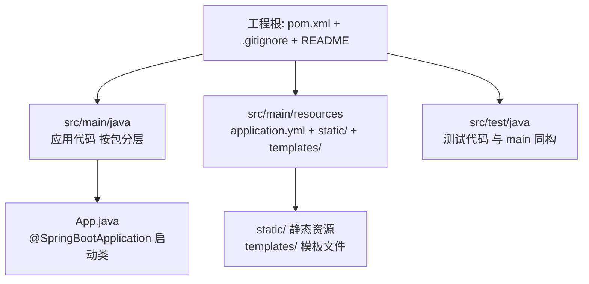
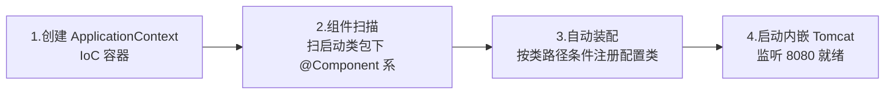

# 第一个应用与工程结构

> 从 start.spring.io 到第一个接口：标准目录、pom 起步依赖、启动流程初识，以及新手最常见的坑。

## 🎯 本文核心

Spring Boot 应用的标准形态 = **start.spring.io 生成的 Maven 工程 + `@SpringBootApplication` 启动类 + 约定目录（main/resources/test 三分）**。pom 里 parent 管版本仲裁、starter 管依赖打包，两者分工是「约定大于配置」在工程层的落地；启动时走「建容器 → 扫组件 → 自动装配 → 起内嵌容器」四步——**后面所有章节都是在给这条主线加细节**，特性层《SpringApplication 启动流程源码走读》则把四步拆到方法级。

## 一句话摘要

理解了 Boot 的定位（篇 1），这一篇解决「怎么落地」：五分钟生成一个标准工程，看懂 pom 里 parent 与 starter 的分工，跑通第一个 REST 接口，并且避开新手期出问题率最高的几个坑——启动类位置、端口占用、依赖冲突。

## 一、五分钟跑起一个 Boot 应用

**初始化三选一**：start.spring.io（官方向导，选依赖最稳）、IDE 内置的 Spring Initializr（同源）、手写 pom（老手）。生成物解压后就是一个完整 Maven 工程，`mvn spring-boot:run` 或 IDE 里直接跑主类即可启动。

**标准目录的分工**是约定式工程的第一课——你不配「哪里放什么」，Maven 和 Boot 都按默认位置找：



启动类的位置有讲究：它必须放在**所有业务包的父包**——`@ComponentScan` 默认扫启动类所在包及子包，放深了组件扫不到，这是新手第一大坑（§四展开）。

## 二、pom 与起步依赖：parent 和 starter 的分工

生成的 pom 有三个关键块：

```xml
<parent>
    <groupId>org.springframework.boot</groupId>
    <artifactId>spring-boot-starter-parent</artifactId>
    <version>3.5.x</version>       <!-- 1. 版本仲裁: Spring 生态依赖版本统一管 -->
</parent>

<dependencies>
    <dependency>                    <!-- 2. 起步依赖: 一个顶一串 -->
        <groupId>org.springframework.boot</groupId>
        <artifactId>spring-boot-starter-web</artifactId>
    </dependency>
    <dependency>                    <!-- 3. 测试起步依赖 -->
        <groupId>org.springframework.boot</groupId>
        <artifactId>spring-boot-starter-test</artifactId>
        <scope>test</scope>
    </dependency>
</dependencies>
```

**parent 的作用是版本仲裁**（本质是导入官方 BOM）：你写代码不用写版本号，几十个 Spring 生态依赖的兼容矩阵由 Boot 官方测试并维护——这就是「约定大于配置」在依赖层的体现。要覆盖个别版本，用 `<properties>` 覆盖对应属性即可，不必整个 parent 换掉。

**starter 的作用是依赖打包**：一个 `spring-boot-starter-web` 背后是 spring-web、spring-mvc、jackson、内嵌 Tomcat 等一串依赖的惯用组合。两者的关系可以用一句话说清：**parent 管版本（哪个版本互相兼容），starter 管集合（一组功能要哪些 jar）**。

最小可用组合就是上面两个 starter + 一个数据库驱动（按需）。克制是原则：**用到一个加一个**，起步依赖堆多了启动变慢，还容易触发你并不想要的自动装配。

## 三、机制：启动流程初识

```java
@SpringBootApplication
public class App {
    public static void main(String[] args) {
        SpringApplication.run(App.class, args);
    }
}
```

`run()` 背后发生四件事（初识版）：



这一版先建立直觉——**顺序是「先有容器、再填组件、再装配、最后起服务」**：容器是骨架，你的组件和自动装配的 bean 是血肉，内嵌容器是让骨架对外开口鼻。为什么这个顺序不能乱？追问一层就明白：自动装配要在组件扫描之后，用户的 `@ConditionalOnMissingBean` 自定义 Bean 才能优先于框架默认；内嵌 Tomcat 必须在 bean 就绪之后启动，Controller 才有地方挂。每一步都依赖上一步的产物，这是启动流程只此一条主线的原因。方法级的源码走读（prepareEnvironment、refreshContext、callRunners 的调用次序与扩展点）在特性层《SpringApplication 启动流程源码走读》，入门阶段记住四步图即可。

**这套约定式工程结构的设计思想**值得停下来说一句：把 Java Web 工程从 XML 时代的「一切靠声明」演进到注解时代的「声明即组件」，再到 Boot 的「目录即约定」，三代演进的方向始终是**让工程结构可预测**——任何人接手一个 Boot 工程，目录长得都一样，入口只有一个主类。可预测性在大团队协作里的价值远超个人项目：架构评审、新模块接入、CI 流水线配置都建立在「结构可预测」这个前提上。这是约定优于自由的设计取舍：牺牲目录组织的自由度，换来跨团队的一致性。

第一个 REST 接口的完整链路：`@RestController` 类里的 `@GetMapping("/hello")` 方法——HTTP 请求进内嵌 Tomcat → 过 DispatcherServlet 路由 → 反射调用你的方法 → 返回值经 Jackson 序列化为 JSON。**你已经用上了 MVC、容器、序列化，但一行配置都没写**——这就是自动装配的体感。请求分发链路的细节在特性层《DispatcherServlet 分发与参数解析源码》，篇 9 也会从入门视角走一遍。

## 5W 速记卡

| W | 一句话 |
|---|---|
| What | start.spring.io 生成的标准 Maven 工程 + 启动类 + 约定目录 |
| Why | 统一工程形态，把「跑起来」的成本压到五分钟 |
| Where | src/main/java 启动类放父包，resources 放配置 |
| When | 所有新 Boot 项目的起点 |
| Who | 新手照目录约定走，多模块按业务域拆包 |

## 四、实践：常见坑排查清单

- **端口被占**：`Port 8080 was already in use` → `server.port=8081` 换端口，或找到占用进程释放
- **依赖冲突**：引了第三方 jar 带来旧版 Spring 类 → 启动报 `NoSuchMethodError`，用 `mvn dependency:tree` 找冲突源，`<exclusions>` 排除
- **组件扫不到**：启动类放太深，Service 不在扫描范围 → 注入报 `NoSuchBeanDefinitionException`，把启动类移到父包或显式扩大 `scanBasePackages`
- **编码乱码**：properties 文件中文乱码 → 用 yml（原生 UTF-8）或统一 IDE 文件编码
- **devtools 边界**：热部署只用于开发（改代码免重启），它靠重启类加载器实现——**不要打进生产包**（打 jar/war 时自动禁用，但要知道为什么：生产的热更新必须走发布流程，绕过它等于绕过验证）

**典型场景**：本地起服务联调（日志出现 `Started App in x.x seconds` 是健康信号）；容器化部署（`java -jar` 是天然镜像入口）；多环境本地切换（dev/prod 配置文件，Profile 篇 18 展开）；快速验证一个第三方 SDK（建临时工程引 starter 试，不通就换，成本低到可以试错）。

**什么时候用单模块、什么时候拆多模块**——这是工程结构的第一个选型决策，给一个明确推荐：单体模块（一个工程一个 jar）适合服务逻辑内聚、团队两三人以内的场景；按业务域拆多模块（api/service/dao 各自成模块）适合模块边界清晰、多人并行开发的场景。怎么选的判断标准不是「项目大不大」，而是「改一处会不会牵动多处」——并行改动冲突多就拆，否则单模块更简单。拆分本身是架构决策，深入展开在专题层《分层架构与包结构规范》。

## 五、与传统 war 部署工程的区别

| 对比 | 传统 war 工程 | Spring Boot 工程 |
|---|---|---|
| 容器 | 外装 Tomcat，丢 war 进 webapps | 内嵌 Tomcat，`java -jar` 自包含 |
| 配置 | web.xml + XML 配置为主 | 自动装配 + yml 覆盖 |
| 依赖 | 自己管全部版本 | parent 仲裁 + starter 打包 |
| 环境一致性 | 依赖宿主机 Tomcat 配置 | 镜像/自包含 jar 一次构建处处一致 |

取舍点：内嵌形态牺牲了「多应用共享一个 Tomcat」的省资源模式，换来部署自包含与环境一致——云原生时代这笔账几乎总是划算的。不同规模的判断也不同（业内认知口径）：十万级 QPS 以下的常规服务，自包含 jar 的资源开销完全可接受；千万级请求的部署密度敏感场景，才需要认真算容器资源账；亿级流量的巨无霸集群则早已按服务拆小，单体 war 共享容器的老路基本没人走。

## 六、常见误区

- **误区一：把启动类放子包里也行**。扫描范围缩小到子包，父包组件全部丢失——报错不在启动时而在注入时，隐蔽性强
- **误区二：starter 越多越全越好**。每个 starter 触发一批自动装配，不用也装配（占启动时间、占内存），按需引入
- **误区三：改了代码必须重启**。开发期 devtools 或 IDE 热加载可覆盖大部分场景；生产改代码走发布流程，热部署不是生产工具
- **误区四：pom 里手写版本号更保险**。恰恰相反——绕开 parent 仲裁等于自己接管兼容矩阵，官方测过的组合不用是浪费；理解这层仲裁原理，才知道版本号该写在哪、不该写在哪

## 七、实践叙事：一次「组件扫不到」的排查复盘

把新手期一次典型排查复盘记下来：新同事把 `UserService` 写在了启动类的**同级包**（比如启动类在 `com.example.app`，Service 在 `com.example.service`），启动不报错，一调接口就抛 `NoSuchBeanDefinitionException`。排查路径：先确认类上有 `@Service` 注解（有）→ 再确认包路径（发现不在扫描范围）→ 把启动类上移一级到 `com.example`，问题消失。这次复盘的两个教训：**报错时机 ≠ 出错时机**，扫描问题在注入时才暴露；以及启动类放父包不是风格偏好，而是 `@ComponentScan` 机制决定的硬约束。

## ❓ 你们可能会问

**Q1：一定要用 start.spring.io 吗？手写 pom 行不行？**
行，但没必要。向导的价值不只是生成骨架，而是它生成的 starter 组合经过了官方兼容性验证；手写容易漏 `spring-boot-maven-plugin`（打可执行 jar 全靠它）。老手手写是熟悉了规则后的效率选择，不是更稳妥的选择。

**Q2：application.properties 和 yml 用哪个？**
功能等价，Boot 两种都支持。yml 层级缩进表达结构化配置更清晰、原生 UTF-8 无乱码问题；properties 扁平直观。团队统一一种即可，混用不报错但可读性差。

**Q3：启动日志那么长，重点看哪几行？**
三处：`Starting App` 与 `Started App in x.x seconds`（起没起来、多久）；带 `Tomcat started on port` 的行（端口与协议）；以及任何 `ERROR` 行。启动慢的深排查（自动装配耗时分析）在专题层《启动慢与启动失败排查》展开。

## 自测三问

1. 启动类为什么必须放在父包？
2. parent 和 starter 各自负责什么？
3. `java -jar` 为什么能直接跑？

## 💡 实战提示

- 💡 `mvn dependency:tree` 是依赖问题的第一入口——引入新依赖前后各跑一次对比，冲突当场暴露
- 💡 多模块工程把启动类放最上层 `bootstrap`/`application` 模块，业务模块只放组件——扫描范围天然全覆盖
- 💡 CI 里加一步「空跑启动」：打包后 `java -jar` 起 10 秒再杀掉，能拦住八成装配类问题进主干
- 💡 devtools 的机制是「重启类加载器」而非字节码热替换，改配置文件和大多数代码改动免重启，改类结构（加字段/改签名）还是要完整重启

## 🔍 追问链与开放问题

**追问一**：parent 的 BOM 为什么能管住全生态的版本？
再深一层：BOM 本质是一堆 `<dependencyManagement>` 条目，Maven 在解析依赖树时用它补齐/覆盖版本号——所以它只对「没写版本号的依赖」生效，你手写了版本号就是自己负责。这套机制的底层原理是「声明优先、仲裁其次」：离依赖声明越近的版本声明越先被采纳。打破砂锅：那第三方 starter 自己声明的依赖版本归谁管？归它的 parent 或它自己的 BOM——多层仲裁的次序是特性层《启动流程源码走读》的延伸话题，入门记住「谁写的版本号谁负责」即可。

**开放问题（值得讨论）**：约定式目录在微服务多模块场景下会不会变成负担——当工程拆成十几个模块，每个模块都复制一遍标准结构，约定带来的「零配置」收益和结构重复的成本怎么平衡？回顾工程组织的演进，从单 war 到多模块再到服务化，每一代都在回答同一个问题；专题层《分层架构与包结构规范》给了一种参考答案，但团队规模与模块粒度的权衡没有唯一解。

## 🎯 核心带走

- **核心一句话**：Boot 工程 = 约定目录 + parent 版本仲裁 + starter 依赖打包 + 四步启动流程（建容器 → 扫组件 → 自动装配 → 起内嵌容器）
- **机制链**：`SpringApplication.run` → 创建容器 → 扫描启动类包下组件 → 条件装配注册 bean → 内嵌 Tomcat 就绪
- **失效点/边界**：启动类放深了扫描失守（注入期才报错）；starter 贪多触发多余装配；parent 仲裁只保护你不写版本号的那部分依赖

## 📌 数据与事实声明

- 写于 2026-09-23，基于 Spring Boot 3.5.x 实测口径；devtools 生产自动禁用为官方文档行为
- 行业认知：部署规模分档的判断为业内认知口径，非精确统计
- 免责：依赖坐标与配置项以 spring.io 官方文档为准

## 📚 参考资料

| 类型 | 标题 | 来源 |
|---|---|---|
| 官方向导 | Spring Initializr | start.spring.io |
| 官方文档 | Developing Your First Application | spring.io/guides |
| 官方文档 | Developer Tools（devtools） | docs.spring.io/spring-boot/reference/using/devtools.html |
| 系列导航 | Spring Boot 系列目录 | `docs/backend/java/ecosystem/spring-boot/index.md` |

## 下篇预告

下一篇 [3_IoC容器与Bean生命周期](./3_IoC容器与Bean生命周期-入门.md)：容器里到底发生了什么——Bean 从定义到就绪的一生。
