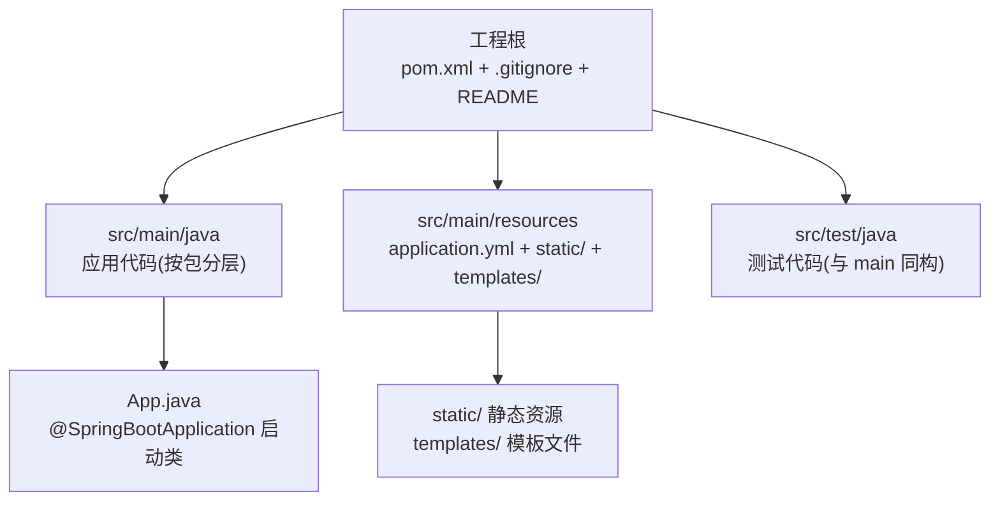
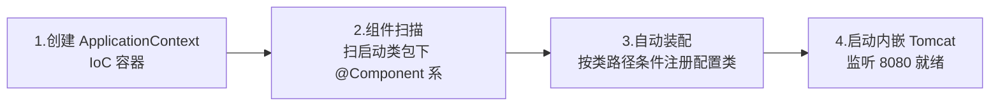

# 第一个应用与工程结构

> 从 start.spring.io 到第一个接口：标准目录、pom 起步依赖、启动流程初识，以及新手最常见的坑。

## 一句话摘要

Spring Boot 应用的标准形态 = start.spring.io 生成的 Maven 工程 + `@SpringBootApplication` 启动类 + 约定目录（main/resources/test 三分）；理解 pom 里 parent 与 starter 的分工、启动时「建容器 → 扫组件 → 自动装配 → 起内嵌容器」的四步流程，后面所有章节都是在给这条主线加细节。

## 一、五分钟跑起一个 Boot 应用

**初始化三选一**：start.spring.io（官方向导，选依赖最稳）、IDE 内置的 Spring Initializr（同源）、手写 pom（老手）。生成物解压后就是一个完整 Maven 工程。

**标准目录的分工**是约定式架构的第一课：



启动类的位置有讲究：它必须放在**所有业务包的父包**——`@ComponentScan` 默认扫启动类所在包及子包，放深了组件扫不到，这是新手第一大坑。

## 二、pom 与起步依赖

生成的 pom 有三个关键块：

```xml
<parent>
    <groupId>org.springframework.boot</groupId>
    <artifactId>spring-boot-starter-parent</artifactId>
    <version>3.5.x</version>       <!-- ① 版本仲裁: 所有 Spring 生态依赖的版本由它统一管 -->
</parent>

<dependencies>
    <dependency>                    <!-- ② 起步依赖: 一个顶一串 -->
        <groupId>org.springframework.boot</groupId>
        <artifactId>spring-boot-starter-web</artifactId>
    </dependency>
    <dependency>                    <!-- ③ 测试起步依赖 -->
        <groupId>org.springframework.boot</groupId>
        <artifactId>spring-boot-starter-test</artifactId>
        <scope>test</scope>
    </dependency>
</dependencies>
```

parent（本质是 BOM 导入）的架构作用：**你写代码不用写版本号，冲突仲裁规则由 Boot 官方维护**——几十个 Spring 生态依赖的兼容矩阵是官方测过的，这就是「约定大于配置」在依赖层的体现。要覆盖个别版本用 `<properties>` 覆盖属性即可。

最小可用组合就是上面两个 starter + 一个数据库驱动（按需）。克制是原则：**用到一个加一个**，起步依赖堆多了启动变慢还容易触发不想要的自动装配。

## 三、机制：启动流程初识

```java
@SpringBootApplication
public class App {
    public static void main(String[] args) {
        SpringApplication.run(App.class, args);
    }
}
```

`run()` 背后发生四件事（初识版，细节特性层展开）：



第一个 REST 接口的完整链路：`@RestController` 类里的 `@GetMapping("/hello")` 方法——HTTP 请求进内嵌 Tomcat → 过 DispatcherServlet 路由 → 反射调用你的方法 → 返回值经 Jackson 序列化为 JSON。**你已经用上了 MVC、容器、序列化，但一行配置都没写**——这就是自动装配的体感。

## 四、实践：常见坑清单

- **端口被占**：`Port 8080 was already in use` → `server.port=8081` 换端口，或找到占用进程
- **依赖冲突**：引了第三方 jar 带来旧版 Spring 类 → 启动报 `NoSuchMethodError`，用 `mvn dependency:tree` 找冲突源，`<exclusions>` 排除
- **组件扫不到**：启动类放太深，Service 不在扫描范围 → 注入报 `NoSuchBeanDefinitionException`，把启动类移到父包或显式扩大 `scanBasePackages`
- **编码乱码**：properties 文件中文乱码 → 用 yml（原生 UTF-8）或配 IDE 文件编码
- **devtools 边界**：热部署只用于开发（改代码免重启），它靠重启类加载器实现——**不要打进生产包**（打 war/jar 时自动禁用，但要知道为什么）

**典型场景**：本地起服务联调（8080 就绪日志 `Started App in x.x seconds` 是健康信号）；容器化部署（`java -jar` 是天然镜像入口）；多环境本地切换（dev/prod 配置文件，Profile 篇展开）。

## 与传统 war 部署工程的区别

| 对比 | 传统 war 工程 | Spring Boot 工程 |
|---|---|---|
| 容器 | 外装 Tomcat，丢 war 进 webapps | 内嵌 Tomcat，`java -jar` 自包含 |
| 配置 | web.xml + XML 配置为主 | 自动装配 + yml 覆盖 |
| 依赖 | 自己管全部版本 | parent 仲裁 + starter 打包 |

取舍点：内嵌形态牺牲了「多应用共享一个 Tomcat」的省资源模式，换来部署自包含与环境一致——云原生时代这笔账几乎总是划算的。

## 常见误区

- **误区一：把启动类放子包里也行**。扫描范围缩小到子包，父包组件全部丢失——报错不在启动时而在注入时，隐蔽性强
- **误区二：starter 越多越全越好**。每个 starter 触发一批自动装配，不用也装配（占启动时间、占内存），按需引入
- **误区三：改了代码必须重启**——开发期 devtools 或 IDE 热加载可覆盖大部分场景；生产改代码走发布流程，热部署不是生产工具

## 自测三问

1. **启动类为什么必须放在父包？**
   - `@ComponentScan` 默认扫启动类所在包及子包；放子包会让父包与旁包组件扫不到。

2. **parent 帮你做了什么？**
   - 依赖版本仲裁：Boot 官方维护兼容矩阵，你的依赖不用写版本号，冲突概率大幅下降。

3. **`java -jar` 为什么能直接跑？**
   - 内嵌容器 + Boot 特制启动器（ fat jar 里带了容器与加载器），应用自包含，不需要外部 Tomcat。

## 5W 速记卡

| W | 一句话 |
|---|---|
| What | start.spring.io 生成的标准 Maven 工程 + 启动类 + 约定目录 |
| Why | 统一工程形态，把「跑起来」的成本压到五分钟 |
| Where | src/main/java 启动类放父包，resources 放配置 |
| When | 所有新 Boot 项目的起点 |
| Who | 新手照目录约定走，老手按模块拆包 |

## 下篇预告

下一篇 [3_IoC容器与Bean生命周期](./3_IoC容器与Bean生命周期-入门.md)：容器里到底发生了什么——Bean 从定义到就绪的一生。

## 📌 数据与事实声明

- 写于 2026-09-09，基于 Spring Boot 3.5.x 实测口径；devtools 生产自动禁用为官方文档行为
- 免责：依赖坐标与配置项以 spring.io 官方文档为准

## 📚 参考资料

| 类型 | 标题 | 来源 |
|---|---|---|
| 官方向导 | Spring Initializr | start.spring.io |
| 官方文档 | Developing Your First Application | spring.io/guides |
| 官方文档 | Developer Tools（devtools） | docs.spring.io/spring-boot/reference/using/devtools.html |
