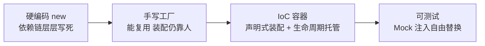
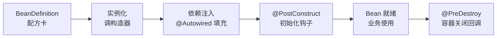

# IoC 容器与 Bean 生命周期

> 容器是什么、Bean 怎么定义、生命周期钩子何时触发——IoC 是 Spring 的地基，本篇把它一次讲清。

## 一个让新人怀疑人生的下午（场景）

> 你入职第二周，被安排给下单流程加一个「风控校验」：改 `OrderService`，在里面调用新写的 `RiskService`。改动本身十分钟——但你发现 `RiskService` 需要 `UserService`，`UserService` 又要 `ConfigDao`，`ConfigDao` 的初始化还要先加载配置文件。更麻烦的是：这个服务要全局唯一（多实例会重复扣风控额度），关闭时还得把缓冲的记录刷出去。
> 一下午过去，你写了一堆 `new`、一把手写双重检查锁、一个没人知道该在哪调的 `destroy()` 方法。带你的同事看了一眼说：「这些事，容器都替你干了。」

**这段经历里的三类痛苦——依赖装配、单例保证、生命周期管理——就是 IoC 容器存在的全部理由。**下面进入机制。

## 🎯 本文核心

IoC 容器 = **对象工厂 + 生命周期管理 + 依赖装配**三合一：你用 `@Component`/`@Bean` 声明「哪些类归容器管」，容器负责实例化、注入依赖、回调初始化/销毁钩子。**机制链**：BeanDefinition（配方卡）→ 实例化（构造器）→ 依赖注入 → `@PostConstruct` → Bean 就绪 → 容器关闭时 `@PreDestroy`。记住钩子顺序，排障不慌；原理级的 BeanFactory 体系与生命周期源码，特性层《深入理解IoC容器》系列逐层拆解，本篇只建立「是什么/怎么用」的直觉。

## 一句话摘要

自己 `new UserService()` 的三宗罪：依赖自己装配（链条层层硬编码）、单例自己保证（手写双重检查锁）、生命周期没人管（初始化散落构造器、销毁没人调）。容器的回答是把「对象的创建与组装」整体收走——你只声明类是组件、依赖是什么，其余全部托管。这就是「控制反转」：创建的控制权从业务代码反转给容器。

## 一、背景：从 new 对象到容器管理

没有容器的世界里，对象的演进路径是这样的：

每一步演进都在还上一代的债：硬编码的债是「换实现要改源码」，手写工厂的债是「装配逻辑散落且重复」，容器的答案是把装配声明化——**控制权反转**的本质不是「不用 new 了」，而是「组装知识集中到了一处」，集中才有统一托管（单例、生命周期、AOP 增强）的可能。从架构位置看，容器处在所有组件的下游：Controller/Service/DAO 都是它生产的，组件之间的上下游协作关系也由它接线——理解这一点，很多装配类问题就从「玄学」变成了「查接线」。

## 二、核心：Bean 定义的两种姿势

- **`@Component` 家族**（`@Service`/`@Repository`/`@Controller` 是语义化别名）：放在**你自己写的类**上，配合 `@ComponentScan` 扫包注册。四个别名的语义差异只是分类标记，机制上与 `@Component` 等价——语义化的价值在于团队沟通（一眼看出这类的角色）
- **`@Bean` 方法**：写在 `@Configuration` 配置类里，用于**第三方库的类**（你改不了它的源码，加不了注解）——比如把 ObjectMapper、数据源声明成 Bean

两者怎么选一句话：**自己的类用注解，别人的类用方法**。判断标准是「能不能改源码」，不是「哪个更高级」。这两条注册路径在架构上也有分工：组件扫描覆盖业务模块，`@Bean` 方法覆盖基础设施模块——很多团队把数据源、缓存客户端这类第三方装配集中到独立的配置模块，模块边界就此清晰。

容器内部把每个 Bean 描述成 **BeanDefinition**（类名、作用域、依赖、初始化方法等元数据）——可以先理解为「Bean 的配方卡」，容器按配方卡生产实例。排障时见到 BeanDefinition 相关异常，就是「配方卡缺失」：要么没扫到，要么没声明。BeanDefinition 从加载到注册的完整流程（BeanFactory 体系怎么读定义、后置处理器何时介入）是特性层《BeanFactory 体系与 Bean 定义加载》的主题，那里有逐方法源码走读。

## 三、机制：Bean 生命周期钩子

初始化与销毁各有三种写法：

| 时机 | 注解方式 | 接口方式 | 声明方式 |
|---|---|---|---|
| 初始化 | `@PostConstruct`（推荐） | `InitializingBean.afterPropertiesSet()` | `@Bean(initMethod=)` |
| 销毁 | `@PreDestroy`（推荐） | `DisposableBean.destroy()` | `@Bean(destroyMethod=)` |

为什么推荐注解方式？设计取舍有三点：不侵入业务类（不实现框架接口，换容器成本低）、语义直白（方法名自解释）、JSR-250 标准注解（不绑定 Spring）。接口方式把框架类型写进业务类，是「侵入换能力」的老式设计——除非在框架内部代码里，业务代码没理由选它。

**完整执行顺序**：

注意 `@PostConstruct` 在依赖注入**之后**才执行——所以初始化逻辑里可以安全使用注入的依赖，构造器里不行（那时依赖还没进来）。这不是实现细节巧合，而是设计目标使然：初始化逻辑几乎总要依赖协作对象，Spring 把钩子放在注入后，才能保证「初始化时依赖一定可用」这条不变式。

Aware 接口族是「容器告诉你它有什么」：`ApplicationContextAware` 把容器本身给你、`BeanNameAware` 告诉你 Bean 的名字。日常少用（耦合容器 API），框架开发常见——又是一条「侵入换能力」的边界：你越知道容器的内部，越离不开这个容器。

## 5W 速记卡

| W | 一句话 |
|---|---|
| What | 管理对象创建/装配/生命周期的容器 |
| Why | 解耦依赖装配、统一单例与生命周期托管、支撑可测试性 |
| Where | 所有 Spring 应用的地基，Boot 里就是那个 ApplicationContext |
| When | 每个被扫描到的组件都由它管理 |
| Who | 开发者声明组件与依赖，容器负责其余一切 |

## 四、实践：容器使用的日常姿势

- **获取 Bean 的正姿势**：业务代码里用注入（构造器/字段），不要 `applicationContext.getBean()`——后者是「服务定位器反模式」，把容器 API 渗透进业务代码，测试难替身。框架代码/工具类拿不到注入时才用
- **Bean 冲突排查**：同一类型两个实现，启动报 `NoUniqueBeanDefinitionException`——用 `@Primary` 定默认或 `@Qualifier` 按名取；同名 Bean 报 `ConflictingBeanDefinitionException`，多为包重复扫描
- **`@Lazy` 延迟初始化**：首次使用才创建。适合「启动贵/很少用」的 Bean（重连接池、批处理引擎）；注意它的副作用——配置错误会延迟到第一次使用才爆炸，问题发现变晚

**典型使用场景**：数据库连接池（启动即初始化，销毁时关闭连接）；定时任务注册（`@PostConstruct` 里挂调度）；优雅停机（`@PreDestroy` 里释放连接、发完在途消息）；SDK 客户端装配（第三方客户端用 `@Bean` 声明，超时参数走配置绑定）。

## 五、与手动工厂模式的区别

| 对比 | 手写单例工厂 | IoC 容器 |
|---|---|---|
| 单例保证 | 自己写双重检查锁 | 作用域声明，容器保证 |
| 依赖装配 | 工厂方法里手动组装 | 声明依赖，容器注入 |
| 生命周期 | 各类自己管 | 统一钩子回调 |
| 可测试性 | 工厂绑死实现 | 注入点可换 Mock |

取舍要说两面：工厂模式零依赖、可脱离 Spring 使用，工具型小库里仍有价值；容器换来的是全套托管能力，但在 Spring 生态里手写工厂多数时候是重复造轮子。什么时候用哪个的判断标准就一条：**对象需要「被框架增强」（事务/AOP/生命周期）时必须进容器**，纯函数式工具类不需要容器也不必硬塞。

## 六、常见误区与适用边界

- **误区一：构造器里用注入的依赖**。构造器执行时依赖还没注入完成，拿到的是 null——初始化逻辑放 `@PostConstruct`
- **误区二：`@PostConstruct` 方法里抛异常没关系**。初始化失败 = Bean 创建失败 = 应用启动失败，钩子里的异常要当成启动故障对待——这其实是特性不是缺陷：问题在启动期暴露比运行期暴露便宜得多
- **误区三：prototype 作用域的 Bean 会自动销毁**。容器只管创建不管回收（销毁钩子不触发），需要客户端自己管理释放——这是和 singleton 最大的行为差异，篇 5 展开
- **不适用边界**：纯静态工具函数（无状态、无依赖）不必注册成 Bean——「万物皆 Bean」会让容器膨胀且启动变慢；DTO/VO 这类数据载体走 new 或 MapStruct，不进容器

## 七、实践叙事：一次初始化顺序问题的排查复盘

记录一次典型排查复盘：某服务启动后定时任务首次执行报空指针，报错点在任务里用到的一个客户端成员。排查路径：先怀疑注入失败，但应用启动无任何异常日志；再对时间线复盘，发现任务注册发生在 `@PostConstruct`，而它依赖的客户端是在另一个配置类的 `@PostConstruct` 里初始化的——**两个钩子的执行顺序不确定，任务先跑、客户端还没就绪**。修复把任务注册改到 `ApplicationRunner`（全部 Bean 就绪后才执行）。这次复盘沉淀的原则：`@PostConstruct` 里只做「自身就绪」的事，跨 Bean 的协作初始化放到容器就绪后的回调里——顺序依赖是初始化期最常见的隐形雷。

## ❓ 你们可能会问

**Q1：`@Component` 和 `@Bean` 功能重复吗？为什么不统一成一个？**
不重复，它们覆盖的类范围互补：注解只能标在你能改的源码上，`@Bean` 方法为改不了的第三方类提供注册入口。统一不了的原因很朴素——你给不了别人的类加注解。这也是「扩展点必须开放声明式入口」的设计哲学体现。

**Q2：容器什么时候创建 Bean，`@Lazy` 的代价是什么？**
默认（singleton）在容器启动时全部创建——换来的是「启动即验证所有装配」，错误早暴露；`@Lazy` 换启动速度，代价是错误晚暴露。启动时间的诉求（十万级实例规模的平台每秒都要冷启动大量容器）和稳健的诉求（金融类系统要求启动期全量验证）怎么选，取决于你的失效成本在哪个阶段更高。

**Q3：钩子执行顺序背不下来怎么办？**
不用背全表，记一条主轴就够：**构造 → 注入 → 初始化钩子 → 就绪 → 销毁钩子**。中间的 Aware、BeanPostProcessor 等细粒度回调属于框架扩展点，特性层《Bean 生命周期与三级缓存源码》有完整时序图，入门期遇到再查。

## 自测三问

1. `@Component` 和 `@Bean` 怎么选？
2. 初始化逻辑放构造器还是 `@PostConstruct`？为什么？
3. `@Lazy` 什么时候用，代价是什么？

## 💡 实战提示

- 💡 初始化钩子里的异常等于启动失败——钩子里只放「失败就该起不来」的逻辑，可降级的初始化放到运行期懒加载
- 💡 跨 Bean 的初始化顺序依赖不要靠钩子，用 `ApplicationRunner`/事件监听把协作初始化推迟到全容器就绪后
- 💡 业务代码里 `getBean()` 出现两次以上，通常意味着装配设计出了问题——先把依赖关系画出来，大多数时候该用注入
- 💡 追问「这个 Bean 是谁注册的」用 `--debug` 条件报告或 IDEA 的 Bean 图——知道每个 Bean 的来源是排查装配问题的底层能力

## 🔍 追问链与开放问题

**追问一**：容器凭什么保证单例？并发下会不会创建出两个？
再深一层：singleton 的语义是「按名字缓存唯一实例」，容器内部有同步保护，并发取同一 Bean 拿到同一个。打破砂锅：那 singleton Bean 里的成员变量并发修改谁管？容器不管——**实例唯一 ≠ 线程安全**，这是篇 5 的主题，也是误解重灾区。

**开放问题（值得讨论）**：GraalVM 原生镜像要求装配关系在编译期静态确定，「运行时反射扫描」这套机制正在被 AOT 化改造——容器的动态性边界未来会收缩到什么程度？特性层《深入理解安全与原生》系列跟踪了这条演进展开，值得带着「动态性的代价是什么」这个问题去读。

## 🎯 核心带走

- **核心一句话**：IoC 容器把「对象的创建、装配、生命周期」整体托管——你声明配方（组件/依赖），容器保证时序（构造 → 注入 → 初始化 → 就绪 → 销毁）
- **机制链**：BeanDefinition → 实例化 → 依赖注入 → `@PostConstruct` → 就绪 → `@PreDestroy`
- **失效点/边界**：构造器里拿不到注入依赖；`@PostConstruct` 异常即启动失败；prototype 不受销毁托管；纯静态工具不必进容器

## 📌 数据与事实声明

- 写于 2026-09-23，基于 Spring Framework 6.x / Boot 3.5.x 口径
- 行业认知：JSR-250（`@PostConstruct`/`@PreDestroy`）随 Jakarta 命名空间迁移为 `jakarta.annotation` 包，为公开口径
- 免责：生命周期回调细节以 Spring Framework 官方文档为准

## 📚 参考资料

| 类型 | 标题 | 来源 |
|---|---|---|
| 官方文档 | IoC Container（Bean Lifecycle 一章） | docs.spring.io/spring-framework/reference/core/beans.html |
| 官方文档 | JSR-250 Annotations | jakarta.ee/specifications/annotations |
| 书 | 《Spring 实战》第 6 版 | 参考资料 |
| 系列互指 | 深入理解IoC容器（特性层） | `docs/backend/java/ecosystem/spring-boot/特性层/深入理解IoC容器/index.md` |

## 下篇预告

下一篇 [4_依赖注入详解](./4_依赖注入详解-入门.md)：`@Autowired` 和 `@Resource` 的查找规则差异，构造器/字段/setter 三种注入的取舍决策树。
