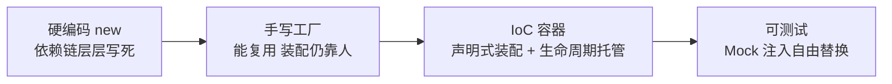
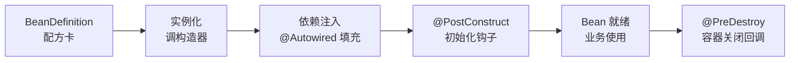

# IoC 容器与 Bean 生命周期

> 容器是什么、Bean 怎么定义、生命周期钩子何时触发——IoC 是 Spring 的地基，本篇把它一次讲清。

## 一句话摘要

IoC 容器 = 对象工厂 + 生命周期管理 + 依赖装配：你用 `@Component`/`@Bean` 声明「哪些类归容器管」，容器负责实例化、注入依赖、回调初始化/销毁钩子——Bean 的一生从 BeanDefinition 开始，到 `@PreDestroy` 结束，钩子顺序背下来排障不慌。

## 一、背景：从 new 对象到容器管理

自己 `new UserService()` 有什么问题？依赖自己装配（Service 里 new DAO，DAO 里 new 数据源，链条层层硬编码）、单例要自己保证（多人写双重检查锁）、生命周期没人管（初始化逻辑散落构造器，销毁没人调）。

容器的回答：把「对象的创建与组装」收走。你只声明类是组件（`@Component`）和依赖是什么（构造器参数），容器负责图上的全部环节——这就是「控制反转」：创建的控制权从业务代码反转给了容器。

## 二、核心：Bean 定义与注册方式

两种主要方式，覆盖不同场景：

- **`@Component` 家族**（`@Service`/`@Repository`/`@Controller` 是语义化别名）：放在**你自己写的类**上，配合 `@ComponentScan` 扫包注册
- **`@Bean` 方法**：写在 `@Configuration` 配置类里，用于**第三方库的类**（你改不了它的源码，加不了注解）——比如把 ObjectMapper、数据源声明成 Bean

容器内部把每个 Bean 描述成 **BeanDefinition**（类名、作用域、依赖、初始化方法等元数据）——可以先理解为「Bean 的配方卡」，容器按配方卡生产实例。排障时见到 BeanDefinitionNotFoundException，就是「配方卡缺失」：要么没扫到，要么没声明。

`@Configuration` 与扫描路径：`@ComponentScan` 默认扫启动类包；第三方配置类用 `@Import` 或 `@ComponentScan(basePackages)` 显式纳入。

## 三、机制：Bean 生命周期钩子

初始化与销毁各有三种写法，优先级和常用度如下：

| 时机 | 注解方式 | 接口方式 | XML/声明方式 |
|---|---|---|---|
| 初始化 | `@PostConstruct`（推荐） | `InitializingBean.afterPropertiesSet()` | `@Bean(initMethod=)` |
| 销毁 | `@PreDestroy`（推荐） | `DisposableBean.destroy()` | `@Bean(destroyMethod=)` |

**执行顺序**：构造器 → 依赖注入完成 → `@PostConstruct` → Bean 就绪 → 容器关闭时 `@PreDestroy`。注意 `@PostConstruct` 在依赖注入**之后**才执行——所以初始化逻辑里可以安全使用注入的依赖，构造器里不行（那时依赖还没进来）。

Aware 接口族是「容器告诉你它有什么」：`ApplicationContextAware` 把容器本身给你、`BeanNameAware` 告诉你 Bean 的名字。日常少用（耦合容器），框架开发常见。

## 四、实践：容器使用的日常姿势

- **获取 Bean 的正姿势**：业务代码里用注入（构造器/字段），不要 `applicationContext.getBean()`——后者是「服务定位器反模式」，把容器 API 渗透进业务代码，测试难替身。框架代码/工具类拿不到注入时才用
- **Bean 冲突排查**：同一类型两个实现，启动报 `NoUniqueBeanDefinitionException`——用 `@Primary` 定默认或 `@Qualifier` 按名取；同名 Bean 报 `ConflictingBeanDefinitionException`，多为包重复扫描
- **`@Lazy` 延迟初始化**：首次使用才创建。适合「启动贵/很少用」的 Bean（重连接池、批处理引擎）；注意它的副作用——配置错误会延迟到第一次使用才爆炸，问题发现变晚

**典型场景**：数据库连接池（启动即初始化，销毁时关闭连接）；定时任务注册（`@PostConstruct` 里挂调度）；优雅停机（`@PreDestroy` 里释放连接、发完在途消息）。

## 与手动工厂模式的区别

| 对比 | 手写单例工厂 | IoC 容器 |
|---|---|---|
| 单例保证 | 自己写双重检查锁 | 作用域声明，容器保证 |
| 依赖装配 | 工厂方法里手动组装 | 声明依赖，容器注入 |
| 生命周期 | 各类自己管 | 统一钩子回调 |

取舍：工厂模式零依赖可脱离 Spring 用；容器换来的是全套托管能力——在 Spring 生态里，手写工厂多数时候是重复造轮子。

## 常见误区

- **误区一：构造器里用注入的依赖**。构造器执行时依赖还没注入完成，拿到的是 null——初始化逻辑放 `@PostConstruct`
- **误区二：`@PostConstruct` 方法里抛异常没关系**。初始化失败 = Bean 创建失败 = 应用启动失败，钩子里的异常要当成启动故障对待
- **误区三：prototype 作用域的 Bean 会自动销毁**。容器只管创建不管回收（销毁钩子不触发），需要客户端自己管理释放——这是和 singleton 最大的行为差异

## 自测三问

1. **`@Component` 和 `@Bean` 怎么选？**
   - 自己写的类用 `@Component` 家族；第三方库的类（改不了源码）用 `@Bean` 方法声明。

2. **初始化逻辑放构造器还是 `@PostConstruct`？**
   - 放 `@PostConstruct`。构造器执行时依赖未注入；`@PostConstruct` 在注入完成后回调，可以安全使用依赖。

3. **`@Lazy` 什么时候用？**
   - 启动贵、使用少的 Bean 用它延迟成本；但要意识到错误会推迟到首次使用才暴露。

## 5W 速记卡

| W | 一句话 |
|---|---|
| What | 管理对象创建/装配/生命周期的容器 |
| Why | 解耦依赖装配、统一单例与生命周期托管、支撑可测试性 |
| Where | 所有 Spring 应用的地基，Boot 里就是那个 ApplicationContext |
| When | 每个被扫描到的组件都由它管理 |
| Who | 开发者声明组件与依赖，容器负责其余一切 |

## 下篇预告

下一篇 [4_依赖注入详解](./4_依赖注入详解-入门.md)：`@Autowired` 和 `@Resource` 的查找规则差异，构造器/字段/setter 三种注入的取舍决策树。

## 📌 数据与事实声明

- 写于 2026-09-09，基于 Spring Framework 6.x / Boot 3.5.x 口径
- 行业认知：JSR-250（`@PostConstruct`/`@PreDestroy`）随 Jakarta 命名空间迁移为 `jakarta.annotation` 包
- 免责：以 Spring Framework 官方文档为准

## 📚 参考资料

| 类型 | 标题 | 来源 |
|---|---|---|
| 官方文档 | IoC Container（Bean Lifecycle 一章） | docs.spring.io/spring-framework/reference/core/beans.html |
| 官方文档 | JSR-250 Annotations | jakarta.ee/specifications/annotations |
| 书 | 《Spring 实战》第 6 版 | 参考资料 |
