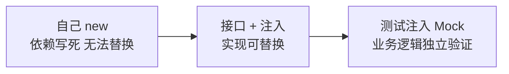
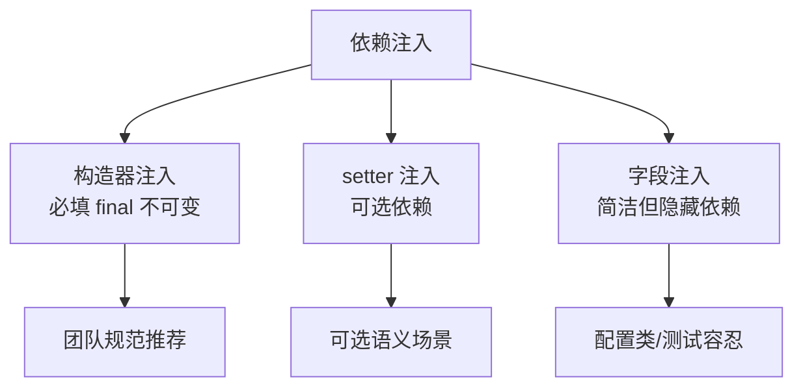

# 依赖注入详解

> @Autowired 与 @Resource 的差异、三种注入方式的取舍、注入失败怎么排查——依赖注入的完整决策树。

## 一句话摘要

依赖注入的核心是「查找规则 + 注入方式」两个选择：查找上 `@Autowired` 按类型优先、`@Resource` 按名称优先；方式上构造器注入（不可变、必填，团队规范首选）> setter 注入（可选依赖）> 字段注入（简洁但隐藏依赖）。注入失败的报错只有两类——找不到 Bean 和找到多个，掌握两条排查路径就够了。

## 一、背景：依赖为什么不能自己 new

直接 `new OrderService()` 的问题不止是耦合：**依赖倒置原则的工程价值**在于——业务代码依赖接口而非实现，实现可以被替换（换数据库、换消息中间件）而不动业务代码；**可测试性**是更现实的理由：单测里要给 Service 注入 Mock 的 DAO，`new` 出来的对象没有这个口子，注入式装配才有测试替身的入口。



## 二、核心：注入方式三种对比

```java
// ① 构造器注入（Spring 官方推荐）
@Service
public class OrderService {
    private final UserDao userDao;          // final: 不可变
    public OrderService(UserDao userDao) {  // 显式声明必填依赖
        this.userDao = userDao;
    }
}

// ② 字段注入（简洁但隐藏依赖）
@Service
public class OrderService {
    @Autowired
    private UserDao userDao;                // 反射注入，类外看不到依赖
}

// ③ setter 注入（可选依赖）
@Service
public class OrderService {
    private ReportClient reportClient;      // 可以没有
    @Autowired(required = false)
    public void setReportClient(ReportClient c) { this.reportClient = c; }
}
```

| 维度 | 构造器 | 字段 | setter |
|---|---|---|---|
| 不可变性 | ✅ final 可用 | ❌ | ❌ |
| 依赖必填表达 | ✅ 缺了起不来 | ❌ null 潜伏 | ⚠️ 可选语义 |
| 循环依赖 | 启动即暴露（好事） | 被容器悄悄解开（坏事） | 可解开 |
| 测试 | 直接 new 传入 | 必须反射/容器 | setter 注入 |

**决策树**：必填依赖 → 构造器；可选依赖 → setter（`required=false`/`ObjectProvider`）；字段注入只在配置类/测试里容忍。

Spring 的注入体系从 2.5 时代的纯 XML 演进到今天注解为主，演进的方向一直是「声明更少、表达更多」——理解这一点，就明白为什么新注解（如构造器参数免写 `@Autowired`）不断出现而旧能力不删。



## 三、机制：@Autowired vs @Resource

两个注解的查找规则不同，这是面试与实战的交叉点：

- **`@Autowired`（Spring 提供）**：先**按类型**找 → 找到多个再看 `@Qualifier`/字段名匹配 → 还多个就报错。`required=false` 允许没有，或注入 `Optional<T>`
- **`@Resource`（JSR-250 标准）**：先**按名称**找（默认取字段名/方法名）→ 名称找不到再退回按类型。名称是第一关键字

多实现场景的标准解法：

```java
public interface PayChannel { String name(); }

@Component("alipay")  class AlipayChannel implements PayChannel {}
@Component("wechat")  class WechatChannel implements PayChannel {}

@Service
public class PayService {
    private final Map<String, PayChannel> channels;   // Spring 自动注入所有实现为 Map
    public PayService(List<PayChannel> list) {
        this.channels = list.stream().collect(Collectors.toMap(PayChannel::name, c -> c));
    }
    public PayChannel of(String key) { return channels.get(key); }
}
```

收集所有实现到 Map/List（Spring 内建能力），比一排 `@Qualifier` 字段更可扩展——新增渠道零改动。

## 四、实践：注入失败排查手册

**报错只有两大类，先分类再排查**：

| 报错 | 含义 | 排查路径 |
|---|---|---|
| `NoSuchBeanDefinitionException` | 按类型/名称**找不到** | 类有没有 `@Component`？在扫描包内吗？（启动类位置！）条件装配没命中？（`--debug` 看条件报告） |
| `NoUniqueBeanDefinitionException` | 找到**多个** | 加 `@Qualifier`/`@Primary`，或字段名对齐 Bean 名 |

**循环依赖**：A 注入 B、B 又注入 A。构造器注入下启动直接报 `BeanCurrentlyInCreationException`——这不是坏事，它把设计问题提前暴露。解法优先级：重新设计依赖方向 > `@Lazy` 打破环 > （万不得已）字段注入让容器解环。字段注入能解环但**掩盖了设计问题**，这正是构造器注入被团队规范推崇的原因之一：宁可靠性和设计面前「啰嗦」一点。

**为什么团队规范常推构造器注入**：不可变（final）+ 必填表达 + 循环依赖早暴露 + 测试友好。代价是参数多时构造器冗长——参数超过 5 个通常是类职责过多的信号，该拆类而不是嫌参数多。

**典型场景**：策略模式（Map 注入全实现，按 key 路由）；多数据源（`@Qualifier` 区分两个 DataSource 与上下游 Mapper 体系）；可选增强（报表导出客户端缺失时业务主流程不受影响）。从架构上看，注入体系处在「组件 ↔ 容器」的中间层：组件声明需求，容器负责供给，两者的解耦让替换实现不动业务代码——这也是依赖倒置在 Spring 里的落地形态。

## 与字段注入的区别（为什么代码评审总盯着它）

字段注入的问题不在「不能用」，在「把依赖藏起来了」：类签名上看不出依赖什么，new 出来就是坏的（依赖为 null），循环依赖被容器静默解环。构造器注入把这些全部**显式化**——显式化是可维护性的核心。

## 常见误区

- **误区一：`@Autowired` 加在接口上就能注入所有实现**。它注入的是「一个」匹配 Bean；要全部实现，注入 `List<T>` 或 `Map<String, T>`
- **误区二：`@Resource` 是 Spring 的注解**。它是 JSR-250 标准注解，Spring 只是兼容支持——名称优先的查找规则与 Spring 的类型优先体系并不同
- **误区三：注入失败去查注解拼写**。九成是组件不在扫描包内或条件装配没命中——先看启动日志和条件评估报告，再怀疑注解本身

## 自测三问

1. **`@Autowired` 找到两个同类型 Bean 会怎样？**
   - 报 `NoUniqueBeanDefinitionException`；用 `@Qualifier` 指名、`@Primary` 定默认，或字段名对齐 Bean 名来消歧。

2. **可选依赖怎么注入？**
   - `@Autowired(required = false)`、`Optional<T>` 或 `ObjectProvider<T>`——缺 Bean 时不报错，运行期按需取。

3. **循环依赖该用字段注入解吗？**
   - 能解但会掩盖设计问题。优先重构依赖方向（提取第三方类），`@Lazy` 次之，字段注入是最后手段。

## 5W 速记卡

| W | 一句话 |
|---|---|
| What | 容器把依赖「推」给组件的装配机制 |
| Why | 解耦实现、支撑测试替身、让依赖关系显式可审计 |
| Where | Service/Component 之间的协作装配 |
| When | 必填走构造器，可选走 setter，字段注入忍着用 |
| Who | Spring 官方、主流团队规范都站构造器注入 |

## 下篇预告

下一篇 [5_Bean作用域与循环依赖](./5_Bean作用域与循环依赖-入门.md)：singleton/prototype 的行为差异，循环依赖的三种解法与原理。

## 📌 数据与事实声明

- 写于 2026-09-09，基于 Spring Framework 6.x 口径；`@Resource` 为 Jakarta JSR-250 注解
- 免责：以 Spring Framework 官方文档为准

## 📚 参考资料

| 类型 | 标题 | 来源 |
|---|---|---|
| 官方文档 | Dependency Injection（IoC 容器章） | docs.spring.io/spring-framework/reference/core/beans/dependencies/ |
| 官方文档 | @Autowired 使用细则 | docs.spring.io/spring-framework/reference/core/beans/dependencies/factory-autowire.html |
| 书 | 《Spring 实战》第 6 版 | 参考资料 |
