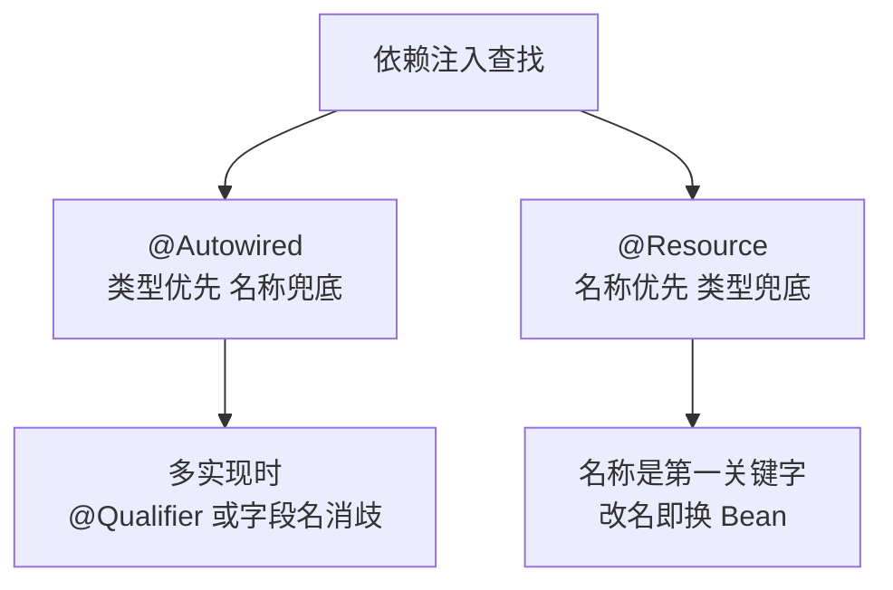

# 依赖注入详解

> @Autowired 与 @Resource 的差异、三种注入方式的取舍、注入失败怎么排查——依赖注入的完整决策树。

## 🎯 本文核心

依赖注入的选择就两个维度：**查找规则**（`@Autowired` 按类型优先、`@Resource` 按名称优先）+ **注入方式**（构造器/setter/字段）。**机制链**：容器启动 → 按类型/名称解析目标 Bean → 反射填充（或构造器传参）→ 注入完成。一条主线决策：必填依赖走构造器（不可变、缺了起不来），可选依赖走 setter，字段注入只在配置类和测试里容忍——团队规范普遍站构造器注入，不是风格偏好，是机制特性决定的（下文展开）。注入失败的报错只有两类：找不到 Bean 和找到多个，两条排查路径就能覆盖绝大多数现场。

## 一句话摘要

篇 3 讲了容器怎么创建对象，这一篇讲对象之间怎么「接线」：依赖为什么不能自己 `new`、三种注入方式怎么选、两个注入注解的查找规则差异在哪、注入失败怎么排查。核心结论先行——**显式声明依赖（构造器注入）是可维护性的基石**，隐藏依赖（字段注入）的简洁是借来的，迟早要还。

## 一、背景：依赖为什么不能自己 new

直接 `new OrderService()` 的问题不止是耦合，从架构看有两层：

- **依赖倒置原则的工程价值**：业务代码依赖接口而非实现，实现可以被替换（换数据库、换消息中间件）而不动业务代码——`new` 把「用哪个实现」的决策焊死在代码里
- **可测试性是更现实的理由**：单测里要给 Service 注入 Mock 的 DAO，`new` 出来的对象没有这个口子，注入式装配才有测试替身的入口


注入的本质是「把组装知识从类内部挪到容器」：类只声明「我需要什么类型」，至于给哪个实现、什么配置，容器说了算——同一份业务代码因此可以在不同环境接不同实现。回顾注入体系的演进也能看清方向：Spring 2.5 时代纯 XML 装配，到注解为主的今天，演进的主线一直是「声明更少、表达更多」——新注解（如构造器参数免写 `@Autowired`）不断出现而旧能力不删，理解这条演进脉络，就不会被注解的「新旧并存」迷惑。

## 二、核心：三种注入方式的取舍

```java
// 1. 构造器注入（Spring 官方推荐）
@Service
public class OrderService {
    private final UserDao userDao;          // final: 不可变
    public OrderService(UserDao userDao) {  // 显式声明必填依赖
        this.userDao = userDao;
    }
}

// 2. 字段注入（简洁但隐藏依赖）
@Service
public class OrderService {
    @Autowired
    private UserDao userDao;                // 反射注入，类外看不到依赖
}

// 3. setter 注入（可选依赖）
@Service
public class OrderService {
    private ReportClient reportClient;      // 可以没有
    @Autowired(required = false)
    public void setReportClient(ReportClient c) { this.reportClient = c; }
}
```

| 维度 | 构造器 | 字段 | setter |
|---|---|---|---|
| 不可变性 | ✅ final 可用 | ❌ | ❌ |
| 依赖必填表达 | ✅ 缺了起不来 | ❌ null 潜伏 | ⚠️ 可选语义 |
| 循环依赖 | 启动即暴露（好事） | 被容器悄悄解开（坏事） | 可解开 |
| 测试 | 直接 new 传入 | 必须反射/容器 | setter 注入 |

决策树一句话：**必填依赖 → 构造器；可选依赖 → setter（`required=false`/`ObjectProvider`）；字段注入只在配置类/测试里容忍**。

**为什么团队规范普遍推构造器注入？** 把设计思想说透：不可变（final）保证依赖不会被运行期篡改；必填表达让「缺依赖」在启动期爆炸而不是运行期潜伏；循环依赖启动即报错，把设计问题提前暴露；测试时直接 new 传入，不依赖容器。这四条合起来是一句架构判断：**依赖越显式，失效越早暴露，修复成本越低**。字段注入把这一切反过来——简洁是表象，把依赖藏起来、把问题推迟才是本质。代价也要诚实说：构造器参数多时冗长——参数超过 5 个通常是类职责过多的信号，该拆类而不是嫌参数多。

## 三、机制：@Autowired 与 @Resource 的查找规则

两个注解长得像，查找规则不同，这是注解选型的关键交叉点：

- **`@Autowired`（Spring 提供）**：先**按类型**找 → 找到多个再看 `@Qualifier`/字段名匹配 → 还多个就报错。`required=false` 允许没有，或注入 `Optional<T>`
- **`@Resource`（JSR-250 标准）**：先**按名称**找（默认取字段名/方法名）→ 名称找不到再退回按类型。名称是第一关键字



多实现场景的标准解法——收集所有实现到 Map/List（Spring 内建能力），比一排 `@Qualifier` 字段更可扩展：

```java
public interface PayChannel { String name(); }

@Component("alipay")  class AlipayChannel implements PayChannel {}
@Component("wechat")  class WechatChannel implements PayChannel {}

@Service
public class PayService {
    private final Map<String, PayChannel> channels;   // Spring 自动注入所有实现为 Map
    public PayService(List<PayChannel> list) {
        this.channels = list.stream().collect(Collectors.toMap(PayChannel::name, c -> c));
    }
    public PayChannel of(String key) { return channels.get(key); }
}
```

新增一个渠道只需加一个 `@Component` 类，PayService 零改动——**新增不改旧代码**，这就是策略模式 + 集合注入的威力。

## 5W 速记卡

| W | 一句话 |
|---|---|
| What | 容器把依赖「推」给组件的装配机制 |
| Why | 解耦实现、支撑测试替身、让依赖关系显式可审计 |
| Where | Service/Component 之间的协作装配 |
| When | 必填走构造器，可选走 setter，字段注入忍着用 |
| Who | Spring 官方与主流团队规范都站构造器注入 |

## 四、实践：注入失败排查手册

**报错只有两大类，先分类再排查**：

| 报错 | 含义 | 排查路径 |
|---|---|---|
| `NoSuchBeanDefinitionException` | 按类型/名称**找不到** | 类有没有 `@Component`？在扫描包内吗？（启动类位置！）条件装配没命中？（`--debug` 看条件报告） |
| `NoUniqueBeanDefinitionException` | 找到**多个** | 加 `@Qualifier`/`@Primary`，或字段名对齐 Bean 名 |

**循环依赖**：A 注入 B、B 又注入 A。构造器注入下启动直接报错——这不是坏事，它把设计问题提前暴露。解法优先级：重新设计依赖方向 > `@Lazy` 打破环 > （万不得已）字段注入让容器解环。完整机制与三级缓存原理在篇 5 展开，这里先记住「构造器注入会让环藏不住」。

**典型使用场景**：策略模式（Map 注入全实现，按 key 路由）；多数据源（`@Qualifier` 区分两个 DataSource 与各自上下游的 Mapper 体系）；可选增强（报表导出客户端缺失时业务主流程不受影响，用 `ObjectProvider` 按需取）。什么时候用什么场景选哪种注入，回到决策树：必填构造器、可选 setter、字段注入仅容忍——不存在第五种选择。

规模视角补一句量级判断（业内认知口径）：十万行代码以内的服务，三种注入怎么选影响都不大，跟规范走即可；百万行级、几十个模块的工程，构造器注入的显式性开始产生复利——依赖关系可被工具静态分析，架构治理（谁依赖谁、环在哪里）全靠它；亿级请求的核心链路，则还要关注注入对象的创建成本与单例复用，装配策略直接进架构评审清单。

## 五、与字段注入的区别（为什么代码评审总盯着它）

字段注入的问题不在「不能用」，在「把依赖藏起来了」：类签名上看不出依赖什么；new 出来就是坏的（依赖为 null）；循环依赖被容器静默解环；单测必须上反射或起容器。构造器注入把这些全部**显式化**——显式化是可维护性的核心。

| 追问点 | 字段注入的隐患 | 构造器注入的回应 |
|---|---|---|
| 依赖关系谁看得见 | 只能进类里数 `@Autowired` | 构造器签名一目了然 |
| 对象能否脱离容器存在 | 不能（null 依赖） | new 即完整可用 |
| 依赖数量失控 | 无感知地堆到十几个 | 参数列表膨胀倒逼拆类 |

## 六、常见误区

- **误区一：`@Autowired` 加在接口上就能注入所有实现**。它注入的是「一个」匹配 Bean；要全部实现，注入 `List<T>` 或 `Map<String, T>`
- **误区二：`@Resource` 是 Spring 的注解**。它是 JSR-250 标准注解，Spring 只是兼容支持——名称优先的查找规则与 Spring 的类型优先体系并不同，混用时排查思路要切换
- **误区三：注入失败去查注解拼写**。九成是组件不在扫描包内或条件装配没命中——先看启动日志和条件评估报告，再怀疑注解本身
- **不适用边界**：不是所有类都值得注入——一次性脚本、纯工具函数直接调用即可；注入体系服务于「多实现可替换 + 可测试」的对象协作，没有协作就没有注入

## 七、实践叙事：一次线上注入异常的排查复盘

记录一次线上问题排查复盘：某服务灰度发布后，部分接口报 `NoSuchBeanDefinitionException`，指向一个新引入的导出组件。排查路径：先看启动日志——启动正常无报错；再看报错时机——只在调导出接口时出现；最后查条件报告，发现该组件的自动配置带了 `@ConditionalOnProperty` 开关，而灰度环境的配置中心里这个开关没开。复盘结论有三条：**「启动正常」不等于「装配齐全」**，条件装配可以延迟到运行期才暴露缺失；可选依赖必须显式声明兜底行为；环境差异类问题先对配置、再对代码。这次之后团队约定：带开关的组件，缺省行为（开了怎样/没开怎样）必须写进组件文档。

## ❓ 你们可能会问

**Q1：`@Autowired` 找到两个同类型 Bean 会怎样？**
报 `NoUniqueBeanDefinitionException`；用 `@Qualifier` 指名、`@Primary` 定默认，或字段名对齐 Bean 名来消歧。三种消歧的优先级：明确指定（Qualifier）> 默认指定（Primary）> 隐式约定（字段名）——越明确越抗重构。

**Q2：可选依赖怎么注入最稳？**
`@Autowired(required = false)`、`Optional<T>` 或 `ObjectProvider<T>`——缺 Bean 时不报错，运行期按需取。`ObjectProvider` 最稳，因为它把「取」的动作也交给你，可以在取的时候给默认值。

**Q3：循环依赖该用字段注入解吗？**
能解但会掩盖设计问题。优先重构依赖方向（提取第三方类），`@Lazy` 次之，字段注入是最后手段——宁要启动时的一声报错，不要运行时的诡异时序。

## 自测三问

1. 三种注入方式各自适合什么场景？
2. `@Autowired` 和 `@Resource` 的查找规则差异是什么？
3. 为什么说构造器注入「让循环依赖藏不住」是优点？

## 💡 实战提示

- 💡 新类一律构造器注入 + final 字段；IDE 可以对字段注入直接给警告——把规范交给工具，比靠评审人盯可靠
- 💡 构造器参数超过 5 个先怀疑类职责过多，拆类比接受参数膨胀更治本
- 💡 策略路由用「集合注入 + Map 索引」，别写一排 if-else 挨个 `@Qualifier`
- 💡 追问注入问题的第一动作是看条件评估报告（`--debug`），第二动作才是查注解——九成问题在装配条件不在语法

## 🔍 追问链与开放问题

**追问一**：容器按类型查找时，类型匹配是精确匹配还是含子类？
再深一层：含子类——按接口注入时，所有实现类都候选，这正是集合注入的原理。打破砂锅：那两个实现互为父子类怎么办？都算候选，多个就报错，除非有 `@Primary`/`@Qualifier` 消歧——类型体系的包容性换来了扩展性，也把消歧责任交给了你。

**开放问题（值得讨论）**：字段注入在示例代码和小工具里依然泛滥，规范与便利的边界在哪？一种思路是「测试代码容忍字段注入、生产代码强制构造器」的双轨制；另一种是全面禁止求一致。值得讨论的是：规范的成本应该花在生产代码的可维护性上，还是花在规则的简单性上——不同团队规模答案可能不同。

## 🎯 核心带走

- **核心一句话**：依赖注入 = 查找规则（类型优先/名称优先）+ 注入方式（构造器/setter/字段）两个选择；显式依赖早暴露失效，是构造器注入被推崇的机制根源
- **机制链**：容器解析依赖声明 → 按类型/名称查找候选 → 唯一匹配则注入/多候选则消歧/零候选则报错 → 反射填充完成装配
- **失效点/边界**：条件装配未命中时延迟到运行期报错；字段注入隐藏依赖并静默解环；集合注入注入的是全部实现而非一个

## 📌 数据与事实声明

- 写于 2026-09-23，基于 Spring Framework 6.x 口径；`@Resource` 为 Jakarta JSR-250 注解
- 行业认知：「团队规范普遍推荐构造器注入」为公开的社区与官方文档口径
- 免责：注入细则与注解行为以 Spring Framework 官方文档为准

## 📚 参考资料

| 类型 | 标题 | 来源 |
|---|---|---|
| 官方文档 | Dependency Injection（IoC 容器章） | docs.spring.io/spring-framework/reference/core/beans/dependencies/ |
| 官方文档 | @Autowired 使用细则 | docs.spring.io/spring-framework/reference/core/beans/dependencies/factory-autowire.html |
| 书 | 《Spring 实战》第 6 版 | 参考资料 |
| 系列导航 | Spring Boot 系列目录 | `docs/backend/java/ecosystem/spring-boot/index.md` |

## 下篇预告

下一篇 [5_Bean作用域与循环依赖](./5_Bean作用域与循环依赖-入门.md)：singleton/prototype 的行为差异，循环依赖的三种解法与直觉。
