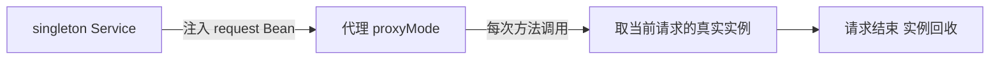
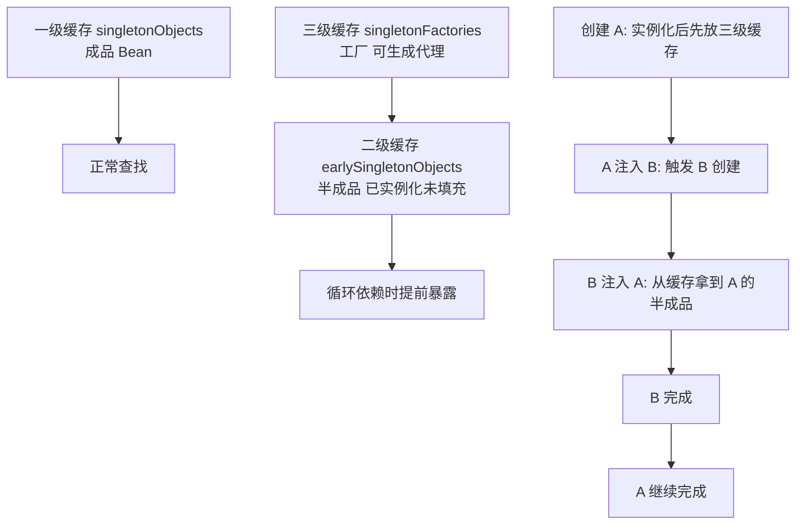

# Bean 作用域与循环依赖

> singleton 还是 prototype？循环依赖为什么报错、怎么解？作用域与依赖闭环一次说透。

## 🎯 本文核心

两个话题一条主线：**作用域决定「一个 Bean 定义造几个实例」，循环依赖暴露「创建顺序互相等待」**——两者都是「实例从哪来、什么时候来」的问题。**机制链**：singleton 全容器一个（默认，无状态铁律）；prototype 每次取用新建（注入只发生一次）；循环依赖的本质是互相等对方「创建完成」，Spring 用三级缓存的「半成品提前暴露」只解「单例 + 非构造器注入」这一种情况。本篇讲**现象与解法直觉**——三级缓存的源码级拆解（为什么是三级、代理何时介入）在特性层《循环依赖与三级缓存》完整展开，两篇互为表里。

## 一句话摘要

默认作用域 singleton 全局一个实例、被所有线程共享，所以无状态是铁律；prototype 每次取用新建但注入只发生一次，容易「作用域失效」；循环依赖报错不是框架缺陷而是设计信号——先想改设计，再想 `@Lazy`，最后才考虑让容器解环。

## 一、背景：对象要几个实例

**singleton（默认）**：全容器一个实例。省内存、可复用，但**多线程共享同一个对象**——如果 Bean 里放可变成员变量（比如一个非线程安全的 `SimpleDateFormat` 成员），并发下就出隐蔽 Bug。所以 singleton Bean 的铁律是**无状态**：不写可变成员，或用 `ThreadLocal` 隔离。

**prototype**：每次 `getBean()`/注入都新建。适合有状态的场景（比如携带请求上下文的任务对象）。代价是创建开销 + 容器不再管它的销毁（篇 3 讲过钩子不触发）——**要多少个实例，本质上是在「复用收益」和「状态隔离」之间取舍**。

## 二、核心：作用域全景

| 作用域 | 实例数 | 典型场景 |
|---|---|---|
| singleton | 全容器 1 个（默认） | Service/DAO/工具类（无状态） |
| prototype | 每次注入/获取新建 1 个 | 有状态任务对象 |
| request | 每个 HTTP 请求 1 个 | Web 请求上下文对象 |
| session | 每个 Web 会话 1 个 | 会话级用户状态 |
| application | 每个 ServletContext 1 个 | 全应用共享的 Web 信息 |

作用域体系本身随框架演进而扩张：Spring 1.x 只有 singleton/prototype 两个，2.0 引入 web 作用域与自定义扩展，到 Boot 时代又加了 Cloud 的 RefreshScope（配置热刷新）——**作用域史就是 Spring 能力圈的演进史**。日常开发的默认选择 95% 以上是 singleton（业内认知口径），其余作用域属于「知道有、用时查」。

**Web 作用域的关键坑**：singleton Service 注入 request 作用域的 Bean 会失败——request Bean 在非请求线程根本不存在。解法是 `@Scope(value="request", proxyMode=TARGET_CLASS)` 声明**代理**：容器注入的是代理对象，每次调用时代理去取当前请求的真实实例。「作用域 + 代理」是框架用代理打通生命周期差的典型手法，自定义作用域同理——这个手法与 AOP 代理同源，代理如何生成在特性层《深入理解AOP与代理》有源码级展开。

## 三、机制：三级缓存与循环依赖（现象与直觉）

**为什么循环依赖难解**：A 创建时需要 B，B 创建时又需要 A——互相等对方「创建完成」，死锁式等待。Spring 的解法思路一句话：**不等「完全创建完」，先把「半成品」提前暴露**。

入门期对三级缓存的**直觉版理解**：一级放成品；二级放「已实例化、依赖还没填完」的半成品；三级放的其实是**工厂**——它能决定「提前暴露的是原对象还是 AOP 代理」。为什么需要一个「工厂」这么绕？直觉是这样：如果 A 需要被代理（比如有 `@Transactional`），循环依赖里提前暴露的必须是**代理对象**而不是裸对象，否则 B 拿到的引用就是错的。三级缓存把「要不要代理」的决策**延迟**到了真正被循环依赖触及的那一刻——没有循环依赖就按正常流程走，有循环依赖才动用工厂。从上下游看，这套缓存体系处在「容器创建线」与「AOP 代理线」的交点：容器管创建节奏，代理增强管能力包装，两条线的汇合点就在三级缓存。这个「按需升级」的设计取舍，源码级的推演（缓存何时升降级、为什么二级缓存会让代理时机错乱）在特性层《循环依赖与三级缓存》里完整走了一遍，入门期记住「三级是为了兼容 AOP 的延迟决策」即可。

**构造器循环依赖为什么无解**：三级缓存的前提是「实例化」和「注入」分两步——先 new 出半成品才能暴露。构造器注入时，new 这个动作本身就需要对方，半成品都造不出来，缓存无从谈起。prototype 循环依赖同理无解：容器不缓存 prototype 实例，没有「提前暴露」的位置。

## 5W 速记卡

| W | 一句话 |
|---|---|
| What | 作用域管实例数量，循环依赖管创建顺序 |
| Why | singleton 复用省资源，prototype 隔离状态；半成品暴露解互相等待 |
| Where | Bean 定义与装配体系内 |
| When | 有状态对象用 prototype；循环依赖报错先想设计 |
| Who | 写 Service 的人都要懂——默认作用域的线程安全是自己的责任 |

## 四、实践：解决与规避策略

**规避优先级**（从设计到妥协，明确推荐按此顺序）：

1. **重新审视依赖方向**：A 依赖 B、B 又依赖 A，多半是职责切分不清——提取共同依赖的 C，环就解了。**循环依赖大多数是设计坏味道的信号**，这是首选解
2. **`@Lazy` 打破**：`@Lazy` 注入的是代理，首次真正使用时才解析——适合「确实互相需要但不会在初始化期互调」的场景
3. **字段注入/setter 注入**：能解但掩盖问题，最后手段（与篇 4 的取舍原则一致）

构造器注入的团队会问「那循环依赖岂不是全报错」——对，报错正是价值：设计问题在启动期暴露，而不是在生产期以诡异时序出现。失效时怎么办也要预案：启动报环错误时，先看环上两个类是否职责纠缠（多数该拆），确实合理的相互引用（如门面互调）才用 `@Lazy`。

**典型使用场景**：Facade 门面互相调用（A 门面要 B 门面的能力、B 又要 A 的）——拆出共享 Service 或改事件解耦；初始化期互调（A 的 `@PostConstruct` 调 B、B 又依赖 A）——把互调推迟到业务期或用 `ApplicationRunner` 延后；请求上下文透传——request 作用域 + 代理。

规模视角补一句量级判断（业内认知口径）：十万行代码以内的服务，循环依赖靠 `@Lazy` 应急可以接受，重构成本大于收益；百万行级工程、几十个模块的组织，装配关系已经进入架构治理视野——环会被依赖分析工具在 CI 里拦截，解环策略要写进模块边界约定；亿级请求的核心链路，初始化时序错乱的排查成本极高，构造器注入 + 禁环 + 启动期全量验证是事实标准。

## 五、与 prototype 注入的区别（最容易想错的地方）

singleton 里注入 prototype，**prototype 只注入一次**（注入发生在 singleton 创建时）——之后用的都是同一个实例，作用域「失效」了。这不是 Bug，是注入时机决定的：注入是一次性动作，而 prototype 的语义是「每次获取新建」——两者对不上。

要真正的「每次拿新的」，两条路：

- `ObjectProvider<T>` 按需 `getObject()`——语义清晰，推荐
- 配 proxyMode 代理——注入代理，每次调用去拿新实例

| 对比 | singleton 注入 singleton | singleton 注入 prototype |
|---|---|---|
| 注入次数 | 1 次，语义一致 | 1 次，但语义错位 |
| 实际效果 | 全局共享一份 | 变相 singleton（失效） |
| 正确姿势 | 直接注入 | ObjectProvider 或代理 |

## 六、常见误区

- **误区一：singleton 是「线程安全的」**。默认作用域只保证实例唯一，线程安全靠你自己设计（无状态/加锁/ThreadLocal）——反直觉但必须刻进脑子
- **误区二：三级缓存能解一切循环依赖**。只解「单例 + 非构造器注入」；prototype 循环依赖、构造器循环依赖都无解，直接报错
- **误区三：`@Lazy` 是循环依赖的万能药**。它只是把解析推迟到首次使用——两个 Bean 真要在初始化期互调，`@Lazy` 照样出问题，而且问题从启动期挪到了运行期，更难查
- **不适用边界**：不是所有「互相引用」都要解——如果两个类确实强协作且不会在初始化期互调，`@Lazy` 一次性打破即可；为解环强行抽第三方的代价是类数量膨胀，取舍要看环的「设计含金量」

## 七、实践叙事：一次启动报环的排查复盘

记录一次启动失败的排查复盘：某服务引入新的审批组件后启动报循环依赖错误，环上有三个类——OrderService、ApprovalFacade、NotifyService。排查路径：先画依赖图，发现 ApprovalFacade 依赖 OrderService 是为了「回调订单状态」，而 OrderService 依赖 ApprovalFacade 是为了「发起审批」——**两个方向干的是两件事，职责已经纠缠**。拆解方案：把「回调订单状态」抽成 OrderStatusUpdater，OrderFacade 与 ApprovalFacade 都只依赖它，环消失，`@Lazy` 都没用上。复盘的启示：循环依赖报错信息里就写着环上所有类名，按图索骥先分析职责再动手——**报错本身是框架送你的设计体检报告**。生产环境类似问题更隐蔽（不报错但初始化时序错乱），所以团队规范坚持构造器注入让环在启动期暴露。

## ❓ 你们可能会问

**Q1：为什么 singleton Bean 要求无状态？**
全局一个实例被所有线程共享，可变成员会出现并发修改；状态用方法参数/局部变量/ThreadLocal 承载。这也是为什么 Service 层普遍设计成「处理流水线」而不是「带记忆的对象」。

**Q2：三级缓存为什么是三级，二级不行吗？**
直觉版：三级（工厂）让「提前暴露原对象还是 AOP 代理」的决策延迟到必要时；二级直接放对象，循环依赖 + AOP 场景会暴露错引用。更细的缓存升降级推演在特性层《循环依赖与三级缓存》，那里的源码走读会把「为什么必须是工厂」讲透。

**Q3：构造器循环依赖 Spring 为什么不救？**
半成品暴露的前提是「先实例化后注入」；构造器注入在实例化这一步就需要对方，原理上无法提前暴露。框架选择「不救」其实是设计立场：这类环几乎都是职责问题，救了反而掩盖。

## 自测三问

1. singleton 与 prototype 在「注入时机」上的行为差异是什么？
2. 循环依赖的三种解法按什么优先级排？
3. request 作用域的 Bean 为什么注入时要配代理？

## 💡 实战提示

- 💡 新写的 Service 先过一遍「有没有可变成员变量」——无状态检查比任何并发修复都便宜
- 💡 遇到循环依赖报错，第一动作是画依赖图问「这两个方向是不是两件事」——八成的正确解是拆职责，不是加注解
- 💡 需要每次拿新的 prototype 实例时用 `ObjectProvider`，别让注入时机把作用域悄悄「吃掉」
- 💡 追问时序类问题（谁先初始化、谁先销毁）时，把 Bean 依赖图画出来按拓扑序推一遍，比记忆钩子顺序表更可靠

## 🔍 追问链与开放问题

**追问一**：singleton 实例唯一，容器是怎么做到并发放问不出多个的？
再深一层：容器对 Bean 的创建有同步保护（按名字加锁创建），并发取同一 Bean 拿到同一个实例。打破砂锅：那 prototype 并发取会怎样？每次都是新实例，天然无冲突——两种作用域的并发语义完全不同，这也是「作用域选择影响并发设计」的底层原因。

**开放问题（值得讨论）**：Boot 2.6 起默认禁止循环依赖（`spring.main.allow-circular-references=false`），框架从「默默帮你解环」转向「逼你改设计」——这个默认值变化值得讨论的是：框架应该在多大程度上替开发者承担设计责任？回顾这一默认值演变的背景，是大量生产事故源于「被解开的环」在运行期爆雷；「能解就解」的宽容和「报错逼改」的严格，分别适合什么成熟度的团队？没有标准答案，但值得每个团队显式选择一次。

## 🎯 核心带走

- **核心一句话**：作用域决定实例数量（singleton 全局一个要无状态、prototype 每取新建但只注入一次）；循环依赖 = 互相等对方创建完成，三级缓存用「半成品 + 代理工厂」只救单例非构造器一环
- **机制链**：创建 A → 实例化后放入三级缓存工厂 → 注入 B 触发 B 创建 → B 从缓存取 A 半成品 → B 完成 → A 续完成（构造器注入没有半成品阶段，无解）
- **失效点/边界**：singleton 不保证线程安全；`@Lazy` 只推迟不消除；prototype 无销毁托管；Boot 2.6+ 默认禁止循环依赖

## 📌 数据与事实声明

- 写于 2026-09-23，基于 Spring Framework 6.x / Boot 3.5.x 口径；三级缓存机制与 Boot 2.6 默认禁循环依赖均为 Spring 官方源码/文档行为（DefaultSingletonBeanRegistry）
- 行业认知：「日常默认 singleton 占比 95% 以上」为业内认知口径，非精确统计
- 免责：作用域与缓存细节以 Spring Framework 官方文档与源码为准

## 📚 参考资料

| 类型 | 标题 | 来源 |
|---|---|---|
| 官方文档 | Bean Scopes（含自定义作用域与代理） | docs.spring.io/spring-framework/reference/core/beans/factory-scopes.html |
| 官方源码 | DefaultSingletonBeanRegistry（三级缓存） | github.com/spring-projects/spring-framework |
| 书 | 《Spring 揭秘》王福强 | 参考资料 |
| 系列互指 | 循环依赖与三级缓存（特性层） | `docs/backend/java/ecosystem/spring-boot/特性层/深入理解IoC容器/3_循环依赖与三级缓存-特性.md` |

## 下篇预告

下一篇 [6_条件装配与starter机制](./6_条件装配与starter机制-入门.md)：自动装配的底层——@Conditional 家族与 starter 的组成结构。
