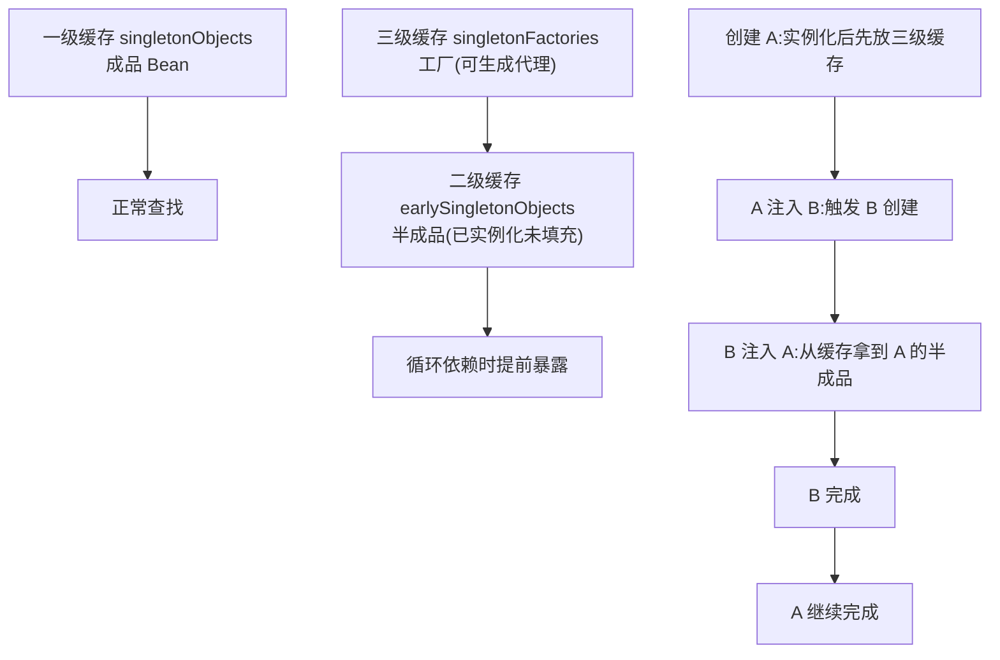
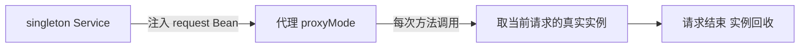

# Bean 作用域与循环依赖

> singleton 还是 prototype？三级缓存为什么能解循环依赖？作用域与依赖闭环一次说透。

## 一句话摘要

作用域决定「一个 Bean 定义造几个实例」——singleton 全局一个（默认，注意无状态设计），prototype 每次取用新建（注入只发生一次，别混淆）；循环依赖的本质是「互相等对方创建完」，Spring 用三级缓存只解「单例 + setter/字段注入」这一种情况，构造器循环依赖无解——源头规避靠设计。

## 一、背景：对象要几个实例

**singleton（默认）**：全容器一个实例。省内存、可复用，但**多线程共享同一个对象**——如果 Bean 里放可变成员变量（比如一个非线程安全的 `SimpleDateFormat` 成员），并发下就出隐蔽 Bug。所以 singleton Bean 的铁律是**无状态**：不写可变成员，或用 `ThreadLocal` 隔离。

**prototype**：每次 `getBean()` 注入都新建。适合有状态的场景（比如携带请求上下文的任务对象）。代价是创建开销 + 容器不再管它的销毁（§3 篇讲过钩子不触发）——**要多少个实例，本质上是在「复用收益」和「状态隔离」之间取舍**。

## 二、核心：作用域全景

| 作用域 | 实例数 | 场景 |
|---|---|---|
| singleton | 全容器 1 个（默认） | Service/DAO/工具类（无状态） |
| prototype | 每次注入/获取新建 1 个 | 有状态任务对象 |
| request | 每个 HTTP 请求 1 个 | Web 请求上下文对象 |
| session | 每个 Web 会话 1 个 | 会话级用户状态 |
| application | 每个 ServletContext 1 个 | 全应用共享的 Web 信息 |

作用域体系本身随框架演进而扩张：Spring 1.x 只有 singleton/prototype 两个，2.0 引入 web 作用域与自定义扩展，到 Boot 时代又加了 Cloud 的 RefreshScope（配置热刷新）——**作用域史就是 Spring 能力圈的演进史**。

**Web 作用域的关键坑**：singleton Service 注入 request 作用域的 Bean 会失败——request Bean 在非请求线程根本不存在。解法是 `@Scope(value="request", proxyMode=TARGET_CLASS)` 声明**代理**：容器注入的是代理对象，每次调用时代理去取当前请求的真实实例。「作用域 + 代理」是框架用代理打通生命周期差的典型手法，自定义作用域同理。

## 三、机制：三级缓存与循环依赖

**为什么循环依赖难解**：A 创建时需要 B，B 创建时又需要 A——互相等对方「创建完成」，死锁式等待。Spring 的解法思路：**不等「完全创建完」，先把「半成品」提前暴露**。

三个缓存的分工：一级放成品；二级放「已实例化、依赖还没填完」的半成品；三级放的其实是**工厂**——它能决定「提前暴露的是原对象还是 AOP 代理」。这个设计是为了兼容 AOP：如果 A 需要代理，循环依赖里提前暴露的必须是**代理对象**而不是裸对象，否则 B 拿到的是错的引用。三级缓存把「要不要代理」的决策延迟到了真正被循环依赖触及的那一刻。

**构造器循环依赖为什么无解**：三级缓存的前提是「实例化」和「注入」分两步——先 new 出半成品才能暴露。构造器注入时，new 这个动作本身就需要对方，半成品都造不出来，缓存无从谈起。

从架构上下游看：作用域是「容器 ↔ 运行环境」的边界协商——容器管创建节奏，Web 环境提供生命周期信号（请求开始/结束），两者靠代理衔接。

## 四、实践：解决与规避策略

**规避优先级**（从设计到妥协）：

1. **重新审视依赖方向**：A 依赖 B、B 又依赖 A，多半是职责切分不清——提取共同依赖的 C，环就解了。**循环依赖大多数是设计坏味道的信号**
2. **`@Lazy` 打破**：`@Lazy` 注入的是代理，首次真正使用时才解析——适合「确实互相需要但不会在初始化期互调」的场景
3. **字段注入/`@Setter` 注入**：能解但掩盖问题，最后手段（§4 篇的取舍原则一致）

构造器注入的团队会问「那循环依赖岂不是全报错」——对，报错正是价值：设计问题在启动期暴露，而不是在生产期以诡异时序出现。

**典型场景**：Facade 门面互相调用（A 门面要 B 门面的能力、B 又要 A 的）——拆出共享 Service 或事件解耦；初始化期互调（A 的 `@PostConstruct` 调 B、B 又依赖 A）——把互调推迟到业务期或用 `ApplicationRunner` 延后。

## 与 prototype 注入的区别（常见误解）

singleton 里注入 prototype，**prototype 只注入一次**（注入发生在 singleton 创建时）——之后用的都是同一个实例，作用域「失效」了。要真正的「每次拿新的」，用 `ObjectProvider<T>` 按需 `getObject()`，或配 proxyMode 代理。这是作用域与注入机制交叉最容易想错的地方。

## 常见误区

- **误区一：singleton 是「线程安全的」**。默认作用域只保证实例唯一，线程安全靠你自己设计（无状态/加锁/ThreadLocal）
- **误区二：三级缓存能解一切循环依赖**。只解「单例 + 非构造器注入」；prototype 循环依赖、构造器循环依赖都无解，直接报错
- **误区三：`@Lazy` 是循环依赖的万能药**。它只是把解析推迟到首次使用——两个 Bean 真要在初始化期互调，`@Lazy` 照样出问题

## 自测三问

1. **为什么 singleton Bean 要求无状态？**
   - 全局一个实例被所有线程共享，可变成员会出现并发修改；状态用方法参数/局部变量/ThreadLocal 承载。

2. **三级缓存为什么是三级，二级不行吗？**
   - 三级（工厂）让「提前暴露原对象还是 AOP 代理」的决策延迟到必要时——二级直接放对象，循环依赖 + AOP 场景会暴露错引用。

3. **构造器循环依赖 Spring 为什么不救？**
   - 半成品暴露的前提是「先实例化后注入」；构造器注入在实例化这一步就需要对方，原理上无法提前暴露。

## 5W 速记卡

| W | 一句话 |
|---|---|
| What | 作用域管实例数量，循环依赖管创建顺序 |
| Why | singleton 复用省资源，prototype 隔离状态；三级缓存解半成品依赖 |
| Where | Bean 定义与装配体系内 |
| When | 有状态对象用 prototype；循环依赖报错先想设计 |
| Who | 写 Service 的人都要懂——默认作用域的线程安全是自己的责任 |

## 下篇预告

下一篇 [6_条件装配与starter机制](./6_条件装配与starter机制-入门.md)：自动装配的底层——@Conditional 家族与 starter 的组成结构。

## 📌 数据与事实声明

- 写于 2026-09-09，基于 Spring Framework 6.x 口径；三级缓存机制为 Spring 官方源码行为（DefaultSingletonBeanRegistry）
- 免责：以 Spring Framework 官方文档与源码为准

## 📚 参考资料

| 类型 | 标题 | 来源 |
|---|---|---|
| 官方文档 | Bean Scopes（含自定义作用域与代理） | docs.spring.io/spring-framework/reference/core/beans/factory-scopes.html |
| 官方源码 | DefaultSingletonBeanRegistry（三级缓存） | github.com/spring-projects/spring-framework |
| 书 | 《Spring 揭秘》王福强 | 参考资料 |
