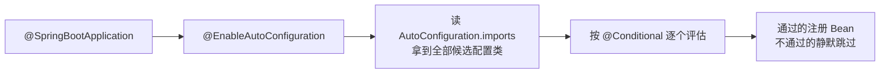

# 条件装配与 Starter 机制

> @Conditional 家族怎么按条件生效、@EnableAutoConfiguration 背后是什么、自定义 starter 怎么做——自动装配机制入门。

## 一句话摘要

条件装配 = 按运行时条件决定 Bean 是否注册（类路径有某个类、配置项等于某值、容器缺某个 Bean）；starter = 「依赖打包 + 自动配置类」的销售单元——两者合起来就是 Boot「引依赖即得功能」的全部秘密，也是看懂「为什么我的 Bean 没生效」的钥匙。

## 一、背景：一个 jar 全家桶如何按需生效

没有条件装配的时代（Spring 2.x），引入一个库就要手动写一堆 `<bean>` 配置——配置地狱的根源不是配置多，而是**配置不区分环境**：开发要一套、生产要一套，全靠 profile 切换手工维护。

条件装配把思路反过来：**配置类自己声明生效条件**，环境满足就注册、不满足就静默跳过。于是同一个 jar 可以「引了就生效、不满足就闭嘴」——starter 全家桶按需生效的基础设施就位了。

## 二、核心：@Conditional 家族

| 条件注解 | 生效条件 | 典型用途 |
|---|---|---|
| `@ConditionalOnClass` | 类路径存在指定类 | 有 Jackson 才装配 JSON 转换器 |
| `@ConditionalOnMissingClass` | 类路径缺失 | 避免与替代实现打架 |
| `@ConditionalOnProperty` | 配置项等于指定值 | `spring.mail.enabled=true` 才装配邮件 |
| `@ConditionalOnMissingBean` | 容器没有该 Bean | **默认实现的标准写法**：用户配了就用用户的 |
| `@ConditionalOnBean` | 容器已有该 Bean | 依赖某 Bean 才装配 |
| `@ConditionalOnWebApplication` | 是 Web 应用 | Web 专属组件 |

**最重要的组合范式是 `@ConditionalOnClass` + `@ConditionalOnMissingBean`**：类路径有这个类才装配（否则静默退出），容器里还没有这个 Bean 才给默认实现（用户自定义的优先）。这两条合起来，就是「约定大于配置，覆盖永远有效」的机制保证。

```java
@AutoConfiguration
@ConditionalOnClass(MailSender.class)                 // 类路径有才生效
public class MailAutoConfiguration {
    @Bean
    @ConditionalOnMissingBean(MailSender.class)       // 用户没配才给默认
    public MailSender mailSender() { return new JavaMailSenderImpl(); }
}
```

## 三、机制：自动装配原理初识

`@EnableAutoConfiguration` 的加载机制随版本演进过一次：Spring Boot 2.7 之前用 `spring.factories` 注册，2.7 起改为 `META-INF/spring/org.springframework.boot.autoconfigure.AutoConfiguration.imports` 文件（每行一个自动配置类全名），3.x 全面切换到 imports 文件——读老文章时注意这个分界。



**自动配置类 vs 普通配置类**：自动配置类由 imports 文件加载、必须设计成「可缺席」（条件不满足就不生效）；普通配置类由组件扫描加载、无条件生效。排障上：普通配置类的 Bean 缺了查扫描路径，自动配置的 Bean 缺了查条件评估。

**失效分析**：启动失败时 Boot 的 failure analyzer 会给 human-readable 提示；看「某个 Bean 为什么没装配」用 `--debug` 启动打印 CONDITIONS EVALUATION REPORT——每个配置类 matched/not-matched 的原因逐条列出。这份报告是自动装配问题的唯一真相源。

## 四、实践：典型场景与自定义 starter 全流程

**典型场景**：公司统一日志埋点/加解密/审计组件封装成 starter；第三方 SDK（短信/对象存储）包一层带默认配置的 starter 让业务零配置接入；开源 starter 的默认实现不符合要求时用 `@ConditionalOnMissingBean` 覆盖。

给公司封装一个私有 starter（如统一日志埋点、加解密组件）的完整动作：

1. **两个模块**：`xxx-spring-boot-autoconfigure`（自动配置类 + conditions）+ `xxx-spring-boot-starter`（空壳，只聚合依赖）——官方命名规范：第三方用 `xxx-spring-boot-starter`，官方才叫 `spring-boot-starter-xxx`
2. **写自动配置类**：`@AutoConfiguration` + `@ConditionalOnClass`（功能类在才生效）+ `@ConditionalOnMissingBean`（用户可覆盖）+ `@ConfigurationProperties`（配置项绑定）
3. **注册**：写 `AutoConfiguration.imports` 文件，内容是配置类全名
4. **发布**：使用者只引 starter 一个依赖，配置几行 yml 即用

**金融项目的封装思路**：把监管要求的审计日志、脱敏、幂等框架沉淀为公司 starter——所有业务系统引同一个 starter，监管口径升级只改 starter 一处。这是「组件复用」在合规场景的放大价值。


## 与手动配置的区别

| 对比 | 手动配置 | 自动装配 |
|---|---|---|
| 生效判定 | 写了就有 | 条件满足才有 |
| 用户覆盖 | 改配置类 | `@ConditionalOnMissingBean` 放行用户 Bean |
| 升级影响 | 改配置类 | 框架演进配置内部实现，接口不变 |

取舍：自动装配省了配置，代价是「生效与否」需要会看条件报告——这份能力是 Boot 开发者的必修课。

## 常见误区

- **误区一：配置类写在扫描包里就一定会生效**。自动配置类不走扫描，走 imports 文件——放错了地方等于没写
- **误区二：条件注解随便加，顺序无所谓**。`@ConditionalOnBean` 依赖「别的 Bean 已注册」的求值顺序，自动配置类之间有加载顺序约定（`@AutoConfigureBefore/After`），乱用会时灵时不灵
- **误区三：starter 里塞业务逻辑**。starter 只做「装配 + 默认实现」，业务逻辑进 starter 会让它变成甩不掉的全局依赖——边界要守住

## 自测三问

1. **为什么我的 Bean 没被装配？**
   - 三步定位：看它是自动配置类还是扫描组件；自动配置的跑 `--debug` 看条件报告哪条不满足；扫描组件查包路径。

2. **`@ConditionalOnMissingBean` 为什么是 starter 的灵魂？**
   - 它保证「用户自定义优先，框架默认兜底」——没有它，starter 的默认实现会和用户配置打架。

3. **自定义 starter 为什么拆两个模块？**
   - autoconfigure 放代码与条件，starter 只聚合依赖——职责分离后，依赖变化不影响实现，实现升级不用动依赖声明。

## 5W 速记卡

| W | 一句话 |
|---|---|
| What | 按条件装配 Bean + starter 打包分发 |
| Why | 让「引依赖即得功能」可扩展到任何人封装的组件 |
| Where | Boot 自动装配体系 / 公司基础设施封装 |
| When | 三次以上重复配置同类组件时，就该抽 starter |
| Who | 平台/中台团队的核心产出物 |

## 下篇预告

下一篇 [7_AOP切面编程](./7_AOP切面编程-入门.md)：切点、通知、代理——横切关注点的统一收口。

## 📌 数据与事实声明

- 写于 2026-09-09，基于 Spring Boot 3.5.x；imports 文件机制为 Boot 2.7+ 官方演进（2.7 起弃用 spring.factories 自动装配注册）
- 免责：条件注解清单以官方 API 文档为准

## 📚 参考资料

| 类型 | 标题 | 来源 |
|---|---|---|
| 官方文档 | Auto-configuration（How-to 与 Reference） | docs.spring.io/spring-boot/reference/using/auto-configuration.html |
| 官方文档 | Creating Your Own Auto-configuration | docs.spring.io/spring-boot/reference/features/auto-configuration.html#custom-starter |
| 官方源码 | spring-boot-autoconfigure（条件注解全集） | github.com/spring-projects/spring-boot |
