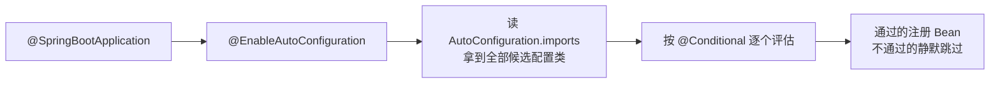

# 条件装配与 Starter 机制

> @Conditional 家族怎么按条件生效、@EnableAutoConfiguration 背后是什么、自定义 starter 怎么做——自动装配机制入门。

## 🎯 本文核心

条件装配 = **按运行时条件决定 Bean 是否注册**（类路径有某个类、配置项等于某值、容器缺某个 Bean）；starter = **「依赖打包 + 自动配置类」的分发单元**——两者合起来就是 Boot「引依赖即得功能」的全部秘密，也是看懂「为什么我的 Bean 没生效」的钥匙。**机制链**：`@EnableAutoConfiguration` → 读 imports 文件拿到候选配置类 → 逐个评估 `@Conditional` → 通过的注册、不通过的静默跳过。本篇讲机制直觉与用法；`@Conditional` 求值的源码时序、自动配置类的加载细节在特性层《自动装配机制与条件装配源码》逐行拆解，两篇互为表里。

## 一句话摘要

没有条件装配的时代，引入一个库就要手动写一堆配置——配置地狱的根源不是配置多，而是**配置不区分环境**。条件装配把思路反过来：配置类自己声明生效条件，环境满足就注册、不满足就静默跳过。starter 再把「依赖 + 自动配置」打包成分发单元，于是任何团队都能封装出「引了就能用」的组件。

## 一、背景：一个 jar 全家桶如何按需生效

Boot 自动装配的演进分两个阶段：Spring Boot 2.7 之前用 `spring.factories` 注册自动配置类，2.7 起改为 `META-INF/spring/org.springframework.boot.autoconfigure.AutoConfiguration.imports` 文件（每行一个配置类全名），3.x 全面切换到 imports 文件——读老文章时注意这个分界，机制没变、注册入口变了。

这套机制解决的架构问题是「**能力可插拔**」：同一个 jar，进什么环境就装配什么能力，不需要每处 if-else 手工判断。整个评估流水线一张图：



## 二、核心：@Conditional 家族

| 条件注解 | 生效条件 | 典型用途 |
|---|---|---|
| `@ConditionalOnClass` | 类路径存在指定类 | 有 Jackson 才装配 JSON 转换器 |
| `@ConditionalOnMissingClass` | 类路径缺失 | 避免与替代实现打架 |
| `@ConditionalOnProperty` | 配置项等于指定值 | `spring.mail.enabled=true` 才装配邮件 |
| `@ConditionalOnMissingBean` | 容器没有该 Bean | **默认实现的标准写法**：用户配了就用用户的 |
| `@ConditionalOnBean` | 容器已有该 Bean | 依赖某 Bean 才装配 |
| `@ConditionalOnWebApplication` | 是 Web 应用 | Web 专属组件 |

**最重要的组合范式是 `@ConditionalOnClass` + `@ConditionalOnMissingBean`**：类路径有这个类才装配（否则静默退出），容器里还没有这个 Bean 才给默认实现（用户自定义的优先）。这两条合起来，就是「约定大于配置，覆盖永远有效」的机制保证：

```java
@AutoConfiguration
@ConditionalOnClass(MailSender.class)                 // 类路径有才生效
public class MailAutoConfiguration {
    @Bean
    @ConditionalOnMissingBean(MailSender.class)       // 用户没配才给默认
    public MailSender mailSender() { return new JavaMailSenderImpl(); }
}
```

**为什么这么设计？** `@ConditionalOnMissingBean` 是整套体系的设计灵魂：它让「框架默认」与「用户自定义」有了明确的优先级契约——用户 Bean 先注册（组件扫描先于自动装配求值），框架看到已有就让位。没有这条约定，starter 的默认实现会和用户配置打架，覆盖机制就无从谈起。

## 5W 速记卡

| W | 一句话 |
|---|---|
| What | 按条件装配 Bean + starter 打包分发 |
| Why | 让「引依赖即得功能」可扩展到任何人封装的组件 |
| Where | Boot 自动装配体系 / 组织内公共组件封装 |
| When | 同类组件配置重复三次以上，就该抽 starter |
| Who | 平台/基础组件团队的核心产出物 |

## 三、机制：自动配置类与普通配置类的边界

**自动配置类 vs 普通配置类**：自动配置类由 imports 文件加载、必须设计成「可缺席」（条件不满足就不生效）；普通配置类由组件扫描加载、无条件生效。排障口径因此分叉：**普通配置类的 Bean 缺了查扫描路径，自动配置的 Bean 缺了查条件评估**——先分清 Bean 属于哪类，再选排查入口，方向反了会白查半天。

**失效分析的标准动作**：看「某个 Bean 为什么没装配」，用 `--debug` 启动打印 CONDITIONS EVALUATION REPORT——每个配置类 matched/not-matched 的原因逐条列出。这份报告是自动装配问题的唯一真相源：哪条条件没满足、期望值与实际值是什么，全都写在里面。启动直接失败的场景，Boot 的 failure analyzer 会给人类可读的修复建议，先读它再动手。

## 四、实践：自定义 starter 全流程

给组织封装一个私有 starter（如统一日志埋点、加解密组件）的完整动作：

1. **两个模块**：`xxx-spring-boot-autoconfigure`（自动配置类 + 条件）+ `xxx-spring-boot-starter`（空壳，只聚合依赖）——官方命名规范：第三方用 `xxx-spring-boot-starter`，官方才叫 `spring-boot-starter-xxx`
2. **写自动配置类**：`@AutoConfiguration` + `@ConditionalOnClass`（功能类在才生效）+ `@ConditionalOnMissingBean`（用户可覆盖）+ `@ConfigurationProperties`（配置项绑定）
3. **注册**：写 `AutoConfiguration.imports` 文件，内容是配置类全名
4. **发布**：使用者只引 starter 一个依赖，配置几行 yml 即用


**为什么拆两个模块？** 职责分离：autoconfigure 放代码与条件，starter 只管依赖聚合——依赖变化不影响实现，实现升级不用动依赖声明；模块边界就此清晰：使用方永远只面对 starter 一个门面。这套封装模式的价值随规模放大（业内认知口径）：十几个服务的小团队，直接引 jar 写配置类也够；百万行级、上百个服务的组织，组件升级要全量同步——starter 把「升级」收敛成「改一处版本号」，上下游依赖关系也随版本号一起管理；亿级请求的核心链路平台化之后，starter 更是基础组件唯一合理的交付形态（版本、配置、行为三统一），这类封装策略会进入组织的架构规范。

## 五、典型使用场景

- **组织内统一组件**：日志埋点、加解密、审计、幂等框架沉淀为 starter——所有业务系统引同一个 starter，治理口径升级只改一处。监管/审计类需求的封装思路同理：把合规要求做成默认行为，业务零成本达标
- **第三方 SDK 接入**：短信/对象存储 SDK 包一层带默认配置的 starter，业务零配置接入
- **开源组件覆盖**：开源 starter 的默认实现不符合要求时，用 `@ConditionalOnMissingBean` 的约定写自己的 Bean 直接覆盖
- **多环境差异化装配**：同一份代码，开发环境装配内存实现、生产环境装配真实客户端——`@ConditionalOnProperty` 按环境开关

## 六、与手动配置的区别

| 对比 | 手动配置 | 自动装配 |
|---|---|---|
| 生效判定 | 写了就有 | 条件满足才有 |
| 用户覆盖 | 改配置类 | `@ConditionalOnMissingBean` 放行用户 Bean |
| 升级影响 | 每个工程改一遍 | 框架演进内部实现，接口不变 |
| 排查入口 | 直接看代码 | 条件评估报告 |

取舍要说两面：自动装配省了配置，代价是「生效与否」多了一层间接——必须会看条件报告才能排障，这份能力是 Boot 开发者的必修课；「隐藏的自动行为」也可能在不了解时造成意外装配（引了依赖就悄悄生效），所以 starter 的克制原则与依赖的克制原则一致：**用到一个加一个**。什么时候用自动装配、什么时候坚持手动配置的选型判断就一条：行为可默认的通用能力交给自动装配，需要精细控制且行为特殊的组件手动写配置类——权衡的标准是「默认值离你的需求有多远」。

## 七、常见误区

- **误区一：配置类写在扫描包里就一定会生效**。自动配置类不走扫描，走 imports 文件——放错了地方等于没写，这是自定义 starter 最常见的「静默失效」
- **误区二：条件注解随便加，顺序无所谓**。`@ConditionalOnBean` 依赖「别的 Bean 已注册」的求值顺序，自动配置类之间有加载顺序约定（`@AutoConfigureBefore/After`），乱用会时灵时不灵——时灵时不灵的根因往往是求值顺序，不是玄学
- **误区三：starter 里塞业务逻辑**。starter 只做「装配 + 默认实现」，业务逻辑进 starter 会让它变成甩不掉的全局依赖——边界要守住
- **不适用边界**：只有一个使用方的组件不必抽 starter——封装有成本（模块拆分、版本管理、文档），使用方达到三个以上再抽，收益才覆盖成本

## 八、实践叙事：一次「starter 不生效」的排查复盘

记录一次典型排查复盘：团队封装的日志埋点 starter 在 A 应用生效、在 B 应用死活不生效。排查路径：先在 B 应用跑 `--debug` 看条件报告——配置类显示 not matched，原因是 `@ConditionalOnClass` 检查的核心类不在类路径；再查 B 的 pom，发现 B 引的是老版本的 starter 坐标（模块拆分前的旧 artifact），核心类在老版本里还不存在。复盘三条结论：**条件报告先看「not matched 的条件」再看代码**；starter 发版必须保证坐标与模块结构的向后兼容或明确迁移指南；新 starter 接入要走一遍「引依赖 → 看条件报告 matched → 触发一次行为验证」的三步验收，不能只看「启动没报错」。

## ❓ 你们可能会问

**Q1：为什么我的 Bean 没被装配？**
三步定位：看它是自动配置类还是扫描组件；自动配置的跑 `--debug` 看条件报告哪条不满足；扫描组件查包路径（启动类位置！）。九成答案在条件报告里。

**Q2：`@ConditionalOnMissingBean` 为什么是 starter 的灵魂？**
它保证「用户自定义优先，框架默认兜底」——没有它，starter 的默认实现会和用户配置打架，覆盖机制失效。这也是 Boot 生态「约定可覆盖」信任关系的机制基石。

**Q3：自定义 starter 为什么拆两个模块？**
autoconfigure 放代码与条件，starter 只聚合依赖——职责分离后，依赖变化不影响实现，实现升级不用动依赖声明；使用方也只需要关心 starter 一个坐标。

## 自测三问

1. `@ConditionalOnClass` 和 `@ConditionalOnMissingBean` 分别守卫什么？
2. 自动配置类和普通配置类的加载入口有什么不同？
3. 自定义 starter 的四步流程是什么？

## 💡 实战提示

- 💡 封装 starter 前先写「使用方视角的一页文档」：引什么坐标、配什么项、默认行为、怎么覆盖——没有文档的 starter 是负债
- 💡 排查装配问题先跑 `--debug` 条件报告，matched/not-matched 逐条对着看，不要靠猜
- 💡 starter 的默认值要「保守可跑」，个性化能力全部走 `@ConfigurationProperties` 暴露——默认行为改一次，所有使用方陪葬一次
- 💡 追问「这个自动配置类什么时候生效」时，把它依赖的条件注解逐个翻译成大白话（类路径有什么/配置是什么/容器里有没有），条件组合一读就懂

## 🔍 追问链与开放问题

**追问一**：自动装配每次启动都要评估全部候选配置类，会不会拖慢启动？
再深一层：会，候选越多评估越久——所以 Boot 3 引入了自动配置类排序优化与 AOT 提前计算的路径，把运行期评估部分搬到构建期。打破砂锅：AOT 化之后条件还有「运行时」语义吗？部分有——`@ConditionalOnBean` 这类依赖容器状态的条件的静态化是原生镜像的难点之一，特性层《自动装配机制与条件装配源码》与《深入理解安全与原生》系列分别从装配和 AOT 两侧展开。

**开放问题（值得讨论）**：starter 是「组织内组件治理」的最佳载体吗？一种观点认为 starter 解决的是接入成本，治理（版本一致性、漏洞响应）要靠平台层的依赖管控；另一种观点认为 starter 的版本收敛本身就是治理。值得讨论的是：当同一个 starter 在组织内存在 5 个版本共存时，该靠工具强制对齐，还是靠 starter 自身的向后兼容设计——这决定了封装团队的工作重心。

## 🎯 核心带走

- **核心一句话**：条件装配让 Bean「满足条件才注册」，starter 把「依赖 + 自动配置」打包成分发单元——两者合成 Boot「引依赖即得功能」的机制底座
- **机制链**：`@EnableAutoConfiguration` → 读 imports 候选 → 逐个评估 `@Conditional` → 通过注册/不通过静默跳过；`@ConditionalOnMissingBean` 保证用户覆盖优先
- **失效点/边界**：自动配置类不进扫描（放错即失效）；条件求值有顺序依赖；starter 不装业务逻辑；单使用方不值得抽 starter

## 📌 数据与事实声明

- 写于 2026-09-23，基于 Spring Boot 3.5.x；imports 文件机制为 Boot 2.7+ 官方演进（2.7 起弃用 spring.factories 自动装配注册），为公开口径
- 行业认知：「使用方三个以上再抽 starter」「规模分档判断」为业内认知口径
- 免责：条件注解清单与命名规范以官方 API 文档为准

## 📚 参考资料

| 类型 | 标题 | 来源 |
|---|---|---|
| 官方文档 | Auto-configuration（How-to 与 Reference） | docs.spring.io/spring-boot/reference/using/auto-configuration.html |
| 官方文档 | Creating Your Own Auto-configuration | docs.spring.io/spring-boot/reference/features/auto-configuration.html |
| 官方源码 | spring-boot-autoconfigure（条件注解全集） | github.com/spring-projects/spring-boot |
| 系列互指 | 深入理解自动装配与启动流程（特性层） | `docs/backend/java/ecosystem/spring-boot/特性层/深入理解自动装配与启动流程/index.md` |

## 下篇预告

下一篇 [7_AOP切面编程](./7_AOP切面编程-入门.md)：切点、通知、代理——横切关注点的统一收口。
