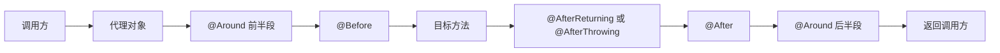
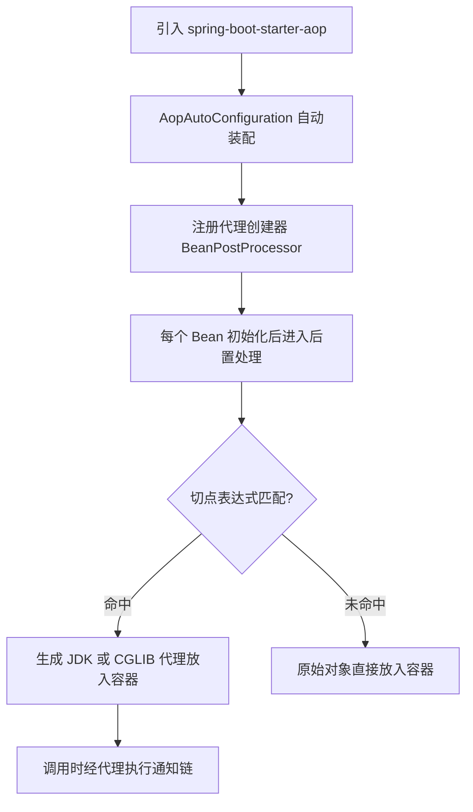

# AOP 切面编程

> **一句话摘要**：AOP 把日志、鉴权、监控、事务这类散落在每个业务方法里的「横切关注点」抽到切面里统一维护，靠动态代理在方法调用前后织入逻辑——业务代码一行不改，横切能力全局生效。

## 🎯 本文核心

**核心机制一句话**：Spring AOP 的本质是「代理对象替换」——容器在 Bean 初始化完成后，用切点表达式逐个比对，命中的 Bean 不再以原样放进容器，而是放一个动态代理进去；调用方拿到的永远是代理，通知逻辑就在代理转发的前后执行。

**机制链**：`starter 引入 → 自动装配开启代理 → BeanPostProcessor 在初始化后拦截 → 按切点匹配 → 生成 JDK/CGLIB 代理 → 调用时执行通知链`。这条链上任何一环断掉（比如绕过代理直接 `this` 调用），AOP 就失效——理解了链，就理解了后面所有失效场景。

## 一、为什么需要 AOP：横切关注点的抽离

先看一个没有 AOP 的世界。订单创建、库存扣减、支付回调三个方法，每个都要打入口日志、校验登录态、统计耗时：

```java
public Order createOrder(OrderRequest req) {
    long start = System.currentTimeMillis();
    log.info("enter createOrder, user={}", currentUser());
    checkLogin();
    // —— 以上三行在 20 个方法里重复出现 ——
    Order order = doCreate(req);
    log.info("exit createOrder, cost={}ms", System.currentTimeMillis() - start);
    return order;
}
```

这类日志/鉴权/监控逻辑有三个共同点：**到处都要、与业务无关、改一处要动所有文件**。软件工程里叫「横切关注点」，OOP 的继承和组合都解不干净——继承会污染类的语义，组合要求每个方法显式调用工具类，重复依旧。

AOP（面向切面编程）的设计思想是：**把「在哪些方法前后做什么」声明出来，让容器替你织入**。业务类保持纯净，横切逻辑集中在一个切面类里。这背后是一种设计哲学的转向：从「我在每个方法里调用公共逻辑」变成「声明规则，让框架反向注入」——控制反转思想在行为维度的延伸。

**追问链：从能用到为什么**

- **追问 ①**：切面代码不改业务类，那逻辑是什么时候进去的？——不是编译期改字节码（AspectJ 才是编译织入），Spring AOP 是运行期生成代理对象，调用先进代理再转发。
- **再追问**：那容器里放的还是原来的对象吗？——不是。注入给你的是代理，原始 Bean 被包在代理内部；`ApplicationContext.getBean()` 拿到的类型看起来一样，实际是子类/同接口的代理实例。
- **打破砂锅**：既然靠代理，什么情况会绕过代理？——`this.method()` 自调用、`final`/`private` 方法、自己 `new` 出来的对象。这三类是 AOP 失效的全部根源，第五节展开。

## 二、切点与五类通知

### 2.1 切点表达式：声明「织入哪里」

```java
@Aspect
@Component
public class AccessLogAspect {

    // 拦截 service 包下所有类的所有方法
    @Pointcut("execution(* com.example.app.service..*.*(..))")
    public void serviceLayer() {}

    // 拦截带某个自定义注解的方法——最推荐，精准且不怕重构挪包
    @Pointcut("@annotation(com.example.app.anno.AccessLog)")
    public void annotated() {}
}
```

三种常用表达式的取舍：`execution` 按方法签名批量拦截，适合包级别的通用策略；`@annotation` 按注解拦截，语义最清晰、误伤最小，业务埋点首选；`within` 按类型拦截，粒度粗，适合调试期临时观察。**推荐默认用 `@annotation`，只有真正的横切策略（全局日志、全局鉴权）才用 `execution`**。

### 2.2 五类通知：声明「什么时候做」

| 通知 | 时机 | 典型用途 |
|---|---|---|
| `@Before` | 目标方法执行前 | 鉴权、参数预检 |
| `@AfterReturning` | 正常返回后 | 结果脱敏、审计落库 |
| `@AfterThrowing` | 抛异常后 | 异常埋点上报 |
| `@After` | 结束后（不论成败） | 资源清理 |
| `@Around` | 完全包裹 | 耗时统计、限流、缓存、重试 |

```java
@Around("serviceLayer()")
public Object around(ProceedingJoinPoint pjp) throws Throwable {
    long start = System.currentTimeMillis();
    try {
        Object result = pjp.proceed();   // 放行：不调它，目标方法根本不执行
        return result;
    } finally {
        log.info("{} cost {}ms", pjp.getSignature(), System.currentTimeMillis() - start);
    }
}
```

`@Around` 是唯一能**决定目标方法是否执行、且能改返回值**的通知，`ProceedingJoinPoint.proceed()` 就是放行开关。



💡 **实战提示**：能不用 `@Around` 就不用——它权限太大，忘了 `proceed()` 或重复调用都会制造难排查的 Bug。简单的前置校验用 `@Before`，让每个通知只干一类事。

💡 **实战提示**：多个切面叠加时用 `@Order(n)` 控制顺序，数字越小越先进入、越后退出，像洋葱模型。鉴权切面的 Order 应小于日志切面，保证没登录的请求不被记录脏日志。

## 三、Spring Boot 里「开个注解就生效」的底层原理

纯 Spring 时代要手写 `@EnableAspectJAutoProxy`；Boot 项目里加一个 `spring-boot-starter-aop` 依赖、写个 `@Aspect` 就生效了。为什么？

机制穿透到底层是一条自动装配链：

1. starter 引入 `spring-aop` 与 AspectJ 依赖，`AopAutoConfiguration` 条件满足被激活；
2. 它向容器注册 `AnnotationAwareAspectJAutoProxyCreator`——本质是一个 `BeanPostProcessor`；
3. 容器创建**每一个** Bean 时，初始化完成后都会经过这个后置处理器：拿全部切面的切点表达式逐个匹配；
4. 匹配成功 → 生成代理对象放入容器；不匹配 → 原样返回。



代理怎么选？JDK 动态代理要求目标实现接口（基于 `Proxy` + 反射）；CGLIB 生成目标类的子类字节码（要求类和方法非 `final`）。**演进结论**：Boot 2.x 起 `proxy-target-class` 默认 true，全量走 CGLIB——官方公开口径的理由是「有无接口行为一致」，省掉了「注入接口实现类时代理类型对不上」这类经典困惑。这是框架演进里「用简单性换一点代理创建开销」的典型取舍，公开资料多次提及，初创期性能损耗业内认知上可忽略。

**设计思想**：把「是否织入」从运行时 if-else 变成容器生命周期的声明式规则，是 Spring「非侵入式」哲学的又一次落地——业务类对切面毫无感知，删掉切面业务照跑。回头看这十几年的演进：XML 配置 `<aop:config>` → 注解声明 → Boot 自动装配，复杂度不断从使用者侧挪向框架侧，但代理这个底层机制始终没变——变的只是「触发它的方式」越来越省心。这种「机制稳定、入口简化」的演进路径，在读其他 Spring 子项目时同样适用。

## 四、AOP 与过滤器、拦截器的区别

三者都做「包裹逻辑」，但作用位置完全不同——这是选型判断的根基：

| 维度 | AOP 切面 | 拦截器 Interceptor | 过滤器 Filter |
|---|---|---|---|
| 作用层 | Bean 方法级（容器内部） | Handler 前后（Spring MVC） | Servlet 请求级（容器） |
| 能拦截谁 | 任何 Spring Bean 的方法 | 只能拦进 Controller 的请求 | 一切请求（含静态资源） |
| 能拿到什么 | 方法参数、返回值、注解 | HandlerMethod、ModelAndView | 原始 request/response |
| 典型用途 | 事务、缓存、方法级鉴权 | 登录态、接口日志 | 编码、全局安全头 |

一句话选型：**要拦「任意 Bean 的方法」用 AOP；要拦「HTTP 请求」按需选 Filter/Interceptor**（详见系列第 11 篇）。从架构视角看，三者的作用位置天然划出了模块边界：Filter 守在容器入口，Interceptor 守在 MVC 门内，AOP 深入到服务层方法内部——切面不应越界去读 HTTP 细节，上游三层也不该下探替代切面做方法级增强，各层守住自己的上下游契约，排查问题时才能一眼定位逻辑在哪个层生效。

## 五、常见失效场景与排查

失效只有三类根源，全部能追溯到「没走代理」：

1. **自调用**：同一个类里 `this.check()` 调用本类的切点方法，走的是原始对象引用，代理被完全绕过。替代方案：注入自身代理（`ObjectProvider` 拿自己）或拆类。
2. **方法修饰符**：`final`/`private`/`static` 方法无法被子类代理重写（CGLIB）或接口代理拦不到，通知静默丢失。
3. **非容器对象**：`new` 出来的对象没有经过 BeanPostProcessor，天然无代理。

曾经有团队在线上排查过一个经典案例：切面里给核心服务加了耗时监控，某个接口的监控却始终是零。复盘下来，是该方法被同类另一个方法内部调用，`this` 直达原始对象，监控静默失效了一周。这个踩坑的教训值得记录：**「改了切面没生效」第一反应查调用链是否经过了代理**，而不是怀疑表达式写错。

💡 **实战提示**：验证代理是否生效，直接在方法里打印 `this.getClass()`——输出带 `$$EnhancerBySpringCGLIB` 或 `$Proxy` 字样说明拿的是代理，否则切面必然失效。

## 六、典型使用场景与选型

**什么时候用**：日志审计、方法级权限、缓存（`@Cacheable` 底层就是 AOP）、声明式事务（`@Transactional` 同样是代理）、接口限流、重试——所有「与业务无关但每个方法都要」的逻辑。

**什么时候不用**：需要读/写 HTTP 请求体本身的逻辑（AOP 拿不到 request 上下文的原始流）；需要感知 MVC 生命周期的逻辑（如渲染前后处理）；以及只想拦 URL 白名单的场景——这些交给 Filter/Interceptor 更合适，代价是用错位置后逻辑要么拿不到数据、要么拦截范围失控。

**量级分档 Trade-off**：先想清楚约束来源——切面代码运行在调用主链路上，它消耗的每一毫秒都会被上下游放大成全站延迟。10 万级请求量的应用，切面里做一次 Redis 查询问题不大，这一档的核心问题是「功能正确」而不是「纳秒级开销」；千万级请求量下切面逻辑被放大成全站开销，这一档的核心问题是「恒定小开销」而不是「偶尔抖动」，切面内必须降到本地缓存或采样；亿级链路里 AOP 只留最小集（限流/熔断），观测走旁路采集——这是延迟驱动型思考方式：主链路只留 O(1) 内存操作，其余全部异步化。

## 你们可能会问

**Q1：Spring AOP 和 AspectJ 什么关系？**
Spring AOP 借用了 AspectJ 的注解语法（`@Aspect`、`@Around`），但织入方式完全不同：Spring 是运行期动态代理，只拦 Spring Bean 的方法；AspectJ 是编译期/类加载期改字节码，能织构造器、静态方法、字段。绝大多数应用 Spring AOP 足够。

**Q2：切面里能注入其他 Bean 吗？**
能。切面本身就是普通 Bean，`@Autowired` 照常工作。注意切面别依赖被自己拦截的 Bean，容易造成循环依赖。

**Q3：`@Transactional` 也是 AOP 吗？会和我自己写的切面打架吗？**
是，事务就是内置切面。不「打架」，但顺序由 `@Order` 决定——自定义切面若在事务通知内层，它抛的异常会触发回滚；若在外层且吞了异常，事务可能不回滚，这是最容易出事的位置关系。

**Q4：切点表达式写错了会启动报错吗？**
多数情况不会——匹配不到就静默不生效。所以切面功能上线必须有一条端到端验证用例，而不是假设表达式对了。

## 5W 速记卡

| 维度 | 要点 |
|---|---|
| What | 动态代理 + 切点匹配，把横切逻辑织入 Bean 方法 |
| Why | 日志/鉴权/事务到处重复，OOP 抽不干净 |
| When | 方法级横切策略；HTTP 层逻辑交给 Filter/Interceptor |
| Where | 代理对象内部，容器初始化后由 BeanPostProcessor 织入 |
| How | `@Aspect` + 切点表达式 + 五类通知；失效先查「是否绕过代理」 |

## 自测三问

1. 五类通知的执行顺序是什么？`@Around` 独有的能力是什么？（答：Around 前半 → Before → 目标 → AfterReturning/Throwing → After → Around 后半；独有「不放行/改返回值」）
2. 自调用为什么让切面失效？两种解法？（答：this 走原始对象绕过代理；拆类或注入自身代理）
3. Boot 2.x 默认用哪种代理？为什么？（答：CGLIB；有无接口行为一致，公开口径以简单性优先）

## 🎯 核心带走

**一句话**：AOP = 容器用代理对象替换原 Bean，切点声明「拦谁」，通知声明「做什么」，调用方永远先碰到代理。

**失效边界**：绕过代理的三条路——自调用、final/private、非容器对象。写完切面必验「拿到了代理吗」。

**留一个问题**：如果切面里需要修改 HTTP 请求体，该放在 AOP、拦截器还是 Filter 里？带着这个问题读第 11 篇，你会发现位置选型的判断标准其实只有一条。

## 下篇预告

下一篇 [8_事件机制与解耦-入门](./8_事件机制与解耦-入门.md)：同样是解耦，事件机制把「方法调用」换成「发布-订阅」，我们看 ApplicationEvent 三件套与事务边界下的坑。

## 📌 数据与事实声明

- 本文机制描述基于 Spring Framework / Spring Boot 官方公开文档；Boot 2.x 默认 CGLIB 的原因引述官方口径。
- 文中性能量级描述为业内认知，非实测数据；涉及默认参数以所用版本官方文档为准。
- 排查案例已做匿名化与脱敏处理，不涉及任何真实公司与系统代号。

## 📚 参考资料

| 资料 | 链接 |
|---|---|
| Spring Framework 官方文档 · AOP | https://docs.spring.io/spring-framework/reference/core/aop.html |
| AspectJ 注解风格通知 | https://docs.spring.io/spring-framework/reference/core/aop/ataspectj/advice.html |
| Spring Boot 官方文档 | https://docs.spring.io/spring-boot/reference/ |
