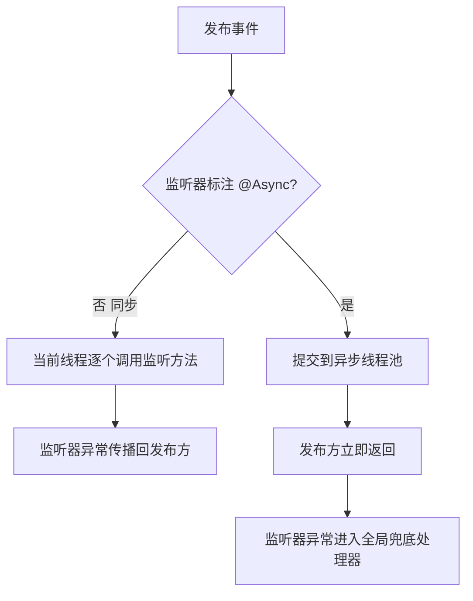
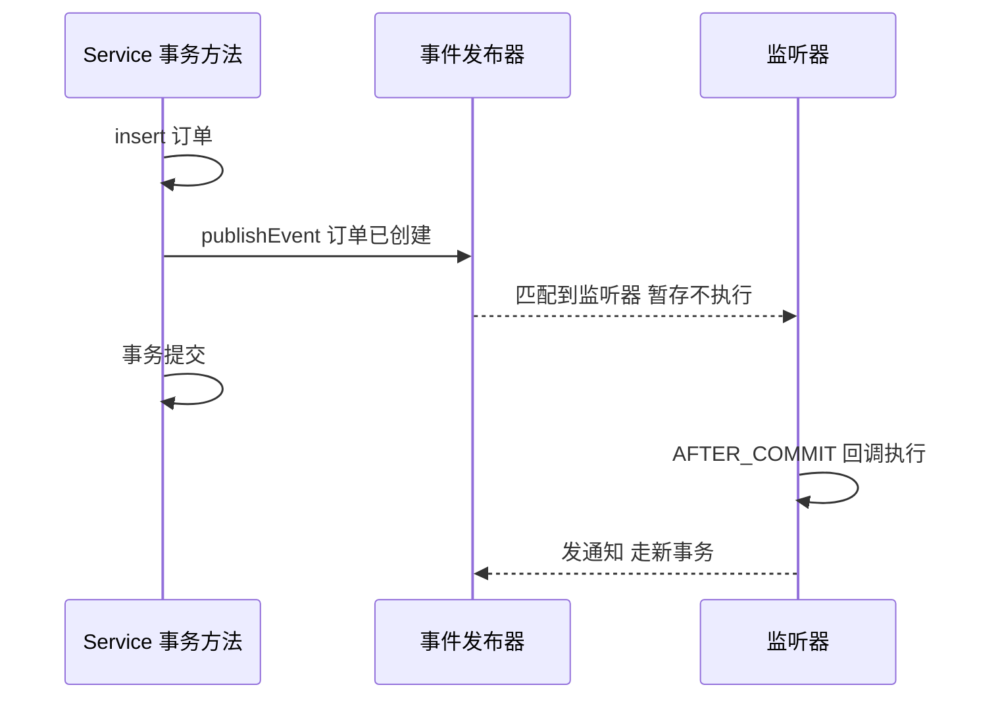

# 事件机制与解耦

> **一句话摘要**：Spring 事件机制用「发布-订阅」把「某件事发生了」和「谁来处理」拆开——业务代码只管发布事件，不关心有几个监听者；监听者只认事件类型，不认识发布者。进程内的观察者模式，容器替你完成注册与分发。

## 🎯 本文核心

**核心机制一句话**：事件的本质是「容器持有的一个监听器注册表 + 一条广播分发逻辑」——`ApplicationEventPublisher` 发布一个事件对象，容器按事件类型（含泛型）找出所有匹配的 `@EventListener` 方法，在**调用线程上同步逐个执行**（不加异步时）。

**机制链**：`业务代码调 publishEvent → 事件广播器按类型匹配监听器 → 按顺序同步调用（或提交线程池） → 异常默认向上传播中断发布方`。理解这条链的关键在「同步、同线程」四个字：默认行为下事件不是消息队列，发布方和监听方是同一个线程里的普通方法调用——后面所有的坑都源于此。

## 一、为什么需要事件：模块间通知的解耦

订单创建成功后要：发短信通知、加积分、刷新缓存、同步报表。直接写的架构长这样：

```java
public void createOrder(Order order) {
    orderDao.insert(order);
    smsService.send(order);        // 短信挂了要不要回滚订单？
    pointService.add(order);       // 积分服务上线时又得改这里
    cacheRefresher.refresh(order); // 每加一个下游改一次
}
```

痛点很清楚：**上游认识每一个下游**，模块边界被打穿；下游出异常会拖垮主流程；每加一个关注方都要改主流程代码。权衡之后，事件驱动给出另一种组织方式：主流程只发布「订单已创建」这个事实，不关心谁订阅；关注方各自监听各自处理。上游和下游都只依赖「事件」这个抽象，架构从网状依赖收敛成星形。

适合事件机制的业务形态：**异步通知**（发短信/推送）、**审计记录**、**缓存刷新**、**领域内多对象联动**——共同点是「附带动作，失败不影响主流程」。

**追问链：为什么不用别的方式**

- **追问 ①**：这和把逻辑抽成一个 `OrderCreatedHandler` 类再调用有什么区别？——抽类只解决了代码组织，上游仍然硬编码认识 handler；事件连这份「认识」都省了，新增订阅方零改动。
- **再追问**：那为什么不直接上 MQ？——MQ 解决的是跨进程可靠投递，引入 broker 的运维与一致性代价在单体应用里是过度设计；进程内事件没有网络开销，代码即部署。
- **打破砂锅**：事件会不会让调用链路变得不可追踪？——会，这正是它的代价。订阅关系是隐式的，读代码时 grep 事件类名才能找全监听者，所以团队约定「一个事件只表达一个已发生的事实，命名用过去式」。

## 二、事件三要素：定义、发布、监听

```java
// 1. 事件：不可变的事实对象（Boot 任意对象都可作事件，不强制继承）
public record OrderCreatedEvent(Long orderId, String userPhone) {}

// 2. 发布：注入 Publisher，一行发布
@Service
public class OrderService {
    private final ApplicationEventPublisher publisher;
    public void createOrder(Order order) {
        orderDao.insert(order);
        publisher.publishEvent(new OrderCreatedEvent(order.getId(), order.getPhone()));
    }
}

// 3. 监听：按类型自动匹配，一个事件可被多个监听者消费
@Component
public class OrderCreatedListeners {
    @EventListener
    public void sendSms(OrderCreatedEvent event) { ... }

    @EventListener(condition = "#event.orderId != null")
    public void addPoints(OrderCreatedEvent event) { ... }
}
```

设计思想上的一个要点：**事件应当是不可变的事实快照**——只带数据、不带行为，命名用过去式（`XxxCreated`/`XxxPaid`）。监听者拿到的是「已发生」的陈述，而不是「请执行」的指令，这是事件驱动与普通方法调用在语义上的分水岭。

## 三、同步、异步与事务边界：三个最容易踩坑的点

### 3.1 默认同步执行

`@EventListener` 默认在**发布线程**上同步执行：监听者抛异常，异常会传播回发布方；监听者耗时 5 秒，主流程就卡 5 秒。想要异步，加 `@Async` 并配好线程池，异常进 `SimpleAsyncUncaughtExceptionHandler` 不会传回——两种模式的取舍：同步换来「确定性」（顺序、事务上下文一致），异步换来「隔离性」（慢消费不拖垮主流程），按业务失败的容忍度选。



### 3.2 事务边界：`@TransactionalEventListener`

**最常见的线上事故形态**：发布事件的代码在一个事务方法里，监听者去发通知/做查询，结果**查不到刚写入的数据**——因为事务还没提交，监听者在同一个事务上下文里跑了。排查这类问题时日志显示「数据明明 insert 了却 select 不到」，根因是时间点：监听执行于提交前。

解法是把监听时机推迟到事务提交之后：

```java
@TransactionalEventListener(phase = TransactionPhase.AFTER_COMMIT)
public void sendSms(OrderCreatedEvent event) { ... }
```

四个阶段（BEFORE_COMMIT / AFTER_COMMIT / AFTER_ROLLBACK / AFTER_COMPLETION）里，**AFTER_COMMIT 是通知类场景的默认正确答案**：事务回滚时通知不发出去，避免「用户收到下单短信但订单是失败的」。注意它有个反直觉行为——如果该方法自己也开事务（默认 `fallbackExecution=false` 且无事务上下文时不执行），需要显式 `@Transactional(propagation = REQUIRES_NEW)` 开新事务写库，因为原事务此时已提交，别在回调里复用已结束的事务。



💡 **实战提示**：判断要不要用 `@TransactionalEventListener` 只需一句话——监听者会不会读「本事务刚写的数据」或「对外发出不可撤回的通知」？会，就用 AFTER_COMMIT；纯内存操作（如本地缓存更新）用普通 `@EventListener` 即可。

💡 **实战提示**：事件类建议集中放在一个 `event` 包里并全团队可见——订阅关系是隐式的，事件类的聚合目录就是这张「谁可能被谁影响」的显式清单，评审新增监听者时先看这个包，比口头约定可靠得多。

### 3.3 监听器异常隔离与顺序

多个监听者默认按顺序同步执行，中间一个抛异常，后面的不再执行。需要隔离时：给每个监听者内部 try-catch，或直接 `@Async` 天然隔离。需要排序时 `@EventListener` 不支持 `@Order`？支持——`@Order` 在监听方法上同样生效，数字小者先执行。

## 四、事件机制与 MQ 的区别

| 维度 | Spring 事件 | 消息队列 MQ |
|---|---|---|
| 作用范围 | 单 JVM 进程内 | 跨进程、跨服务 |
| 可靠性 | 无持久化，进程重启即丢 | 落盘/副本，可重试可回溯 |
| 削峰能力 | 无，同步时就是方法调用 | 天然缓冲 |
| 失败补偿 | 自己写重试 | 消费重试 + 死信队列 |
| 引入代价 | 零，框架自带 | broker 集群与运维 |

选型边界一句话：**单体或模块间用事件，跨服务、要求不丢、要削峰，才升级到 MQ**。架构演进上常见的路径是「先事件后 MQ」：领域内联动先事件化收敛，等拆服务时同一批事件平移到消息中间件，事件对象的设计如果一开始就按「可序列化的事实快照」来做，迁移代价会小很多。回看 Spring 自身十多年的演变也是如此：早期只有同步事件，后来加入泛型事件、异步支持、事务绑定——事件机制始终定位在「进程内轻量解耦」，把可靠投递留给专业中间件，这个模块边界从来没含糊过。

## 五、典型使用场景与选型

**什么时候用**：一个动作触发多个「附带反应」且各反应独立可失败（通知/积分/审计）；模块间想解耦但仍在同一进程；框架事件定制（如监听 `ApplicationReadyEvent` 做启动后预热）。

**什么时候不用**：下游处理结果影响主流程分支（要返回值，事件是单向广播）；跨进程投递；严格顺序消费——事件的分发顺序契约弱于 MQ，不要把顺序正确性押在上面。误用最大的误区是把事件当异步手段却忘了加 `@Async`，主流程照样被慢监听卡住。

**量级分档 Trade-off**：约束来源是「事件消费能力受限于本进程的线程资源」——10 万级日请求的单体应用，进程内事件就够了，这一档的核心问题是「解耦」而不是「吞吐」；请求量到千万级后，慢监听会占满容器线程池拖垮全站，这一档的核心问题是「隔离」而不是「顺序」，异步监听要配独立线程池并设队列上限；若事件需要跨服务共享或绝对不丢，这一档的核心问题变成「可靠投递」而不是「低延迟」，此时演进到 MQ 是必然选择——事件对象按可序列化快照设计，就是为这次升级预留的通路。

## 你们可能会问

**Q1：事件必须继承 `ApplicationEvent` 吗？**
Spring 4.2 起任意对象都可以直接发布，推荐用 POJO/record，测试时构造更轻。

**Q2：监听者抛异常，发布方的事务会回滚吗？**
普通 `@EventListener` 同步执行时异常传播进发布方，若发布方在事务里且异常是运行时异常，事务会回滚——这正是「通知类逻辑要隔离」的原因；积分这种附属动作失败不应该连坐订单。`@Async` 监听者异常则完全不影响发布方。

**Q3：`@TransactionalEventListener` 在没有事务时执行吗？**
默认不执行（`fallbackExecution=false`），事件直接被丢弃——这是比「执行时机不对」更隐蔽的坑：本地调试没开事务时监听器静默不跑。需要无条件执行就设 `fallbackExecution = true`。

**Q4：怎么给事件写单元测试？**
注入 `ApplicationEventPublisher` 的 mock 验证发布，或用 `@RecordApplicationEvents` 收集测试期间的全部事件做断言，不必真的执行监听者。

## 5W 速记卡

| 维度 | 要点 |
|---|---|
| What | 进程内发布-订阅：Publisher 发布事实，容器按类型分发给监听方法 |
| Why | 一对多附带动作，上游不该认识每个下游 |
| When | 通知/审计/缓存刷新；跨进程或不丢消息交给 MQ |
| Where | 默认发布线程同步执行；事务场景用 AFTER_COMMIT |
| How | record 事件类 + `@EventListener`；对外不可撤回动作必须挂事务提交后 |

## 自测三问

1. 默认监听是同步还是异步？异常传给谁？（答：发布线程同步；传播回发布方，可致其事务回滚）
2. 为什么事务内发通知要用 `@TransactionalEventListener`？（答：避免读到未提交数据、避免回滚后通知已发出）
3. 事件和 MQ 的分界线是什么？（答：进程内 vs 跨进程；不要求可靠投递 vs 要求）

## 🎯 核心带走

**一句话**：Spring 事件 = 进程内观察者模式，容器按类型广播；默认同步同线程，事务边界和异步隔离要显式声明。

**失效边界**：三个高频坑——忘了 `@Async` 被慢监听卡主流程、事务内读不到未提交数据、无事务时 AFTER_COMMIT 监听静默丢弃。

**开放问题**：如果一个动作的附带反应涨到了十几个监听者，该继续加监听还是拆成一个独立的编排层？这个没有标准答案，取决于反应之间有没有顺序与一致性要求——值得在团队里形成书面约定。

## 下篇预告

事件解决「进程内解耦」，下一篇 [9_WebMVC请求链路-入门](./9_WebMVC请求链路-入门.md) 回到 Web 层：一个 HTTP 请求从进 Tomcat 到返回 JSON，中间到底经过哪几站。

## 📌 数据与事实声明

- 本文机制基于 Spring Framework 官方公开文档（核心事件与事务绑定行为）；版本行为差异以所用版本文档为准。
- 场景描述为业内常见形态的抽象与匿名化，不含真实公司与业务数据。
- 性能量级表述为业内认知，非实测。

## 📚 参考资料

| 资料 | 链接 |
|---|---|
| Spring 官方文档 · 标准与自定义事件 | https://docs.spring.io/spring-framework/reference/core/beans/context-introduction.html |
| Spring 官方文档 · 事务绑定事件 | https://docs.spring.io/spring-framework/reference/data-access/transaction/event.html |
| Spring Boot 官方文档 · 应用事件与监听 | https://docs.spring.io/spring-boot/reference/features/spring-application.html |
