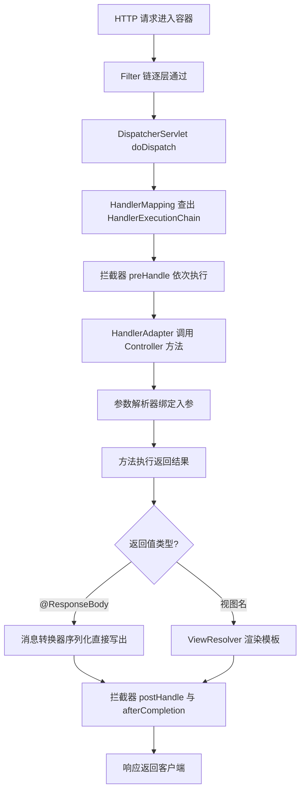
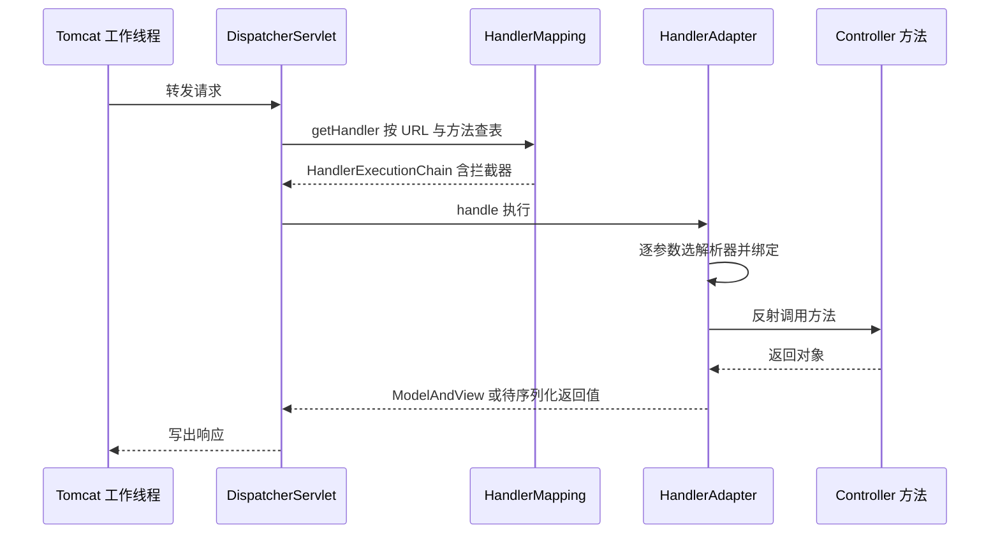

# Web MVC 请求链路

> **一句话摘要**：一个 HTTP 请求进 Tomcat 后只有一个 Servlet 在干活——DispatcherServlet 前端控制器；它负责查路由、调参数解析器、执行 Controller 方法、处理返回值，整条链路的每一站都是可替换的接口实现。

## 🎯 本文核心

**核心机制一句话**：DispatcherServlet 是「前端控制器模式」的落地——所有请求收口到一个入口，入口内部再按「HandlerMapping 找处理器 → HandlerAdapter 执行处理器 → HandlerExceptionResolver 兜异常 → ViewResolver/消息转换器出响应」四步分发；你写的 `@Controller` 只是这条流水线上的「处理」那一站。

**机制链**：`请求进容器 → Filter 链 → DispatcherServlet.doDispatch → HandlerMapping 查出执行链（含拦截器） → 参数解析 → 方法执行 → 返回值处理 → 序列化/渲染 → 响应`。记住这条链，404/405 这类问题就不再是玄学——每一站失败都有明确的异常与状态码对应。

## 一、背景：Web 层要解决的两个问题

手写 Servlet 时代，每个 URL 对应一个 Servlet 类，web.xml 里注册映射，一个中型系统几十个 Servlet 配置。Web 层的核心问题从来只有两个：**请求怎么找到处理方法**（路由），以及**HTTP 字符串与 Java 对象怎么互转**（绑定与序列化）。Spring MVC 的答案是前端控制器模式：加一个总入口 DispatcherServlet，路由查表完成，转换交给参数解析器与消息转换器。

Servlet 与 MVC 的关系一句话：**Spring MVC 不是一个独立的服务器，它本身就是跑在 Servlet 容器里的一个（智能的）Servlet**。Boot 的嵌入式 Tomcat 启动时自动注册 DispatcherServlet 并映射 `/`，这就是为什么项目里一个 Servlet 都没写，Web 服务照样能跑。理解这层原理后你会明白：Spring MVC 的扩展点全部围绕「分发链上的标准接口」展开，底层就是接口 + 责任链的组合机制。

**追问 ①**：DispatcherServlet 会不会成为单点瓶颈？——不会，它是无状态的单例分发器，真正的并发容量在 Servlet 容器的工作线程池上（Boot 默认 Tomcat 最大工作线程 200，公开文档口径），分发本身只是查表和反射调用。
**再追问**：那所有请求共用一个入口，出错怎么办？——`doDispatch` 内部有完整的异常解析分叉，Controller 抛的任何异常都会进入 HandlerExceptionResolver 链，这就是第 12 篇统一异常处理的挂载点。
**打破砂锅**：为什么不用「每个 URL 注册一个 Servlet」的老方案，而要多加一层分发？——对比一下替代方案就清楚：分散注册导致映射关系散落各处、公共逻辑无处安放；集中分发让路由可查表、公共逻辑有统一的挂载点，这是前端控制器模式成为主流的设计思想根源。

## 二、核心：doDispatch 分发流程

几个关键角色用一张表收束：

| 组件 | 职责 | 常见实现 |
|---|---|---|
| HandlerMapping | URL + 方法 → 找到处理器 | RequestMappingHandlerMapping（处理 `@RequestMapping`） |
| HandlerAdapter | 真正「调用」处理器 | RequestMappingHandlerAdapter |
| HandlerMethodArgumentResolver | 把 HTTP 输入转成方法参数 | 第 10 篇的主角 |
| HttpMessageConverter | Java 对象 ↔ 请求/响应体 | Jackson 的 MappingJackson2HttpMessageConverter |
| HandlerExceptionResolver | 异常 → 响应 | 第 12 篇的主角 |

`@Controller` 与 `@RestController` 的区别也在这条链上：后者是前者的组合注解，等于类上每个方法默认带 `@ResponseBody`——返回值全部走消息转换器直出 JSON，而不是被当成视图名去找模板。前后端分离架构下几乎只写 `@RestController`。

### 2.1 参数解析直觉：HTTP 输入怎么变成方法参数

执行方法前，`RequestMappingHandlerAdapter` 会遍历方法的每个参数，找一个「认识它」的 `HandlerMethodArgumentResolver`。直觉化的对应关系：

- 无注解的简单类型（`String`/`int`）→ 按**参数名**匹配查询串或表单字段；
- `@RequestParam` → 强制从查询串/表单取，`required` 默认 true，缺了就 400；
- `@PathVariable` → 从 URI 模板占位符取，配合正则约束（`/{id:\\d+}`）；
- `@RequestBody` → 读完整请求体，按 Content-Type 选消息转换器反序列化成对象——**一个请求的流只能读一次**，这是它与其他方式最大的不同；
- 没有任何注解的自定义对象 → 走「模型绑定」：按字段名从查询参数逐个填（表单风格），不碰请求体。

两个参数解析直觉推论：同一个方法里 `@RequestBody` 只能有一个（流不可重复读）；`@RequestParam` 的参数名在编译期未保留参数名信息时会退化成 param1/param2，`-parameters` 编译开关缺失是「参数莫名取不到值」的经典根因。

为什么不用另一种做法——手动从 `HttpServletRequest` 里 getParameter？对比可见解析器的价值：手写要处理类型转换、缺参报错、编码问题，每处都写一遍；解析器把这些收进一处标准实现，方法签名保持强类型。「拿到的参数已经是能用的对象」正是这套机制的设计哲学。

## 三、机制：返回值的两条出路

方法执行完，返回值去哪由返回值处理器决定，主流就两条路。先多追问一句：为什么框架不规定一种固定返回形态？因为 Web 场景的演进本来就有两条路线——接口直出与页面渲染，链路把「去哪」交给返回值处理器裁决，两种形态才能共存于同一套架构。

1. **`@ResponseBody` 直出**：选一个能处理该类型与目标媒体类型的 `HttpMessageConverter`，对象序列化后写进响应体。返回 JSON 用 Jackson，文件下载用 `Resource` 转换器。
2. **视图渲染**：返回字符串被 `ViewResolver` 解析成视图（如 Thymeleaf 模板路径），模型数据塞进 `Model`。传统服务端渲染走这条路。

两条出路的选择本身就是一种架构表态：接口型服务全走直出，页面型服务走渲染；混合存在的老系统里，这条分界线也天然划出了前后端的模块边界——直出侧只认数据契约，渲染侧认页面模型，上下游职责不混。

静态资源与欢迎页是两个特殊「处理器」：没被任何 `@RequestMapping` 匹配的路径会落到 `ResourceHttpRequestHandler` 上（默认 `/**` 映射 classpath 静态目录），首页 `/` 若无映射则尝试欢迎页。这也是为什么静态文件没放对目录时，表现为 404 而不是启动报错。

💡 **实战提示**：`postHandle` 对 `@ResponseBody` 请求基本没用——响应体在转换器写出时已生成，拦截器里改不了已写的流。要统一包装响应体，用第 12 篇的 `@RestControllerAdvice` 或转换器定制，不要指望 postHandle。

💡 **实战提示**：路径匹配规则默认已从 Ant 风格切到 `PathPatternParser`（Boot 2.6+ 默认，官方迁移说明口径），后者匹配更快但不支持部分 Ant 特性；迁移老项目遇到路径规则行为差异，先查这个演进点。

## 四、实践：404/405 的排查思路

排查不要重启碰运气，按链路从上往下定位：

- **404**：HandlerMapping 没查到。三种可能——路径拼错（含 context-path 前缀遗漏）、方法所在类没被扫描成 Bean（包扫描范围外）、请求方式存在但路径不匹配。
- **405**：路径找到了但 HTTP 方法对不上。典型是 Postman 用 GET 调了一个 `@PostMapping`。RESTful 设计里同一资源路径按方法区分动作，405 反而是好信号——说明路由本身工作正常。
- **415**：Content-Type 与能处理的媒体类型不匹配，比如发 JSON 忘了带 `application/json` 头，转换器找不到匹配项。

曾经复盘过一个线上问题：新接口灰度后部分客户端全量 404，服务端日志一片干净。排查两小时后定位到网关把新版 context-path 前缀丢了——请求根本没进到正确的路由表。这个案例的教训值得沉淀：**Web 层问题先确认「请求长什么样到了应用」，再怀疑框架**，抓一次入口日志胜过十次猜测。

### 5.1 常见误区与适用边界

- **误区一：把业务逻辑塞进控制器**。控制器只做「接收-校验-委托-返回」，业务下沉到 service 层，模块边界才守得住——控制器是架构上最外圈，往里才是领域逻辑，别让它认识上下游的所有服务。
- **误区二：在 Controller 里直接操作 HttpServletResponse 手写输出**。绕开了返回值处理这一站，统一异常处理和响应封装全部失效，代价是这条接口脱离了全局契约。
- **误区三：以为 `@CrossOrigin`/过滤器之外没有别的入口**。静态资源、Error 页面都走同一 DispatcherServlet，配在 Controller 上的东西管不到它们。
- **不适用与代价**：流式推送、超高并发 IO 密集场景不适用同步 MVC，硬用的话代价是线程池被占满后全站排队。

## 五、典型使用场景与选型

**什么时候用 Spring MVC 全家桶**：标准 REST API、服务端渲染页面、对外网关后的业务服务——默认链路覆盖绝大多数形态。

**什么时候不合适**：超高并发长连接场景（WebFlux 的响应式栈才是对应解），或需要极致定制分发逻辑的场景——为什么不自己写 Servlet 替代 DispatcherServlet？因为替代方案意味着重新实现路由缓存、参数解析、异常解析一整套轮子，在业务系统里这几乎永远是错误的取舍：你只会重新发明一个更差的分发器。这正是「优先扩展现有链路，而不是换掉它」的设计哲学。

**量级分档 Trade-off**：约束来源是「同步 Servlet 模型下一请求占一工作线程」——10 万级日请求，默认配置完全够，这一档的核心问题是「正确性」而不是「线程模型」；请求量到千万级，慢下游会耗尽 200 线程引发雪崩，这一档的核心问题是「线程不被慢 IO 占住」，靠超时、隔离舱与异步 Servlet 缓解；亿级网关流量才值得评估响应式栈或容器线程模型调整——这是吞吐驱动型思考，先量化瓶颈再换模型。

## 你们可能会问

**Q1：`@Controller` 类里的方法必须是 public 吗？**
处理器方法一般声明为 public；非 public 在部分代理场景（如 AOP 增强后的 CGLIB 子类）可能不可见或行为异常，保持 public 是零成本的稳妥默认。

**Q2：同一个路径写了两个匹配的方法会怎样？**
启动即失败——`RequestMappingHandlerMapping` 检测到模糊映射直接抛异常，不给带病启动的机会。这是「配置错误尽早暴露」的设计思想，比运行期随机命中好得多。

**Q3：异步请求（DeferredResult / WebAsyncTask）和拦截器怎么配合？**
异步请求下 preHandle 正常执行，主线程立即释放，响应在异步超时/完成后产生，`afterCompletion` 推迟到真正完成时才调用。依赖「方法返回后响应已发出」的拦截器逻辑要专门适配。

**Q4：为什么我的接口直接访问正常，加过滤器后就乱了？**
顺序问题：Filter 在 DispatcherServlet 之前执行，可能已消费请求流或改写了请求。链路上每个站点的位置契约见第 11 篇——过滤器和 MVC 层的上下游关系一旦被破坏，排障时很难第一时间想到是入口被污染。

**Q5：这套链路会不会影响性能？要不要自己优化分发？**
公开基准与业内认知一致：查表 + 反射的开销在微秒级，远小于一次网络往返与业务处理。过去十年这条链路经历了多次演进（HandlerMapping 缓存、PathPatternParser 替换 Ant 匹配），框架侧一直在压这部分成本；应用侧该优化的是业务逻辑与下游调用，而不是重新发明分发器。

## 5W 速记卡

| 维度 | 要点 |
|---|---|
| What | 前端控制器统一分发：查路由 → 拦截器 → 参数解析 → 执行 → 返回值处理 |
| Why | 收口路由与转换，业务代码不碰 HTTP 细节 |
| When | 所有 Spring Web 请求都会走这条链，排查问题按链定位 |
| Where | 嵌入式容器内，DispatcherServlet 单例无状态 |
| How | 404 查路由与扫描、405 查方法、415 查 Content-Type |

## 自测三问

1. 一个请求经过哪几站？（答：容器 → Filter → DispatcherServlet → Mapping → 拦截器 pre → 参数解析 → 执行 → 返回值处理 → 拦截器后置 → 响应）
2. `@RestController` 和 `@Controller` 的差异在链路的哪一站体现？（答：返回值处理站——直出 JSON vs 视图解析）
3. 404 和 405 分别说明链路在哪一站出了问题？（答：404 在 Mapping 查表站，405 在方法匹配站）

## 🎯 核心带走

**一句话**：Spring MVC 的全部秘密是「一个入口 + 四步分发」，你写的 Controller 只是流水线中间的一站，前后每一站都是标准接口，可查可换可扩展。

**失效边界**：404/405/415 分别对应查表、方法匹配、媒体类型三站；postHandle 改不了 JSON 响应体；路径规则默认已是 PathPatternParser。

**留一个问题**：参数解析器把 HTTP 输入转成方法参数时，校验注解在哪一刻生效、什么情况下会静默失效？下一篇专门拆。

## 下篇预告

下一篇 [10_参数绑定与校验-入门](./10_参数绑定与校验-入门.md)：`@RequestParam`/`@PathVariable`/`@RequestBody` 的绑定规则、Jackson 细节与 Bean Validation 的生效原理。

## 📌 数据与事实声明

- 分发流程与默认值描述基于 Spring Framework / Spring Boot 官方公开文档；Tomcat 线程默认值为公开文档口径。
- 性能与量级表述为业内认知，非实测数据。
- 排查案例已匿名化处理，不涉及真实公司与系统信息。

## 📚 参考资料

| 资料 | 链接 |
|---|---|
| Spring 官方文档 · DispatcherServlet | https://docs.spring.io/spring-framework/reference/web/webmvc/mvc-servlet.html |
| Spring 官方文档 · 注解控制器 | https://docs.spring.io/spring-framework/reference/web/webmvc/mvc-controller.html |
| Spring 官方文档 · 异步请求 | https://docs.spring.io/spring-framework/reference/web/webmvc/mvc-ann-async.html |
